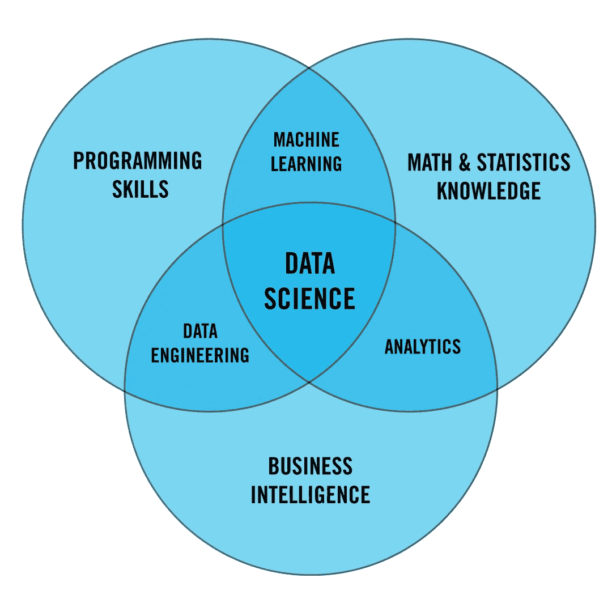
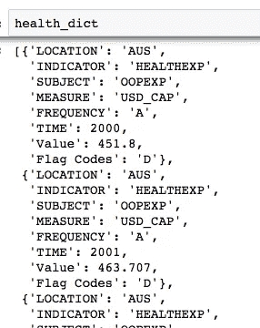
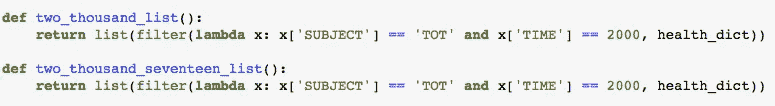
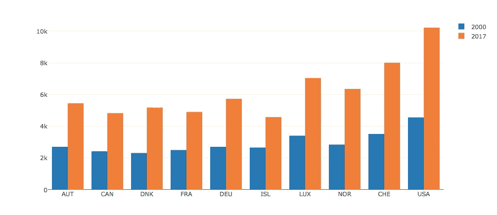
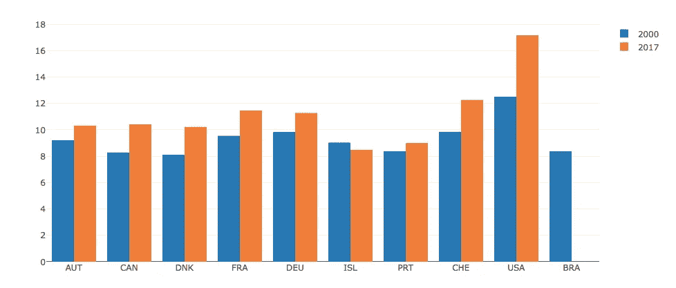
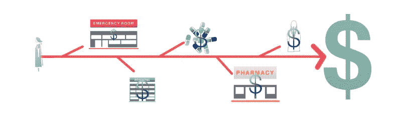

# 让数据来讲述故事

> 原文：<https://medium.datadriveninvestor.com/let-data-tell-the-story-dfe54b63f5f8?source=collection_archive---------32----------------------->

[https://wedomarketing.com/blog/let-infographics-tell-your-story/](https://wedomarketing.com/blog/let-infographics-tell-your-story/)

几乎每次我告诉朋友和家人我正在参加数据科学训练营，他们都会马上问:“什么是数据科学？”根据维基百科，“数据科学是一个跨学科的领域，它使用科学的方法、过程、算法和系统，从各种形式的数据中提取知识和见解，包括结构化和非结构化，类似于数据挖掘。”如果我向他们提供维基百科的定义，我很可能会收到许多围绕答案本身的问题，所以与其让他们去维基百科，我更愿意遵从熨斗学校对 Learn.co 的定义。

Flatiron School 将数据科学描述为编程技能、数学和统计以及商业智能的交叉。编程技能对于收集数据是必要的，商业智能对于理解数据的相关性是必不可少的，数学和统计学是用于构建预测模型的重要工具。通过使用这些工具，数据可以推动业务决策。

只有当我们允许数据讲述故事时，数据才能推动商业决策。作为人类本性的一部分，我们经常被想法困住，简单地搜索数据，希望能支持我们先入为主的观念。在大学里，我在美国上了一门名为“医疗保健”的课，在这门课里，我不是让数据来讲述故事，而是习惯于根据从各种论文和书籍中提取的理论来讲述故事。我清楚地记得了解到美国在医疗保健上的巨额支出。当我写它的时候，我会把它作为一个基于先前阅读的事实来陈述，也许会寻找一篇记录了支持这个观点的最小数字的论文。**数据充当了支持因素，而不是焦点。**

 [## 数据科学和软件工程哪个更有前途？-数据驱动型投资者

### 大约一个月前，当我坐在咖啡馆里为一个客户开发网站时，我发现了这个女人…

www.datadriveninvestor.com](https://www.datadriveninvestor.com/2019/01/23/which-is-more-promising-data-science-or-software-engineering/) 

当我开办了熨斗学校的数据科学训练营，并意识到即使是最小限度的分析也有强大的潜力时，我决定重新审视医疗支出数据，让它来讲述一个故事。

在经济合作与发展组织(OECD)的图书馆里，我找到了按国家分列的医疗支出数据。我很想知道数据集将提供什么样的见解，并且很高兴找到一个可下载的 CSV 文件。

使用 Pandas 库，我下载了 CSV 文件并创建了一个字典列表，开始对数据进行排序。

The first two dictionaries within my list of dictionaries after reading the CSV file and using Pandas’ to_dict().

此时，是时候开始分析了。我需要决定如何引导数据来讲述一个有意义的、准确的故事。与任何种类的支出一样，观察那些处于极端的国家很有趣——在这种情况下，这些国家在医疗保健上的支出最多。作为第一步，我将数据分成两组，以帮助显示随时间的变化。我过滤了一组以显示 2000 年的总支出，我过滤了另一组以显示 2017 年的总支出。

我急于确定 2000 年在医疗保健上花费最多的国家，以及它们的医疗保健支出在 2000 年至 2017 年之间增加的程度(撇开通货膨胀不谈，不幸的是，我认为我会看到大幅增加)。使用 Python 的 heapq 模块中的 nlargest，我导出了 2000 年十个最高医疗保健支出值的列表以及与该值列表相关的字典列表。

接下来，我遍历并过滤了 two _ Qian _ seventeen _ list()，这样列表中剩下的词典就只剩下那些在 two _ Qian _ countries()中找到“Location”值的词典了。

在这一点上，我想看我的数据，并选择这样做的直方图。在定义了我的直方图桶和相应的值之后，我使用 plotly 来绘制它。

Healthcare spending in USD per capita in 2000 and 2017 for the countries with the highest spending in 2000

毫不奇怪，我立即注意到，美国是 2000 年和 2017 年医疗支出最高的国家，显然也是同期医疗支出增长最快的国家。

我也很好奇同样的柱状图会是什么样子，但是看医疗支出占 GDP 的百分比，而不是人均美元支出。幸运的是，我可以轻松地重用上面的代码。我只是改变了从中提取数据的 CSV 文件路径，并使用完全相同的代码创建了下面的直方图。

Healthcare spending as a percent of GDP for 2000 and 2017 for the countries with the highest spending in 2000 *No BRA data provided for 2017

然而，美国又一次超越了其他消费大国。在看这些数据之前，我知道美国有一个非常低效的医疗保健系统，并且在医疗保健上的花费比它的同龄人多。通过整理和可视化这些数据，美国在医疗保健上的支出比其他国家高的程度是显而易见的。数据讲述了一个故事。

随着数据的惊人力量，还有太多的事情需要被讲述。有各种方法可以进一步分析这个数据集，另外还可以引入其他数据集。从这里开始，将围绕医疗保健结果和医疗保健公平性的数据整合起来将会很有意思。在医疗保健上花费最多的国家一定有更好的医疗保健结果和更公平的医疗保健机会吗？如果根据医疗保健模式对数据进行分组，会有什么明显的趋势吗？

[https://www.brookings.edu/blog/usc-brookings-schaeffer-on-health-policy/2014/07/23/the-beginners-guide-to-new-health-care-payment-models/](https://www.brookings.edu/blog/usc-brookings-schaeffer-on-health-policy/2014/07/23/the-beginners-guide-to-new-health-care-payment-models/)

坦率地说，我可以连续列出可以用来进一步分析这些数据以及相关数据的其他步骤。重要的是要认识到，这些步骤中的每一步都是让数据讲述故事的指南。尽管我对医疗支出的研究没有突破性的结论，但它讲述了一个故事，而不仅仅是简单地说“2017 年，美国的人均支出比其他任何国家都多 2000 美元。”它作为引言，作为分析的蓝图。从这里开始，还有无数种收集和分析数据的方法来继续这个故事。