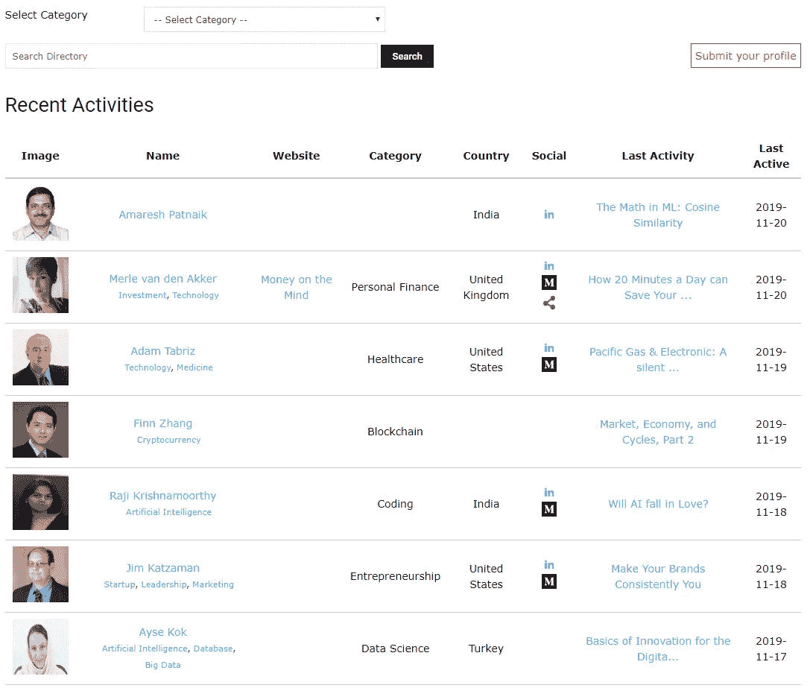

# 让社区找到你

> 原文：<https://medium.datadriveninvestor.com/let-the-community-find-you-e1592c68af11?source=collection_archive---------16----------------------->

亲爱的朋友们，

正如你可能注意到的，我们喜欢开发一个不同领域的人互相分享想法的地方。

不过，在这之前，我们必须开发一种方法，让我们的成员可以根据类别、兴趣以及他们提供的内容和他们来自哪里进行搜索。

这是我们带给你的下一个发展。

[**DDI 目录**](https://www.datadriveninvestor.com/directory)

目前，在测试版中，我们已经根据贡献者的类别、标签、国家和最近活动(以书面形式或在 DDI Connect 上讨论的形式)初始化了我们的目录。这里特别有用的是，你可以通过他/她的文章了解某个会员的服务/网站。

**让我们的社区找到你**

我们的目录对我们所有的读者来说也是一个很好的工具。无论你是 SaaS 的企业家、基金经理还是个人金融博客，你都可以在我们庞大的网络中被搜索到，他们可能会寻找你提供的服务。只需点击目录页面上的“提交您的个人资料”将您的个人资料提交给我们，我们中的一员将为您设置。

**入门**

前往我们的 [**目录页面**](https://www.datadriveninvestor.com/directory) 提交您的个人资料。

与我们分享您的博客/网站。

通过类别、描述性标签和简历部分让我们知道你的技能和领域专长。

DDI 团队将审核您的信息并将您添加到目录中！