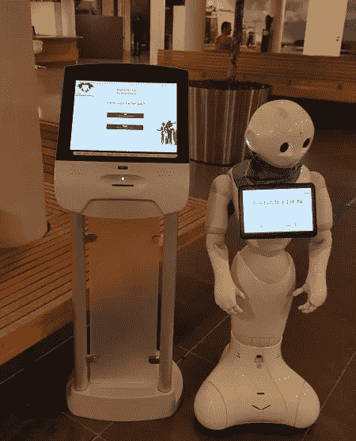
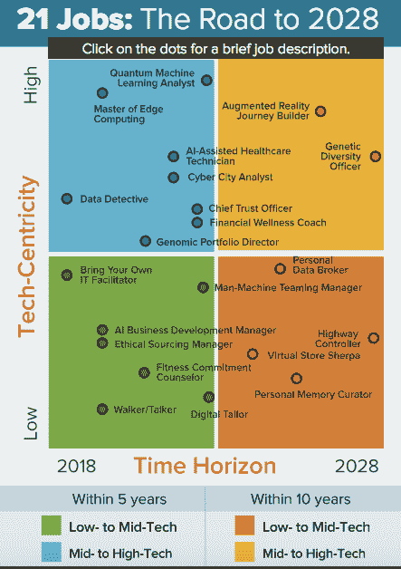
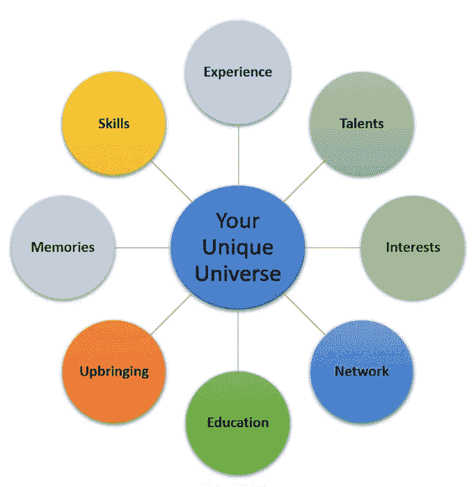

# 让机器人接管我们的工作，这样我们就能再次成为人类！

> 原文：<https://medium.datadriveninvestor.com/let-the-robots-take-our-jobs-so-we-can-become-humans-again-3ec1676851a7?source=collection_archive---------6----------------------->

今年 1 月，我不得不去荷兰的莱岑丹-沃尔堡市登记我们的婚姻和我的新姓氏。迎接我的不是接待员，而是一个可爱的小机器人 Evie，她问我是否有预约，并给我带路。而这是一个 2018 年人口 [74.947 人](https://allecijfers.nl/gemeente/leidschendam-voorburg/)的小直辖市。

这一经历对我来说是另一个生动的例子，说明我们在客户支持等服务中越来越失去人际互动。或者，想想超市的自助扫描仪和机场的自助登机机。

最近有很多关于机器人有一天会取代我们工作的讨论。来自 [Gartner Research](https://www.gartner.com/newsroom/id/3837763) 的  研究表明，到 2020 年将失去 180 万个工作岗位，到 2022 年，从事大部分非例行任务的五分之一工人将依赖人工智能(AI)来完成工作。

当你意识到我们的工作生活将在未来两到四年内发生怎样的变化时，这些预测是相当可怕的。高度重复性和事务性的工作，如制造、报告、收银员，风险最高。像这样的统计数据可能会让我们大多数人对不确定的未来感到焦虑:

> 几年后我们的生活和工作会是什么样子？
> 
> 我们的技能和能力还会有价值吗？

有时候我会想

> 既然我们自己已经变成了机器人，为什么还要担心机器人会接管我们的工作呢？

许多组织，尤其是大公司，都在不断地优化和引入成本削减计划，力求用更少的人获得更多的东西。因此，我们经常要为两个或更多的全职员工工作，每天在办公室花费超过 8 个小时。在一些国家，一周超过 40 个小时。

在工作中，我们主要关注目标、利润、期限和效率。我们赶着去开会，赶着完成任务，赶着在最后期限前完成，为我们没有做的事情相互追逐和指责，但我们很少相互谈论我们实际上做得怎么样。

所以，当我听说机器人将接管我们的工作时，我个人看到了人类更光明的未来。

肯定会有许多挑战:经济的、政治的、教育的、心理的。许多人确实会失业，需要获得一套新的技能，最重要的是要有一种心态，即我们现在所做的不一定与我们职业生涯结束时将要做的一样。

这个未来正在缓慢但肯定地成为我们的现在。虽然研究和媒体试图让我们对未来感到恐惧，但本文的目的是从光明的一面来看待它，并就我们如何在个人层面上为这些挑战做准备提出一些想法。

# 作为人类，我们有一个光明的未来

根据同样的 [Gartner 研究](https://www.gartner.com/newsroom/id/3837763)人工智能将在 2020 年创造更多的工作岗位(230 万)，超过将被淘汰的工作岗位数量(180 万)，因此人工智能将成为积极的工作激励因素。

[例如，认知咨询公司](https://www.cognizant.com/consulting)已经提出了 [21 种未来 10 年将出现的新工作](https://www.cognizant.com/perspectives/21-jobs-of-the-future):从数据侦探，到网络城市分析师，再到增强现实旅程建设者。(您可能需要下载整个报告，包括更详细的工作描述)。

与此同时，许多公司和国家已经开始试行缩短工作周。如果新标准变成每周工作少于 40 小时，我们将有更多的时间娱乐和陪伴家人。谁会抱怨呢？！

但最重要的是，我看到了一个积极的未来，人工智能可以承担重复和平凡的任务，让我们专注于真正重要的事情——艺术和人类互动。

**娱乐**

我的假设是，如果我们在工作中不断被机器人和人工智能包围，我们会在空闲时间渴望与人互动。我们会觉得需要娱乐。但愿到那时，我们会受够了当前的娱乐形式——比如 Instagram、脸书或 Youtube 等社交媒体平台。

> 换换口味，练习艺术或去剧院或芭蕾舞团怎么样？

歌手、舞蹈家、演员、作家等专业人士是人类创造力和才华的体现，然而多年来，主要是他们所在领域的顶级表演者设法过上了体面的生活。我希望像单口喜剧、音乐会、剧院这样的现场表演会变得比现在更有价值和吸引力，因为它们促进了真实的人类情感和联系。

**商业**

一些公司将提供完全由人类提供的服务。人际交往将被视为一种奢侈的体验，我们需要为此支付高价。

为了有资格在这样的公司工作，你需要比机器人更苗条、更敏捷，同时拥有所有合适候选人中最强有力、对客户最友好的个性。

成为一家提供完全由人类提供的服务的公司的客户，将是一种声望和地位的象征，因为这将表明你对人类互动的欣赏，而你很可能是少数几个能够负担得起的人之一。

**辅导**

我的另一个个人预测是，生活和职业教练将成为必需品。当我们失去工作和对未来的希望时，我们需要有人倾诉，帮助我们看到自己的新机会。

尽管会有许多应用程序和在线自助中心，但谁不想感受到至少另一个人的支持呢？这个人相信你有能力通过寻找新的生活激情和目标来重塑自己的未来。

# 我们该如何准备？

我并不声称我能预见未来，我意识到我的胡乱猜测可能会显得有点理想化。然而，我只是与你分享我看待和处理不确定未来的方式。

我们既不能预测到底会发生什么，也不能预测我们今天需要采取哪些行动来确保我们未来的繁荣，但有一点是肯定的——忽视任何关于它的想法，什么也不做，不会让你比现在更进一步。

我们可以采取的第一步是深入挖掘我们自己的世界。我们每个人都拥有一套独特的技能——经验、天赋、兴趣、网络、记忆、教育、教养。

Credits for this image go to Boryana Dineva

我相信，在未来保持相关性和价值的关键是探索你自己独特的宇宙，并找出你如何在未来以别人无法做到的方式提供价值。

你可以先自己回答以下问题:

*   是什么让你成为你？或者你如何充分利用你的教养、教育、关系网、才能和兴趣的独特组合？
*   你能为社会做出什么贡献，让你和你周围的人都能从中受益？
*   在你所在的行业或专业领域，你看到了哪些新的机会？
*   为了对不确定的未来有更好的准备，你需要掌握哪些新的技能和能力？

**不要抓住肯定会改变的事情不放，而是要把心态放在未来，这样你就可以通过今天的行动来预测和影响未来。**

正如我所说，这是我为不确定的未来做准备的方式。你的呢？