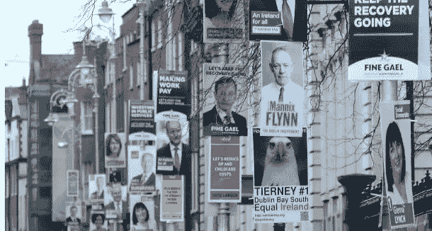
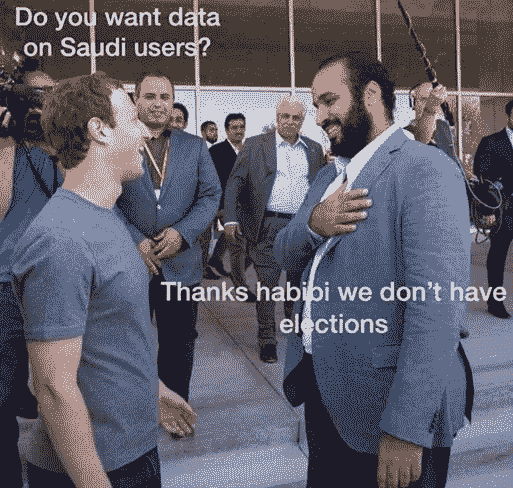
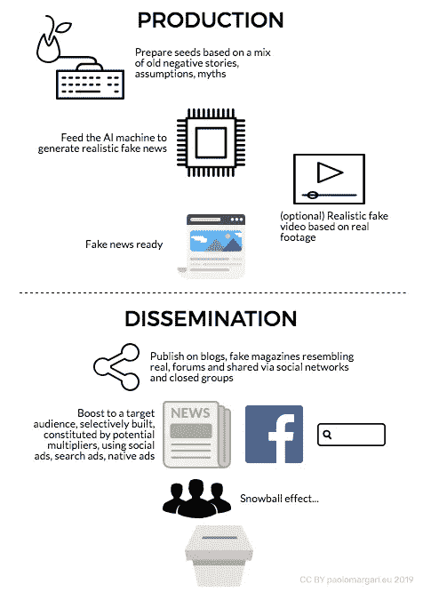

# 人工智能将深刻影响选举结果。无论何处，永远。

> 原文：<https://medium.datadriveninvestor.com/lets-ai-run-political-campaigns-for-you-d6307c96baf8?source=collection_archive---------18----------------------->

政治是一个仍然部分豁免于营销/宣传自动化、机器学习、人工智能、量子计算等新概念的领域。事实上，决策过程让我们想起了 100 年前或更久以前政治家们的所作所为。

尽管数字渠道的影响不断增长，政治宣传仍然大量依赖老式的广告渠道:海报、活动、电视、报纸、愚蠢/无用的小工具(在大多数情况下=浪费/污染)。

Recent posters for national elections, respectively in Ireland and Italy.

除了选举，政府的选择仍然依赖于个人互动、私人会议、游说者等等。艾在哪里？政治决策的自动化在哪里？是政治权力愿意依靠机器还是对个人利益的追求不能以逻辑为中介？

无论政客们怎么想，人工智能正在进入政治，至少在选举方面，这听起来对一贯的，体制内的一部分，让我们说是最保守的(不一定是从意识形态上来说)来说相当可怕。

# 机器可以制造假新闻，而且它们比人类做得更好

机器将扮演记者的角色，特别是对于反复出现的、重复的、无聊的报道。另外，他们可以扮演作家的角色。深度学习可以指示机器基于庞大的数据背景生成惊人的故事，而大多数人类，甚至是最有创造力或最高层的人，都无法达到这些故事。因此，在未来，当记者/作家必须塑造一个故事或从头开始写一个故事，以说服特定的观众时，机器可能会做得更好。

> 由 Elon Musk 等人支持的非营利人工智能研究小组 OpenAI 的研究人员希望训练他们新的文本生成软件来预测句子中的下一个单词。它吹走了他们所有的期望，并且非常擅长模仿人类的书写，他们决定在探索它可能造成的损害时停止这项研究。
> 
> 研究人员使用从 800 万个网页中提取的 40GB 数据来训练 GPT-2 软件。

在一个例子中，软件被输入了这样一段话:

> 在一个令人震惊的发现中，科学家发现了一群生活在安第斯山脉一个遥远的、以前未被探索过的山谷中的独角兽。更令研究人员惊讶的是，独角兽能说一口流利的英语。

> 基于这两句话，它能够继续写这个异想天开的新闻故事，再写九段，以一种可以相信是由人类写的方式。以下是机器产生的几段机器文字:

> 这位科学家根据他们独特的角给这个种群命名为奥维德独角兽。这些四角银白色的独角兽此前是科学未知的。
> 
> 现在，在将近两个世纪之后，引发这一奇怪现象的谜团终于解开了。
> 
> 来自拉巴斯大学的进化生物学家 Jorge Pérez 博士和几个同伴在探索安第斯山脉时，发现了一个小山谷，没有其他动物或人类。佩雷斯注意到山谷里有一个看起来像是天然喷泉的东西，被两座岩石和银色积雪的山峰环绕着。

GPT-2 软件似乎非常善于适应给出的提示的风格和内容。

阅读更多关于 [Gizmodo](https://gizmodo.com/elon-musk-backed-ai-company-claims-it-made-a-text-gener-1832650914) 的内容。

# 让一个名人用自己的假脸说假新闻

听说过软件 [FakeApp](https://www.malavida.com/en/soft/fakeapp/#gref) 吗？这远远超出了变形。

> 利用一些最新的人工智能技术，Peele 腹语向巴拉克·奥巴马提问，让他说出他对*黑豹*(“杀戮者是对的”)的看法，并称呼唐纳德·川普总统为“完全彻底的笨蛋”
> 
> 该视频是由 Peele 的制作公司使用新旧技术相结合的方式制作的:Adobe After Effects 和人工智能面部交换工具 FakeApp。后者是人工智能如何促进真实感假视频创作的最突出例子。它最初是作为制作虚假名人色情的工具在 Reddit 上诞生的，但它已经成为人工智能产生错误信息和假新闻的令人担忧的象征。

阅读更多关于 [The Verge](https://www.theverge.com/tldr/2018/4/17/17247334/ai-fake-news-video-barack-obama-jordan-peele-buzzfeed)

# 向合格的受众传播信息，这将成倍扩大社交媒体的覆盖范围

这个想法来自拉里·金的脸书广告、假新闻和影响选举的低得惊人的成本

*   **第一步:创建假新闻网站**
*   **第二步:在脸书上创建一个假新闻页面**
*   **第三步:制作一个脸书广告，在你的假网页上推广假新闻**

> 唐纳德·特朗普和希拉里·克林顿在 2016 年竞选总统时总共花费了 68 亿美元。但美国大选非常容易(也很便宜)被黑。这是因为总统选举的结果往往只取决于几千张选票(例如密歇根州)。

每一个脸书广告都被赋予一个 1 到 10 之间的相关性分数。脸书用极具吸引力的广告来奖励广告商。根据作者的说法，假新闻广告得到了 7/10 的分数。

# 让人工智能提高你的瞄准能力

在同一个保护伞下为特定品牌/事业/个人/政党的支持者或反对者创建渠道。吸引敌人/对手很重要，至少有两个原因:

*   **将对手排除在未来目标之外**。不要宣扬皈依者是可以的，尽管播种对让他们为你工作很重要，但更重要的是不要在一场试图让敌人皈依的失败战役中浪费金钱，至少是直接皈依。让他们以后改变主意。
*   通过创建稍微不同的路径来迷惑他们——罗马人过去常说“ **DIVIDI ET IMPERA** ”(分而治之)。"*我同意你，但是……*"这里的*但是*将在社区中开始一个新的潜在破坏性传奇。
*   通过明显的支持渠道传播软性假新闻，以**转移对手领导人在其渠道上享有特权的核心话题**。他们在大力推广 A 吗？好吧，我们来讨论一下 B，但是不要忘了 c。

播下有趣的，虚假的故事。人工智能生成的，可能是由虚假的领导人采访驱动的，声称他们可能做过的事情，但没有得到证实。

然后，让你的合格受众，通过基于特定*转化*的优化目标选择，在网上传播这些新闻，也在脸书以外，例如在**信使**的黑暗地带(Whatsapp、Facebook Messenger、Instagram messages、Twitter Direct Messages、Linkedin Messages、Viber、Telegram、line 等)。)无法跟踪，但据说有助于重新定位功能。这些渠道有助于这些故事的传播。

并行地，让机器在双方(赞成和反对)建立海量受众。这些受众可以通过长相相似的受众来扩展(下面是一个例子)。

再次，**让 AI 为你优化战役**。将一个*自定义转换*分配给特定的操作，例如分享一个活动、签署一份请愿书、以某种方式在线投票或以某种方式回应一项调查。

然后，如果指示该算法“优化转化”，即特定的定制转化，该算法将继续向最初没有通过标准类别锁定的类似人群显示您的广告。许多用户不公开表达自己，但仍然有自己的观点，他们是潜在的*休眠放大器*，可以通过复杂的目标锁定来达到，并由触动他们本能的故事来触发(A/B 测试有助于微调信息，这也是人工智能的工作)。目标受众也将被这样一个事实触发，即越来越多的意想不到的用户正在为一个特定的目标而运动(这里一群假冒用户可以加速这个过程)。

让政治品牌远离漏斗的初始阶段非常重要。该品牌将逐渐成为在用户中产生负面情绪的问题的唯一或最佳解决方案。

# 不要忘记搜索和原生广告

有些用户通常会怀疑，所以他们会寻找证据:让我们打消他们的疑虑。确保有相同主题的次要故事和/或重提旧的丑闻来强化种子概念，然后通过程序化的原生广告来宣传这些*故事*——在类似主题的真实新闻下出现的广告词。想做更多吗？购买与你的对手相关的关键词，使用定制的包含相关关键词的登陆页面，将搜索流量转移到一部新的政治小说的入口。

# **等待雪球效应**

据拉里·金(Larry Kim)称，“通过社交媒体渠道购买一场选举不需要花费太多，脸书正从中大赚一笔。”

现在，等待雪球效应，当用户开始传播消息，添加自己的观点，怀疑，用其他虚假的故事丰富，创造虚假的 memeplex。一粒种子可以在很短的时间内产生病毒效应，其结果部分是不可预测的。

攻击可能会继续，基于在病毒影响期间发现的好种子产生新的虚假故事。

虽然受到攻击的实体必须花时间否认指控(这些指控仍然基于一些真实的种子，因此它们永远不会被 100%否认)，但对手有时间进一步攻击和谈论他们自己的选举方案，表现得像干净、完美、更强大的赢家。许多选民倾向于支持胜利者。

按照作者的说法，**“假新闻便宜有效”**既然可以用几块钱接触到成千上万的用户，让他们免费传播‘新闻’。由人工智能和其他工具(如 FakeApp)驱动的假新闻机器，传播到有选择地针对的正确用户/乘数，是老式运动者无法对抗的事情，除非他们改变武器。

这里有一个关于# *novax* (用户，大多数是年轻父母，反对认为对儿童有害的疫苗接种)的新闻如何在一周内传播的例子(2019 年 2 月)。来源: [Hoaxy](https://hoaxy.iuni.iu.edu/#query=novax&sort=mixed&type=Twitter) 。

# 《剑桥分析》之后，为什么所有这些对脸书的恐惧？

*(我们在说什么？阅读更多关于* [脸书-剑桥分析数据“丑闻”](https://en.wikipedia.org/wiki/Facebook%E2%80%93Cambridge_Analytica_data_scandal)

这是可以理解的，因为构成的权力又名民族国家机器，代代相传，担心新的叙事，无论是真的还是假的，可以通过新的渠道传播，这些渠道已经占据了传统渠道的上风，通常是引导，指示，纵容，或者，如果替代，边缘化。

众多的出版商和记者为取悦当权者而制造框架。事实上，任何规模的陌生人都可以为了精确的目的通过改变或扭曲这种框架来闯入该系统，这被认为是对系统稳定性的巨大威胁。人们，也就是选民，相信他们听到/读到/看到的任何东西，并可以传播信息，创造一个不可控制的雪球效应。

如果我们真的热爱自由，即使是错误的信息(因为媒体和政权相爱，这是经常发生的事情)，我们必须捍卫像脸书这样的频道，努力拥有更多有意识的选民，而不是不那么有害的媒体。

交叉目标做了很多，但没人这么说。GDPR 违反了很多，但没有人敢指责，因为它是不可能分分钟控制每个人。因此，问题的核心被击中了。像德国这样的民主国家也决定审查脸书(以及 Youtube 和谷歌地图),就像朝鲜审查自己的公民一样。审查只能增强传播另类新闻的意愿，从长远来看没有帮助。

我们能相信被日益增长的人工智能力量严重破坏的选举结果吗？人工智能吞噬了大量没有批判精神的选民。也许不是。

为了提高民主的质量，在目前的情况下，一个答案可以是选择代表的不同方式，跳过选举，再次给算法清晰透明的指令，反映公民的意愿，以便为政治家应该代表的社会产生最佳结果。更多精彩，敬请关注…

Infographic: the fake-news generation and dissemination process mentioned in the article.