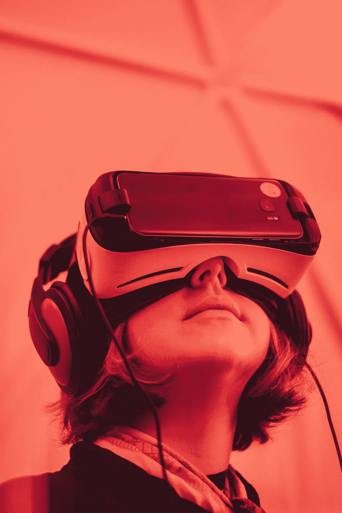
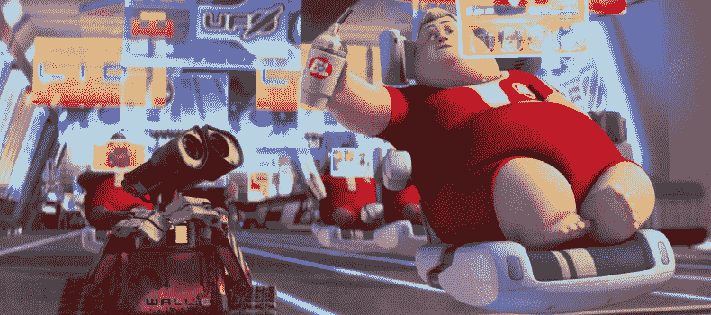

# 让我们和技术分手吧！

> 原文：<https://medium.datadriveninvestor.com/lets-break-up-with-tech-already-585cf0673e12?source=collection_archive---------42----------------------->

Picture by Samuel Zeller

我们人类可以在一秒钟内从技术爱好者变成技术恐惧者。你想过是什么让我们成为人类吗？我选:同理心，感受和联系他人的能力。技术在这种情况下扮演什么角色？真的对我们有帮助吗？

如今，当技术无处不在的时候，如果我们没有关注 Twitter 上的每一个趋势话题，如果我们拒绝不断滚动脸书的时间轴，如果我们在电视机前看了几分钟后选择了一本书，我们会感到尴尬。

在使用了所有这些社交媒体的东西一段时间后，我意识到我没有必要这么做。我选择放弃它们，这样我就可以控制我的时间，把它用在真正重要的事情上。我觉得自己像个外星人，但却是一个真正快乐的外星人。

想想你从脸书学到的伟大的经验。通过阅读时间表，思考一些真正帮助你成为更好的专业人士或更好的人的事情。问题是这些虚拟玩具可能很有趣，但它们并没有真正给我们的生活增添什么。

社交媒体训练我们消费他们选择的信息，随着时间的推移，我们往往会失去对真正重要的事情做出决定的能力，只是吞下信息，而不考虑它们的真正意义。

如果我们不考虑我们消费的东西，我们就失去了部分理性。转眼间，我们忘记了同理心，把人当成了可擦除的内容。

Wall-e: a great dystopia we’re beginning to experience

我记得老诺基亚的座右铭“连接人们”，我想知道所有这些技术是否真的在连接我们。去一家餐馆，观察有多少家庭真正联系在一起，有多少家庭迷失在他们自己的滚动世界中，包括孩子。

ech 本身并不坏，问题在于我们如何使用它。人类历史告诉我们，我们的自私和骄傲总是把我们带到我们后悔记住的地方。我们吐槽自己的观点，不考虑对方的感受。只需轻轻一点，我们就可以删除、屏蔽、丢弃关系。但是我们可以而且我们可以用它做好事，对吗？权力在我们手中。

我们迷失在链接中，在对通知的焦虑中，忘记了此时此地该如何生活。最重要的是，我们忘记了感受和联系他人的能力。但是我们不需要一直往这个方向走，我们可以重新选择。