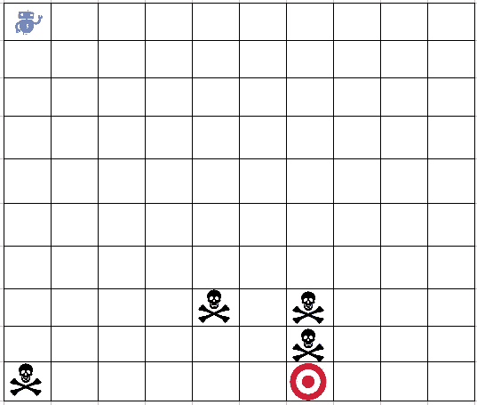
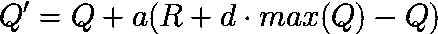
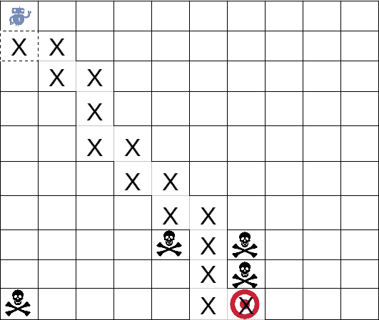
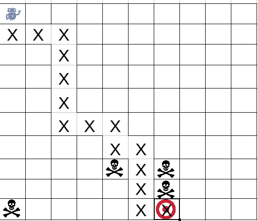

# 让我们用 Qlearning 构建一个简单的移动机器人

> 原文：<https://medium.datadriveninvestor.com/lets-build-a-simple-moving-bot-with-qlearning-3c56120ff32a?source=collection_archive---------8----------------------->


Source: [https://media.metrolatam.com/2018/01/23/r11111-1200x600.jpg](https://media.metrolatam.com/2018/01/23/r11111-1200x600.jpg)

我们在这个故事中要做的事情叫做强化学习。强化学习是机器学习的一部分(除了有监督学习和无监督学习)。在监督和非监督学习中，算法通过给定的数据进行学习。在强化学习中，它通过经验学习。通过体验其意义**利用奖惩系统**。

例如在贪吃蛇游戏中，在简单的方式中，当蛇吃食物时，**给蛇+1** 的分数。但是当蛇撞到墙或自己的尾巴时，我们给蛇的**分数是-1** 。简而言之，奖惩系统就是这样工作的。

在强化学习中，我们有两个新术语，状态和动作。状态是我们系统所有可能的位置/状态，动作是我们在状态下所有可能的行为。强化学习是关于**在所有可能的状态下做最好的动作**。


在所有可能状态下采取最佳行动的简单方法是**绘制所有可能状态和这些状态下所有可能行动的表格**。这个表叫做质量表。**我们在这个故事中要做的事情叫做 qlearning** (优质学习)。简而言之，首先我们从我们的机器人的经验(随机选择行动获得的奖励和惩罚)中建立我们的量化表，然后当我们的机器人的经验足够时，我们使用量化表来选择最佳行动。决定获得的经验是否足够的参数称为**ε**。

我们将建造**机器人，它将在避开陷阱**的同时向目标移动。机器人、陷阱和目标如下图所示。



那么 qlearning 的算法怎么样呢？该算法分为两个步骤，训练步骤(更新 q 表)和行动步骤(利用 q 表确定当前状态下的最佳行动并据此行动)。这是细节。

训练步骤的第一步:

1.  **初始化 q 表**。q 表的结构如何取决于所有可能的状态及其动作。
2.  **随机选择动作或选择 q 表**中得分最高的动作。其机制是首先我们生成 0 和 1 之间的随机值。当生成的值大于我们称为ε的阈值时，我们选择具有最大分数的动作，否则我们随机移动。在初始化阶段，ε的值为 1。ε值将随着时间继续降低。当我们已经决定要采取的行动时，我们根据下面的公式更新我们的 q 表。



Q’ is new value of action, Q is current value, R is reward to choose the action, d is discount rate, max(Q) is maximum value of action in current state.

d 的值会随着机器人从初始位置开始的旅程而减少。当机器人将其位置重置到原始点时，d 的值会将其值重置为原始值。在这种情况下，d 的值是 0.9 的幂，即机器人所走的步数。

在行动的最后一步，我们只是根据当前步骤中最有价值的行动来采取行动。

这是我们用来让机器人学习如何通过学习算法移动到目标的代码。

```
#!/usr/bin/python

import numpy as np
import random

#setting
row = 10
column = 10
iteration = 100
targetsym = 9
trapsym = 1
playersym = 7
lrate = 0.2
discount = 0.9
epsilon = 1.0
minepsilon = 0.01
maxstep = 100
decay_epsilon = 0.005
actchoice = ['bawah', 'atas', 'kanan', 'kiri']
#target
target = np.asarray([9,6])

trap = []
trap.append([7,6])
trap.append([7,4])
trap.append([9,0])
trap.append([8,6])
trap = np.asarray(trap)

def init_board(player):
	#make a board
	board = np.zeros((row, column))

	#init board
	board[target[0], target[1]] = targetsym
	for j in xrange(len(trap)):
		board[trap[j,0], trap[j,1]] = trapsym
	board[player[0], player[1]] = playersym
	return board

def calcreward(posplayer1, posplayer2, postarget):
	jarak1 = np.absolute(posplayer1-postarget)
	jarak2 = np.absolute(posplayer2-postarget)

	trapped = False
	#check if trapped
	for i in xrange(len(trap)):
		if np.array_equal(posplayer2, trap[i]):
			trapped = True
	if np.sum(jarak1-jarak2) > 0:
		reward = 1.
	else:
		reward = -1.
	if np.array_equal(posplayer2, target):
		reward = 100.
	elif trapped:
		reward = -100.
	return reward

def action(qtable, posplayer):
	global epsilon
	chance = random.uniform(0,1)
	if chance < epsilon:
		while True:
			choice = random.randrange(len(actchoice))
			if actchoice[choice] == 'bawah':
				cnt = posplayer[0]
				cnt += 1
				if cnt < row:
					posplayer[0] = cnt
					break
			elif actchoice[choice] == 'atas':
				cnt = posplayer[0]
				cnt -= 1
				if cnt > 0:
					posplayer[0] = cnt
					break
			elif actchoice[choice] == 'kanan':
				cnt = posplayer[1]
				cnt += 1
				if cnt < column:
					posplayer[1] = cnt
					break
			elif actchoice[choice] == 'kiri':
				cnt = posplayer[1]
				cnt -= 1
				if cnt > 0:
					posplayer[1] = cnt
					break
	else:
		choice = np.argmax(qtable[posplayer[0], posplayer[1]])
		if actchoice[choice] == 'bawah':
			cnt = posplayer[0]
			cnt += 1
			if cnt < row:
				posplayer[0] = cnt
		elif actchoice[choice] == 'atas':
			cnt = posplayer[0]
			cnt -= 1
			if cnt > 0:
				posplayer[0] = cnt
		elif actchoice[choice] == 'kanan':
			cnt = posplayer[1]
			cnt += 1
			if cnt < column:
				posplayer[1] = cnt
		elif actchoice[choice] == 'kiri':
			cnt = posplayer[1]
			cnt -= 1
			if cnt > 0:
				posplayer[1] = cnt
	#decaying epsilon
	epsilon -= decay_epsilon
	return choice, posplayer

def realaction(qtable, posplayer):
	choice = np.argmax(qtable[posplayer[0], posplayer[1]])
	if actchoice[choice] == 'bawah':
		cnt = posplayer[0]
		cnt += 1
		if cnt < row:
			posplayer[0] = cnt
	elif actchoice[choice] == 'atas':
		cnt = posplayer[0]
		cnt -= 1
		if cnt > 0:
			posplayer[0] = cnt
	elif actchoice[choice] == 'kanan':
		cnt = posplayer[1]
		cnt += 1
		if cnt < column:
			posplayer[1] = cnt
	elif actchoice[choice] == 'kiri':
		cnt = posplayer[1]
		cnt -= 1
		if cnt > 0:
			posplayer[1] = cnt
	return actchoice[choice], posplayer

############
#init board#
############

#make q table
qtab = np.zeros((row, column, 4))

hasil = 'belum'
for i in xrange(iteration):
	if hasil == 'menang':
		break

	#start player
	player = np.asarray([0,0])
	board = init_board(player)

	for j in xrange(maxstep):
		poslama = np.zeros((2))
		poslama[:] = player
		choice, player = action(qtab, player)
		R = calcreward(poslama, player, target)

		#update q table
		qtab[int(poslama[0]), int(poslama[1]), choice] =  qtab[int(poslama[0]), int(poslama[1]), choice] + lrate*(R + \
		(discount**j)*(np.max(qtab[int(poslama[0]), int(poslama[1])] -  qtab[int(poslama[0]), int(poslama[1]), choice])))

		#update board
		#print 'cek posisi lama', poslama, player
		board[int(poslama[0]), int(poslama[1])] = 0
		board[player[0], player[1]] = playersym
		print board
		#break if landed in trap

		trapped = False
		#check if trapped
		for k in xrange(len(trap)):
			if np.array_equal(player, trap[k]):
				trapped = True
		if trapped:
			break
print np.max(qtab)

#check solution

#start player
player = np.asarray([0,0])
board = init_board(player)
move = []

for j in xrange(maxstep):
	poslama = np.zeros((2))
	poslama[:] = player
	nextmove, player = realaction(qtab, player)
	move.append(nextmove)

	#update board
	board[int(poslama[0]), int(poslama[1])] = 0
	board[player[0], player[1]] = playersym
	print board

	trapped = False
	#check if trapped
	for i in xrange(len(trap)):
		if np.array_equal(player, trap[i]):
			trapped = True
	if trapped:
		print 'FAILED'
		break
	if np.array_equal(player, target):
		break

print 'sukses dalam step ke', j
print 'rincian move nya adalah'
print move
```

让我们运行这段代码，这是结果。


这里我们有机器人的移动细节。让我们把它映射到图片中



对于每次运行，最终的解决方案会有所不同。这是另一次跑步的结果。



如果想进一步探索，就再加一个陷阱或者改变 bot 原有的位置什么的。我认为你很容易编辑代码，因为我添加了一些注释来解释代码中的所有内容。另一篇文章再见。