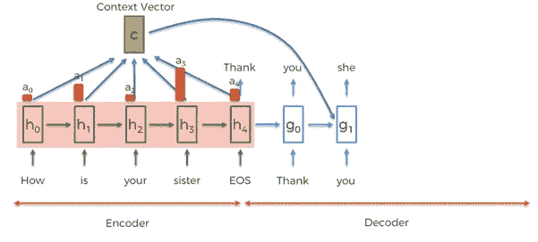
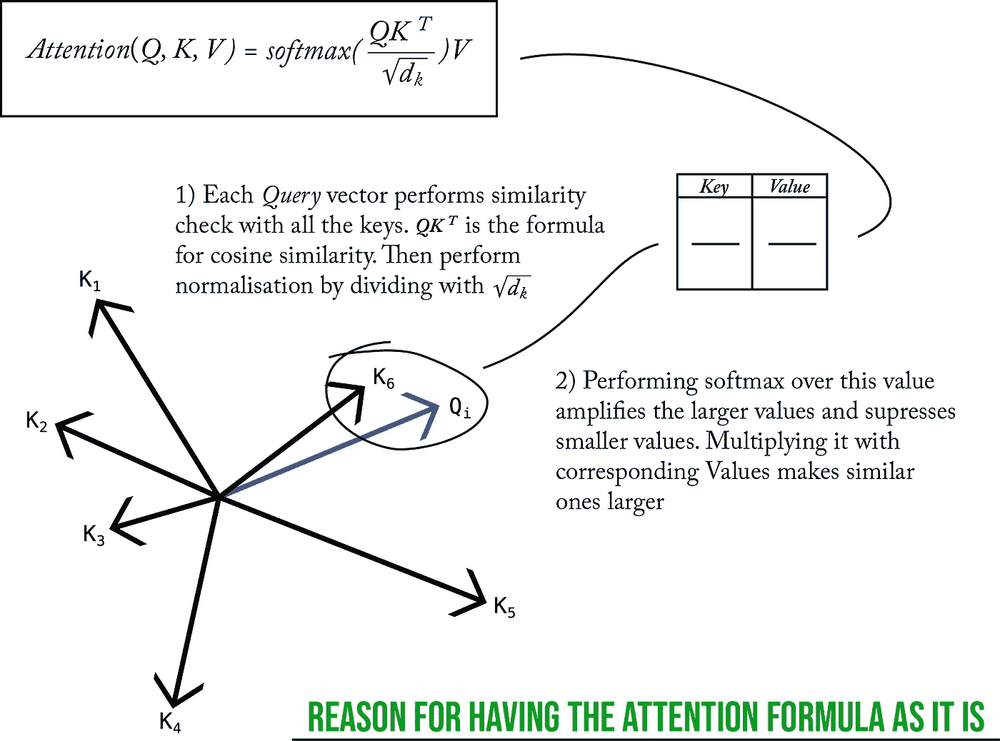
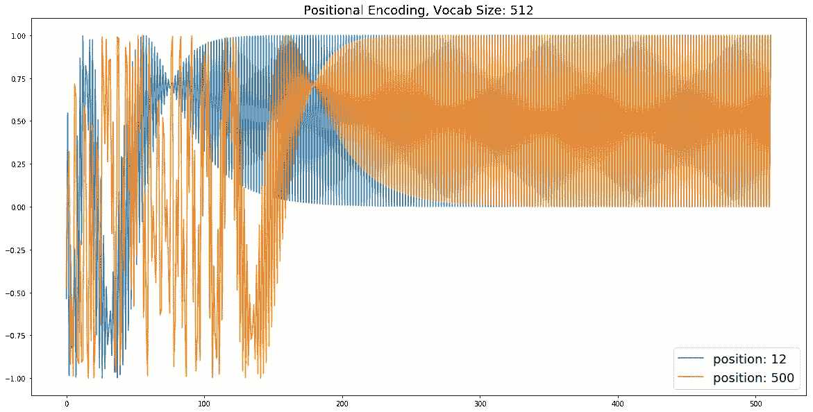
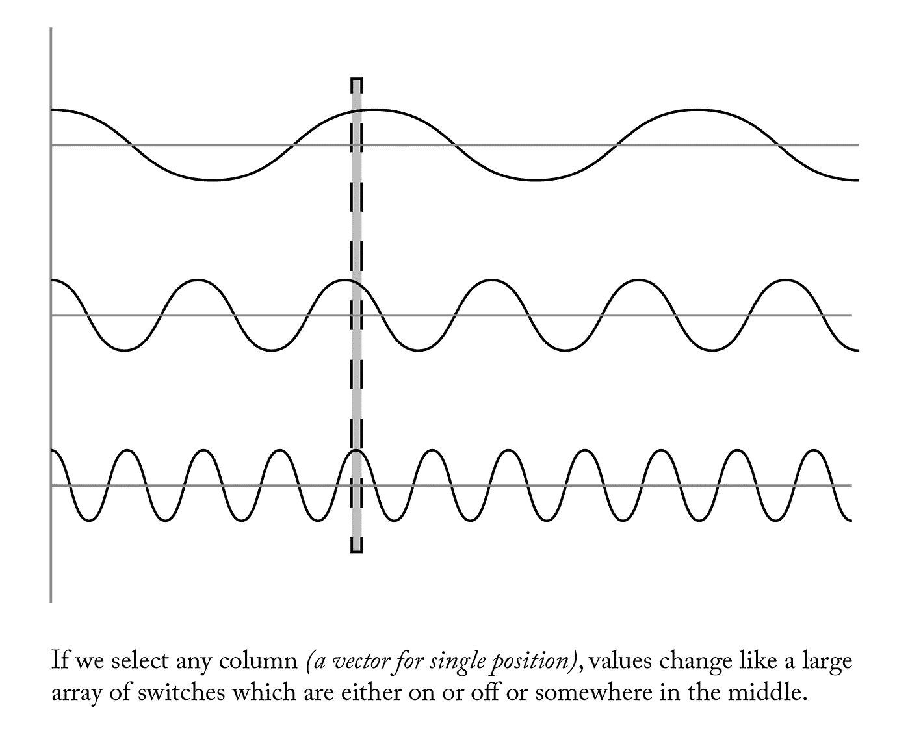

# 让我们建立“注意力是你所需要的一切”——1/2

> 原文：<https://medium.datadriveninvestor.com/lets-build-attention-is-all-you-need-1-2-de377cebe22?source=collection_archive---------1----------------------->

## 关于 RNNs 为什么烂！

你有没有和一个话很多的人在一起，即使你密切关注，你也会错过一些细节。电脑在这方面非常糟糕，它们什么也记不住。即使是最先进的机器也记不住几步以外的事情。这种依赖于时间的信息，即序列信息，被称为时间知识。解决时间问题创造了没有人认为可能的解决方案，想想几乎全球语言翻译谷歌翻译。

大多数时间深度学习模型使用一种特殊类型的神经网络，称为[递归神经网络(RNN)](http://karpathy.github.io/2015/05/21/rnn-effectiveness/) 。谷歌在他们的翻译系统中使用硬编码规则和 RNN 来创建这个星球上跨语言的无缝结果。这些模型背后的主要思想是每当一些信息到来时，即在每个时间步，使用相同的网络。一旦所有的输入信息都已给出，输入神经网络就进行我们所说的编码。编码后，它使用不同的神经网络(尽管结构相似)来解码信息并预测翻译结果。

最常用的神经网络被称为*长短期记忆(LSTM)*，但也有各种基于需求的神经网络，如*门控循环单元(GRU)* ，它们在声音模型上表现得非常好。rnn 在解决翻译任务方面非常有效，但是使用它们有许多缺点:

1.  **它们的计算效率低下:**如今运行这些庞大网络的大多数硬件都是 GPU，它们被优化来执行一项任务，即矩阵乘法。现在，是的，rnn 也需要矩阵乘法，但它们同样需要在存储器之间连续传输数据，因为它需要在每个时间步重新运行网络。
2.  它们很慢:如上所述，它们可能需要很长时间才能运行。想想一个有 12 个单词的句子，那么它必须运行编码器神经网络 14 次(12 个单词+ < START >和< END >标签)，对于解码器来说，运行次数大约相等。总计约 28 倍。它必须从内存中存储和检索信息，并把它推到处理器 28 一个句子的时间！据谷歌的人说，他们得到的序列的平均长度是 70 个单词。
3.  **每个单词必须经过的距离:**现在用文字来解释有点棘手，所以请看下图。你看到的是一个简单的 RNN，忽略 x，W，h，y。但是单词“Echt”必须经过多个步骤。最后的红色层必须存储编码信息。如果你想一想超过 50 个单词的大句子，每个单词需要移动的距离是线性增加的。由于我们不断地改写那些编码信息，我们肯定会漏掉句子中出现较早的重要单词。编码之后，它还必须经过一段距离才能到达被解码的目的地。

[from here](http://www.wildml.com/2015/09/recurrent-neural-networks-tutorial-part-1-introduction-to-rnns/)

使用 RNN 的一个最重要的问题是第三点。因此，新的处理方法被引入，其中最流行的是注意机制。有了注意机制，我们不再试图将完整的源句子编码成固定长度的向量。相反，我们允许解码器在输出生成的每一步“关注”源句子的不同部分。注意力机制大致基于人类的视觉注意力。当我们基于像理解这样的连续数据执行任务时，使用这一点，我们立即在文本中寻找相似的单词，并围绕它们分支来搜索答案。

注意机制的重大成就是改善了模型的空间理解，并允许它在执行翻译等任务时专注于句子的不同部分。一个正常的注意力机制模型如下图所示。

编码器不仅创建像传统模型一样被馈送到解码器的隐藏状态，而且在每个时间步长，它还生成也被馈送到解码器的上下文向量。现在，添加这些上下文向量的确切位置和方法因模型而异，但这是这个想法的要点。注意力机制很快超越了传统模型，成为行业标准，从各种公司的翻译模型到使用 RNN 的更专业的案例。

# 变压器网络

但是，即使我们解决了第三点，我们仍然需要解决前两点。这就是 transformer network 发挥作用的地方。*，不仅是一篇研究论文非常吸引人的标题，也是一个非常恰当的标题。作者证明，仅仅通过利用注意力，他们就胜过了传统的模型。但对我来说，最大的成就是他们的模型运作的巧妙方式。网络看起来像这样:*

**

*We have an encoder on left and decoder on right, each stack is repeated 3 times. The most unique element is the Multi-Head attention mechanism that is uses.*

*它的工作方式与传统的 RNN 模型的工作方式非常不同，需要时间来理解它，尤其是如果像我一样你决定先编码(即愚蠢)。解释这个模型如何运行的最简单的方法如下，与传统模型不同，我们不是先逐字输入，然后再获取输出。*

> *我们同时输入和输出句子。输出最初可以用任何东西填充，模型忽略你填充的任何东西。它使用整个输入句子和输出句子一次性预测下一个单词。一旦我们预测了单词，我们在输出序列中替换它，模型只考虑到该点的输出，而忽略它前面的内容。我们继续这样做，直到我们有一个完整的句子。*

## *注意力的用法*

*为了实现注意力，transformer 网络使用了一种叫做多头注意力 *(MHA)* 的东西。attention 背后的主要思想是 lookup-table，这是一个包含大量其他值的表，当你向它查询时，它会返回最接近的值。在这里使用的方法中，我们为它提供了三个值， ***键，值*** 和 ***查询。*** 有大量的键，基本上是 n 维空间中的一维向量，其中每个键都有一些对应的值。*

*这里使用的注意机制是加法，也使用点积。使用这个公式的原因可以用视觉化来更有效地解释。看看下面的图片，你会有更好的想法:*

**

*Query (Q), Key (K) and Value (V) and dk = dmodel/num_heads*

*MHA 只是注意力机制的一个更大的实现。我们不是在文本上使用一个注意力，而是应用 8 个*(在论文中)*注意力标题，合并这些标题并执行进一步的操作。主要优点是使用一个以上的注意力，减少差异，也允许随着时间的推移更好地学习。也许不同的大脑学习关注不同的事情，但最终的输出是相同的。比例点积注意力就是上面解释的那个。该单元看起来如下:*

**

*The Masking is optional and it’s use is explained below*

*理想情况下，我们希望在整个输入序列中使用注意力，并且只在生成的输出中的所需点上使用注意力，因为在语言任务中，我们不能让未来预测过去。但是这将再次要求我们对已经生成的序列进行循环，以预测下一个单词，而循环是与我们想要的相反的。因此，作者提出了一个简单的方法，一步到位。在底部的解码器堆栈中，有一种特殊类型的多头注意力，称为屏蔽多头注意力 *(MaskedMHA)* 。这会屏蔽掉未来的所有值，并将它们转换为 0。*实际实施略有不同，但这是其背后的理念。**

*我们使用 MHA，MaskedMHA，结合前馈网络创建一个模块。这个模块本身就是一个完整的处理单元，我们可以随意使用。在论文中，作者对每个编码器和解码器使用 3 个堆栈，即 Nx = 3。在解码器的最终输出中，我们将其通过前馈层，并对整个词汇表执行最终的 softmax。以获得所需的单词。*

## ***位置编码的用法***

*由于我们同时处理输入和输出句子，我们的模型不理解单词在序列中的位置和地点。为了给出关于位置的知识，作者使用简单的基于余弦的编码方法。使用余弦函数背后的简单思想就像给每个位置一个介于-1 和+1 之间的向量值。所以每个位置向量的行为就像一个巨大的开关阵列，或者开或者关，或者在中间。编码可以想象为:*

**

*For this example the vocabulary size is 512 words*

*之所以选择以下函数，是因为作者认为它可以让模型通过相对位置来学习注意力，还因为它的简单性允许它用在比它被训练的句子更长的句子上。*

**

*Positional Encoding*

*请这样想，我们有大量不同波长/频率的余弦函数，对于每个位置，我们必须选择一个对应于该指数的列。大概是这样的:*

**

*Selection of columns*

***这就是变压器网络主要组件的构建方式。**模型中每个小零件的努力和细节值得称赞。在制作这个模型时，我特别感兴趣的是注意力机制背后的直觉和逻辑。该方法的简单性也可用于确定大空间中的相似向量。事实上，我已经在另一个项目中使用它来确定多个轨迹的相似性。我没有添加很多显示注意力工作的图片，因为它们可以在其他博客上看到。*

*下一次，我们将使用 python 中的 tensorflow 构建变压器网络，并在简单的玩具数据集上对其进行训练。**敬请期待！***