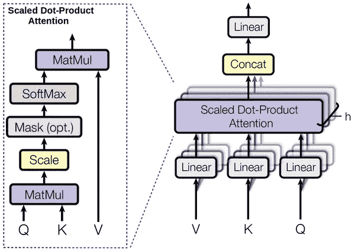
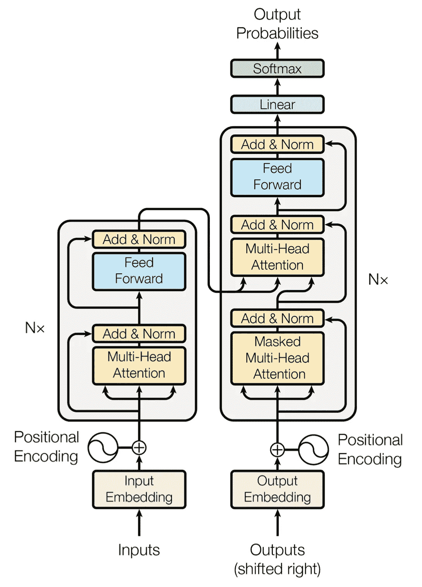

# 让我们建立“注意力是你所需要的一切”——2/2

> 原文：<https://medium.datadriveninvestor.com/lets-build-attention-is-all-you-need-2-2-11d9a29219c4?source=collection_archive---------6----------------------->

## 应当编写代码！

我在学习人工智能时发现的最大问题是缺乏适当的、有据可查的、最重要的是简单的代码。通常编写这些代码的人都是专业人士，他们将大部分时间花在编写行业级软件上，但对于像我这样没有很多编写代码经验或实践，更没有实现研究论文经验的人来说，这是一个问题。即使是在线可用的代码也不能正确解释选择特定策略背后的原因，为什么使用一个张量流函数而不是另一个，或者这里应该使用哪个张量流函数。另一个问题是，缺乏计算能力或研究人员使用的数据集，即使我们能够以某种方式获得它们，如何实际使用它们！别担心，我正在努力解决这个问题。在之前的一篇博文中，我写了这个模型的要点。在这里我们最终解决了如何建造这个东西。

关于这一点，我们需要知道的第一件事是 tensorflow 的工作方式，因为一切都是背景，大多数 python 函数都不工作，我们需要找到一种方法来使用 tensorflow 函数来达到我们的目标。

您可以通过单击下面的链接找到实际代码:

[](https://github.com/yashbonde/transformer_network_tensorflow/blob/master/tutorial/transformer.py) [## 亚什邦德/变压器 _ 网络 _ 张量流

### 变压器网络的张量流实现

github.com](https://github.com/yashbonde/transformer_network_tensorflow/blob/master/tutorial/transformer.py) 

我建议你在一个标签中打开代码，并在这里阅读原因，显然你不能使用 github gist 在媒体上显示相同的代码块。在这里，我将讨论具体的代码选择和一些棘手部分的解释。有一件重要的事情你需要知道，即使你到现在都忽略了，那就是使用作用域，并且很好地使用它们。不得不使用大量示波器的主要原因是因为在变压器网络中使用了大量相同的单元。

我们从写下 transformer 类的大纲开始我们的过程。

```
class Transformer(): '''initialization code''' def __init__(self, param):
        # initialise parameters here '''in-house functions - functions users should not call'''    def _masked_multihead_attention(self, args):
        # code for masked multihead attention here def _multihead_attention(self, args):
        # code for multihead attention here def _encoder(self, args):
        # code to build the entire encoder here def _decoder(self, args):
        # code to build decoder '''user callable functions - users can call if they want, but don't necessarily need to''' def make_transformer(self):
        # take the output of encoder and merge with decoder inputs def make_loss(self):
        # write the loss function and apply gradients functions def initialize_network(self):
        # initialize the session and variables '''operation functions - functions to properly run the model''' def run(self, args):
        # code to run a single input sequence and generate outputs
        # can use this function to both train and infer only def save_model(self):
        # save the model according to requirements
```

如果你查看所有使用的主要功能，它们将按此顺序排列。为任何模型编写代码的方法都在上面的模板中。**将类分为四个主要部分:初始化、内部函数、用户可调用、操作。**

**初始化**函数中有`def __init__()`。

**内部**函数具有建立模型所必需的函数。它有大量的代码，因为所有的操作都在这里。在我们的代码中，我们有两个主要模块`masked-multihead-attention`和`multihead-attention`，以及两个主要单元`encoder`和`decoder`。所以我们编写函数来构建它们。Tensorflow 后端作为计算图运行，因此这是我们写入所有节点的地方。我们通过在名字前加下划线来表示这些函数。

**用户可调用的**函数是用户可以调用的函数，如果他们想要，但不一定需要，来运行模型。这些函数中的大部分只会在`__init__`期间被调用。在我们的例子中，我们有`make_transformer()`，它组合了来自`_encoder`和 _ `decoder`的输入，以生成能够执行推理的最终计算图。为了使模型可训练，我们需要添加更多的模块，即损失和训练函数。我们将这些函数放在`make_loss()`中，它给出了损耗和`train_step`。

**操作**功能有用户根据需要调用的功能。对于我们的代码，我们有`run()`函数，它为一个输入序列运行一次迭代。您还可以添加代码，以您想要的任何格式保存模型。经验法则是，如果将来要改进模型，可以保存为检查点文件。如果要进行部署，使用`protobuf`将模型存储为冻结图。

几乎每个代码库都可以分解成这四个块，然后按照这个模板来构建。经过无数天的代码编写，无论是作为项目还是专业，我亲自做了自己的模板，一直在微调。你根据自己的需求做一个吧！

## 初始化功能

所以我们从顶部开始，我们定义的第一件事是`LOWEST_VAL`，它是系统中可以使用的最小值。默认情况下，可以用 32 位浮点表示的最低值约为 1.175e-38。因此，我们选择一个更接近它的值，我们选择 1e-36，因为它足够小。根据这篇论文，我们基本上需要应用负无穷大，但是由于无穷大的值没有被正确处理，我们用一个非常小的数来代替它。

接下来，我们导入我们的依赖项，`utils`具有确定位置编码的功能。`numpy`是我们最重要的线性代数库，`tensorflow`用于制作和处理我们的模型。接下来，我们定义我们的类并编写初始化值。大多数值都是根据论文预先填充的，我们唯一需要的参数是目标语言的字数`VOCAB_SIZE`。我们根据文中给出的公式定义了一些参数，如`DIM_KEY`和`DIM_VALUE`。

接下来的`line-52`我将屏蔽矩阵定义为一个占位符，所以它可以在运行时改变或输入。掩蔽背后的主要思想已经在之前的博客帖子中解释过了。挑战在于在运行时实现它，因为每个输入句子可能长度不同。在`line-61`我定义了一个嵌入矩阵，以防用户不希望预先实现 word 的嵌入。

接下来，我们再定义四个占位符，`input_placeholder`用于输入序列`output_placeholder`用于输出序列，`labels_placeholder`用于要预测的目标标签，`position`用于跟踪生成句子之前的位置。最后一个是在使用`tf.nn.embedding_lookup()`时与`masking_matrix`一起用作参数。接下来的功能是`make_transformer()`、`build_loss()`和`initialize_network()`。这三个函数的用法将在后面讲到。

## [屏蔽]多头注意力



转到模型架构，如果你想一想，多头注意力是非常复杂的，也是它们自己的实体，所以我们可以将它们转换成函数，它们只是返回输出张量。这就是我们通过创建单独的函数所做的，尽管两者都可以转换成一个函数。我只是觉得让他们作为两个不同的实体更方便。在`line-75`我们启动`multihead_attention()`，它有四个参数，其中三个如前所述，还有一个`reuse`参数。

非常正确地使用 tensorflow 功能(如示波器)非常重要！这是一个隐藏的技巧，让我们可以制作这些复杂的图形。作用域只不过是被创建的变量的名字，在 transformer 中我们使用堆栈，也就是说，相同的变量被多次使用。为了使用它，我们使用函数`tf.variable_scope()`,向它传递两个参数，作用域的名称和是否重用它。作用域的名称可以是任何东西，它只是告诉在它下面创建的所有变量都将带有名称`<outer_scope> / <inner_scope> / <variable_name>`。还要注意的是，我们第一次不能通过`reuse`论证为真，因为我们必须先给它们下定义。

为了存储所有创建的张量的值，我们创建了一个名为`head_tensors`的列表，随着我们定义越来越多的张量，我们会不断地将它们添加到这个列表中。我们迭代我们拥有的头的数量，就像外部范围，如果重用不是真的，这意味着我们第一次创建这些层，我们定义`reuse_linear`为假。对于每个线性层，我们定义了另一个可变范围。在 scope 下生成变量的最佳实践是使用`tf.get_variable()`函数。第一个参数是名称，第二个参数是形状。如果我们得到了变量，我们仍然需要初始化它们，因为现在我们使用`tf.truncated_normal_initializer`用截断正态分布中的数字填充它。

这样，我们创建了三个权重，`weight_q`、`weight_k`和`weight_v`，并执行进一步的计算以获得`head`。计算出`head`后，我们将其添加到包含不同头部值的列表中。在线性层迭代完成后，我们现在需要连接不同线性层的输出值。我们这样做，并执行最后的线性运算，并从名为`mha_out`的多线程注意返回值。

在掩蔽的多头注意力的情况下，我们简单地乘以另一个值(掩蔽值)，如图所示。为了获得这个值，我们从前面定义的`masking_matrix`开始计算。现在没有办法只传递 index 并获得 tensorflow 中的值。通过运行会话和计算来实现它是非常缓慢和低效的。但是有一个变通方法，它涉及到使用另一个名为`tf.nn.embedding_lookup()`的 tensorflow 函数。它在逻辑上类似于我们想要的，我们给它一个矩阵和我们想要的索引列表。这给了我们蒙版的价值，我们后来乘在线性层。

## 编码器



一旦完成了多头注意力，剩下的代码就很容易构建了。这里我们也使用变量作用域来跟踪正在生成的变量。我们还创建了一个空列表，用每个名为`stack_op_tensors`的堆栈的输出填充这个列表。接下来，我们迭代我们拥有的堆栈的数量，如果我们在第一个堆栈，我们需要给模型输入作为输入，否则我们必须使用前一个堆栈的输出。然后，我们再次打开一个可变范围，并在需要时重用它们。我们从多头注意力获得输出，并对其执行进一步的操作。现在我使用 l2 规范化，但是你可以随意使用任何你认为合适的。

对于每个堆栈，我们有两个子层，第一个具有如上所述的多头注意力，第二个具有前馈和归一化部分。在计算完每个堆栈后，我们将它添加到`stack_op_tensors`中，当完成堆栈的数量时，返回包含特定张量的列表。

## 解码器

解码器模块在结构上类似于编码器模块，除了每个堆栈有三个子层，来自编码器的输入在中间子层。我们再次打开变量范围，并在需要时重用它们。完成所有堆栈后，我们获得最终输出，并将其传递到密集层，以预测最终的 pre-softmax 输出。

## 用户可调用函数

我有三个不同的用户可调用函数，`make_transformer()`定义了全局范围，将编码器的输出连接到解码器的输入，并创建名为`decoder_op`的全局变量，该变量将用作模型的预测。接下来，我们使用定义全局`loss`的`build_loss()`和执行一次梯度下降迭代的`train_step`。我在这里做了一个改变，不像这篇论文我不会手动降低学习率，而是使用`AdamOptimizer`来训练网络。

最后一个用户可调用的函数是`initialize_network()`，它什么也不做，只是通过使用`global_variables_initializer()`启动一个会话并初始化变量。

## 操作功能

当制作如此大的模型时，能够调试代码比以往任何时候都重要。我们应该能够做的第一件事是看到所有的可训练变量，所以我们创建了一个名为`get_variables()`的函数，它返回所有的`trainable_ops`。我正在使用的另一个工具是`save_model()`，它可以把模型保存成你想要的任何格式。我还没有写完这一部分，但是有多种格式可以保存你的模型，每种格式都有其独特的优点和缺点。一些比较流行的格式有`protobuf`、`frozen_graph`、`checkpoint files`、`servings`等。

现在进入最后一个函数`run()`，它运行一次输入迭代，即一次迭代，输出序列长度为 long。我们制作的第一个主要值是掩蔽矩阵，它是如上所述的三角形矩阵。如果用户不提供嵌入，那么我们需要自己制作。使用公共嵌入矩阵，我们得到文本的嵌入，然后乘以我们从 utils 得到的位置编码。我们也为输入序列制作标签。如果我们正在训练的论点`is_training`将为真，那么我们也需要记录损失。因此，我们定义了一个名为`seq_loss`的变量，它存储序列生成过程中发生的损失值。

我们迭代我们必须生成的单词数，即`seqlen`并对其运行操作。如果我们正在训练模型，那么我们需要再运行两个操作，一个计算`loss`，另一个执行训练`train_step`的一次迭代。我们返回生成的序列和 if 训练序列中每个单词的生成损失。

这个模型花了我三个多星期的时间从零开始完全实现，这是一次很好的学习经历。我还在小型玩具数据集上训练了模型，并在其上制作了一个 jupyter 笔记本。一旦模型被适当地训练将在这里连接它。

> 如有任何澄清/疑问，请联系 bonde.yash97@gmail.com

****敬请期待下期沉思！****