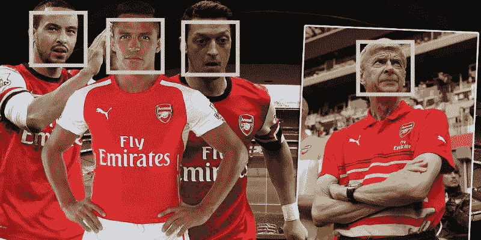

# 让我们在世界杯比赛中进行人脸识别

> 原文：<https://medium.datadriveninvestor.com/lets-do-face-recognition-in-a-worldcup-match-4b59851781b0?source=collection_archive---------0----------------------->

[](http://www.track.datadriveninvestor.com/1B9E)

# 什么是面部识别？

> 面部识别系统是一种能够从来自视频源的数字图像或视频帧中识别或验证人的技术。面部识别系统有多种工作方法，但一般来说，它们通过将从给定图像中选择的面部特征与数据库(维基百科)中的面部进行比较来工作。

# 面部识别用例

许多行业都在使用人脸识别:

*   解锁手机:这是一个旧的。我们已经在使用这项技术来解锁我们的智能手机
*   防止零售犯罪:如果你知道一些零售公司有一个庞大的人脸数据库来匹配他们制造的麻烦，你会有什么感觉？该系统可以在有问题的顾客进入商店时识别出他们
*   寻找失踪的人
*   识别社交媒体中的人:脸书标签是一个很好的例子
*   诊断疾病
*   保护学校免受威胁
*   跟踪学校出勤率:中国的一些学校正在使用这些系统
*   在 ATM 中验证身份
*   寻找丢失的宠物
*   识别驱动程序
*   控制敏感区域的进入

[](https://www.datadriveninvestor.com/2019/02/19/artificial-intelligence-trends-to-watch-this-year/) [## 今年值得关注的人工智能趋势——数据驱动的投资者

### 预计 2019 年人工智能将取得广泛的重大进展。从谷歌搜索到处理复杂的工作，如…

www.datadriveninvestor.com](https://www.datadriveninvestor.com/2019/02/19/artificial-intelligence-trends-to-watch-this-year/) 

# 面部识别教程

让我们使用人脸识别库在一个视频中进行人脸识别！

我在文章末尾分享了一个链接，这样你也可以得到这个 python 库。

我将用 2014 年世界杯的一段视频来检测德国队球员的面部！

# 安装 Face_Recognition Python 库

首先，让我们安装依赖项:

```
!pip install face_recognition
```

视频编解码器兼容性需要此包:

```
!pip install ffmpeg
```

导入库:

```
Import libraries
import face_recognition
import cv2
```

让我们打开视频文件:

```
input_video = cv2.VideoCapture("worldcup2014.mp4")
length = int(input_video.get(cv2.CAP_PROP_FRAME_COUNT))
```

确保分辨率和帧速率与输入视频匹配。我的视频分辨率为 1280x720，帧率为 25.07:

```
fourcc = cv2.VideoWriter_fourcc('M','P','E','G')
output_video = cv2.VideoWriter('selfie_oscars.mpeg', fourcc, 25.07, (1280, 720))
```

# 收集足球运动员的照片

为了实验，我从 11 名德国足球运动员那里收集了一些样本图片:


Bastian Schweinsteiger is my fav!

现在，让我们加载选定的图片，以便机器可以学习识别视频中的图片:

```
lahm_image = face_recognition.load_image_file("lahm.png")
lahm_face_encoding = face_recognition.face_encodings(lahm_image)[0]ozil_image = face_recognition.load_image_file("ozil.jpg")
ozil_face_encoding = face_recognition.face_encodings(ozil_image)[0]mueller_image = face_recognition.load_image_file("mueller.png")
mueller_face_encoding = face_recognition.face_encodings(mueller_image)[0]neuer_image = face_recognition.load_image_file("neuer.jpg")
neuer_face_encoding = face_recognition.face_encodings(neuer_image)[0]klose_image = face_recognition.load_image_file("klose.jpg")
klose_face_encoding = face_recognition.face_encodings(klose_image)[0]kroos_image = face_recognition.load_image_file("kroos.jpg")
kroos_face_encoding = face_recognition.face_encodings(kroos_image)[0]boateng_image = face_recognition.load_image_file("boateng.jpg")
boateng_face_encoding = face_recognition.face_encodings(boateng_image)[0]howedes_image = face_recognition.load_image_file("howedes.jpg")
howedes_face_encoding = face_recognition.face_encodings(howedes_image)[0]hummels_image = face_recognition.load_image_file("hummels.jpg")
hummels_face_encoding = face_recognition.face_encodings(hummels_image)[0]krammer_image = face_recognition.load_image_file("kramer.jpg")
krammer_face_encoding = face_recognition.face_encodings(krammer_image)[0]bastian_image = face_recognition.load_image_file("bastian.jpg")
bastian_face_encoding = face_recognition.face_encodings(bastian_image)[0]
```

这些都是我们将在视频中尝试找到的面孔:

```
known_faces = [
    lahm_face_encoding,
    ozil_face_encoding,
    mueller_face_encoding,
    neuer_face_encoding,
    klose_face_encoding,
    kroos_face_encoding,
    boateng_face_encoding,
    howedes_face_encoding,
    hummels_face_encoding,
    krammer_face_encoding,
    bastian_face_encoding
]
```

让我们初始化一些变量:

```
face_locations = []
face_encodings = []
face_names = []
frame_number = 0while True:
  **  # Grab a single frame of video**
    ret, frame = input_video.read()
    frame_number += 1**# Quit when the input video file ends**
    if not ret:
        break
```

现在，让我们从 BGR 转换到 RGB 颜色:

```
**# Convert the image from BGR color (which OpenCV uses) to RGB color** (which face_recognition uses)
    rgb_frame = frame[:, :, ::-1]
```

这些行将查找视频当前帧中的所有面孔和面孔编码:

```
 face_locations = face_recognition.face_locations(rgb_frame)
    face_encodings = face_recognition.face_encodings(rgb_frame, face_locations)face_names = []
    for face_encoding in face_encodings:
        # See if the face is a match for the known face(s)
        match = face_recognition.compare_faces(known_faces, face_encoding, tolerance=0.50)

        name = None
        if match[0]:
            name = "Philipp Lahm"
        elif match[1]:
            name = "Mesut Ozil"
        elif match[2]:
            name = "Thomas Muller"
        elif match[3]:
            name = "Manuel Neuer"
        elif match[4]:
            name = "Miroslav Klose"
        elif match[5]:
            name = "Toni Kroos"
        elif match[6]:
            name = "Jerome Boateng"
        elif match[7]:
            name = "Benedikt Howedes"
        elif match[8]:
            name = "Mats Hummels"
        elif match[9]:
            name = "Christoph Kramer"
        elif match[10]:
            name = "Bastian Schweinsteiger"

        face_names.append(name)
```

下一段代码将标记结果，并在识别出的人脸周围画一个方框:

```
**# Label the results**
    for (top, right, bottom, left), name in zip(face_locations, face_names):
        if not name:
            continue**# Draw a box around the face**
        cv2.rectangle(frame, (left, top), (right, bottom), (0, 0, 255), 2)**# Draw a label with a name below the face**
        cv2.rectangle(frame, (left, bottom - 25), (right, bottom), (0, 0, 255), cv2.FILLED)
        font = cv2.FONT_HERSHEY_DUPLEX
        cv2.putText(frame, name, (left + 6, bottom - 6), font, 0.5, (255, 255, 255), 1)
```

这一行将生成带有标记面的所有帧，并将它们添加到输出视频文件中:

```
**# Write the resulting image to the output video file**
    print("Writing frame {} / {}".format(frame_number, length))
```

我们现在可以检查最终的视频！

```
**# All done!**
input_video.release()
cv2.destroyAllWindows()
```

这是使用 **Face_Recognition** Python 库的结果:

使用此 API 并分享您的结果！

# 资源:

Python 的面部识别 API

[](https://github.com/ageitgey/face_recognition) [## 年龄/面部识别

### 世界上最简单的用于 Python 和命令行的面部识别 API——ageitgey/face _ recognition

github.com](https://github.com/ageitgey/face_recognition)