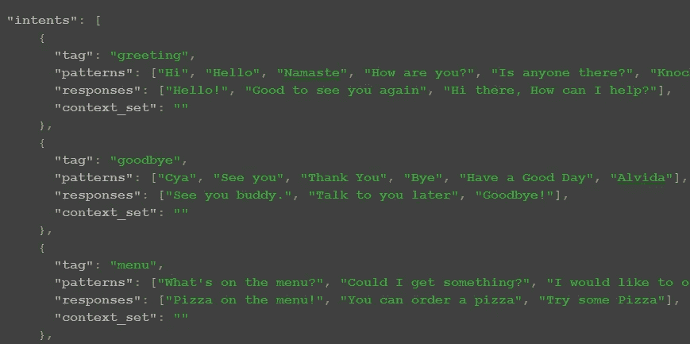
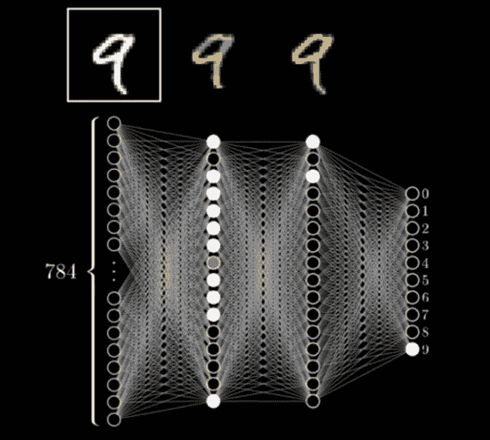
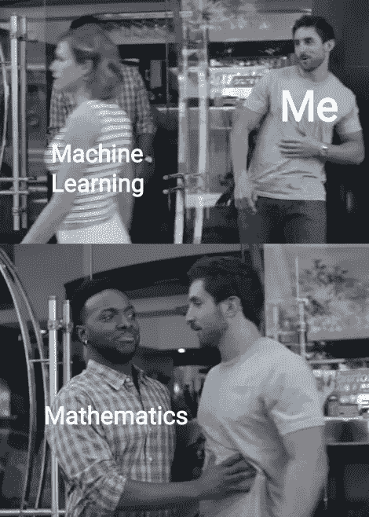
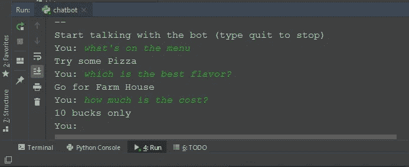

# 让我们制造一个人工智能“常见问题”聊天机器人——由神经网络驱动

> 原文：<https://medium.datadriveninvestor.com/lets-make-an-ai-faq-chat-bot-powered-by-neural-network-af701640e41e?source=collection_archive---------2----------------------->

聊天机器人的受欢迎程度当然在上升。不久前，任何商业网站上的 **FAQ 版块**都是一个沉闷、黑暗、地牢般的地方，在那里**静态**信息**经常堆在一堆，让你去理解。那些日子一去不复返了。人工智能时代即将来临。**

越来越多的企业正在将他们的 FAQ 版块从“自助”转向“机器人辅助”的高度互动体验。虽然不是百分百准确，但机器人正设法以相当高的准确度回答这些问题。随着这一领域研究的增加，它们只会变得更好。趋势分析师预测**他们的大量使用**和 [**在未来的时代占据市场主导地位**](https://www.businessinsider.com/80-of-businesses-want-chatbots-by-2020-2016-12?IR=T) ，没有理由不这样认为。

1950 年，被广泛认为是理论计算机科学和人工智能之父的艾伦·图灵(Alan Turing)提出了图灵测试(Turing test ),这是一种检查任何软件表现出智能行为的能力的方法，这种智能行为类似于人类行为，并且与人类行为没有区别。以目前的形式和形状，聊天机器人离通过图灵测试还很远，但它们每天都在变得越来越聪明，可能会让我们大吃一惊。

 [## 对话式人工智能的兴起将如何影响世界|数据驱动的投资者

### 从不同的专业服务，保险，教育，金融，旅游，电信，到建筑，银行，和…

www.datadriveninvestor.com](https://www.datadriveninvestor.com/2019/02/07/how-the-rise-of-conversational-ai-will-impact-the-world/) 

好了，关于他们能力的宣传和鼓舞士气的话已经说得够多了，让我们直接看如何制造一个。不过，既然我们谈到了图灵测试这个话题，在我们开始之前，我想说最后一点，一个我觉得很酷的小细节。众所周知，验证码也是一种图灵测试。这是它的完整形式，在测试过程中完全自动的告诉计算机和人。但在这里面，电脑是在评估你是不是人，而不是反过来。很奇怪，不是吗？

不管怎样，话虽如此，我们开始吧。市场上有各种各样的聊天机器人，许多非常复杂，像谷歌助手或亚马逊 Alexa。但是 FAQ 部分通常需要的种类不需要那么复杂，因为它们的领域是定义好的。它们是为了一个**特定的目的**而建造的。他们只会对他们被训练回答的主题中的问题感兴趣。但是**键是**问题是**而不是硬编码的**。只要语义相同，用户可以自由地以他们希望的任何形式输入问题。

例如，要获得任何企业的工作时间信息，两个人可以用两种不同的方式问同一个问题，

> 人 1:你们什么时候开门？
> 
> 人 2:你的工作时间是什么时候？

请注意，这两个问题是相同的，只是框架不同，用词**与**不同。FAQ 聊天机器人应该将它们解释为相同的，并提示相同的回复。

此外，一个问题可以以任何语法顺序提问，也可以借助任何助词提问，聊天机器人必须考虑所有这些，并从句子中找到主要的词，以了解所提问题背后的真正含义。

> 人 1:菜单上有什么？
> 
> 你能给我看看你的菜单吗？
> 
> 人 3:我应该去哪里查看你的菜单？

注意这里有很多助词但是主要的词是“**菜单**”。这些是聊天机器人应该注意并发现的词。

因此，即使机器人不需要回答世界上的所有问题，解决一系列问题也绝不是在公园散步。这就是人工智能的力量所在。

我们讨论了功能方面，现在让我们来谈谈技术方面。我已经把代码上传到了我的 GitHub 账户上，如果你想参考的话。

# 生成训练数据

那么，我们需要做的第一件事就是准备**培训数据**。机器学习和人工智能的核心是用大范围的训练数据集**训练模型，以便模型从中学习**，并基于这种学习对下一组它从未见过的数据集**做出预测**。为了实现这一点，我创建了一个 training.json 文件，在这里我对发帖用户可能的"**意图**"进行了分类。

我正在假装为一家比萨饼店制作一个机器人。因此，他们的客户可以发布“问候”消息、“再见”消息、关于“菜单”的问题、询问“价格”、预订“订单”的命令、询问经营者的“姓名”等等。在开始任何工作之前，我们需要考虑**所有可能的意图**，一个访问者可能在我们的聊天门户上有。

一旦我们有了意图列表，那么我们就可以添加**他可能在这里提出的疑问/问题的可能模式**。说到问候，有许多可能的方式来问候某人，不同的人会说不同的话，如“你好，嗨，你好，早上好”等，我们需要尽可能多地把我们能想到的放在这里。请注意，这个机器人**不仅限于这些模式**。这些只是训练数据集。基于这些单词集，机器人还将捕捉列表中不存在但具有相同含义的单词，并将它们分类为“问候”消息。例如，单词“嘿”不在问候列表中，但机器人会捕捉到它。

发布，然后我们需要放入**响应**。这些是机器人在看到任何特定意图的消息时会回复的句子。为了让用户感觉到机器人每次都在做出不同的“问候”回复，我们可以放置一个**范围的回复**并随机选择一个**。**

## **Python 模块**

**一旦我们准备好了训练数据集，我们就必须导入某些 python 模块(如果还没有的话，就安装它们)。我们需要，**

> ****Json** :解析我们的 Json 训练数据集。**
> 
> ****Nltk** :自然语言工具包(为了*阻止*我们将在下面讨论的单词)**
> 
> ****随机**:随机选择响应**
> 
> ****Tensorflow** :神经网络实现**
> 
> ****Tflearn** :简化 TensorFlow 工作的深度学习库**
> 
> ****Numpy** :阵列管理**
> 
> ****Pickle** :对象序列化，缓存预处理后的数据。**

**python 脚本有三个步骤，**

1.  **数据预处理**
2.  **训练神经网络**
3.  **与用户聊天**

# **第一步:数据预处理**

**在这一部分，我们需要对数据做一堆事情，以便它变得理想，可以馈入神经网络进行深度学习。**

## ****词汇****

**阅读 Json 训练数据。在**单一列表**中收集所有模式和标签中的所有单词。我们称之为词汇表。它有助于我们评估我们正在处理的输入数据的大小。**

## ****词干****

**自然语言处理工具包(nltk)的功能是将任何单词带到**的最根形式**。例如，当我们说“Whats's”时，主要的词是“What”。词干删除所有多余的字符和标点符号，并使其修剪。我们不想给我们的模型添加任何不必要的词语来使事情复杂化。所以，这个过程对**保持模型清洁**至关重要。**

## ****一热编码****

**神经网络**只理解数字**。我们收集的词干词汇表对底层网络毫无意义。因此，我们必须将单词列表转换成一串数字。这个过程叫做[一键编码](https://hackernoon.com/what-is-one-hot-encoding-why-and-when-do-you-have-to-use-it-e3c6186d008f)。简单来说就是如果一个词存在，用 1(热位)编码，不存在，用 0(冷位)编码。我们需要为每个相应的查询模式生成这个编码模式。**

**例如，假设我们有 6 个单词的总词汇量。**

****【“你好”、“好”、“价格”、“早上好”、“年龄”、“姓名”】****

**并且模式(记住模式是用户提出的询问或问题)是“早上好”，那么我们将对其进行编码，**

****【0，1，0，1，0，0】****

**将“1”放在词汇表中出现该模式的单个单词的位置。**

## ****一袋话****

**如果我们对训练数据的每个模式重复这种一次性编码，我们将得到许多单独的编码列表。我们需要把它放在[一袋字里](https://machinelearningmastery.com/gentle-introduction-bag-words-model/)(另一个机器学习术语)。这个袋子代表**没有任何订单**。一旦我们将物品放入包中，我们不确定它们将按什么顺序放入包中。这一立场完全是武断的。**

**从同样的意义上说，神经网络并不真正关心单词出现的顺序。重要的是**这个词存在与否**。这是根据内容对文档进行分类时常用的方法。**

**注意:我们必须把输出也转换成一个单词包。在我们的例子中，输出是**用户发布查询**的意图。我们本质上是试图对用户输入内容背后的意图进行分类。如果他键入“确认我的订单”，他的意图是“订购”。如果他键入“再见”，他的意图是“再见”，等等。**

**所以，如果我们有五个意图，**

****【“问候”、“再见”、“订单”、“费用”、“菜单”】****

**然后，对于每个模式，我们需要对相应的输出进行如下编码，比如模式“这个比萨饼多少钱？”，我们知道这是询问比萨饼“成本”的查询，所以我们必须将其匹配输出编码为，**

****【0，0，0，1，0】****

**请注意，该模式是针对意图“成本”的，因此我们在意图列表中的该位置放置了 1。**

**这个编码过程需要对每个模式及其相应的输出重复进行。**

## **预处理数据的缓存**

**最后，数据预处理步骤中的最后一项是缓存预处理的数据，这样我们**就不必在每次客户与我们的机器人聊天时重复**整个过程。**

**为此，我们将使用 pickle 模块。存储的对象(词汇表、输入模式的单词包、输出意图的单词包)等被序列化并存储在一个文件中，我们将重用这个文件。**

# **步骤 2:训练模型**

**现在，一切都准备好了，为那些饥饿的神经元提供一些有营养的饲料。但首先，让我们试着理解神经网络是如何工作的。**

****生物神经元**是大脑的**基本工作单元**，一种专门用于向其他神经细胞传递信息的细胞。这种交流形成了我们的神经系统(生物神经网络)，本质上使我们的大脑做所有这些奇妙的事情。**

****人工**神经网络是基于相同的原理设计的。神经网络从根本上来说是分层排列的神经元网络。每一层的神经元都被分配了一个特定的计算任务，并且基于这个计算的结果，它们的工作是**激活下一层的神经元**。超级迷惑对吧？我们举个例子(神经网络的 hello world，手写数字的分类)。**

****

**The neural network to predict the hand-written digit**

**在这个例子中，我们的任务是设计一个能够识别手写数字的神经网络。我们拥有的输入系统是一个 28 * 28 像素的网格，我们在其中绘制图像，形成 784 个不同的像素值。根据你在输入帧上画的内容，784 像素中的一些会变亮。**

**在我们的神经网络中，我们**设计了 4 层**。第一个是**输入层**，接下来的 **2 是隐藏层**，最后的**是输出层**。每一层的神经元**都与下一层的每个神经元**相连。**

**第一个神经层，即输入层，将有 **784 个神经元**，其值是它们所代表的像素的固有亮度。该值的范围从 **0(完全暗)到 1(完全亮)**。**

**下一层(**第二层**)是一个**隐藏层**，我们设计了有 **16 个神经元**。这个隐藏层中的每个神经元都将被分配一个专用区域。这一层神经元的任务是**识别特定区域的边缘**。如果其专用区域中像素的亮度超过某个阈值，则该区域的神经元将被激活。**

**下一层(**第 3 层**)也是一个**隐藏层**，有 **16 个神经元**。该层中的每个神经元都被分配了基于边缘输入的**检测模式**的任务。如果图像的上半部分有类似圆形的图案，这一层的特定神经元就会被激活。**

**最后一层是**输出层**，它包含 **10 个神经元**，代表我们想要对我们的图像进行分类的 10 个数字。基于来自第三层的模式输入，特定的神经元将在这一层被激活。比方说，如果我们在图像的上半部分有一个圆形图案，在图像的下半部分的右侧有一条直线，则 9 位数的可能性很高。因此，输出层的神经元将被激活。**

**你看，**这是多么优雅的**。一个复杂的大问题被分解成一个抽象层，每一层都被分配一个特定的任务来实现最终的目标。我希望这有助于理解神经网络隐藏的秘密。**

**继续，对于我们的聊天机器人，我们必须做基本相同的事情。**输入层**是模式的**单词包，神经元的数量将是我们词汇表的大小。**输出层**会将**意图的单词包**对应到那些模式，神经元的数量将是我们意图列表的大小。****

****

**我们还将有 2 个隐藏层，每个隐藏层有 8 个神经元，它们将自己计算出如何从输入神经元值到达输出神经元值。这就是机器学习的高明之处。**

**但是最终，**这都是在巨大比例上重复的数学运算**。如果你对神经网络的数学细节感兴趣，我推荐[这位数学教授的](https://youtu.be/aircAruvnKk)系列。**

**当模型在我们的训练数据上训练时，它会以概率的形式吐出**输出。基于用户提出的问题模式，每个意图的可能性有多大。我们简单地选择**概率最高的意图**。****

# **步骤 3:与用户聊天**

**我必须承认，这是最简单的步骤。到目前为止，我们的模型是用我们提供的训练数据训练的，现在**已经准备好预测未知客户抛出的**句子背后的意图。**

**为了简单起见，我们将在命令行界面上与用户交互。我们将通过发布一个查询请求用户与机器人聊天。自然地，用户将以自然语言键入**查询。记住，神经网络只理解数字。因此，我们需要将这种自然语言查询转换成网络能够理解的东西。****

**我们需要**从这个查询中提取单词**，**根据我们的词汇量对它们进行编码**，将它们转换成**一个新的未知模式**的单词包。最后，我们把它输入到网络中，它会给出每个意图的概率。我们选择**最大的一个**。**

**然后，在那个 **intent** 部分，我们选择一个**随机响应**并将其返回给用户。太好了。**

****

**Interacting with FAQ chatbot using the terminal**

**为了**进一步微调**，如果用户发布一些**随机消息**与我们的意图列表不匹配，我们会说“我们没有得到你”。这可以很容易地通过检查我们的最大意图输出神经元的概率来完成。**如果大于(比如说 0.7 即大于 70%的概率)**，那么只显示一个真实的响应，否则要求用户‘再试一次’。**

**各位先生女士，这就是了。您自己的工作常见问题聊天机器人，您可以定制处理任何类型的查询和答案。去想想。**

**[参考资料](https://youtu.be/wypVcNIH6D4)**

** [## Mehul Gala -产品架构师- Seclore | LinkedIn

### 在全球最大的职业社区 LinkedIn 上查看 Mehul Gala 的个人资料。Mehul 有一份工作列在他们的…

www.linkedin.com](https://www.linkedin.com/in/mehul-gala-5790a237/)**