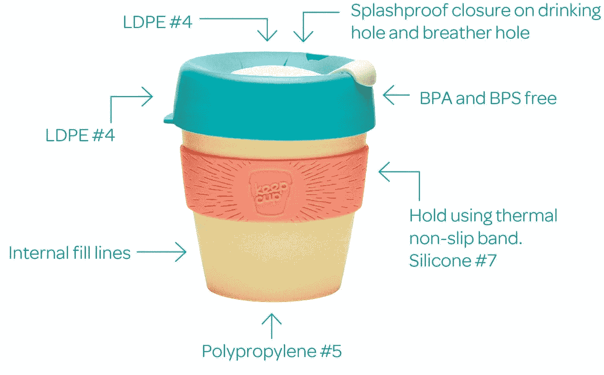

# 让我们再次让咖啡变得伟大

> 原文：<https://medium.datadriveninvestor.com/lets-make-coffee-great-again-7c92e8ab8fa2?source=collection_archive---------15----------------------->

我们喜欢咖啡，这是众所周知的事实。但是我们对外卖咖啡杯了解多少呢？让我们试一试——新西兰人每年用多少个咖啡杯？

一千万，七千万，二亿九千五百万

猜猜看。

*2.95 亿！没错。*

我们每年狂饮 2.95 亿杯外卖咖啡。大多数不能回收，因为纸杯内衬一种叫塑料的东西来防止液体溢出。因此，它们最终被填埋，污染了循环水。

这是一个可以追溯到几十年前的复杂问题，除非我们改变习惯，否则它似乎将持续到不久的将来。

*那么，我做了什么来解决这个问题呢？*

当然，有一天我醒来说——我要戒掉咖啡。好吧，那是个笑话。这不会很快发生:-)

**所以，让我分享我在过去的 8-9 个月里采用的两个简单而有效的方法，我鼓励你也尝试一下。**

**没有外卖，在咖啡厅吃**

我在这里已经住了五年了，我可以有把握地说，人们喜欢边喝咖啡边聊天。一切都发生在喝咖啡时——

让我们叙叙旧，开个短会。我请你喝咖啡。

让我们边喝咖啡边采访吧。

两周没见了，我们一起喝杯咖啡吧。

自从搬到新西兰后，我的咖啡消耗量从零降到了每天一杯。

 [## 精疲力竭耗尽了简单的答案|数据驱动的投资者

### “大多数卫生专业人员知道如何照顾病人，但不知道如何照顾自己。”医疗保健…

www.datadriveninvestor.com](https://www.datadriveninvestor.com/2019/01/15/burnout-exhausts-easy-answers/) 

所以，事情是这样的。有人邀请你去喝咖啡，你决定你想要什么，然后下订单。咖啡师问——在这里吃还是带走？现在，因为你认为你可能想带着咖啡走，或者可能无法在咖啡馆喝完，你有时会点一杯外卖。

这是一个无意识的决定，我不是说它是对的还是错的。我是说这是可以避免的。

相信我——如果你停下来想一想，你通常会点一杯普通瓷杯的咖啡。当你这样做的时候，你也会推动你的咖啡伴侣也这样做。它对我有效！

现在这样做的副作用是——你省了两个外卖杯子！此外，你已经享受了咖啡馆提供的独特而美丽的氛围，也许你还浏览了一些创意杂志，这些杂志经常藏在咖啡馆里，可能会激发一些想法。

所以，不要外卖，在咖啡馆吃。

**BYOC——带上你的杯子**

你见过这项伟大的发明吗——保温杯。

这些是由澳大利亚咖啡公司制造的可重复使用的杯子。我花了 26 美元买了一个，一直用到现在。它也已经成为会议上的一个很好的赠品，所以你可以在那里得到一个。

我发现这些杯子的一些好处是:

*   它们有不同的颜色——简单朴素的、专业的、简约的、爵士的、运动的。整个光谱。选择一个符合你性格的。
*   过去三年。
*   它们是高度可持续的。
*   它们适合用洗碗机清洗。
*   另外，带着它们到处走——你会觉得自己是革命的一部分。
*   最后但同样重要的是，如果你自带杯子，咖啡师会提供高达 50%的折扣。

去，给自己买一个！

所以，亲爱的读者们。我已经向你展示了两个简单的方法，你可以让喝咖啡再次变得很棒！

我敦促你接受这个挑战。

没有人说我们将解决世界的塑料问题，但千里之行始于足下，或者我们应该说是一个杯子:-)