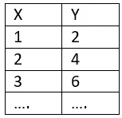
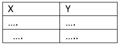
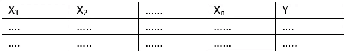
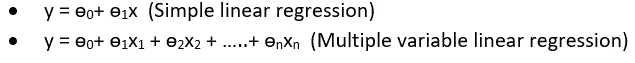
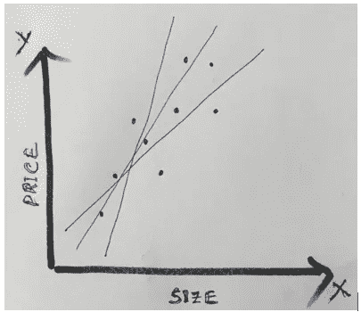
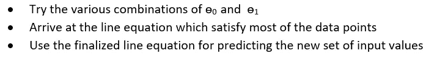
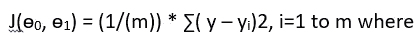
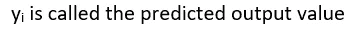

# 让我们用“简单线性回归”来预测

> 原文：<https://medium.datadriveninvestor.com/lets-predict-with-the-simple-linear-regression-1b690f64f947?source=collection_archive---------2----------------------->

***作者仅代表作者个人观点。这些绝不代表和/或反映他所关联的组织。***

**背景**

如今，我们不断看到许多围绕预测的讨论，比如根据保险索赔数量预测索赔金额，以及根据顾客光顾商店的数量预测销售额，这样的例子不胜枚举。这些预测是如何实现的，这背后的概念是什么？

当我们进一步了解细节时，从对话中可以明显看出，机器学习是预测背后的概念，它在很大程度上依赖于统计/数学建模来得出这些结论。有多种算法可以派上用场，使用可以基于手头问题的性质。线性回归就是这样一种算法，它是处理任何高级概念之前的基本概念。

线性回归并不新鲜，它是作为统计建模的一部分而存在的，但随着机器学习变得更加普遍。

这是一种简单的机制，通过这种机制，我们使用历史中的现有数据值(输入和输出),并尝试拟合一个模型方程，以便可以使用该方程来预测新输入值集的输出。

上面的例子非常直观，对于给定的值 5(输入 x)，我们可以很容易地将 y 的值估计为 10。然而，当我们考虑稍微复杂一点的问题时，情况可能就不一样了，比如在给定房子大小的情况下预测房子的价格，这需要在得出模型方程方面做更多的工作，而且不可能像 y=2x 那么简单。也许不可能得出一个在所有情况下都完美无缺的方程，我们需要收敛到一个更接近和更有意义的方程。现在的问题是，如何选择这个有多种可能性的模型方程。

**什么是线性回归？**

我们可以采用的方法是，在图表上绘制给定的 x 和 y 值，并绘制可以满足大多数值的直线，从这些选项中，我们需要选择一个最佳的并确保最大覆盖范围。这被称为最佳拟合，这样得到的方程就是模型方程。一旦获得模型方程，下一步将使用该方程预测给定 x 值的 y 值。

上面讨论的概念被称为线性回归，它有简单和多元线性回归形式的几个变体。当我们只有一个输入变量时，简单线性回归是适用的，当我们开始处理多个输入变量时，简单线性回归将扩展到多元线性回归。

简单线性回归和多元线性回归中的数据可以用以下方式表示

Simple Linear Regression

Multiple Linear Regression

每个输入参数都可以作为一个特征来调用。在简单线性回归的情况下，我们试图仅仅通过评估房子的大小来确定房子的价格。然而，在多元线性回归的情况下，房子的价格可以由大小、卧室数量、楼层数量等决定。所有这些参数(或输入变量)称为特征。

数学上，线性回归可以表示为 y = m*x + c，其中

*   x 是独立变量，
*   y 是因变量，
*   m 是斜率，和
*   c 是 y 轴截距

为了便于解释，我们可以用下面的格式写出相同的方程

**成本函数**

让我们将注意力集中在简单的线性回归上，以理解关于成本函数的细节。

如果我们看到上面的图表，有多种可能的线方程，如何选择最相关的一个是我们可以进一步讨论的问题。

我们需要做的是

对于数量很少的数据点来说，这听起来很简单，就像上图中描述的那样，但实际上，我们可能会遇到成千上万的样本数据点，可能无法如此容易地得出最佳方程。这里有**成本函数**来帮助我们确定正确的等式，以及ɵ0 和ɵ1 的正确组合，以确保精确的优化。

对于每个可能的线方程，

*   尝试预测 y 值，并取实际 y 值的差值，这给出了该特定方程的可能误差。
*   对所有可用的采样点重复相同的步骤
*   平方所有的误差，因为我们对误差的大小感兴趣，有时正面和负面可能会抵消，导致没有结论
*   通过除以样本数据点的数量获得平均值

可以比较每个可能的线方程由此得到的值，以导出最佳线方程。具有最小均方误差的一个是可以被挑选作为用于未来预测的模型的一个。

**成本函数**在数学上可以写成

*   m 是样本数据点的数量，
*   y 是实际输出值，以及

如前所述，当我们有一些合理的样本数据时，这种方法工作得很好，并且可以在一些迭代之后达到收敛(J，成本函数达到最小)。然而，当我们开始增加样本数据点的数量时，这可能会被证明是一种低效的方法，而且这可能会导致整体成本的提高。用有限的步骤达到我们的成本函数的最小值的替代方案是什么？

梯度下降算法在这里起了拯救作用，帮助我们以最少的步骤达到成本函数的最优值，因此它有助于从许多可能的机会中为给定的方程得出最佳拟合的结论。

参考我的另一篇关于[梯度下降](https://link.medium.com/otyhn3Ws8T)的文章来了解这方面的细节。

**最终评论**

当我们处理多个输入变量时，我们将分析从二维平面转移到 n 维平面，使理解和可视化变得稍微复杂一些。从计算的角度来看，矩阵运算也将用于适应并行处理，因为特征和相关数据点的数量越来越多。

总的来说，线性回归简单易懂，有助于从给定的数据集中推导出模型参数。从这里，我们可以形成方程，并对任何输入数据进行预测。该模型的准确性取决于所用数据集的数量，同样可以通过添加更多数据来临时改进，从而使预测保持在持续改进的道路上。

来自 DDI 的相关故事:

 [## 用 7 个步骤解释深度学习——数据驱动投资者

### 在深度学习的帮助下，自动驾驶汽车、Alexa、医学成像-小工具正在我们周围变得超级智能…

www.datadriveninvestor.com](https://www.datadriveninvestor.com/2019/01/23/deep-learning-explained-in-7-steps/)  [## 数据科学和软件工程哪个更有前途？-数据驱动型投资者

### 大约一个月前，当我坐在咖啡馆里为一个客户开发网站时，我发现了这个女人…

www.datadriveninvestor.com](https://www.datadriveninvestor.com/2019/01/23/which-is-more-promising-data-science-or-software-engineering/)