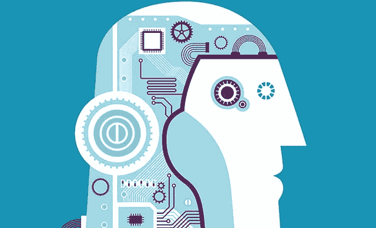
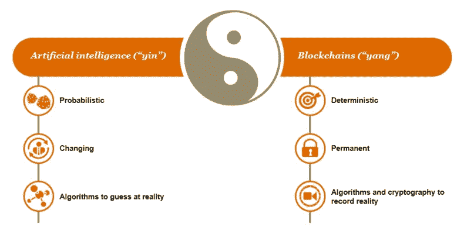

# 利用人工智能和区块链进行有影响力的大数据分析

> 原文：<https://medium.datadriveninvestor.com/leveraging-combination-of-ai-blockchain-for-impactful-big-data-analytics-dd1a1c24c07?source=collection_archive---------9----------------------->

毫无疑问，人工智能(AI)和区块链是当前“数字革命”时代指数级扩展技术的基石。人工智能和区块链与大数据分析的融合为提高运营效率和透明度打开了大门。通过有效地利用、分析和管理数据，企业可以做出明智的决策、降低成本并转变业务流程。然而，由于担心投资回报和安全性，许多公司和组织对转向这些新技术持怀疑态度。

# 使用人工智能进行处理

简单地说，人工智能是建立能够执行需要智能的任务的机器的理论和实践，通过机器学习、人工神经网络和深度学习成为可能。它能够成功地分析大量数据，得出相关的重要见解。有趣的是，随着处理的数据越来越多，人工智能和机器学习算法只会变得越来越智能。人工智能已被证明在大量活动中发挥了重要作用，例如优化能源消耗、医疗保健、金融和经济。

 [## 为什么数据将改变投资管理——数据驱动的投资者

### 有人称之为“新石油”虽然它与黑金没有什么相似之处，但它的不断商品化…

www.datadriveninvestor.com](https://www.datadriveninvestor.com/2019/01/25/why-data-will-transform-investment-management/) 

# 使用区块链保护

区块链本质上是一种新的数字信息归档系统，它将数据存储为受保护的、线性和永久的索引记录。由于数据被加密并分布在许多不同的计算机上，它使得能够创建防篡改、高度可靠的数据库，只有那些有权限的人才能读取和更新这些数据库。

# 人工智能和区块链的阴阳两极

**AI 和加密凝胶好了**

每天都会产生 2.5 万亿字节的数据，如果处理得当，可以为我们的生活带来巨大的价值和便利。然而，其中大部分是高度敏感的个人数据，公司投入大量资金来确保其安全。由于其文件系统中固有的加密技术，保存在区块链上的数据天生就是高度安全的。人工智能算法正在建立，能够处理加密状态下的数据。

**区块链可以帮助跟踪和解释人工智能做出的决定**

有时，人类很难理解人工智能做出的决定，因为在学习哪些变量对实现预期结果很重要时，会使用大量数据和复杂的算法。在区块链系统中以线性方式记录决策，简化了审核流程，并确保了安全性。

**人工智能可以比人类更有效地管理区块链**

传统上，必须向计算机提供明确的指令来执行任务，这在使用区块链时会变得极其复杂，因为它们是加密的。人工智能可以以智能的方式有效地管理任务，依靠强大的算法，这些算法随着数据量的增加而变得更加智能。

*人工智能和区块链的结合最适合协同工作，并有可能对大数据分析和管理产生巨大影响。它们在技术上是兼容和互补的，区块链在增强人工智能方面发挥着重要作用。*