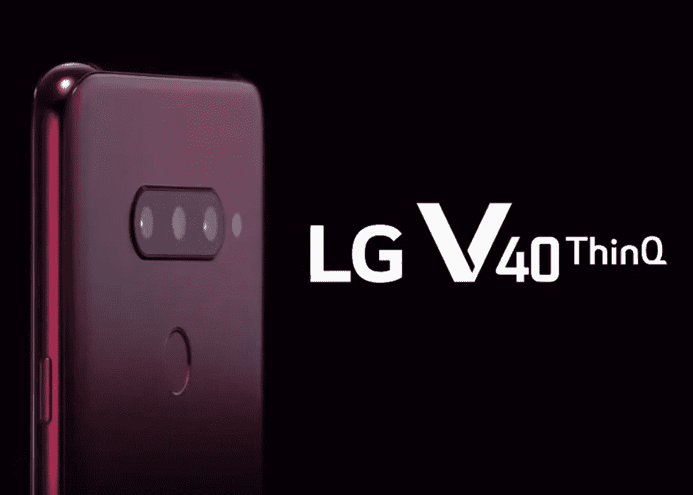
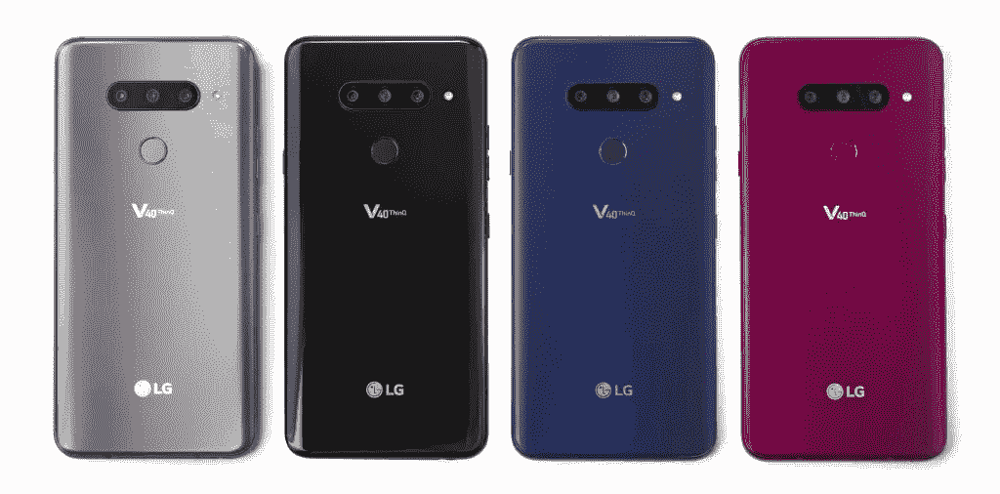
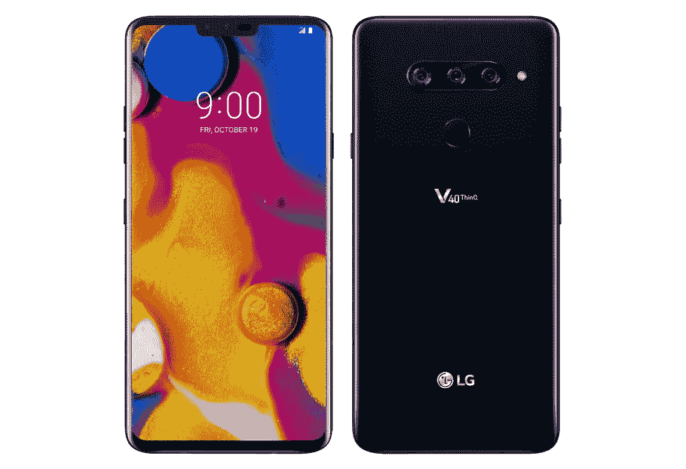
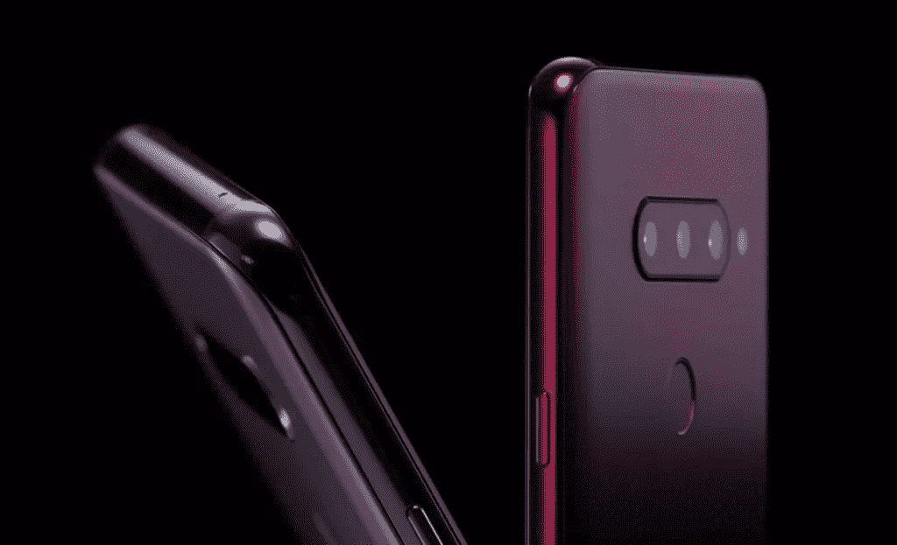
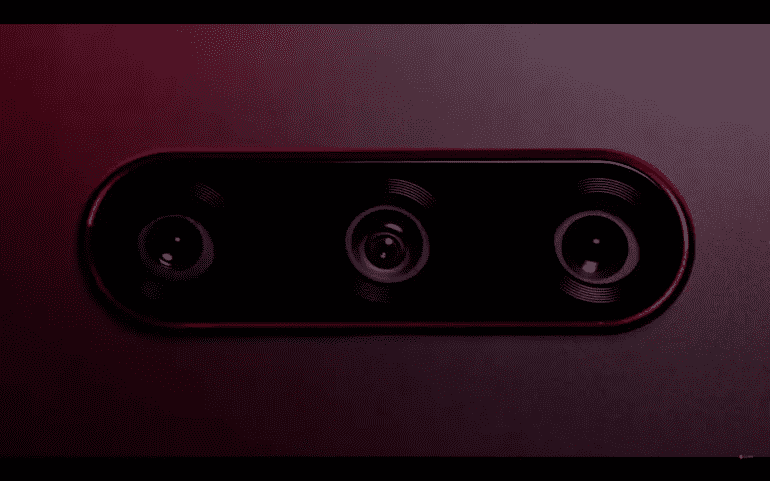
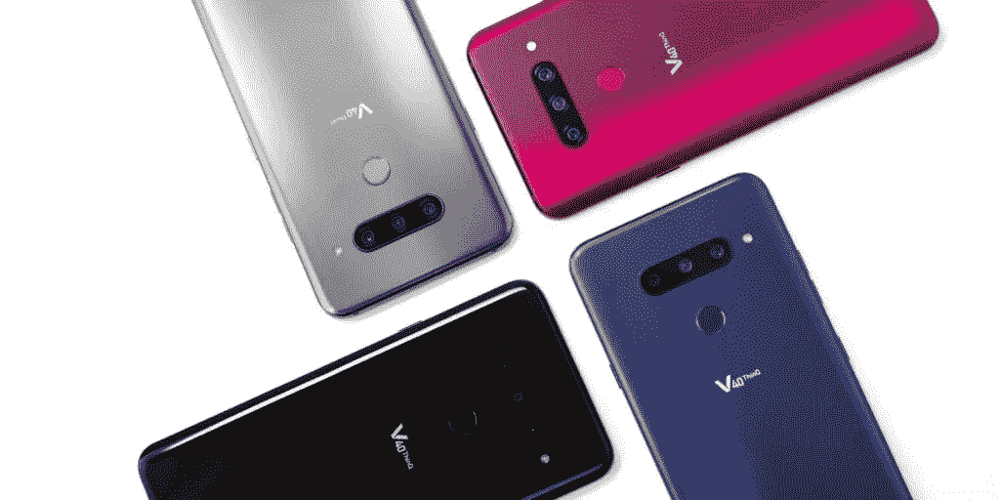

# LG V40 ThinQ:一大堆相机

> 原文：<https://medium.datadriveninvestor.com/lg-v40-thinq-a-whole-lot-of-cameras-c26589cff349?source=collection_archive---------9----------------------->

# LG V40 ThinQ 已经曝光，它有五个摄像头！

LG 新旗舰手机在改进主摄像头的同时，与其他手机有所不同；它在背面额外增加了两个，以增强摄影能力。

一部手机上有多个摄像头肯定不是什么新鲜事，背面有一个双摄像头几乎是高端旗舰机的行业标准(谷歌除外)。华为 P20 Pro 甚至通过在背面添加三个摄像头来进一步推波助澜，但 LG 有更好的主意。

LG 总共有五个摄像头，三个在后面，两个在前面。在拍照方面，它赋予了 LG V40 很多多功能性。它配备了一个标准相机，超广角相机和一个提供 2 倍变焦的长焦相机。

LG V40 的设计与早期的 LG G7 没有太大不同，它有一个由玻璃夹层包围的铝制框架。在一个充满玻璃旗舰的世界里，新设备的设计是尽可能好的；它没有华为的鲜艳颜色，但有一个缺口。

虽然我不确定我是否喜欢背面摄像头的设计；这确实让它看起来像一个奇怪的眼睛瞪得大大的角色。话虽如此，但放在新的 iPhone XS 旁边，它确实很突出。

LG V40 采用了 6.4 英寸的屏幕，由于它有凹口和一点点下巴边框，它比 Galaxy Note 9 和 iPhone XS Max 略小。屏幕是一个 OLED 面板，赋予它丰富的色彩和比 LCD 更好的观看体验。它不像三星的有机发光二极管面板那样生动或饱和，但它仍然是一个非常好的面板！

V40 的内部运行旗舰标准骁龙 845 处理器，加上 6GB 的内存和 64GB 的存储空间。它确实有一个 microSD 插槽，所以购买基本型号可能更划算。

它还具有无线充电、3.5 毫米耳机插孔和 IP68 防水/防尘等级。V40 还带有 G7 的 BoomBox 音频系统，使手机非常响亮，尤其是当它平放时。V40 的侧面还有一个专用的谷歌助手按钮，不能重新映射。

一个可能没有足够提及的功能是 LG 采用的触觉反馈系统；它几乎与苹果的 Taptic 引擎不相上下。LG 无疑是安卓行业的佼佼者，击败了索尼和三星等公司。我个人认为这是一个需要在 Androids 上更加突出的特性。

LG 在新款 V40 中增加了电池容量，为 3,300mAh 电池。这应该可以提供全天的电池寿命，并且应该比 LG G7 持续更长时间。这肯定没有 Note 9 的 4000mAh 电池大，但对普通用户来说已经足够好了。

这款新设备上的软件通常感觉比 G7 上的更优化，动画更流畅，更快。该软件不如一加的软件好，但比我们前几次迭代的噩梦要好很多。唯一的主要问题是，它与 Android Oreo 一起发货，新的 Android Pie 软件的时间表尚未确定。有时候，事情永远不会改变。

# 新相机规格

将你吸引到 LG V40 的主要原因是新的相机系统。和其他厂商不一样，绝对是重点卖点。

背面的主摄像头是一个 1200 万像素的摄像头，配有 f/1.5 镜头，配有 OS 和 78 度视野。它的分辨率比 LG G7 低，但像素高出 40%，使其具有更好的弱光能力。

第二个摄像头是一个 1600 万像素的超宽摄像头，镜头为 f/1.9，视野为 107 度。它与 LG G7 的规格相同(这不是一件坏事)。与手机上的标准相机相比，它可以让你拍摄更广泛的照片。

V40 上的第三个摄像头是新的长焦摄像头；它具有 1200 万像素的分辨率，45 度的视野和 f/2.4 镜头。与其他相机相比，这将给你 2 倍的变焦，给你很好的特写镜头！

我还没有足够的时间来全面测试新相机，但我会做一个单独的帖子，只关注它们。

虽然这只是一次亲身体验，但我已经可以说这是 LG 有史以来最好的手机。屏幕很棒，软件更好，性能比 G7 更好。如果你喜欢摄影，并且需要一台掌上电脑，这绝对适合你。