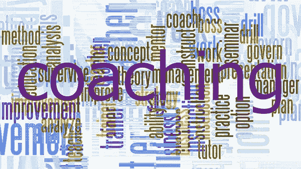

# 通过指导将智力释放到表现中！

> 原文：<https://medium.datadriveninvestor.com/liberating-intelligence-into-performance-through-coaching-40a83e095bcc?source=collection_archive---------41----------------------->

Gerard O'Donovan 经营的教练博客，我们的目标是不断为那些寻求改善生活的人带来价值。因此，我们有一个政策，出版我们重视和欣赏的客座作者的文章和材料。今天的特邀作者是 Paddy Pampallis 博士(南非)。

*我相信，如果你给人们看问题，给他们看解决方案，他们会被感动而采取行动。—比尔·盖茨*

在当今快节奏、高要求的商业世界中，组织、领导者和员工不断被要求“升级游戏”并管理更复杂和相互关联的系统，以取得成果并满足不断增长的目标。

组织是由人来管理的。像你我这样的人，被要求(也经常被告知)利用我们现有的资源和支持来增加我们的能力，有时甚至比我们开始需要的资源和支持还要少！我们被期望执行和满足目标，管理自己、他人、系统和文化。这是一个复杂的挑战。

*   你如何发挥你和你的团队的潜力，培养和释放现有的智慧到绩效中去？
*   你如何通过重要而清晰的对话来照顾自己、他人、系统和组织文化？
*   你如何让你的员工能够通过转变和改变来管理他们的角色、任务、生活和工作，同时与你公司的宗旨相联系？

你倾听、探索、参与、解放、具体化并获得行动承诺。你是教练！

“辅导是一种专业、协作和结果驱动的学习方法，旨在发展个人并提高自我意识，以便她/他可以实现特定的目标并在更有效的水平上表现。”

南非教练和导师协会

**教练简介&管理绩效**

辅导的核心是帮助个人或团队了解他们目前所处的位置，他们想要达到的目标，以及达到目标的障碍和机会。这一过程涉及自我意识、判断、成熟和意志，以促进关键的观察实践和行动，从而带来对我们的工作和生活至关重要的理想现实和结果或目标。

在过去的二十年中，辅导已经发展成为在组织环境中支持和促进个人成长的主要方式之一。有许多不同类型的辅导，针对不同的工作领域和领导、管理和绩效水平

我们区分:

1.  事务性指导(和管理):这需要做需要做的事情——只是做得更好更有效；
2.  过渡教练(和管理/领导):这使领导者能够改变他们做事的方式和他们扮演的角色，以掌握更多的复杂性，使他们更有技巧；
3.  转型辅导(和领导力):这通过提高个人的能力和对业务的思考方式来促进发展，从而在成长、自我、他人和业务的同时更具包容性和系统性。

因此，辅导可以是一种使用简单提问框架的技能，也可以是一个深刻的变革过程，解决我们在商业世界中做事的方式的结构，更重要的是，我们思考问题的方式。这反过来又形成了我们的行为习惯。无论我们从事哪一级别的辅导，我们都知道，如果我们自己生活中的“信奉和实践”的价值观是一致的，那么这些价值观会促进我们的工作。我们大多数人都喜欢思考和做事的方式:有些有用，有些没那么有用！

辅导是向人们提问，鼓励他们自己想出答案，从而获得洞察力并掌控局面。绩效管理是与需要改进的人合作设定目标，并与他们一起确定如何最好地实现这些目标。

*“管理是计划、组织、领导和控制企业资源的过程，以尽可能高效地实现目标”(Smith and de Cronje，1997)。*

正在取得成功的组织是通过从命令和控制的思维模式转向自我授权和集体责任的思维模式来实现的:这种立场表明，人们沿着一个需要方向(事务性工作)的连续体运作，以包括能够平等管理能够更加自我创作、自我管理和自我生成的人的技能。一个有效的管理者会根据情况和团队成员的需要改变他们的方法。发展型辅导将与每个员工或团队成员的具体需求和能力相结合，以实现所需的结果。

“我们相信，如果你与人们一起理解所面临的挑战，然后共同创造解决方案，他们将会采取行动，并对它提供给他们的学习拥有所有权。它让人们从依赖走向独立，并创造了变得相互依赖的途径，”Paddy Pampallis 博士说。

总结一下:教练从行动调查的立场来定位自己，这种立场能够挖掘每个学员的操作模式，以引发对高绩效的自我问责。有效的辅导将确保您有高质量的对话，在广泛的层面上创造与您的公司战略一致的责任、动机和绩效，并将其转化为您的组织目标！

**关于帕迪·潘帕里斯博士**

教练中心的首席执行官，Integral⁺非洲研究所和 TCC Ubuntu 教练基金会的创办人。该实体由它的姐妹企业教练中心(TCC)组成；领导力成熟度中心(全球)和 TCC Ubuntu 教练基金会(NPO)在工作领域产生更大影响。我们将 Integral+ Practice 这一强大而独特的应用程序用于领导力、教练以及人员和组织的成长与发展。这个精心设计的开发和集成应用程序利用了我们与当地和世界思想领袖的合作关系。

在这里阅读更多内容，不要忘记订阅我的教练博客网站以获得免费的教练报告:[https://www . coaching-blog . com/freezing-intelligence-into-performance-through-coaching/](https://www.coaching-blog.com/liberating-intelligence-into-performance-through-coaching/)

请访问我们的网站，订阅免费的教练杂志:【http://www.international-coaching-news.net/ 