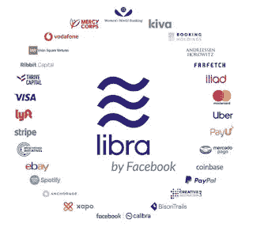
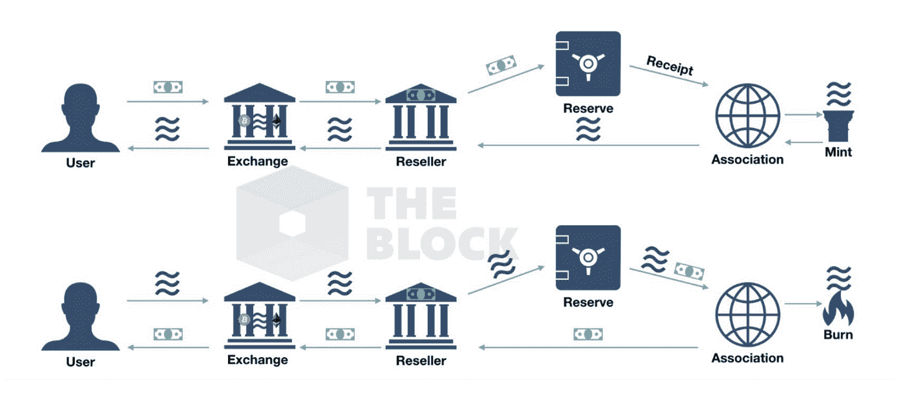

# 天秤座，作者脸书

> 原文：<https://medium.datadriveninvestor.com/libra-by-facebook-cbe9d50cc052?source=collection_archive---------8----------------------->

现在对天秤座做出裁决还为时过早，但 T2 无疑是比特币原始提案中推出加密货币的最强有力的意图。

> 但 Libra 在区块链基础设施的使用上就像比特币一样。天秤座:潜在的干涉不仅对金融系统构成威胁，也对国家主权构成威胁

比特币和其他加密货币从一开始就具有巨大的波动性，**尚未实现整合，也没有作为支付机制或价值储存手段**——如果我们将[“法定”](https://en.wikipedia.org/wiki/Fiat_money)货币兑换成比特币，其价值可能会以不可预测的方式大幅波动，缺乏我们可以理解的与市场的任何逻辑联系。比特币没有内在价值。比特币遇到了“无许可”区块链，需要完全去中心化和匿名的验证。

 [## 计划者让社交媒体保持正轨|数据驱动的投资者

### 如果想达到并保持最高效率，忙碌的人会坚持使用系统。这是 Tweepsmap 和…背后的前提

www.datadriveninvestor.com](https://www.datadriveninvestor.com/2019/03/11/schedulers-keep-social-media-on-track/) 

Libra 是一个数字货币项目，将在第三方应用程序中运行，但主要是在脸书的产品基础设施中运行(其中包括最受欢迎的 WhatsApp、Facebook Messenger 和 Instagram)，该公司目前是世界上最大的数字社交基地，每月用户超过 23 亿。**他们面临着一个独一无二的机会来传播真正的全球数字货币标准，而不仅仅是为没有银行账户或银行服务不足的人。一种管理他们的货币。**

在某种程度上，Libra 遵循了微信(腾讯)等成功的数字支付解决方案的路线，这些解决方案已有效地融入了中国人的日常生活，尽管从技术上讲，微信并不在区块链中运行。Libra 是对苹果、谷歌和亚马逊等其他西方“巨兽兄弟”在金融领域雄心的全面挑战。阅读 Libra 的网页，这种新的加密货币旨在通过其数字钱包 [Calibra](https://calibra.com/) 来*“发送、接收、花费和保管你的钱”*，该电子钱包称*“不会与脸书平台的其余部分共享任何数据。”*必须澄清这些活动的范围，**因为天秤座的支持者深入到我们所知道的银行活动的核心。** Calibra 必须遵守与身份验证、反洗钱等相关的更严格的监管控制，但它具备成为真正的数字钱包的所有要素。

天秤座将是一种稳定的货币，其价值将取决于一篮子法定储备货币中最大的货币(美元、欧元、人民币、日元……)。从根本上说，Libra 带来了一种新的用户体验，不再是法定货币，而是分散在独立的小仓库、小面额、实物或电子货币中，有几个支付来源。**由于** **脸书在用户体验和吸引眼球方面显然是大师，它的目标是与 Libra 一起创建一个生态系统，让不同的数字平台成为用户和他们的金钱的单点交互。**

尽管脸书在 Libra Association 中只有一票或 1%的投票权(两者中较大的一个)，并且 Libra validation 的承诺在 5 年后从“允许”状态变为“不允许”状态，其中一些创始人可以选择成为其区块链 Libra 交易的节点验证者，**脸书聪明地试图成为其用户和他们的钱之间的选择界面**。这就是平台的价值所在。确切地说，这是典型加密货币的另一个主要缺点:**它们缺乏与主要数字平台的重大互动。**简单来说，脸书有 700 多万广告客户和 9000 多万中小企业依靠脸书营销他们的产品，这是在脸书生态系统中扩大 Libra 使用的强大基础。

令人生疑的是，脸书方面正试图说服人们，它不会通过成立该协会来控制 Libra。该协会最终被认为是央行和金融服务用户之间的中介。在第一阶段，这个组的目标是作为节点验证者被信任。虽然从技术上来说，许可验证机制将允许比许可的交易数量多得多的同时发生的交易，并且计算成本更低，**这可能在将来取代基于模型**的效率和可信度的进行/不进行许可的决定。也就是说，白皮书指出，未来的完全去中心化似乎是 Libra 项目的基石。

Libra 协会本身有一些问题:总部设在瑞士的动机，其创始成员的盈利模式是什么，包括 Libra 储备资产(法定货币)和 Libra 之间的利差，以及 Libra 交换的法定货币的位置“将放在托管银行”。随着我们的深入调查，问题会越来越多。

令人惊讶的是，天秤座协会(Libra Association)[创始成员](https://libra.org/es-LA/association/?noredirect=es-419)的数量和质量都很强大(多达 28 个，包括万事达卡、沃达丰、优步、易贝、Spotify 等)，每个成员都通过[“投资代币”](https://www.coindesk.com/theres-a-second-token-a-breakdown-of-facebooks-blockchain-economy)承诺了至少 1000 万美元。这是一个征兆，表明会有大事发生，即使不是发起人所设想的那样。创始小组的目标是在 2020 年 Libra 正式推出时，将成员人数扩大到至少 100 人，他们将通过投资者、用户、交易所和经销商的复杂网络，协调 Libra 和法定货币之间的交易，成为真正的 Libra“布道者”。

一个新的基于开源的金融服务市场可能会出现，现有的[开放银行](https://en.wikipedia.org/wiki/Open_banking)计划将相形见绌。**银行现在有了更大的担忧，因为它们的商业模式不仅受到金融科技竞争对手的威胁。脸书的野心远远超出了大型科技平台(主要是谷歌、苹果、亚马逊)所宣称的。**

除了谁在天秤座，还有谁不在:银行和中国平台都不在。我的解读是，银行是需要击败的竞争对手，Libra 的目标是与中国数字平台竞争，后者正在引领数字货币的大规模采用，微信的日用户超过 8 亿。毫无疑问，他们计划大规模扩张到国外，成为真正的全球化企业。

这就是为什么我相信数字货币已经进入了不归路，在天秤座宣布后，变化可能会加速。

金融监管者和监督者不能再忽视加密货币和数字货币**，并将其视为学术实验或投机者或洗钱者的工具**。由于其复杂性，Libra 项目必须根据其不足之处接受挑战，或者提出替代方案。数字货币是不可避免的。脸书拥有在美国 50 个州开展货币服务业务的[牌照](https://www.facebook.com/payments_terms/licenses)，现在监管机构必须确定现有的牌照是否足以开展新的活动。就在 Libra 宣布两天后，英格兰银行宣布将允许非银行机构直接在央行账户中持有存款，承认新参与者的新角色，并结束迄今为止银行的唯一特权。尽管如此，马克·卡尼警告称**“Libra 等创新必须在推出前获得批准”**以避免重复法律真空，这种真空允许大型平台在灰色监管空间中成长。七国集团成立了一个 Libra 工作组，国际货币基金组织和国际清算银行也开始了类似的分析。

特别是，Libra 成为陷入困境的银行业的又一个头痛问题，当前的“铁路基础设施”是西方国家大多数人从事经济业务的基础，而现代金融监管又位于其上。[正如我最近写的](https://www.linkedin.com/pulse/la-disrupci%C3%B3n-en-banca-y-servicios-financieros-enrique-titos/)(西班牙语文章)，数字化对银行业务模式的影响将超过官方认可的程度。把新的颠覆性技术(在这种情况下是区块链或 [DLTs](https://en.wikipedia.org/wiki/Distributed_ledger) ) **简单地视为现有商业模式和基础设施之上的一层，从中期来看，可能会被证明是一个战略致命错误。**

在我看来，我们正在目睹一种情景的开始，这种情景可能会影响金融服务业公共行动的三项指导原则:保护金融用户、保持竞争活力以及确保金融体系保持稳定。这些原则应该适用于 Libra 或其他任何形式的数字货币。

脸书的 Libra 带来了第四个原则:它旨在促进金融包容性，扩展了肯尼亚的 M-Pesa，但显著的区别是 Libra 可以挑战弱势货币国家的国家主权。正如到目前为止所解释的，天秤座有一种难以夸大的非中介力量。

**现在是监管者的时间**。鉴于脸书的跨国性及其庞大的用户群，**上述 Libra 提案具有系统性影响。**央行数字货币(CBDC)作为一种替代货币的加速不应该令人惊讶，但我担心它们根本不具有可比性。**cbdc(最初)是法定货币之上的另一层，而 Libra 是一种全新的商业模式。**

一切都是公开的，挑战已经开始了。