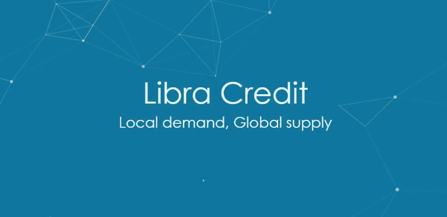
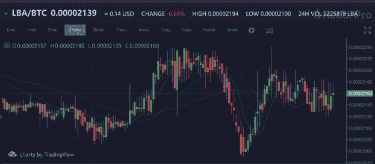

# 天秤座信用:随时随地信用。进一步的分析

> 原文：<https://medium.datadriveninvestor.com/libra-credit-credit-anytime-anywhere-a-further-analysis-459b41efa1cd?source=collection_archive---------1----------------------->

# **Libra credit——随时随地开放信贷服务** ✅

L[ibra Credit](https://www.libracredit.io/)由两位前 PayPal 高管共同创立；鲁花和丹·夏特。天秤座信贷的血统和负责创造它的人是显而易见的。Libra 信用是基于以太坊协议的；它利用自己的平台随时在世界任何地方获得信贷。天秤座信贷利用硬币对硬币或硬币对菲亚特为他们的借款人提供选择。Libra Credit 正在将一个已建立的借贷网络与一大批企业家结合起来，利用区块链作为脊柱，扰乱传统的借贷市场。

# **市场表现**📈

[*Libra Credit*](https://www.libracredit.io/)*最近完成了 LBA 代币的代币出售，轻松触及 2600 万美元的上限。也已经在各个交易所上市；实际上是在同一天在四个不同的交易所上市，展示了上市以来的良好表现。上市后，LBA 令牌经历了急剧 175%的价格增长，反映了对项目能力的乐观态度。Libra Credits 最引人注目的上市是 [*Huobi Pro*](https://www.huobi.br.com/en-us/topic/invited/?invite_code=da523.) 交易所，该交易所拥有许多领先的和即将推出的加密资产。在过去的 24 小时内，通过 Huobi pro 平台交易的 LBA 略多于 250 万，LBA 平均价值约为 0.14 美元，相当于约 35 万美元的 LBA 交易。有关如何购买 LBA 代币[*huo bi Pro*](https://www.huobi.br.com/en-us/topic/invited/?invite_code=da523.)exchange 的更多信息，您可以点击此链接注册并参加。*

**

# ***天秤座信贷的商业模式** ✏️*

*[*天秤座的信用*](https://www.libracredit.io/) 是经营企业，利润通常是企业的重中之重。如果没有任何收入，Libra Credit 就无法运行其平台。Libra Credit 拥有成熟的商业模式，确保他们的平台在每个财务周期都能创造一些收入。对于任何生意的繁荣，拥有正确的伙伴关系是非常重要的。合作伙伴通常拥有支持您业务的产品或服务。*

*[*Libra Credit 的商业模式*](https://www.libracredit.io/) 包括一系列综合战略，以最大限度地提高近期成功目标的能力。其中包括:*

*➡️ ***广泛的伙伴关系网络。这加强了天秤座在分散借贷领域的地位。天秤座将希望与加密市场和金融市场建立伙伴关系，因为他们同时处理加密和菲亚特。这些伙伴关系形成了分散贷款的解决方案。Libra Credit 热衷于参与加密交易所，它已经在 Huobi pro 和其他交易所上市了令牌。银行等有执照的金融机构也必须在其优先伙伴名单上，如果没有这些金融机构的支持，业务可能会极其困难。贷款包括信任陌生人，相信他们会履行债务并在约定的时间内偿还；然而，在人类身上，一切皆有可能。与身份验证数据提供商合作可以帮助 Libra Credit 防止其平台上的任何形式的欺诈。它还可能支持监管机构可能设定的 KYC 和反洗钱条款。****

*➡️ ***基于人工智能的双重信用风险评估。*** 作为企业，避免坏账也是优先考虑的事情。传统贷款平台的问题在于，它们用来评估申请人的信用评分方法很简单，没有考虑技术进步和加密货币等资产。Libra Credit 使用基于人工智能的双重信用风险评估，该评估考虑了申请人提交的抵押品的可行性和借款人的信用评分。*

*➡️ ***多种资金来源和用途。*** Libra Credit 还采用多种资金来源和不同资金用途的策略来满足分散式借贷平台的需求。每个借款人通常都有自己独特的需求，天秤座必须满足这些需求。它们的范围从流动性需求到对冲需求。拥有多种资金来源可在 Libra 平台内创建不同形式的资金，因此 Libra Credit 更容易满足这些不同的需求。*

# ***利益相关者的主要利益使 Libra Credit 成为一个简单的选择** ➕*

*➡️ ***借款人。*** 如今，银行和其他传统贷款机构更难借到钱，因为它们的利息很高，有时还有隐性收费，这使得借款人成为贷款人的奴隶。天秤座信贷提供更好的借款服务，旨在改善借款人的地位容易获得。此外，借款人可以 24 小时访问借款平台，该平台利用顶级技术公平地确定借款人的信用评分和贷款可行性。*

*➡️ ***交换伙伴*** 。选择与 Libra Credit 合作的交易所将从 Libra Credit 的平台中获益。首先，由于 Libra 接触到各种资金来源，流动性可能不再是这些交易所的问题；天秤座信用可以很快为他们解决这个问题。LBA 代币交易也将增加这些交易所的交易量和交易费收入。天秤座几乎所有接触到的东西都会变成某种形式的黄金。*

***➡️*贷方。*** 天秤信用缓解了集中式借贷平台的一些烦恼。贷方不得不花费大量资金来监控他们已经发放的贷款。还涉及到大量的文书工作。Libra Credit 通过使用区块链技术作为单一的真实来源，降低了监控贷款的成本，同时减少了报告工作。贷方也可以参与加密货币和加密资产领域，风险很小。*

# *天秤座❓的未来会怎样*

*最近， [*Libra Credit*](https://www.libracredit.io/) 从机构投资者处获得超过 1600 万美元，用于分散放贷。投资者看到了 Libra 信贷平台的经济潜力，并非常希望让它发挥作用，因此他们对 Libra 信贷项目充满了绝对的信心。*

*Libra 计划很快发布一个桌面版的分散式借贷平台。Libra 的路线图显示今年将会有一个 Q$4 的手机应用发布。Libra 计划到 2020 年成为一支不可忽视的全球贷款力量。在 2020 年全球贷款空间接管之前，合作伙伴关系的增长计划一直持续到 2019 年。*

# ***火币谈和天秤座信用奖池**🍬*

**

*✅The 最新一集的火币谈话节目，由鲁花主演，将于 2018 年 6 月 21 日下午 12 点-1 点 30 分(GMT +8)通过火币的 YouTube 频道播出。要观看视频并参与奖池，观众只需执行以下步骤:*

*➤Sign 高达 [*霍比亲*](https://www.huobi.br.com/en-us/topic/invited/?invite_code=da523) *。**

*➤Make 一定要订阅 [*火币访谈*](https://www.youtube.com/channel/UCABkgL5rRAk61E2Qtjtqcxw) 和路路看节目。*

*➤Answer 第 5 题正确期间 [*霍比说话*](https://www.youtube.com/channel/UCABkgL5rRAk61E2Qtjtqcxw) *。**

**

*关于 Libra Credit 的更多信息，以及他们扰乱借贷市场的计划和未来的扩张计划，请点击此链接收听 Huobi 每周直播。别忘了你可以在 [Huobi Pro 交易所参与 LBA 的交易。](https://www.huobi.br.com/en-us/topic/invited/?invite_code=da523.)*

**如果你觉得这篇文章很有用，并且想看我的其他作品，请一定鼓掌并关注我的* [*媒体*！](https://medium.com/@salmanmiah) *😎**

**