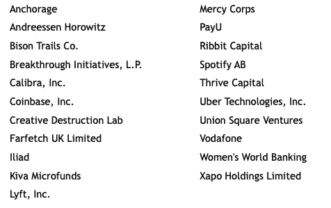
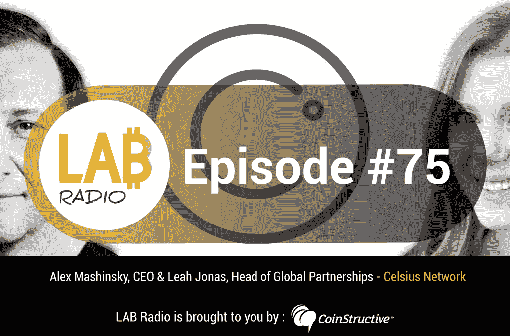
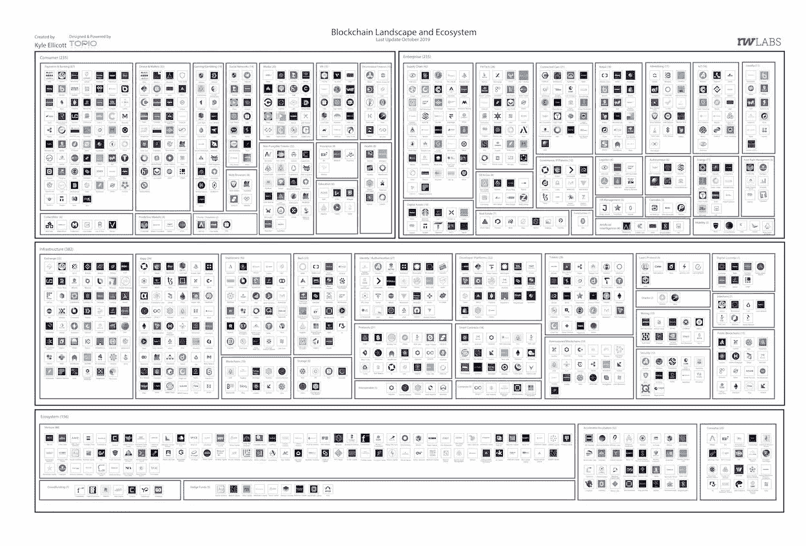

# Libra 成立了 21 人的 Libra 协会/内部安永的夜幕降临/汽车中的区块链支付测试

> 原文：<https://medium.datadriveninvestor.com/libra-forms-21-member-libra-association-inside-ernst-youngs-nightfall-blockchain-payment-f2cb8cf6c316?source=collection_archive---------9----------------------->

Photo by [Frame Harirak](https://unsplash.com/@framemily?utm_source=unsplash&utm_medium=referral&utm_content=creditCopyText) on [Unsplash](https://unsplash.com/s/photos/burst?utm_source=unsplash&utm_medium=referral&utm_content=creditCopyText)

2019 年 10 月 16 日

***什么一周。*** *就从那里开始吧。* ***【天秤】*** *给了区块链社区很多痛苦的关注，因为最近继续有值得注意的退出，一个 21 人协会的形成，以及几个提供他们的想法和/或支持(* ***富士康*** *等)。)为尚未启动的项目。不甘示弱的****Ernst&Young(EY)****透露了他们对区块链(目前为以太网)的更大计划，谈到夜幕降临，并推出新的支持区块链的工具。汽车制造商* ***宝马*******通用汽车*******福特*******雷诺*** *，以及* ***本田*** *，现在都在车辆上测试支持区块链的解决方案。如果这还不够的话，我们继续往下看，****IRS****发布了 5 年来的第一份加密货币税收指导，DApp 交易量上个季度下降，区块链治理提案，零知识证明，可收集的猫，可扩展 dapp 的方法，我们甚至找到了空间来填充大量的研究以及对基础设施、dapp、比特币、经济学和稳定货币的见解。为了了解更多信息，让你跟上时代的步伐，这里有一张本周业内热门新闻的快照。****

## **📖在大牌人物离开后，脸书领导的天秤座组成管理委员会**

****

**Source: [Libra Association Members](https://libra.org/wp-content/uploads/2019/10/Libra-Association-Charter-Press-Release-.pdf) — October 2019**

**在一系列高调退出脸书发起的加密货币项目后，21 个组织签署了 Libra 协会章程。Libra 协会还任命了其董事会，并正式成立了该财团的执行团队……[阅读更多](https://www.coindesk.com/facebook-led-libra-forms-governing-council-after-big-name-departures) —更多关于发布 [100 名成员的信息](https://www.coindesk.com/libra-plays-down-troubles-anticipates-100-members-by-launch) & [富士康创始人欢迎 Libra](https://www.coindesk.com/foxconn-founder-libra-can-converge-with-chinas-digital-currency-in-taiwan)**

** [## 5 行业转型区块链应用|数据驱动投资者

### 除非你一直生活在岩石下，否则我相信你现在已经听说过区块链了。而区块链…

www.datadriveninvestor.com](https://www.datadriveninvestor.com/2019/02/13/5-real-world-blockchain-applications/) 

## 📖随着 Visa、Mastercard、Stripe 和其他信用卡的退出，脸书的 Libra 协会分崩离析

在 PayPal 宣布退出脸书 libra 加密货币项目一周后，万事达、Visa、易贝、支付系统提供商 Stripe 以及南美合作伙伴 Mercado Pago 也退出了 [Libra 协会](https://libra.org)。脸书首席执行官马克·扎克伯格将于 10 月 23 日在众议院金融服务委员会听证会上就货币问题作证……[阅读更多](https://www.theverge.com/2019/10/11/20910330/mastercard-stripe-ebay-facebook-libra-association-withdrawal-cryptocurrency)

## 📖[EY 利用以太坊获得主要业务的激进计划](https://decrypt.co/10241/inside-eys-radical-plan-to-get-major-businesses-using-ethereum)

安永会计师事务所(Ernst & Young)发布了以太坊技术的一项小进展，名为 Nightfall，旨在进行私人以太坊交易。在敌无双 5 上接受 Decrypt 采访时，EY 的全球区块链领导人 Paul Brody 表示，夜幕降临是让企业使用区块链公共以太坊创建协议、结算发票和相互支付的更大过程的第一步，如果它能够创造出它需要的技术，它可能会推动许多公司开始使用区块链公共以太坊，以节省时间和金钱……[阅读更多](https://decrypt.co/10241/inside-eys-radical-plan-to-get-major-businesses-using-ethereum)

## 📖[宝马、通用、福特开始在汽车上测试区块链支付](https://cointelegraph.com/news/bmw-general-motors-ford-to-start-testing-blockchain-payments-in-cars)

汽车制造商宝马、通用、福特、雷诺和本田已经合作在美国测试区块链汽车识别和支付系统。该合作伙伴计划测试在[移动开放区块链倡议](https://dlt.mobi/)下开发的车辆 ID 系统。作为该项目的一部分，汽车被赋予与所有权、服务历史和钱包相关联的数字身份证，允许车辆在没有专门硬件的情况下自动支付费用……[阅读更多](https://cointelegraph.com/news/bmw-general-motors-ford-to-start-testing-blockchain-payments-in-cars)

## 📖 [EY 推出区块链工具，帮助公共财政问责](https://www.coindesk.com/ey-launches-blockchain-tool-to-help-bring-accountability-to-public-finances)

专业服务巨头 EY(安永)正在利用区块链理工学院帮助政府提高公共资金管理的透明度和问责制。该公司是四大会计师事务所之一，[周三宣布了这一消息，称其新的“区块链授权”EY OpsChain 公共财政经理将比较政府支出项目与支出结果，即使这笔钱已经通过了政府和公共服务机构的不同层级……](https://www.ey.com/en_gl/news/2019/10/ey-launches-public-finance-management-blockchain-solution-to-improve-efficiency-and-transparency-in-governments)[阅读更多信息](https://www.coindesk.com/ey-launches-blockchain-tool-to-help-bring-accountability-to-public-finances)

> *👉立即注册领取 2019 年第三季度* [*区块链基础设施景观*](https://www.topionetworks.com/events/5d79268b78e00230faba6f77) *版*

## 📖[联合国儿童基金会启动加密货币基金支持开源技术](https://www.coindesk.com/unicef-launches-cryptocurrency-fund-to-back-open-source-technology)

联合国儿童基金会(UNICEF)推出了一个加密基金，以接收、持有和分发比特币和以太的捐赠，旨在支持全球儿童的开源技术。联合国儿童基金会加密货币基金的第一笔捐款将来自以太坊基金会，并将惠及联合国儿童基金会创新基金的三个受赠方，以及由 GIGA 计划协调的一个项目，该项目旨在将世界各地的学校连接到互联网……[阅读更多信息](https://www.coindesk.com/unicef-launches-cryptocurrency-fund-to-back-open-source-technology)

## 📖[美国国税局刚刚发布了五年来首个加密货币税收指导](https://www.coindesk.com/the-irs-just-issued-its-first-cryptocurrency-tax-guidance-in-5-years)

美国国税局(IRS)周三发布了第一份计算加密货币公司欠税的指导意见。根据该指南，当新的加密货币被记录在区块链上时，如果纳税人控制硬币并可以使用它们，将适用纳税义务……[阅读更多](https://www.coindesk.com/the-irs-just-issued-its-first-cryptocurrency-tax-guidance-in-5-years)

## 📖 [SEC 叫停 17 亿美元未注册数字代币发行](https://www.sec.gov/news/press-release/2019-212)

美国证券交易委员会(SEC)宣布，它已提起紧急诉讼，并获得了针对美国和海外正在进行的数字代币发行的临时限制令，该发行已筹集了超过 17 亿美元的投资者资金……[阅读更多信息](https://www.sec.gov/news/press-release/2019-212)

## 📖[假人是你从未听说过的最具颠覆性的区块链吗？—市场疯人院](https://medium.com/swlh/is-golem-the-most-disruptive-blockchain-youve-never-heard-of-market-mad-house-765c37c42386)

[Daniel G. Jennings](https://medium.com/u/e612ac434910?source=post_page-----f2cb8cf6c316--------------------------------) 带我们参观**假人(GNT)****分布式超级计算机，这可能是你从未听说过的最具颠覆性的区块链项目。解释一下[假人的生态系统](https://golem.network/)是一个区块链市场，旨在让用户出租任意数量的计算能力。理论上，假人可以支持从你的台式机到大型数据中心的任何计算机。假人的潜在用途包括计算机生成图像(CGI)、科学计算、贸易和电子商务……[阅读更多](https://medium.com/swlh/is-golem-the-most-disruptive-blockchain-youve-never-heard-of-market-mad-house-765c37c42386)**

# **本周的更多内容:**

**📖[区块链治理提案](https://medium.com/@bytemaster/blockchain-governance-proposal-470478e42686)作者[丹尼尔·拉里默](https://medium.com/u/1d906c7421de?source=post_page-----f2cb8cf6c316--------------------------------)**

**📖[Hadas zeil Berger](https://medium.com/web3studio/a-simple-explanation-of-zero-knowledge-proofs-ca574092e73b)[对零知识证明](https://medium.com/u/76956d3342ae?source=post_page-----f2cb8cf6c316--------------------------------)的简单解释**

**📖以太坊不再是 Stablecoins 的垄断平台**

**📖[报告:区块链的法律和监管框架以及智能合同](https://media.consensys.net/report-the-legal-and-regulatory-framework-of-blockchains-and-smart-contracts-8f397eaf0b1f)，由 [ConsenSys](https://medium.com/u/6c7078bf7b01?source=post_page-----f2cb8cf6c316--------------------------------) 提交**

**📖[区块链和 DLT 教育:如何用 10 个工作日的工作量获得必要的知识](https://medium.com/@philippsandner/education-in-blockchain-how-to-acquire-the-necessary-knowledge-with-a-workload-of-10-working-days-9091dc8a3c53)作者[菲利普·桑德纳](https://medium.com/u/fb810e5f73b7?source=post_page-----f2cb8cf6c316--------------------------------)**** 

# ****分散式应用程序手表****

## ****📖[尽管 DeFi 大幅增长，Dapp 市场仍出现收缩](https://decrypt.co/10075/dapp-market-contracts-despite-huge-defi-growth)****

****去中心化应用平台 d app.com 报告称，与上一季度相比，区块链主要生态系统的 dapp 交易量下降了近 40%。它分析了六个主要的区块链——以太坊、EOS、TRON、Steem、TomoChain 和 IOST。根据报告，它从 32.8 亿美元下降到 20.3 亿美元……[阅读更多](https://decrypt.co/10075/dapp-market-contracts-despite-huge-defi-growth)****

## ****📖B [专家称，lockchain 可以推动大数据货币化](https://advancedmanufacturing.org/blockchain-can-power-move-to-monetize-big-data-experts-say/)****

****区块链可以为制造商为他们的数据付费打开大门，[SIMBA Chain](http://simbachain.com)CEO[Joel nei dig](https://www.linkedin.com/in/joel-neidig-62971429/)说。他说，该公司的同名产品是一个基于云的智能合同即服务平台。“制造商产生了大量的数据，”他说。“有很多大数据和人工智能，人们希望消费这些数据。区块链是一种能够分享数据的方式，然后从数据中获得回报，基本上是为了鼓励分享数据。”… [阅读更多信息](https://advancedmanufacturing.org/blockchain-can-power-move-to-monetize-big-data-experts-say/)****

## ****📖[可收藏的猫:艾伦·凯尔如何将符号化带给大众](https://decrypt.co/10130/collectible-cats-how-alan-carr-helped-bring-tokenization-to-the-masses)****

****根据 [CryptoKitties](https://medium.com/u/c8b1419b5d28?source=post_page-----f2cb8cf6c316--------------------------------) 公司的高级产品设计师艾伦·凯尔的说法，令牌化只是一种量化或封装通常可能是抽象概念的方式，如“所有权”或“我的巫师的力量……[阅读更多信息](https://decrypt.co/10130/collectible-cats-how-alan-carr-helped-bring-tokenization-to-the-masses)****

## ****📖[利用 vCPU 横向扩展区块链应用](https://medium.com/the-liquidapps-blog/horizontally-scaling-blockchain-apps-with-vcpu-94baf4267aaf)****

****区块链开发公司[liquid PPS](https://medium.com/u/111b26bf40a9?source=post_page-----f2cb8cf6c316--------------------------------)正在为分散的应用程序开发人员推出一种新的区块链可扩展性解决方案，称为 vCPU:一种水平扩展区块链处理能力的方法，同时提供比本地区块链所能提供的更多的计算能力……[阅读更多信息](https://medium.com/the-liquidapps-blog/horizontally-scaling-blockchain-apps-with-vcpu-94baf4267aaf)****

# ****🎧我在摇什么:****

********

****Source: [CoinStructive](https://coinstructive.com/ep75-celsius-network/)****

****这个星期我在听实验室电台的最新一集[，由](https://coinstructive.com/ep75-celsius-network/)[共同构建](https://medium.com/u/d51f2b6cdfd?source=post_page-----f2cb8cf6c316--------------------------------)的嘉宾[亚历克斯·马辛斯基](https://medium.com/u/5d291010601c?source=post_page-----f2cb8cf6c316--------------------------------)和 [Leah Jonas](https://www.linkedin.com/in/leah-jonas-82547580/) 组成[摄氏度网络](https://medium.com/u/c09fb7bc863a?source=post_page-----f2cb8cf6c316--------------------------------)。这一集很好地解释了 Celsius 及其最广为人知的功能，即让个人能够从他们存入的密码中获得利息。20 年前，普通人期望从银行存款中获得利息是很平常的事。摄氏网络正在给大众带来一种让你的钱赚钱的新方式。您将听到 Leah 和 Alex 的故事，这些故事增强了他们对区块链技术如何应用于世界的信念。****

> ****👉立即注册接收最新的[基础设施领域区块链](https://www.topionetworks.com/events/5d79268b78e00230faba6f77)2019 年第三季度版****

********

****Q3 2019 Edition of the Blockchain for Infrastructure & Ecosystem Landscape****

****不想等到下周，[现在就订阅](http://click1.m.readwritelabs.com/xsdqkbbrgsdtqkmntpjlstcnkytvpvphsnhsqlvbrhhd_yfqbfcmslnskglmckvqv.html?source=post_page---------------------------)📥有关区块链、DApps 等的实时行业见解！****