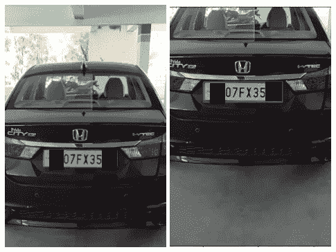
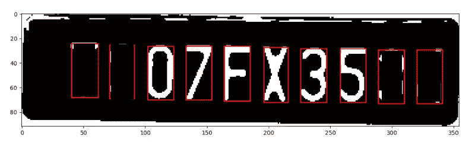

# 车牌检测器—编码、构建和部署

> 原文：<https://medium.datadriveninvestor.com/license-plate-detector-code-build-and-deploy-790579a18402?source=collection_archive---------0----------------------->

本文讨论使用机器学习和 python 对图像和视频中的车牌进行检测。此外，它还讨论了如何使用 Flask 作为 API 来部署我们的机器学习模型。项目范围限于以下要点:

1.  它从一辆汽车的图像和视频中检测出车牌。同一张图片中汽车的多张图片不处理。
2.  为了简单起见，假设在输入图像/视频中存在较少的干扰。
3.  同一个 DetectPlate.py 文件用于检测视频和图像中的车牌。因此，代码必须被注释和使用。

**接近**

我遵循的方法是:

1.  利用 CCA(连通分量分析)检测车牌
2.  执行字符分割(在板上应用 CCA)
3.  使用字符(数字和字母)的图像训练 ML 模型
4.  车牌字符的预测
5.  使用 Flask 作为 API 部署该模型。

**检测车牌**

用于分割图像的方法是连通分量分析。连通区域意味着所有连通的像素属于同一个对象。如果一个像素和另一个像素具有相同的值并且彼此相邻，则称这两个像素相连。

下面是我在 detectplate.py 文件中所做工作的简要描述:

*汽车图像- >灰度图像- >二值图像- >应用 CCA 得到连通区域- >从所有连通区域中检测出车牌*

输入的汽车图像被转换成灰度，然后转换成二值图像。使用 python 的 measure 和 regionprops 模块对汽车的二值图像应用 CCA。measure.label 方法标记二值汽车图像的所有连通区域，并返回一个标记图像。*假设车牌区域相对于完整图像的宽度在 15%和 40%之间，车牌区域相对于完整图像的高度在 8%和 20%之间。* Regionprops 方法应用于带标签的图像，返回区域列表及其属性，如面积、边界框等。获得边界框坐标，然后与板的最大和最小尺寸进行比较(根据假设)。一旦被标记的区域满足尺寸约束，它就被推入名为 plate_like_objects 的列表中。*该列表将包含被我们的代码分类为类似于牌照的对象。*(我观察了一些图像，返回了不止一个看起来像车牌的对象。这需要在进行下一步之前进行过滤)。

Input Image (Left) — License Plate Detected (Right) (The first and last 2 characters have been blacked for the purpose of privacy :p )

**字符分割**

上述步骤的输出是一个汽车图像，牌照周围有一个红色的边框。在牌照上再次应用 CCA 来分割字符。这里对字符的大小做了类似的假设。一旦字符被分段，它们被调整到 20px X 20px 的大小，并被推入一个列表。

Segmented characters of License Plate

**模型训练**

使用 SVC (4 交叉折叠验证)在大小为 20px X 20px 的字符图像数据集上训练模型。

一旦获得了板的特征并训练了模型，就加载模型以预测每个特征。

为了处理视频输入，我在视频中捕捉汽车的不同图像，除非用户按下一个键退出。最后一个视频帧用于检测。假设视频文件只包含一辆汽车。

完整的代码以及注释和描述可以在我的 GitHub 存储库中找到:

 [## apoorva-Dave/license plate detector

### 检测汽车牌照并识别其字符

github.com](https://github.com/apoorva-dave/LicensePlateDetector) 

**模型部署**

我一直想知道如何有效地将我们的模型部署到生产中。 *Flask* 是一个高效的 web 应用框架，它使我们能够将我们的模型作为 API 进行部署。您可以使用 Flask 以不同的方式设置您的项目。我创建了一个单独的 API 用于演示。它可以以更模块化和结构化的方式编写得更好:)回购中给出了这方面的详细信息:

 [## apoorva-Dave/license plate detector-展开-烧瓶

### 使用 flask 部署 ML 模型。通过以下方式为 apoorva-Dave/license plate detector-deployment-flask 开发做出贡献…

github.com](https://github.com/apoorva-dave/LicensePlateDetector-deployment-flask) 

这是我第一次尝试分享我在图像处理领域的工作，也是我谈论分类和回归的系列文章的延伸。如果你们喜欢，请展示一些❤

随着我阅读和探索的深入，我将继续写下并分享我所学到的:)

敬请关注更多文章！在此之前，祝你学习愉快:)

参考资料:

 [## 用 Python 开发机器学习的车牌识别系统

### 我将带你通过使用机器学习的概念开发一个汽车牌照识别系统…

blog.devcenter.co](https://blog.devcenter.co/developing-a-license-plate-recognition-system-with-machine-learning-in-python-787833569ccd)  [## 车牌识别-教程

### 车牌识别(LPR)系统:教程提供了技术和使用的概述

www.licenseplaterecognition.com](http://www.licenseplaterecognition.com/)  [## 连通分量标记:连通分量标记- AI Shack

### 该算法由两个步骤组成。在第一遍中，算法遍历每个像素。它检查像素…

艾萨克.因](http://aishack.in/tutorials/connected-component-labelling/)