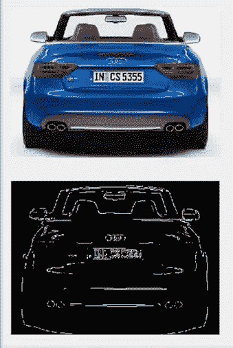
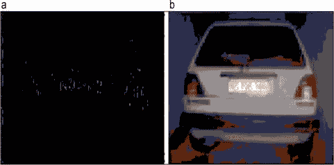
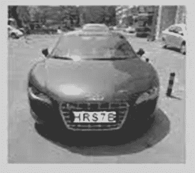
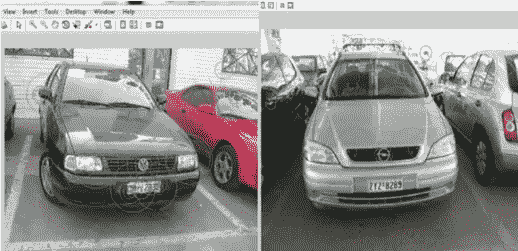

# 自动车牌识别系统中的车牌区域检测

> 原文：<https://medium.datadriveninvestor.com/license-plate-region-detection-3c97fbb3a29?source=collection_archive---------5----------------------->

这是在任何牌照检测系统中发生的主要步骤。在这一步中，我们分析图像以识别我们的车牌所在的区域。

有许多方法用于车牌区域检测，但 4 种最基本的方法是:

1.基于垂直或水平边缘的检测

2.基于车牌亮度模式的区域检测

3.颜色信息

4.径向基函数

我们现在将详细讨论其中的每一个。

**1。** **边缘检测:**

边缘检测包括各种数学方法，旨在识别数字图像中图像亮度急剧变化或者更正式地说具有不连续性的点。图像亮度急剧变化的点通常被组织成一组称为*边缘的曲线段。*

边缘检测是图像处理、机器视觉和计算机视觉中的基本工具，特别是在特征检测和特征提取领域。

 [## 人工智能预测能力的神话——数据驱动的投资者

### AI(人工智能)最有前途的优势之一似乎是它预测未来的能力…

www.datadriveninvestor.com](https://www.datadriveninvestor.com/2019/03/01/the-myth-of-ais-predictive-power/) 

**2。** **使用亮度模式的区域检测:**

在这种方法中，系统首先在所提供的具有特定亮度模式的输入上进行训练，该亮度模式是车牌在那些图片中所具有的，并且使用该所提供的输入数据来开发模型。

现在，当提供给它一些未知的图像时，它使用它的模型来检测车牌的位置，该模型使用它在分析图像后得到的亮度模式，如图所示。

**3。** **使用颜色信息的检测:**

在这种方法中，我们教导系统检测具有特定颜色的区域，这是我们希望检测的车牌的颜色。这种方法是基于这样一个事实，即每个国家使用不同颜色的安巴板。

这通常与边缘检测一起使用，以获得非常精确的结果。

**4。** **径向基函数(RBF):**

这种方法被那些语言中有很多曲线的国家所采用，例如阿拉伯语。

径向基函数是一个实值函数，它的值只取决于离原点的距离，所以；或者取决于距称为中心的某个其他点的距离。此功能的数据(结果)用于牌照检测。

以上就是图像中车牌区域检测的全部内容。