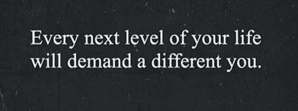

# 企业家的人生篇章。

> 原文：<https://medium.datadriveninvestor.com/life-chapters-of-an-entrepreneur-382ab62402e?source=collection_archive---------19----------------------->

# 第一章“你为什么需要上大学？”

生活就像一本由许多章节组成的书，进化就像剥掉成千上万张皮，通过一条杂乱的意大利面条般的路线，而不是每个人都梦想的直线，到达你真正想去的地方。

我一直认为生活就是一场斗争。如果事情太简单，我会挑战自己，让它变得更难。这听起来很荒谬，可能是经典 A-Levels 课程中过于禁欲主义的结果。我的古典文学老师告诉我的整个班级，他不能确定我是一个完全的天才还是一个绝对的白痴，这一直困扰着我。二十年过去了，我还在寻找答案，感觉自己每天都在这两者之间剧烈摇摆。

我无法给出典型的创业故事，比如 16 岁辍学或被扫地出门。我在高级考试中得了 3 个体面的 B(在你需要 5 个 B 才能去任何地方之前)。社会让我上大学，在科技大爆炸之前的 1995 年有什么选择，没有社交媒体？不情愿地，我选择了最近的可信的大学回家参加家庭周日烧烤。事后看来，这是我选择大学的主要目的，我并没有把它看得很重。剑桥在地理上更近，但我一直不够聪明。伦敦在召唤。

12 个月后，我从国王学院退学，攻读古典文学、拉丁语和考古学——不要问我当初为什么会在那里。为了让我留下来，我的古典学教授做了最后的努力，让我陪他去埃及考古挖掘。很诱人，但是不行，因为要毕业，你必须通过拉丁语，如果你不及格，你就选希腊语，如果你不及格，你猜对了，又是拉丁语。我对古代或现代语言一窍不通。现在知道了这一点，我不得不学习一门废弃的语言，这让自己注定失败。即使按照我“让生活充满挑战”的标准，果汁也不值得压榨。更糟糕的是，我辜负了我的父母。幸运之家的人都不高兴，甚至我们的黑人实验室也不高兴。完全是浪费时间！

间隔年“思考”一个人想要从生活中得到什么，对于一个渴望成功的 A 型人格来说似乎是浪费时间(我不知道我也是一个 A 型人格，也不知道为什么我对生活如此匆忙，直到我快 30 岁的时候，我发现了迈尔斯·布里格斯，我对自己的性格有了顿悟)。19 岁的时候，我不知道自己想做什么，但 T2 必须在伦敦挣很多钱。我经历过身无分文地呆在伦敦，这很令人沮丧。所有的路都通向大学，大学是研究一切事物的地方，当然，除了如何创造财富。

大学的创业课程在 95 年还没有，我就是这样被经典卡住的。如果有的话，我会把门踢开，或者我会吗？我一直认为做和失败比学习要快得多。我不知道你能否教授企业家精神，或者你的 DNA 是否以另一种方式连接。

生活总是以一种奇怪的方式运转，最近，国王学院企业家协会的一名学生找到我，请我在他们的活动上就如何创业发表演讲。讽刺的是我没有错过。在所有的大学中，他们有最好的创业课程之一(奇怪的是，还有航空科学，在后面的故事中会提到这个事实)。所有的路似乎都通向国王，就像宇宙告诉我，我需要结束。

那是 1996 年，没有生活经验和大量的古典文明知识，下一步是在金融城的期货和期权市场的交易大厅工作。回想起来，这似乎是合乎逻辑的，因为这比在大学里更接近学习**如何**赚钱。但 90 年代后期是一片模糊。这座城市的繁荣来自于午餐的狂欢，这些狂欢变成了下午的醉酒和傍晚的饮酒，一直持续到早餐。现在很难相信，但是下午 3 点的钟声表明每个人都可以吸烟。

三年来，在金融城的工作越来越少，再加上痛苦的裁员，这种光芒已经褪去，我感到不安和厌倦。有趣的事情只持续了这么久，但是你猜对了，大学又开始了。这一次，为了每个人的利益，我必须做得恰当，阅读一个远比背诵西塞罗和在大英博物馆鉴别破罐子破摔更相关的主题。这是一个简单的选择，经济和政治。

这一次，为了让它更有挑战性，我有了一个新计划。

保留我在金丝雀码头投资银行的全职合规分析师职位(记得需要现金)，并说服他们赞助我，结果是没有学生债务。我会在 4 年内每周学习 4 个晚上，以 2:1 的成绩毕业，赶上我哥哥。显然压力还不够大，我在富勒姆买了一套公寓，还买了一辆新跑车，以确保我在经济上完全投入，不会辞职。压力太大了。完美，正是我喜欢的。

周一到周四，我早上 6:30 在交易大厅开始工作，下午 6 点开车去伯克贝克上课，晚上 10 点开车回家。我甚至放弃了周五晚上唯一的空闲时间，去学习俄罗斯政治和国际关系。这是我伟大计划的一部分，为了证明我能做到这一切。

快进十年；带着我最引以为豪的 2:1 和 1:1 的论文成绩(这两项成绩都没有对我的人生计划产生丝毫影响)，我可以为第一次退出向父母和我自己道歉。我学过宏观和微观经济学，但实际上还没有学会“**如何**赚钱。这似乎是纯粹的神秘主义。

事实上，我喜欢学习，也想继续学习，所以我申请了 BPP 大学的法学学位。我家有三个人在大学学法律。“依法办事”似乎总是任何问题的答案。可悲的是，对于 BPP 来说，我们从来没有通过预训。我马上意识到，尽管我认为我会成为一名出色的律师，只是为了整天辩论的纯粹乐趣，但我没有能力再学习 3 年，所以我们分道扬镳。

回想起来，我不知道为什么我相信学术界是答案。我们被教导要赚钱，你必须获得更多的资格，但在什么方面？我认识的最富有的人是最不具备“传统”职业资格的人。

最后，事情水落石出。当我在第二章开始新生活时，我意识到大学的意义是什么？如果说有什么不同的话，那就是在我 20 多岁的大部分时间里，它把我引入了一条完全错误的道路。结果，我仍然没有觉得自己更聪明。我仍然觉得自己像是圆孔中的方钉。

是时候停止涉足学术领域，专注于生活中真正重要的事情，创新新想法了。

未完待续第二章……