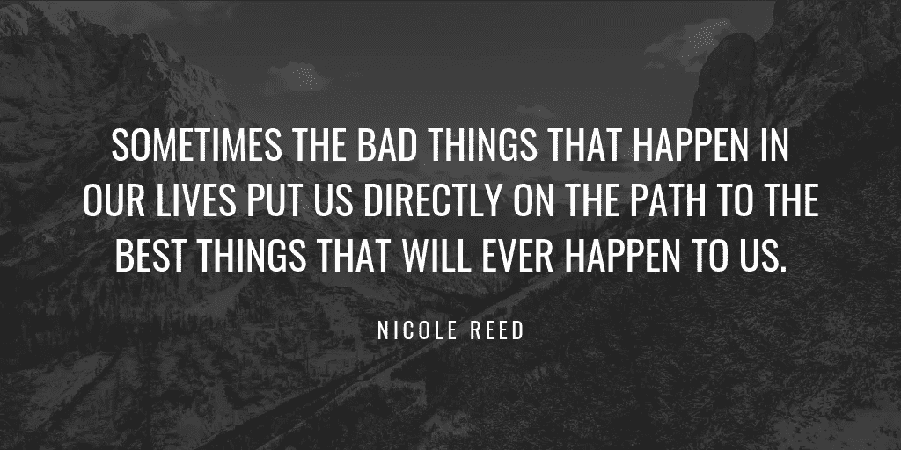
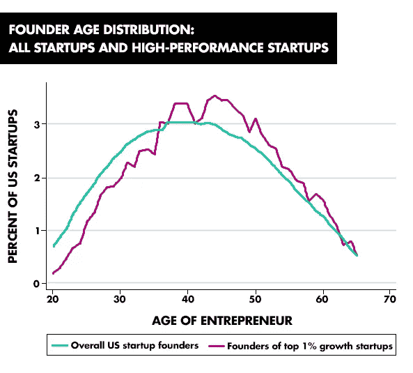
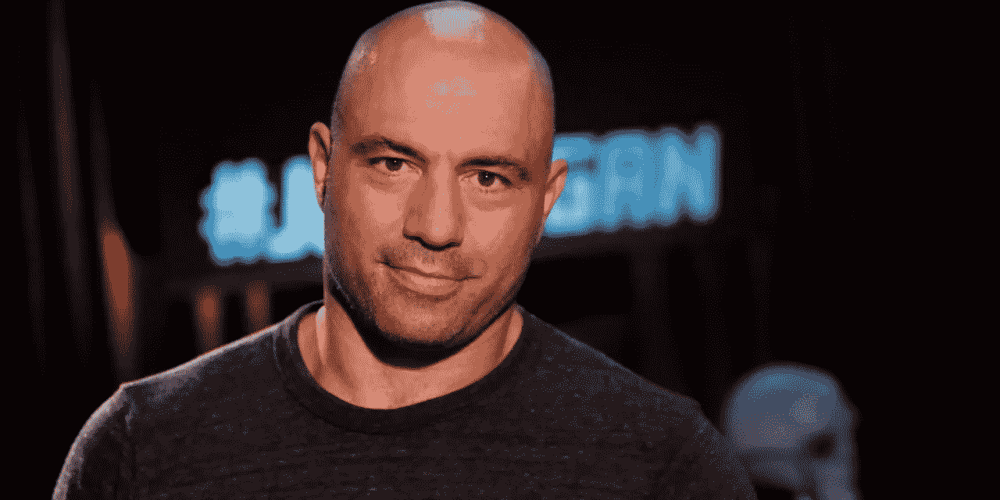

# 唯一一个让伟大的事情发生在你身上的生活帮！

> 原文：<https://medium.datadriveninvestor.com/life-hacks-to-let-great-things-happen-to-you-a78e37632aea?source=collection_archive---------14----------------------->

你正坐在那里读这篇文章，可能感觉很糟糕。你认为如果你在生活中处于不同的位置，会更好，对你更有启发。你甚至会感到不开心和痛苦。你问自己:我到底应该怎么做才能摆脱这种情况？

也许你已经开始建立你的事业，你的生意，或者你仍然在努力规划毕业后的生活。你甚至可能会迷失并被困在大学里，想着如何才能找到让你快乐的事情，让你安全地走出教育的痛苦。

大多数人都忽略了生命的本质机制，尽管本质上很简单:

> 不管你爱不爱，做一些事情，直到伟大的事情开始在你身上发生。

这并不意味着你做你讨厌的事情。事实上，你做的事情在一段时间内对你有用，直到你获得足够的经验，可以继续做下一件事情。

在一次采访中，*西蒙·西内克*向*汤姆·比利尤*讲述了所谓的千禧一代以及他们获取和积累经验的急切心情:

Inside Quest — Tom Bilyeu interviewing Simon Sinek

> …所以我不断遇到这些优秀的、不可思议的、理想主义的、勤奋的、聪明的孩子。他们刚从学校毕业。他们从事的是初级工作。我和他们坐在一起，问他们，“怎么样？”他们说，“我想我要退出。”我想，“为什么？”他们就像，“我没有产生影响。”我说，“你已经来了八个月了。”

其实不只是千禧一代怀念这种生活规律。大多数过着不满足生活的人认为他们运气不好或者事情太难实现。然而，建立一份遗产是一条每天循序渐进的路。不要渴望伟大，因为这太令人失望了，因为生活的本质就是艰难险阻。相反，渴望小小的改进，忘掉史蒂夫·乔布斯和扎克伯格。

是的，你急于积累经验。你认为你的下一件大事是某种奇迹，就像史蒂夫·乔布斯和扎克伯格年轻时发生的那样。但是，这是错误的，这就是为什么 90%的创业失败。

史蒂夫·乔布斯曾在他父亲的车库里摆弄过一段时间的电子产品，并在一家电子工厂工作过，还经常阅读。扎克伯格编写的代码比你想象的要多得多。是的，事情在他们很小的时候就发生了，但这更像是一个意外，而不是生活的规则。

# 不要指望什么是偶然的，指望什么是有效的！

根据麻省理工学院斯隆管理学院教授皮埃尔·阿祖莱和博士生丹尼尔·金的一份工作报告，已经创办公司并雇佣了至少一名员工的企业家的平均年龄是 42 岁。

“如果你什么都不知道，你有两个相同的想法，一个是由一个非常年轻的人提出的，一个是由一个中年人提出的，并且这是你必须继续下去的唯一事情，如果你想预测成功，你最好押注于一个中年人，”阿祖莱说。

为了找出年龄和企业家精神之间的相关性，金和阿祖莱向政府求助，特别是从人口普查局的纵向商业数据库中获得行政数据，并从国内税收署获得 K-1 企业主数据。

Between 2007–14, less than 1 percent of high-performance startup firms were founded by 20-year-olds. Source: “Age and High-Growth Entrepreneurship”

该团队研究了大约 270 万人的数据，这些人在 2007 年至 2014 年间创办了企业，并至少雇佣了一名员工。除了企业家的平均年龄，他们还了解到，那些增长最快的新企业的创始人平均年龄为 45 岁。

研究人员将数据分为高科技就业、风投支持的公司和专利公司。在整个美国，这些部门创始人的平均年龄分别为 43 岁、42 岁和 45 岁。

该团队研究了加州、纽约、马萨诸塞州等地区的年龄和初创企业，特别是硅谷。创始人年龄最接近“年轻”的是风投支持的公司，纽约的平均年龄是 39 岁。

同样，一个“最年轻”的技术领域——在这里指的是无线电信运营商——的平均创始人年龄是 39 岁。

金和阿祖莱还发现，如果创业者以前曾受雇于他们正在创业的特定行业，他们的成功率会高出 125%。

虽然这可能会令人震惊——至少对那些希望创办公司的 20 多岁的年轻人和希望为他们提供资金的风险资本家来说——但金说，对经济学家来说，这个想法不应该太牵强。

> “从理论上讲，我们知道随着年龄的增长，很多益处会积累起来，”金说。
> 
> “例如，你从经验中获得大量人力资本，随着年龄的增长，你还会获得更多的财务资源，以及社会关系，所有这些都可能增加你成为企业家的成功几率。”

阿祖莱说，这并不是说没有一些年轻人创建了“非常稳健、非常成功的大型企业”，但这也不意味着他们不会随着年龄的增长而变得更好。例如，比尔·盖茨和杰夫·贝索斯 50 岁时比 20 岁时更成功。

至于那些希望成为下一个马克·扎克伯格的 20 岁年轻人，金说，他们不应该被这些数据吓倒，相反，他们应该有信心，他们仍然可以取得成功，成为改善企业家精神的一部分。

有了经验，你会获得知识，拓宽你的人际网络。人们开始了解你，信任你。你利用和建立的东西。

# 伟大与其说是被砍，不如说是建造！

## 加里·维的例子

Gary Vaynerchuk

当 Gary 在 90 年代后期发现“互联网”是一个抢占地盘的机会时，他将他父亲的当地酒类商店(当时名为“购物者折扣酒”)转变为该国首批酒类电子商务平台之一，导致了爆炸性的收入增长。加里将公司更名为“葡萄酒图书馆”，在他任职期间，他父亲的公司销售额从 300 万美元增长到 6000 万美元。

在 Wine Library 工作期间，加里·维纳查克于 2006 年在 YouTube 上创建了第一个名为 WineLibraryTV 的长篇视频节目。5 年来，加里几乎每天都制作一集。

听着，这太疯狂了。这一代人在渴望成功和思考成功的时候，并没有考虑连续 5 年每天制作一集。这都是关于你每天做的小事，这些小事让你的经历更丰富，你的关系网更大，让伟大的事情开始发生在你身上。

## [乔·罗根的例子](https://medium.com/@RichestCelebrities/joe-rogan-biography-net-worth-87760a7df874)

每次你获得经验，你就利用它。这一事实在人生的所有成就领域都无处不在，不仅仅是初创公司和企业。例如，乔·罗根从未成为初创公司的联合创始人，但截至 2018 年，他的净资产约为 2500 万美元，这使他成为世界上最富有的喜剧演员之一，同时过着充实的生活。

他在青少年时期努力学习武术。他学习跆拳道、空手道和跆拳道。他是跆拳道黑带，赢得了四次马萨诸塞州冠军以及 1986 年的美国公开赛冠军。他在跆拳道课上逗朋友笑的能力鼓励他尝试单口相声。

他为他的第一部单口喜剧努力了 6 个月，在波士顿一家喜剧俱乐部的公开麦克风之夜。那时，他继续在波士顿大学表演单口喜剧和教授武术，并做一些其他的零工来获得经济稳定。

在与迪斯尼签署了一项协议(独家开发)后，他出名了。如果他不练武术，遇到告诉他你很擅长逗别人笑的同学，这种事永远不会发生。所以，他利用他的关系网。你一定注意到了这样一个事实，他一直在当老师，在做其他临时工作的时候表演喜剧，以便能够追求他的激情。这得到了回报，他和迪斯尼签了一份协议！

看起来很酷，对吧？

但是，成交之前一点都不爽。对于乔·罗根来说，寻找一条通往充实生活的道路总是一件痛苦的事情。

# 小贴士:如何让伟大的事情发生在你身上？

*   开始吧！或者为某人工作并向他学习。
*   执行你的想法，或者去为一个以学习为唯一目的的人工作。
*   耐心点。如果你讨厌你做的事情，停止去做，但是如果你只是觉得不耐烦或者懒惰，那就回去工作吧！
*   消除故障原因！做有用的事情，而不是你认为正确的事情，并给灵感留出空间。
*   转到下一个，试着利用你学到的东西。
*   重复前面的步骤。
*   不要失去希望！

> 你积累经验，利用你的知识和网络。这是唯一的出路！

让我用*加里·维纳查克*在伦敦[4D 事件](https://youtu.be/t8rWsNr1HMQ)中关于耐心的演讲来结束这篇文章:

> 我擅长的是过去 25 年业务的模式识别，我的和别人的。我做过小生意，家族生意。我在硅谷。我去麦迪逊大街是有原因的。我对公司一无所知。七年前，我不能明智地谈论耐克和阿迪达斯。现在我可以告诉你一切。现在我很危险。现在我已经有了所有企业家、中小企业、硅谷技术公司和财富 500 强企业的蓝图。现在我明白了每个人的优点和缺点。现在我可以在 50 岁开始我的职业生涯。这就是计划。所以当我谈到耐心时，我会说:“想想我刚才说的话！”

## 感谢阅读。如果你喜欢这篇文章，请随时留下评论、反馈或分享你的批评。在接下来的几天里，你会在我的[网站](http://www.souliber.com)上找到更多相关内容。