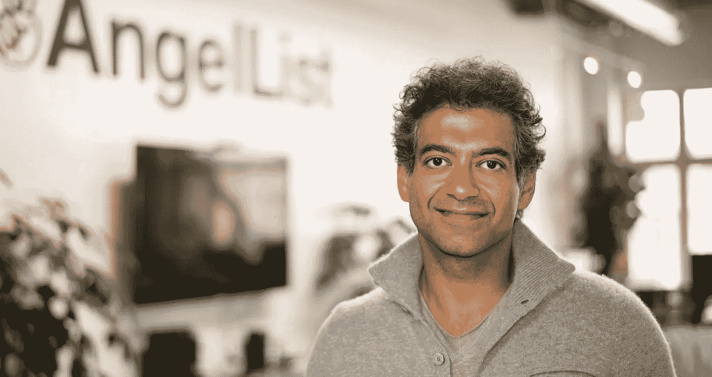

# 亿万富翁纳瓦·拉维坎特的人生教训

> 原文：<https://medium.datadriveninvestor.com/life-lessons-from-billionaire-naval-ravikant-2edcda0069a9?source=collection_archive---------1----------------------->

将会有大量的信息和知识炸弹，所以做好准备。

这一切都是从我在放学回家的路上听沙恩·帕里什的知识工程和纳维尔·拉维坎特的播客开始的，纳维尔开始谈论他的习惯。他的知识、思维和见解立刻引起了我的注意。尽管播客大约有两个小时，但每一秒都是值得的。说真的。

对于那些不了解 Naval 的人来说，这里有一个关于他的快速总结:

他是 Angelist 的联合创始人兼首席执行官，Angelist 是一个为早期创业公司和天使投资人提供会面的平台。他还运营 ProductHunt，这是一个为初创公司推出产品的平台。

好吧，回到好的方面…

> [DDI 编辑推荐——宾夕法尼亚大学的成功](http://go.datadriveninvestor.com/success2/matf)

**我的脑子立刻被炸了。**

Naval 教会了我如何掌握自己的命运，

**做我想做的事情**，

**和** **为自己做最终会带给我快乐的决定。**

# 以下是我的播客集锦

# #1:只是阅读

不，说真的，**随便看。**

读你喜欢的，你享受的，你觉得有趣的，因为其中总有价值，即使其他人看不到这一点。

Listen to Sam

我们总是被告知要读完一整本书才能提取所有的价值。

现实是这样的:你不需要*完成整本书来获得所有的价值。你为自己选择了有价值的东西,而这并不一定来自于阅读整本书。*

**侧面提示:这不仅适用于阅读。如果你周围都是你认为对你没有价值的人，那就离开。做适合自己的事。**

如果这意味着找到新朋友，那就去做吧。我做到了。让你在这个星球上的经历，**你想要的经历。**

> “我总是花钱买书。我从来不认为那是一种花费。对我来说，这是一项投资。”

书籍实际上是充满了如此多知识的纸片。人们把他们的整个生活都投入到他们所学的每一件事情中。这些超级成功人士把他们从这些书中学到的一切都写了下来，这是多么疯狂啊。书籍对我来说是真正的黄金。你只需要知道哪里能找到金子。

选择适合你的知识。一旦你从一本书里学到了所有，移动一本，拿起另一本。

谁知道呢，你明天读的书可能会永远改变你的一生！让你踏上成功之路。你只需要试一试。试一试没有坏处。

在学校，我们总是被教导要一页一页地读完一本书，因为我们必须分析它，找到潜在的信息，隐藏的意义，等等等等。太无聊了。Naval 说，你不必这样做就能获得这本书的全部价值。

根据谷歌的数据，世界上有超过 1.5 亿本书

那是 150，000，000 个获得新知识的新机会**。**

新知识会让你更聪明，更有意识，受到更好的教育。拿起一本书读一读并没有什么坏处。

# #2:你的习惯决定了你是谁，你的生活方式，你的个性。

Naval 说要把自己的生活掌握在**自己的**手中，做自己喜欢的**事情**，不沉溺于对自己和周围人有害的活动。

> “习惯就好。习惯可以让你在后台处理某些事情……解决全新的问题……你绝对需要习惯来发挥作用。”

我们都有自己的一套习惯。这有点像我们的性格。我们的习惯让我们与众不同，它们在定义我们是谁的过程中扮演着重要角色。

这里有一些东西需要考虑，我们生活的大部分是自动驾驶的。想想看，从进化的角度来看，我们不可能每天处理数百个决定。我不考虑我如何拿起我的牙刷，我不考虑我如何吃东西，我不考虑我如何走到我的公共汽车站…它们只是习惯。

然而，这些习惯决定了我们生活中成功的轨迹。我们吃什么将决定我们的健康，也许不是现在，但肯定会在未来。我们选择如何花钱，如何与人交往，如何与人建立关系，都会严重影响我们的生活。

选择最适合你想要的生活的习惯取决于你自己。

> “我们所做的就是积累所有这些习惯。我们把它们放在身份、自我、我们自己的捆绑中，然后我们就依恋于此。”

我们都有好习惯和坏习惯(甚至那些正在阅读这篇文章的人会想，“我没有坏习惯”，你有。你可能只是还没看到而已。)和**没事。**

然而，**真正重要的是**我们能够识别那些坏习惯并说:“嘿！这似乎不是我该做的最好的事情！”

这真的引起了我的共鸣。我开始回顾我过去做的一些对我来说很正常的事情，但后来我开始意识到，我的这些习惯对我没有好处。

> “它对我有用吗？这让我更开心了吗？它让我更健康了吗？它是否让我完成了我现在想要完成的任何事情？”

我决定自己处理这件事。

我开始培养自己的好习惯，比如在放学回家的路上听播客，而不是 Spotify 上的播放列表。

睡觉前，我会花时间反思一天中成功和失败的事件。我思考如何让明天更美好。

我开始在房间的白板上写下我的目标、要做的事情和进展。

> “我认为你可以自己无条件。你可以不训练自己。只是很难。”

改变是艰难的。这需要努力。这需要时间。然而，当你改善你的生活时你得到的感觉是惊人的。

养成对你有益的习惯。这对你有好处。这让你很开心。这让你成为一个更好的人。

**小贴士:**给你的生活带来改变不仅仅适用于习惯。

Naval 公开了他不良的饮酒习惯。他说这对他的生活方式有负面影响。他的饮酒习惯影响了他想要在生活中实施的新养生法，那就是早上锻炼。他很快意识到这是行不通的，**所以他做出了改变。**

每当有机会让你的生活变得更好时，就给你的生活带来改变。

# **#3:优先考虑快乐**

我们生活在一个快节奏的世界里，事物总是在不断变化。人们走进走出会议室，登上飞机，但是我们真的没有太多的时间去做我们喜欢的事情，让我们开心的事情。

Naval 说他最优先考虑的事情之一是幸福，我相信每个人都应该优先考虑幸福。

> “(幸福)是当你消除了生活中缺少某些东西的感觉时所拥有的东西。”

Naval 谈到快乐对他来说是如何不断发展的。一年前他对幸福的定义会和现在大不相同。他说**快乐是一种流动的状态，它在不断变化。**

我对幸福的定义和你对幸福的定义不一样。这和在地铁上坐在你旁边或者在图书馆里坐在你对面的人的幸福是不同的，但是每个人对幸福都有自己的定义。

**找到让你开心的事情。**

做让自己开心的事。

如果你喜欢健身，那就去健身吧。

如果你觉得看电影很快乐，那就看电影吧。

如果你发现读书很快乐，那就读书吧😉。

就像希亚·拉博夫曾经说过的:

不要隐晦的寻找快乐。**有意为之**

**小提示:**有意为之**不**只适用于快乐吗？它适用于一切。

对你的目标要有目的性。有意讲述你的经历。为你所做的事情找一个理由。

不要为了做某事而做某事。

如果你买了一个会议的门票，不要只是去参加会议坐在椅子上 3 个小时，听发言者。

去参加会议，与演讲者建立关系，积极地从那里的人那里获得知识，等等。

**让你做的每件事都有价值。**

所以，

去吧，抓住下一个小时。开始拿起一本书或培养一个新习惯，有意识地，找到快乐，看看你的生活会如何改变！

这些是我最重要的信息，也是 Shane Parrish 和 Naval 的播客的亮点。

# 关键要点

*   随便拿起一本书读一读。谁知道呢，这可能会改变你的生活！
*   做对自己有利的事。
*   把事情掌握在自己手中
*   找出你生活中的坏习惯，并努力去取代它们
*   给你的生活带来积极的变化
*   优先考虑快乐(严肃地)
*   对你做的每件事都要有意识

这些信息和见解改变了我对自己、我周围的人、我交往的人、我做的事情以及我看待生活的方式的看法。

对于那些对播客感兴趣的人(读完这篇文章后，我知道你是感兴趣的)，我在下面添加了播客和抄本的链接

**如果你喜欢我的文章，一定要鼓掌，评论和分享！**

[https://open.spotify.com/episode/5W0RQCDr28VSxVZOYJn3f5?si=OlpKLkEIRwCgQE8MNJP1tA](https://open.spotify.com/episode/5W0RQCDr28VSxVZOYJn3f5?si=OlpKLkEIRwCgQE8MNJP1tA)