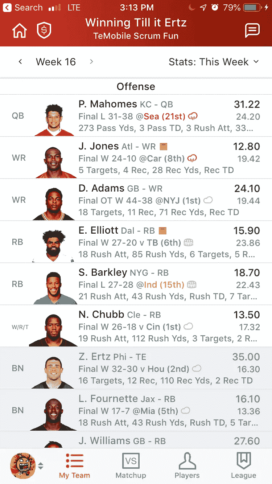
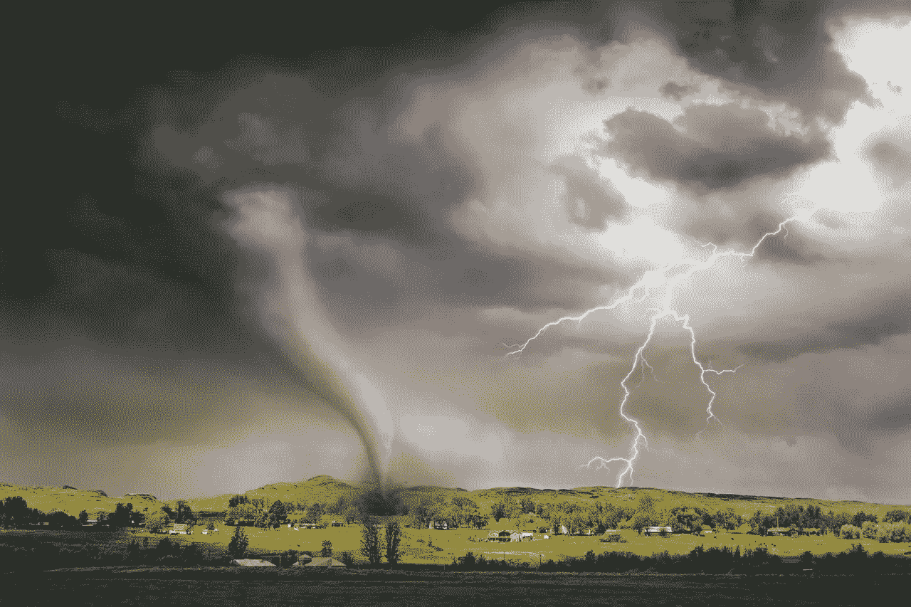

# 来自梦幻足球的人生课程:做出更好决策和预测的 3 个关键

> 原文：<https://medium.datadriveninvestor.com/life-lessons-from-fantasy-football-3-keys-to-making-better-decisions-and-predictions-2a0d76e2a27?source=collection_archive---------5----------------------->

快到了。

你可以在空气中感觉到。

等了六个月，美国职业足球准备开球了。

 [## 决策的移情设计方法如何工作|数据驱动的投资者

### 移情设计是一种产品设计方法，首先由多萝西·伦纳德和杰弗里·雷波特在哈佛大学提出

www.datadriveninvestor.com](https://www.datadriveninvestor.com/2018/07/18/how-the-empathic-design-method-of-decision-making-works/) 

在一个子集狂热群体中，对几乎完全数字化的体育体验的期待是狂热的。

*梦幻足球。*

在某些情况下，这项运动的这一部分具有更高的风险，周末充满了难以描述的情绪高潮和低谷。

那么，所有这些与避免糟糕的决策或预测有什么关系呢？

# 游戏中的游戏

嗯，在这个模拟世界中，每个参与者都有责任决定他们的幻想(假)团队中需要谁，以及每周开始谁。

你从整个联盟的不同球队中选择球员，并根据他们在场上(真实)的比赛表现计算他们的得分。如果比你对手的多，你就赢了这场比赛。然后你可以吹牛，直到下星期你不得不从头再来。

如果你以前从来没有这样做过，而且这没有多大意义，请继续和我在一起。

Sample of Scoring — My Team Last Year (How I have such a stacked team is worthy of another post)

归结起来就是这个。

**在整个赛季中，你每周都会根据预期的球员结果做出决定和选择。**

同样，生活也是由我们每天在职业和个人方面做出的选择组成的。

如果结果是好的，接下来可能会非常兴奋，比如敲定你对本季度的财务预测。在你不得不做出下一个重大决定(或预测)之前，这很棒。

不管是哪种情况，我们都会做出预测，然后等待我们选择的结果。

我被一些同事骗去玩幻想运动。尽管我们玩游戏只是为了炫耀，但我通常都很有动力。

前几年，我用统计学和机器学习来指导我的一些决策。这可能对我在过去两年的联赛中分别获得第二名和第一名起到了一些(小)作用。

也许不是。但是，很快会有更多的报道。

在现实中，使用人工智能对每个人来说都不是可及的或合理的选择。另外，你不能把这样的工具应用到每一个重大的人生决策中。

那么，为什么不找一个更实际的方法来建立一些直觉呢？

在这篇文章中，我将分享这种模拟体验提供的三件非常重要的事情，它们可以帮助你避免在生活和工作中做出糟糕的预测。

# 1)小心吸引你注意力的人

Bruegel — The Parable of the Blind Leading the Blind by [ArtLoveSoul](https://www.flickr.com/photos/artlovesoul/) on Flickr.com

> 与智慧人同行的，必得智慧；与愚昧人作伴的，必受亏损。——箴言 13:20
> 
> 那些随大流的人通常会迷失在其中。—匿名
> 
> 退潮的时候你才知道谁一直在裸泳。—沃伦·巴菲特

有一个能让你发表意见的人总是很棒的。有时候你很无知，任何指导都可以。

有道理。没有人什么都知道。

在梦幻足球里也没什么不同。

整个夏天，随着赛季准备开始，整个赛季你都有所谓的专家就球员如何表现给出建议。

有些有脱口秀，有些有播客和充满“特殊内幕信息”的文章。

如果他们是对的，他们会变得更加自信。

如果他们错了，他们会归咎于一个不可预见的因素，或者在继续下一个预测之前对他们的错误一笑置之。

无论哪种方式，不管结果如何，他们仍然会得到报酬。金块就在这里。

如果这些专家的错误没有真正的后果，那么他们就没有“真正的”动力去明智地做出预测。

同样的事情也发生在生活的其他方面。

有许多政治和经济专家不断做出预测。你周围的人都在对一种情况会如何发展做出大胆的评估。选举、经济等。

在工作中，管理层和领导层根据预期结果做出商业和战略决策。

在任何给定的时间，你要么是在做预测，要么是预测的对象。那么，如何确定谁的话值得听呢？

有两件明显的事情值得注意:

*   这些“专家”提供的支持事实或数据
*   他们的记录

很好，但是你能更进一步吗？

你当然可以。

**你需要思考这个人在游戏中是否有皮肤，以及这可能如何影响预测**。

如果他们错了，他们会失去什么？

*在游戏中没有皮肤，你需要警惕听任何专家*。

例如，在虚拟足球中，一个体育专家的预测、支持数据和良好的记录更值得信赖。

**外卖:**

如果你不得不考虑生活中有影响力的人的建议或预测，从关注他们的支持数据和记录开始。

你可以通过评估他们是否参与游戏(结果)来更进一步。

# 2)机会的作用和能力的幻觉

> 每个人迟早都要放下行李和幻想的包袱。— **卡洛斯·辛坦拿**
> 
> 从短期来看，市场是一台投票机，但从长期来看，它是一台称重机。— **本杰明·格拉哈姆**

在梦幻足球中，挑选一名相当优秀的球员却因为受伤或球队状况不佳而完全失望，这并不罕见。

相反，你可能会选择一个让所有人都感到惊讶并且远远超出预期的球员。

这是一个危险的地方，你可能会把基于运气的结果误认为是技能，反之亦然。

这在生活中也会发生。

一场演讲进行得很好，或者你达成了一笔交易。或者可能演示不顺利，你失去了一个客户。

是运气还是技能和能力发挥了更大的作用？

回答这个问题需要反思。

人们很容易把注意力放在结果上，而不是把注意力放在让你走到今天这一步的过程上。

你无法真正评估运气或技巧在你的结果中发挥了多大作用，这为你未来可怕的决策和预测打下了基础。

另一个严重的危险是将一个事件误读为一种趋势。

时间是最好的均衡器。

当一个好的结果是在一个小样本中时，数据可能没有统计学意义。此外，如果事件是最近发生的，你可能会受到近期偏见的影响。

**时间是对你的能力和过程可靠性的最好评判。如果你还没受够，你可能会成为能力幻觉的受害者。**

**外卖:**

没有反思，学习是不完整的。无论是在生活中还是在梦幻足球中，花时间评估你的决策过程总是值得的。

如果你的过程是合理的，坚持下去，即使一些坏运气影响了结果。如果你的过程不合理，不要让有利的结果欺骗了你。

它不是完全可靠的，但它给了你一个更好的改进机会。

# 3)准备从无序和混乱中获益

> “当你打算在一个领域冒险时，通过在生活的另一个领域异常谨慎来抵消它”——**亚当·格兰特，** [**原件:不墨守成规者如何改变世界**](https://www.adamgrant.net/originals)
> 
> “抗脆弱性超越了弹性或稳健性。有弹性的抵抗冲击并保持不变；抗碎性变得更好。”― **纳西姆·尼古拉斯·塔勒布，** [**抗脆弱:从混乱中获得的东西**](https://www.goodreads.com/work/quotes/19092611)

在美式足球中几乎每年都会发生。

这是一项非常激烈的运动，就像大多数激烈的运动一样，这经常会导致受伤。没有哪个位置比跑锋位置更容易受到这种影响。

这种伤病‘混乱’往往会给一个突然冒出来并大放异彩的替补球员带来意想不到的机会。

这在我两年前有利的幻想结果中发挥了作用。

尽管这种情况经常发生，但随之而来的还有很多不确定性。这是一种无法预测的情况——一种已知的未知。

在梦幻足球中，一个精明的人会投资挑选几个最有潜力发光的替补球员，如果首发球员不幸经历了这种结果。

这种策略类似于反脆弱。

> **抗脆弱性**是系统的一种属性，在压力、冲击、波动性、噪音、错误、故障、攻击或失败的情况下，系统的发展能力会增强。— [维基百科](https://en.wikipedia.org/wiki/Antifragility)

这是金块。

**唯一比能够预测负面结果更好的事情是当它发生时能够茁壮成长。**

正如纳西姆·塔勒布(Nassim Taleb)早先的引述所概述的那样，抗脆弱性的概念不应与弹性或建立一个稳健的系统相混淆。

在生活和工作中，你可以通过做[预抵押](https://en.wikipedia.org/wiki/Pre-mortem)或有一个冗余计划来恢复活力。

这对解决已知的未知问题很有帮助。

解决[黑天鹅](https://www.investopedia.com/terms/b/blackswan.asp)事件——未知的未知——是完全不同的挑战。

> 黑天鹅是一种不可预测的事件，超出了正常情况下的预期，具有潜在的严重后果。— [投资媒体](https://www.investopedia.com/terms/b/blackswan.asp)

你如何为这种不可预测的事件做准备？

一种方法是采用杠铃策略。

纳西姆曾写过大量关于黑天鹅和抗脆弱性的文章，他支持这种方法。

在这种情况下，你可以在不承担过多风险的情况下，为自己带来巨大的收益。

实际例子？

当你在“安全”的日常工作中不断超越和成长时，开始一项高风险高回报的兼职工作。

理想情况下，如果让你的日常工作稳定的东西经历了一次冲击——比如经济衰退——那么副业会有所收获。

**外卖:**

黑天鹅——不可预测的事件——需要在决策和预测中加以考虑。然而，杠铃策略会让你不容易受到这类事件的影响。

换句话说，在让自己暴露于巨大的积极面的同时，让自己为躲避糟糕的情况做好准备。

# 摘要

这篇文章的目的是利用一些关键的要点，当你做决定和预测时，你可以从个人和专业的角度应用它们。

这不是我的目标，但如果我在读完这篇文章后让你对梦幻足球稍微感兴趣，我已经超额完成了。

你可以加入目前只有我妻子的候选名单(如果你认识她的话，这是一大成就)。

涵盖的关键思想都可以归结为

*   密切关注你听取谁的建议。除了寻找一个好的记录和数据，游戏中的皮肤也有很大的帮助。
*   通过反思从你的成功和失败中学习。只有通过反思才能区分运气和技巧。
*   风险和不确定性在预测中起作用。你可以通过计划裁员和使用预抵押来恢复活力。然而，没有什么比当结果是负面的和意想不到的时候被设置为茁壮成长更好的了。

感谢你的阅读，祝你未来的预测和决定一切顺利。另外，在 LinkedIn 上关注我[https://www.linkedin.com/in/shofola/](https://www.linkedin.com/in/shofola/)

最美好的祝愿！

就这样，谁准备好踢足球了？

**喜欢这篇文章吗？单击下面❤，在您的订阅源中查看更多内容，并确保其他人也能看到它！**