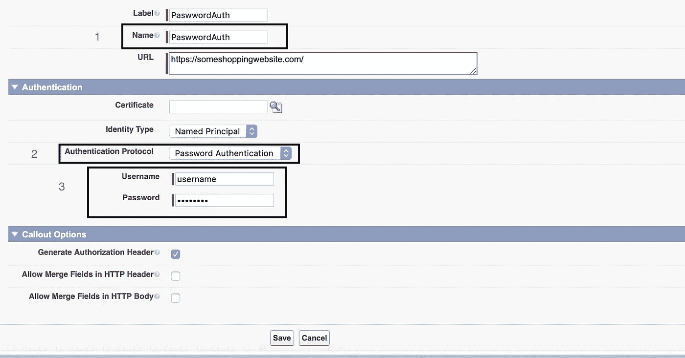
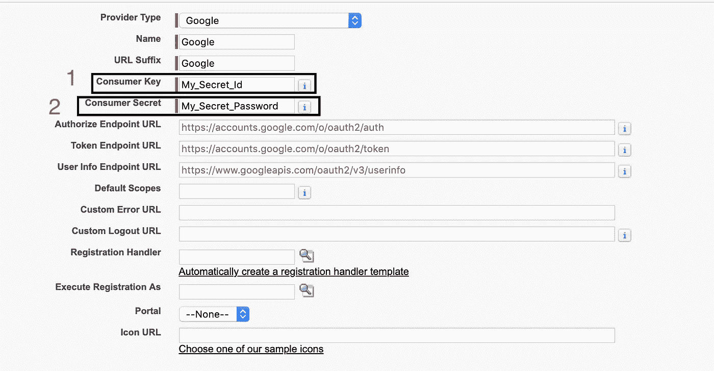
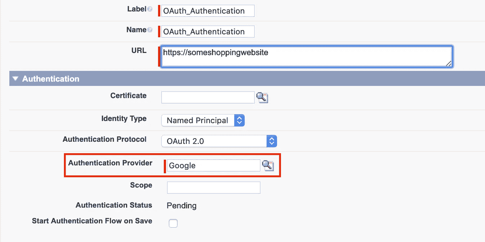

# “命名凭证”让生活变得更简单

> 原文：<https://medium.datadriveninvestor.com/life-made-simpler-by-named-credentials-e350c17d2358?source=collection_archive---------1----------------------->


有时基于业务需求，我们需要将 Salesforce 与外部系统集成。集成是任何项目中最重要的方面。当涉及到集成时，会涉及到很多事情。因此，我将告诉您要做的基本但重要的事情，这是 Salesforce 的一个提示。

我将提出一些场景，关于在“命名凭证”出现之前事情是如何被做的。这不是一个简单的过程，只需指定端点的 URL 就可以了。这在大多数情况下需要认证。外部系统需要验证您的身份。有多种方法可以做到这一点，如基于密码，OAuth 2.0，JWT 等等。

[](https://www.datadriveninvestor.com/2019/02/25/6-alternatives-to-the-yahoo-finance-api/) [## 雅虎财经 API |数据驱动投资者的 6 种替代方案

### 长期以来，雅虎金融 API 一直是许多数据驱动型投资者的可靠工具。许多人依赖于他们的…

www.datadriveninvestor.com](https://www.datadriveninvestor.com/2019/02/25/6-alternatives-to-the-yahoo-finance-api/) 

**在命名凭证之前:**

**场景 1** :使用用户名和密码认证。

**没有命名凭证的标注:**

```
HttpRequest req = new HttpRequest();
req.setEndPoint('https://someshoppingwebsite.com/path/to/fancy/item);
req.setMethod('GET);
***String username = "username";
String password = "password";******//Generate the authorization header
Blob headerValue = Blob.valueOf(username + ':' + password);
String authorizationHeader = ' BASIC ' + EncodingUtil.base64Encode(headerValue);******//set the authorization header
req.setHeader('Authorization',authorizationHeader);***Http http = new Http();
HttpResponse res = new HttpResponse();
```

在运行此代码之前，**您必须在** [***远程站点设置***](https://developer.salesforce.com/docs/atlas.en-us.apexcode.meta/apexcode/apex_callouts_remote_site_settings.htm)***中将 URL 列入白名单，否则 Salesforce 不会让您进行调出****。*

*下面是上面突出显示的代码中需要注意的一些关键内容:*

*   *用户名和密码是硬编码的。*
*   *明确提到了授权头。*
*   *如果任何版本控制系统，如 Git，代码将可见，因此凭证，这可能是一个巨大的安全漏洞。*
*   *对于不同类型的组织，如开发人员组织、沙箱和生产环境，凭据会有所不同。因此，在部署时，每次都必须更改代码。但是我们有一个解决方案，我们可以在自定义设置或自定义元数据等配置中存储凭据。但这不是最安全的方式。*

***如果身份验证需要基于每个用户或基于某个证书进行，该怎么办？**是的，对于基于每用户的认证，我们可以依靠 [***分层自定义设置***](https://developer.salesforce.com/docs/atlas.en-us.apexcode.meta/apexcode/apex_customsettings.htm) 。同样，自定义设置是不可部署的。是数据，不是元数据。从一个环境部署到另一个环境时，必须创建它，否则标注会失败。最大的问题是，它可以访问所有的配置文件，用户。还有，不能加密。*

***对于基于证书的认证**，我们不能简单地将证书存储在静态资源中并访问它，因为所有用户都可以通过/resource URIs 访问静态资源内容服务器，因此这不是最好或安全的方式。*

***那么这些事情怎么处理呢，答案是******取名国书*。****

****场景 2:** 使用 OAuth 2.0 的认证:**

**OAuth 2.0 是一个多步骤的身份验证过程。它包括获取 ClientID、客户端密钥、作用域、回调、访问令牌、刷新令牌等等。**

**假设当前令牌已过期，我们需要获取一个刷新令牌，再次进行标注，获取刷新令牌，再次根据标注的实际目的进行标注，然后将刷新令牌存储在某个位置。我们必须确保无论新的刷新令牌存储在何处，它都是安全的，不会被不需要的用户访问。**这个繁琐的过程由*【命名凭证】*** 优雅地处理。**

****现在让我们看看“命名凭证”是如何让这些事情变得简单而优雅的。****

****场景 1** :使用命名凭证的用户名和密码认证。**

**首先，让我们创建一个命名凭证。下面是已经创建的命名凭据的屏幕截图。**

****

**这里有三个需要注意的地方，**

*   **在框 1 中,“Name”字段在这里很重要，我们将在代码中使用这个名称。**
*   **在框 2 中，字段“身份验证协议”必须设置为“密码身份验证”，因为我们正在进行基于密码的身份验证。**
*   **在第 3 栏，填写你的用户名和密码。**
*   **确保选中“生成授权头”复选框。**

**还有其他字段，如“身份类型”，以及一个名为“标注选项”的部分，我们将在后面讨论。**

****使用命名凭据的标注:****

```
**HttpRequest req = new HttpRequest();
req.setEndPoint('callout:PasswordAuth/path/to/fancy/item);
req.setMethod('GET);
Http http = new Http();
HttpResponse res = new HttpResponse();**
```

**就是这样！我们所要做的就是添加“callout:PasswordAuth”，其中 PasswordAuth 是我们的命名凭证的名称。**

****“指名凭据”的妙处在于:****

*   **这里不需要在“远程站点设置”中将 URL 列入白名单。**
*   ****它自动生成指定的凭证。****
*   ****它还通过将“身份类型”设置为“每个用户”来处理每个用户的身份验证****

****场景 2** :使用 OAuth 2.0 的认证使用命名凭证:**

**对于使用 OAuth 的身份验证，过程稍有不同。首先，我们需要设置身份验证提供者。身份验证提供者只是关于谁将进行身份验证的细节。已经有预设的认证提供商，如谷歌，脸书，Twitter 等。现在，您需要为自己获取一个 ClientId(API 提供者提供的唯一标识符，用来标识您)和 Client secret(除了您之外，没有人知道的密钥)。这需要证明您是具有前面提到的客户端 ID 的人，该客户端 ID 试图从您要进行调出的提供者访问 API 提供者的服务。设置它的屏幕如下所示。**

****

*   **在第一个框中，写着消费者密钥，除了客户端 Id 什么都没有。**
*   **在框 2，消费者秘密字段仅仅是客户秘密。**

**我只是展示了一个谷歌作为认证提供商的例子。如果身份验证协议是“OAuth 2.0”，那么我们的命名凭证就需要这个**

****

**在框中，您可以看到有一个名为“身份验证提供商”的字段。该字段显示您添加的所有身份验证提供程序。既然我们已经把谷歌加为一体，我们就选择了它。您可以看到一个名为“认证状态”的字段。它仍处于“待定”状态。此外，还有一个名为“保存时启动验证流程”的复选框。如果选中此项，一旦保存了指定的凭据，它将启动 OAuth 流并对您进行身份验证。一旦“身份验证状态”变为“已验证”，就可以开始了。**

**同样，您可以使用相同的代码，只是对端点 URL 稍作修改。使用“callout:OAuth_Authentication”而不是“callout:PasswordAuth”，因为这是我们用于 OAuth 身份验证的命名凭据。 ***你不需要担心访问令牌、刷新令牌等问题。一切都搞定了。*****

**现在，我已经告诉过您，我们将讨论像“身份类型”这样的字段和命名凭证屏幕中称为“标注选项”的部分(是的，我没有忘记这一点)。**

****身份类型:**身份有三种类型。**

*   ***:如果该字段设置为按用户，则用户可以在个人设置中设置自己的凭证。标注发生在当前用户上下文中。您应该通过权限集和简档授予用户对命名凭据的访问权限。***
*   ******命名委托人*** :如果设置为命名委托人，则来自 Salesforce 的所有调出，无论当前用户是谁，都使用此凭据。***
*   *****匿名*** :基本上，如果 callout 不需要任何认证，那么就选择这个值。**

****标注选项**:该部分有 3 个复选框**

*   *****生成授权头*** :默认情况下，Salesforce 为您生成授权头。如果外部端点不支持授权头，或者如果您想要使用自定义授权头，请取消选择此选项。**
*   **A ***允许 Http 头中的合并字段&允许 HTTP 正文中的合并字段:*** 这两个复选框指定了 HTTP 头和正文是如何构造的**

****合并字段:**如果需要，这些字段可用于构建 Http 头和主体。下面列出了它们。**

*   ****{！$Credential。用户名}** 和 **{！$Credential。密码}** ，仅当指定的凭证使用密码验证时，这些选项才可用。**
*   ****{！$Credential。OAuthToken}** 和 **{！$Credential。OAuthConsumerKey }**:API 提供者分别给运行用户和 ClientId 的 OAuth 令牌。仅当命名凭据使用 OAuth 身份验证时，此选项才可用。**
*   ****{！$Credential。AuthorizationMethod}** :提供基本密码认证、Bearer-OAuth2.0、null-no 认证等认证使用的协议**
*   ****{！$Credential。AuthorizationHeaderValue}** :该值取决于使用的认证协议**

**唷，我知道这不是一个快速阅读。但是真正命名的凭证通过将端点 URL 和身份验证从标注定义中分离出来，使我们的工作变得更加容易。**

****资源:****

1.  **[命名凭证](https://developer.salesforce.com/docs/atlas.en-us.apexcode.meta/apexcode/apex_callouts_named_credentials.htm)**
2.  **[合并字段](https://developer.salesforce.com/docs/atlas.en-us.apexcode.meta/apexcode/apex_callouts_named_credentials_merge_fields.htm)**
3.  **[使用 Salesforce SOAP API 端点](https://help.salesforce.com/articleView?id=Named-credential-oauth-token-doesn-t-get-automatically-refreshed-with-Salesforce-SOAP-API-end-point&type=1&language=en_US)时，命名凭据 OAuth 令牌不会自动刷新(知识文章)**
4.  **[自定义设置](https://developer.salesforce.com/docs/atlas.en-us.apexcode.meta/apexcode/apex_customsettings.htm)**
5.  **[查看和编辑静态资源](https://help.salesforce.com/articleView?id=pages_static_resources_edit.htm&type=5)**