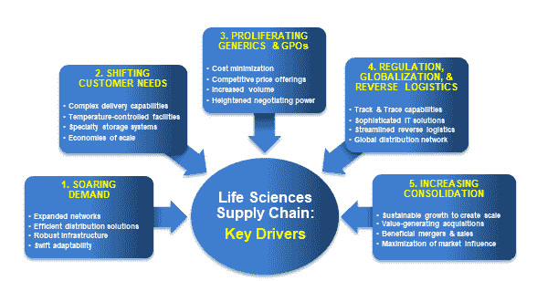
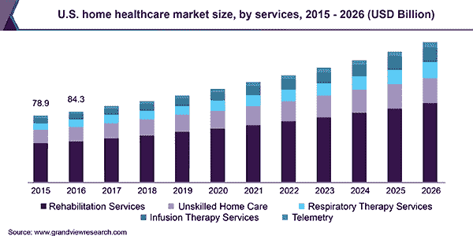
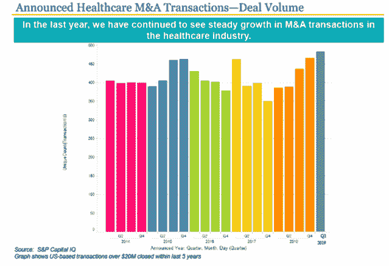

# 生命科学物流:什么在推动交易？数据驱动的投资者

> 原文：<https://medium.datadriveninvestor.com/life-sciences-logistics-whats-driving-the-deals-data-driven-investor-858c0b8a19ed?source=collection_archive---------15----------------------->

由[本杰明·戈登](http://www.bengordonpalmbeach.com)

医疗保健物流市场正在蓬勃发展。7 月 15 日，医疗物流巨头 Marken [宣布了三项收购。奥地利的 HETO、匈牙利的德库里耶和意大利的 HRTL 都同意出售。反过来，Marken 之前被 UPS 收购，试图创造一个生命科学供应链的领导者。](https://www.prnewswire.com/news-releases/marken-acquires-three-european-logistics-companies-300884271.html)

合并后的公司将覆盖 [51 个地点、10 个临床储存站，并覆盖全球](https://www.freightwaves.com/news/ups-marken-consolidates-european-presence-by-acquiring-three-companies)。此外，Marken 每月将能够交付 7，000 次临床试验装运。

 [## 一个 M&A 的爱情故事(第 1 部分，共 3 部分)|数据驱动的投资者

### 上周，我们报道了三集系列节目“M&A 爱情故事”的第二集。今天我们回到开头来谈谈…

www.datadriveninvestor.com](https://www.datadriveninvestor.com/2018/07/10/an-ma-love-story-part-1-of-3/) 

为什么一个包裹公司要推行生命科学战略？

答案是，UPS 只是众多认识到医疗保健物流机会的公司之一。今年，我们还看到了一系列额外的交易，包括

*   医药分销领导者 [McKesson](http://www.mckesson.com/) 以 8 亿美元收购医疗保健分销商[医疗专业分销商](http://www.msdonline.com/)
*   牙科分销巨头[亨利·沙因](http://www.henryschein.com/)收购海斯手机特许经营权、[诊所和](http://www.cliniclands.se/)[意大利精英电脑](http://www.orisline.com/)
*   医疗保健分销商 [Cardinal Health](http://www.cardinalhealth.com/) 收购 [mscripts](http://www.mscripts.com/) 用于基于 [SaaS](https://www.datadriveninvestor.com/glossary/software-as-a-service/) 的移动药房解决方案，以及投资虚拟医院[医疗之家集团](http://www.medicallyhome.com/)

推动变革的根本原因是什么？我要特别强调五个核心趋势:需求飙升、客户需求变化、仿制药激增、监管和逆向物流，以及整合。每个主题概述如下。

# 推动生命科学物流变革的五大趋势

1.  **需求飙升**

随着世界人口的老龄化，慢性疾病将变得更加普遍，增加药物解决方案将是必要的。事实上，T2 联合国经济社会事务部预计，到 2050 年，60 岁以上的人口数量将增加近两倍，达到 20 亿，占世界人口的 21%以上。在发达经济体中，65 岁以上人口的比例已经达到两位数，而且预计还会增长。与此同时，随着发展中国家老年人的寿命不断延长，这些国家对药品的需求将会扩大。因此，消费者需求最主要的变化将来自于对药品和医疗用品需求量的大幅增加。为了在不断扩大的市场中占有一席之地，分销商将负责扩大其网络，并投资基础设施和技术来支持他们。

药品短缺也预示着市场的变化。随着慢性病变得越来越普遍，对治疗这些疾病的药物的需求也在增加。不幸的是，产量往往跟不上日益增长的需求。近年来，注射癌症疗法的使用增加了 20 %,但产量却没有相应增长。去年，据报道有 100 多起关键药物供应中断的事件。结论是:生产需要扩大规模，这给供应商带来了提供高效分销解决方案的更大压力。

**2。转变客户需求**

随着研发的不断推进，制药公司的药物组合将开始呈现不同的形态。到 2025 年，全球生物制品市场预计将达到 4000 亿美元。对于药品分销商来说，这意味着更复杂的制造和交付方式，例如建造额外的气候控制设施和专业存储系统。除了新的资本密集型工厂和设备之外，我们预测那些发展了足够影响力的批发商将会在影响最常分发的药物方面发挥积极作用，从而从这一趋势中获得最大的利润。

病人也开始在家里用药。据估计，全球家庭医疗保健市场目前价值 3060 亿美元，并以每年 8%的速度增长。

因此，供应链必须学会适应向更多地点配送，包括住宅、养老院和社区中心。这是 Cardinal-medical Home Group 交易的一个催化剂。找到更经济的方式进入当地环境是关键，而创造规模经济对于确保轻松到达众多地点至关重要。

**3。扩散仿制药和 GPO**

尽管不断变化的客户需求是制药业变革的关键组成部分，但不断演变的竞争态势无疑是变革中更重要的一部分。该行业正在经历的主要变化是从“仿制药悬崖”(大型制药公司的专利到期)跌落。随着受欢迎的品牌药物专利到期，公司将不再能够通过品牌销售来提高他们的底线。事实上，最近的一项政府研究发现，平均而言，仿制药的零售价格比其品牌药低 75 %,仿制药占零售环境中所有药物的 78%。因此，人们期望企业关注其供应链，寻找精简和削减成本的方法。

随着患者保护与平价医疗法案生效，另一个竞争性变化将会出现。为越来越多的患者提供最佳护理的压力导致来自公共和私营部门支付者的财政资源下降，从而导致越来越依赖于集团采购组织(GPO)来削减成本。已经有大约 72%的医院采购是通过 GPO 合同完成的。这些 GPO 监管的专业化供应链很快可能会经历更多的活动，GPO 的高购买力杠杆将使那些能够提供有竞争力价格的大公司获得巨大优势。因此，对于分销商来说，现在比以往任何时候都更需要增加销量，在增加收入的同时降低成本。

**4。监管、全球化&逆向物流的兴起**

公司还必须准备实施新的联邦法规，以保护药品供应链的完整性。未来 10 年，FDA 将逐步实施[药品供应链安全法案](https://www.fda.gov/drugs/drug-supply-chain-integrity/drug-supply-chain-security-act-dscsa)，该法案概述了对处方药批发商的具体“跟踪和追溯”要求。它还呼吁建立一个全国性的电子、可互操作的系统，以便在某些药物分销时对其进行识别和追踪。与此同时，巴西、俄罗斯、印度和中国(金砖四国)等国家的医疗保健产品制造和消费导致供应链变长，成本和复杂性增加。事实上，IMS 预测中国每年将经历 14 %- 17%的医药行业增长，而美国只有 1 %- 4%。

随着监管和全球化的加剧，为了确保供应链安全，需要复杂的技术解决方案。成功的经销商已经开始投资最先进的 IT 系统，如高级跟踪和[云计算](https://www.datadriveninvestor.com/glossary/cloud-computing/)，以更有效地[交换](https://www.datadriveninvestor.com/glossary/exchange/)信息，减少欺诈和开拓新兴市场。

此外，随着监管力度的加大，召回变得更加频繁，需要移除更多数量的药品。FDA 去年召回了 4448 种药物和设备产品。到期处理也是一个不断增长的细分市场。通常情况下，制造商通过向药店提供过期未售药品的信用担保来确保特定药品的销售。再加上更高的公众审查，对逆向物流的需求正在增加。随着全球化的继续，假药的例子可能会成倍增加。据估计，假药的全球市场规模每年在 1000 亿至 2000 亿美元之间，自 2002 年以来，记录在案的假药、被盗药或非法转移药品的数量增加了 10 倍以上。

因此，药品分销商有机会通过建立和/或增强逆向物流和供应链安全能力，将自己定位为行业领导者。这意味着开发更多的网站和技术资源，使公司能够利用高回报，同时防范假冒。

**5。增加合并**

最后一个重要的市场变化是整合。我们正在见证医疗保健并购的创纪录水平。在 2018 年，我们看到了 [803 起并购，以及 858 起加盟和合作公告](https://www.healthleadersmedia.com/finance/healthcare-industry-most-focused-consolidation-consumerism-2019)。

行业分析师[认为这次并购浪潮将持续](https://www.healthleadersmedia.com/finance/healthcare-industry-most-focused-consolidation-consumerism-2019)。此外,[根据刚刚发布的权威医疗保健调查](https://blog.definitivehc.com/news/healthcare-trends-survey-2019),行业整合被列为今年最重要的趋势，以 25.2%的票数领先。

一个关键的驱动因素是由药品分销三巨头领导的整合浪潮，如上所述——[Cardinal Health](https://www.cardinalhealth.com/en.html)、 [McKesson](https://www.mckesson.com/) 和 [AmerisourceBergen](https://www.amerisourcebergen.com/) 。

生命科学供应链中精明的公司因此认识到创造价值的并购是必须的。随着分销商努力实现更大的产能，适应由 GPO 协调的仿制药采购主导的市场，并跟上不断升级的监管和快速全球化的步伐，同时削减成本和提供有竞争力的价格，未来 12 个月将会实现更多的交易。

# 未来之路:挑战还是机遇？

鉴于这五大行业变化给分销商带来的新负担，我们认为该行业的公司有三种选择:

*   **通过收购建立关键能力**，利用增长战略扩展您的网络并增强您的竞争优势。
*   **利用有利的资本市场**并通过寻求销售或利用额外的股权投资于转型所需的创新技术和现代化设施来记录交易水平。
*   **什么都不做**。然而，像 Medline、VWR 和其他公司这样的合并者正在迅速追求并购导向的增长，面对更具侵略性的竞争对手，你可能会发现你的竞争优势正在削弱。

要想在竞争中取得成功，你应该考虑什么样的策略最能让你在不断发展的空间中保持可持续增长的地位。相比之下，不成功的公司会忽视不断变化的环境，这是他们的风险。对于夹在中间的公司，你可能会发现竞争对手获得了规模经济和长期差异化，而中间的大多数公司将会落后。

生命科学供应链部门面临拐点。尽管医疗需求的上升、仿制药的扩散和全球化可以为医药分销商提供机会，但竞争、监管和整合的加剧也带来了相当大的挑战。因此，鉴于快速的变化，有一点是肯定的:作为买方、卖方或其他人，现在是巩固你的战略并利用有利市场的好时机。

*原载于* [*【本杰明·戈登】*](http://www.benjamingordon.me)*[*剑桥资本*](http://www.cambridgecapital.com) *于 2019 年 9 月 17 日*[*【www.datadriveninvestor.com】*](https://www.datadriveninvestor.com/2019/09/17/life-sciences-logistics-whats-driving-the-deals/)*。**