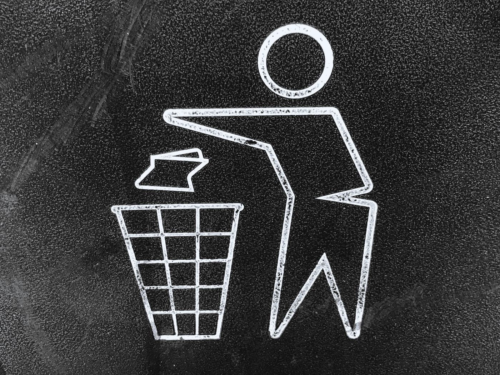
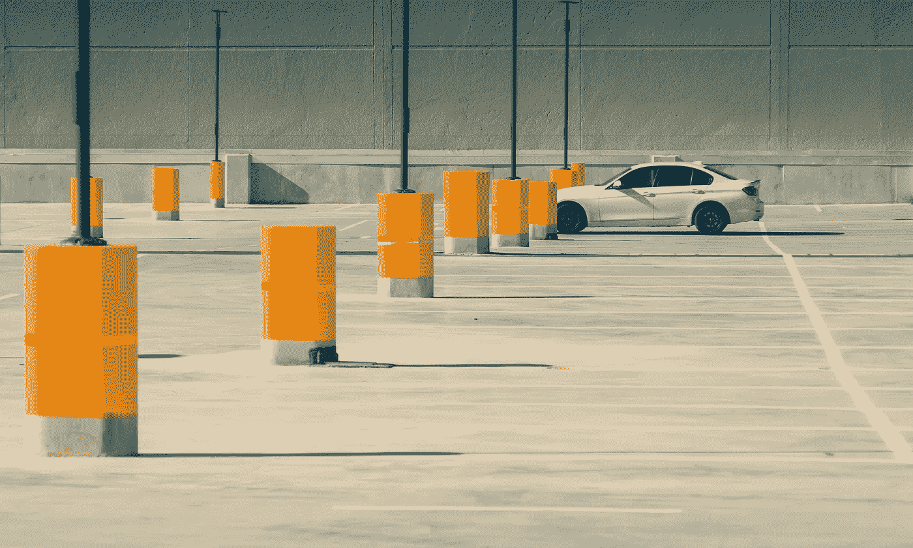

# 生命周期定价:修复我们的经济，让我们的生活更美好

> 原文：<https://medium.datadriveninvestor.com/lifecycle-pricing-fixing-our-economy-and-making-our-lives-better-1ef9cbfa5d83?source=collection_archive---------9----------------------->

## 改善我们的环境、城市和商业

Photo by [Gary Chan](https://unsplash.com/@gary_at_unsplash?utm_source=unsplash&utm_medium=referral&utm_content=creditCopyText) on [Unsplash](https://unsplash.com/search/photos/waste?utm_source=unsplash&utm_medium=referral&utm_content=creditCopyText)

当你环顾你所在的城市，你有没有感觉到廉价已经成为一种流行病？我们的购物中心和停车场，我们的沥青丛林和流水线住宅，每隔 30 个街区就重复一次的出售类似食品的[“餐馆”](https://www.webmd.com/food-recipes/news/20090323/7-rules-for-eating#1)和[快速时尚](https://medium.com/fashion-as-medium/5-truths-the-fast-fashion-industry-doesnt-want-you-to-know-4b4f9f43c864)零售商的相同模式……似乎大多数新城市——像北美的那些城市——有 80%是廉价的、不起眼的、乏味的、重复的、低效的和临时用地，而另外 20%是令人向往的和注重质量的。这种城市形态的一个主要原因是“[广场](https://medium.com/@PPS_Placemaking/how-to-turn-a-place-around-a-new-edition-of-the-book-that-started-the-placemaking-movement-6189a3e2a8f2)的制造你可以在任何城市复制并粘贴这个简单的城市模型，理论上是这样的。重复现有的设计很便宜。当所有零件都可以互换时，它就便宜了。新奇是昂贵的。质量贵。

这就是我们的城市的样子，当我们选择社会成本高的廉价产品，但政府却不愿意将任何东西正式社会化。这就是我们的城市的样子，当我们选择最低提取和销售点成本的产品时，不考虑所有的生命周期成本。不想正式社会化成本没有错。本文不是关于正式社交的利弊；但是，你不能像今天的领导人一样，假装社会成本不存在。如果做得正确——意思是全面地和整体地——两种成本社会化思想都可以奏效。也就是说，我可以看到成本增加的正式社会化的理由，但我认为非正式的、基于外部性的小政府模式也可以起作用。

 [## 为什么包容性财富指数比 GDP 更能衡量社会进步？|数据驱动…

### 你不需要成为一个经济奇才或金融大师就能知道 GDP 的定义。即使你从未拿过 ECON 奖…

www.datadriveninvestor.com](https://www.datadriveninvestor.com/2019/03/08/why-inclusive-wealth-index-is-a-better-measure-of-societal-progress-than-gdp/) 

无论哪种策略，成功的关键都在于对成本的认识。明智的决策至关重要。只要计划周密，成本被充分理解，这两种意识形态的温和形式都能发挥作用。说到我们建造和购买的东西:如果你想要便宜的销售点成本，你就必须社会化一些生命周期成本。如果你想避免社会化——无论是大政府形式的税收还是小政府形式的外部性——你需要确保用户在销售点支付整个生命周期的成本。

> 关于外部性的更多信息，请看这篇更早的文章。

Photo by [Gerrie van der Walt](https://unsplash.com/@gitfo?utm_source=unsplash&utm_medium=referral&utm_content=creditCopyText) on [Unsplash](https://unsplash.com/search/photos/mall-parking?utm_source=unsplash&utm_medium=referral&utm_content=creditCopyText)

# 从提取点到销售点的旅程只是故事的一小部分

价值是从这个我们称之为家园的星球上的原始资源中提取的。价值是通过人的努力增加的。一旦价值被提取，它就被出售。这是从开采到最终用户或消费者在销售点购买价值的供应链。然而，与商品相关的成本并不止于此。每一部分提取的价值都有一个生命周期成本，包括从提取到浪费的时间。在我们当前的经济体系中，价值提取者和生产者只包括提取成本，在许多情况下，这并不构成生命周期成本的大部分。消费者也没有支付生命周期成本的剩余部分，他们只支付了提取成本之外相对较小的加价。他们支付利润来“购买”或推动进一步开采，但同样，直到产品的使用寿命结束，他们才支付产品开采的全部成本。

## 揭开生命周期成本之谜

生命周期成本包括健康影响、污染、废物管理、机会成本、时间损失、安全、维护和资产磨损等。这些成本理论上在开采时就存在，即使它们必须在以后支付。这是值得重复的重要一点:生命周期成本是在提取价值时产生的。它就在那里，以一种停滞的状态四处漂浮，等待着有人来抓住它并偿还它。生命周期成本是提取价值的成本，但提取者不需要支付，因此他们将其传递到下游。注意这里的时间扭曲效应是很重要的。总的生命周期成本将需要在未来付清，最迟在产品生命周期结束时，但由于它们保证在提取时存在，因此可以认为它们立即存在。创造产品会产生不可避免的生命周期成本。至少，将产品作为废物收集的成本。

开采者为开采的劳动或人力付出代价，而消费者只需支付这一成本加上保持经济机器运转的利润。总生命周期成本的剩余部分尚未支付。谁支付这个？

## 生命周期成本的社会化

货币换价值交易的主要参与者没有支付的成本需要支付。当它们不是由开采者或消费者支付时，它们是由社会支付的，无论是通过税收等正式渠道还是外部性等非正式渠道。在一个回避各种形式的政府/公众成本负担社会化的社会中，这些未支付的社会成本大多被视为外部因素。如今，外部性很少被量化，当然也不会成为关于经济的普遍话题。我们都要支付社会成本；外部性只是比通过正式渠道支付要间接得多。理论上，这些社会成本有可能通过外部性更有效地支付。另一种选择是政府运营的系统，这些系统效率不高。不幸的是，没有量化和识别我们都在为之买单的外部性，就有太多的空间给[寻租](https://medium.com/@jvannpashak/the-economy-is-broken-rent-seeking-broke-it-c1a4a94d77a6)，而寻租是当今比政府浪费更大的经济低效和威胁。

Photo by [David Lee](https://unsplash.com/@sanleesnaps?utm_source=unsplash&utm_medium=referral&utm_content=creditCopyText) on [Unsplash](https://unsplash.com/search/photos/pollution?utm_source=unsplash&utm_medium=referral&utm_content=creditCopyText)

这些外部性最糟糕的一点是，我们经常在补贴我们不同意的选择。在许多情况下，我们不知不觉地为他人选择我们致力于避免的不健康生活方式买单，或者购买我们出于环境或政治原因抵制的产品，或者做出主动降低我们生活质量的选择。通过政府甚至类似于保险公司的专业化私营企业进行的正式社会化，使人们清楚地知道到底在支付什么费用以及花费多少。

## 现在很便宜，随着时间的推移越来越贵

产品的生命周期成本迟早要付出。这是一个[零和等式](https://medium.com/@jvannpashak/unintended-economic-consequences-e80c5d8dbdbe)；如果您现在支付更多费用，您以后不必支付同样多的费用，但整个生命周期保持不变。当前价格加上未来价格等于生命周期价格。这里有一句很贴切的谚语:“吝啬鬼会付两次钱。”很好的概括了这个概念。通常，今天的便宜随着时间的推移会变得昂贵。考虑一下便宜的工具和昂贵的工具。如果便宜的工具可以使用 1 年，并且价格是可以使用 10 年的昂贵工具的一半，那么在 3 年内，使用这个工具将比购买更昂贵的工具更昂贵。其他先便宜后贵的决策示例:

*   空调代替了精心设计的房屋；
*   以生活质量差为代价获得廉价住房的城市；
*   廉价劳动力是以不依赖中产阶级债务来防止崩溃的现金流动经济为代价的；
*   以增加建造和使用寿命风险为代价跳过工程；
*   我们的消费和处置经济；
*   以舒适或耐用为代价的廉价家具；和
*   以提高人类生活质量的新奇为代价的城市空间的互换性。

## 生命周期定价:拯救我们的经济和环境

我们的经济在过去的 200 年里，也许更久，没有偏爱最好的产品。从我们的“适者生存”竞争中脱颖而出的公司和产品，一直是社会补贴最多的产品。换句话说,《财富》青睐生命周期成本最高、提取成本最低的产品。生产成本和生命周期成本通常成反比关系。高生产成本一般意味着低社会成本或外部性，低生产成本往往意味着高外部性成本。这是另一个零和等式。争夺同一市场的产品通常有相似的生命周期成本，只是这种价格的分布可能会对销售点价格或社会成本产生重大影响。不幸的是，由于忽视了社会成本，我们让便宜的-现在昂贵的-后来的产品激增，而质量却没有竞争力。

在大多数情况下，我们需要开采者立即支付这些生命周期价格，然后将它们传递给消费者。没有参与这些交易的人不应该为此买单，我们需要确保社会承担很少或没有成本。对于少数每个人或几乎每个人都受益的情况，社会承担成本是可以的。这是通过上述税收或外部因素实现的。在所有其他情况下，只有那些直接与交易互动的人应该付费。在许多情况下，社会成本明显高于销售点价格；提取者和消费者都应该承担这个成本。这样，我们就“内化”了外部性。

这就是生命周期定价。我们需要计算主要采购的生命周期成本，并在销售点收取该价格。这是一个类似于使用费和庇古税的概念。这一概念将成本负担转移到直接决策者身上。

这种类型的策略做了 4 件好事:

*   它促进了一种[循环或稳态经济](https://medium.com/world-economic-forum/the-circular-economy-could-save-life-on-earth-starting-with-cities-836c4c9a1335)。
*   它使质量与廉价相竞争。
*   它最终使质量更加实惠。
*   它促进真正的创新，而不是渐进式创新。
*   它促进了政治家们的长期思考。他们永远不会为了低廉的初始成本而牺牲总体成本。领导们将不再为了今天的省钱而支付更多的长期费用。选择一个今天更贵但 30 年后能省下一大笔钱的产品变得比现在更容易辩护。

在过渡期间，需要管理一个重要的权衡:

一开始，东西会更贵，也许会贵很多。对此，有大量的货币政策和财政解决方案。通常情况下，改变一开始代价高昂，但最终会有所收获。

Photo by [David Lee](https://unsplash.com/@sanleesnaps?utm_source=unsplash&utm_medium=referral&utm_content=creditCopyText) on [Unsplash](https://unsplash.com/search/photos/pollution?utm_source=unsplash&utm_medium=referral&utm_content=creditCopyText)

为了比较苹果和苹果，我们需要在销售点支付生命周期价格。用户和消费者支付整个生命周期的费用。如果有民主意愿的话，这些成本仍然可以通过正确价值的税收正式社会化，但这是不必要的。如果小政府是你所追求的，解决方案也是存在的。实施生命周期定价的简单方法可以采取不同的形式:我们可以直接向价值提取者付款，然后由价值提取者向管理下游成本的相关基金缴款，或者我们可以支付销售税。其他更复杂和优雅的解决方案也是可用的，但需要 1000 多个单词。

## 延伸阅读:

如果你关心如何设定生命周期价格，请继续关注，我将在接下来的文章中解决这个问题。一个非常简单的解释是，我们可以应用一个滑动尺度来衡量我们有多保守(高估)，就像工程成本估计有不同的风险和意外情况类别一样。这恰好是工程工作中生命周期成本计算的一种延伸。

**链接:**

*   [廉价食品和可食用的类似食品物质的外部性](https://medium.com/food-is-the-new-internet/a-national-food-policy-for-the-21st-century-7d323ee7c65f)
*   [房地产](https://medium.com/@oneclicklca/the-business-case-for-life-cycle-costing-b9788c34ee53)和[建筑](https://medium.com/@oneclicklca/life-cycle-costing-in-construction-reduce-your-buildings-lifetime-costs-3c83775ff43e)的生命周期成本
*   [公用事业](http://simple.werf.org/simple/media/LCCT/index.html)的生命周期成本
*   [高速公路](https://www.fhwa.dot.gov/infrastructure/asstmgmt/lcca.cfm)的生命周期成本(特别注意用户成本和活动成本)
*   一篇[精彩报道](http://www.diva-portal.org/smash/get/diva2:756353/FULLTEXT01.pdf)引用如下:

> “当道路使用者成本包含在分析中时，投资成本较高的备选方案产生的生命周期成本最低。”

新奇对人类的幸福极其重要，应该成为我们城市环境的一个基本组成部分，引入自然，提供丰富的交通方式选择，强化土地利用(在合理范围内)，创造性的建筑，艺术和文化，以及大量的娱乐机会。它非常重要，我已经包含了一些链接:

*   [新奇感和大脑，为什么新事物让我们感觉如此之好](https://lifehacker.com/novelty-and-the-brain-why-new-things-make-us-feel-so-g-508983802)
*   图书— [新书:理解我们对新奇和变化的需求](https://www.amazon.com/New-Understanding-Need-Novelty-Change/dp/1594203202)
*   书— [满足:寻找真正满足感的科学](https://www.amazon.com/gp/product/080507600X/sr=8-1/qid=1144094404/ref=sr_1_1/103-8094502-9895015?%5Fencoding=UTF8)
*   [新鲜感让人更快乐](https://www.businessinsider.com/novelty-makes-people-happier-2017-4)