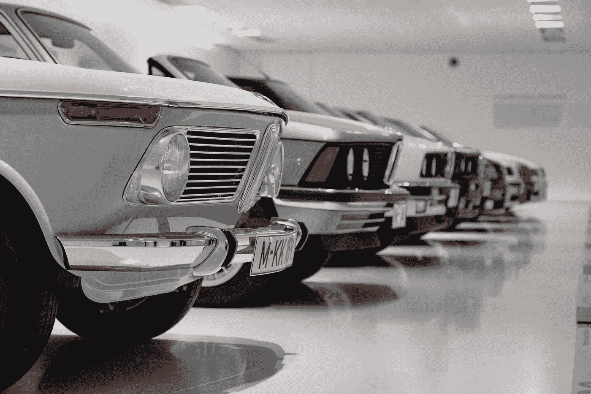

# 生活方式的改变会让你更富有

> 原文：<https://medium.datadriveninvestor.com/lifestyle-creep-can-make-you-richer-e953d80af595?source=collection_archive---------21----------------------->

Photo by Alex Suprun on Unsplash

在谷歌上简单搜索一下“生活方式蠕变”就会发现它的名声不好。

[Investopedia](https://www.investopedia.com/terms/l/lifestyle-creep.asp) 这样定义生活方式的蔓延:

> *随着个人可支配收入的增加，以前的奢侈品变成了新的必需品，个人的生活水平提高了，生活方式蠕变就发生了。*

是的，当生活方式蠕变被误导时，它确实是一件坏事。糟糕到可以毁掉你。

但我提出一个相反的观点。

生活方式的改变可能是好的。事实上，它甚至可以帮助你过上更丰富的生活。

有一个警告。

你需要知道如何重新平衡它。就像重新平衡你的投资组合一样。

与其认为这是生活方式的蠕变，我更愿意认为这是根据不断变化的生活优先级来重新平衡你的生活方式需求，这样你就可以保持最佳的满足感和幸福感。

因此，过着更丰富的生活。

# 买车是一种生活方式吗？

当我单身没有孩子的时候，我走到哪里都是步行和使用公共交通工具。

拥有一辆汽车确实是一种奢侈。

现在，我的车象征着我节省的时间成本，因为我在上班前把我们的两个孩子送到学校。更不用说在周末或午休时间带他们去补习班和跑腿了。

除了做我的全职工作、锻炼、运行这个博客和抽出时间陪陪我的丈夫和孩子，我几乎没有时间了。

我注意并优先考虑如何充分利用我的时间。

如果我没有车，我就不能在有限的时间内完成所有我必须做的事情。

我一回家，我丈夫就开车去见客户。由于他是一名财务规划师，他的大多数会议都在晚上或周末举行。

因此，我们的汽车帮助我们节省了时间成本并创造了收入。

# 升级我们的房子生活方式是一种爬行吗？

同样，我很高兴我不再和我丈夫在我们有孩子之前买的第一套公寓住在一起了。

我们几乎不能在其中一个房间里挤一张单人床。我不知道它是如何容纳我们一家 7 口的。

两个公寓之后，每一次“升级”或一些人认为是生活方式的蠕变，我们现在在一个伟大的社区有一所房子。

当然，我们为此付出了很多，但从长远来看，这对我们来说是一项投资。如果幸运的话，我们打算在这所房子里住到老。

在看到我的父亲因中风而残疾，我的岳母因骨关节炎卧床不起后，我们想要一个单层的房子，我们可以很容易地安装残疾人栏杆，并且可以坐轮椅。

是的，这是非常超前的想法，但是因为这房子是一生的投资，我们需要考虑我们的生活需求。

在这一点上，如果我们出售类似的东西，我们将不再能够负担得起，因为我们居住的国家的财产法律的变化，通货膨胀和不断上涨的财产价格。

# 生活方式的改变或错过的机会？

当我与那些收入比我们高得多，但现在却买不起像我们这样的房子的人交谈时，我感到非常幸运，当时我们让自己的“生活方式蔓延”,做出了购买那栋房子的决定。

这是一个旧的“原始状态”的房子，因为主人已经去世了，所以被放在市场上。

人们告诉我们，这是破旧的，需要太多的工作。

我们看到了一个被低估的潜在资产。

除了我们的抵押贷款，我们还贷款装修房子。我们在 5 年内还清了装修贷款。

虽然我们仍在偿还抵押贷款，但对我们来说，这只是意味着我们偿还了最终属于我们的房子，而不是租金。

# 生活方式的改变还是有意识的消费？

这与其说是关于生活方式的改变，不如说是关于定期检查你的开销，看看它是否符合你的价值观。

当我们的孩子还小的时候，一次差点溺水的事件告诉我们，他们需要知道如何游泳。

所以我们聘请了一位私人教练，专门帮助孩子们克服对水的恐惧。

当然，她的费用很高，但她也很棒。

然后我们加入了一个游泳俱乐部，因为我们的孩子每周都坚持游泳，一旦他们从私人教练那里毕业并接受适当的游泳训练，费用就会便宜得多。

当他们接近青少年时期，他们停止了游泳训练，去追求其他的兴趣。所以我们卖掉了游泳俱乐部的会员资格，因为我们几乎不再使用它了。

我能想到很多其他的例子可以被看作是“生活方式的蠕变”，但对我们来说，这只是一个给我们和我们的家庭带来幸福和满足的生活问题。

我喜欢我儿子额外的语文和数学课，以帮助他取得足够好的成绩，进入他选择的中学。之后，他告诉我他想试着不上那些课，所以我们停止了额外的课程。现在，这些资金被转入我们孩子的退休账户。

# 投资于人际关系和生活经历

是的，我丈夫和我在孩子们的艺术、粘土、嘻哈和攀岩课程上花了很多钱。

我们相信这些是对我们孩子学习和发展的投资。只要我们付得起，我们就会为这些付钱。

这些生活方式令人讨厌吗？有些人可能会说这些是不必要的，我们正在宠坏我们的孩子。

但我们认为不是。

我的儿子最终被艺术项目直接录取，因为我们培养了他对艺术的热情和热爱。

同样，我们的女儿总是有节奏和舞蹈，她花时间学习体操、街舞和攀岩。

我还投资了我的教育、家庭旅行(阅读了我们去看挪威[北极光](http://www.mommymakesthemoney.com/norway-tromso/)和日本[北海道](http://www.mommymakesthemoney.com/japan-sapporo/)的旅行，我们的孩子在那里第一次看到了雪)、一家企业、我的博客和一个住家保姆。

所有这些肯定都要花钱，从外面看可能会被认为是“生活方式的改变”,但每一项都比我们不投资它们更能丰富我们的生活。

# 每一个选择都包含权衡

另一方面，我几乎不买新衣服或鞋子，除非东西坏了。除了两个是我丈夫送的礼物，我没有一个奢侈品包。

我还在用一部旧手机，戴着政府免费发放的追踪手表。如果我觉得自己很时髦，我会穿 8 年前的斯沃琪。

我只在旅行和使用无品牌香水时才买免税化妆品。

我的头发大概一年修剪一次。我想我是幸运的，我的头发是低维护！

我们很少出去吃饭，因为我们有一个住在家里的帮手，他会在家里给我们做更健康的饭菜。

# 重新平衡你的生活方式“组合”,管理生活方式的蔓延

重新平衡我们生活方式需求的关键可以归结为我们做的三件事。

# 1.首先把你的基本知识准备好

“生活方式蠕变”只会在你没有良好的金钱基础时变得具有破坏性。

首先，也是最重要的一点，把你的理财基础搞清楚。

自动化你的储蓄，最大化你的退休投资，或者大学储蓄，如果你有孩子并且有保险的话。

我们很多人都有信用卡债务。我们也是。制定一个计划，在截止日期前付清这些费用。然后停止增加更多的债务。

确保你打下坚实的财务基础。

你可以使用我的免费财务自由路线图来学习做这些事情，你可以在这里下载。

# 2.明智地选择自由支配的支出

将你的消费决定锚定在对你重要的价值观上。

对我来说，这些价值观随着时间的推移而演变，从更多的物质“东西”到投资于伴随我一生的经历和记忆。

为了能够对可自由支配的支出做出明智的选择，你必须接触你的金钱脚本和你与金钱的关系。

[下载](https://pages.convertkit.com/5144f465db/c5d05fe31c)我的自由财务自由路线图。在我为期 14 天的控制你的钱的计划中，前 3 天只涉及我们的金钱脚本和与金钱的关系。

# 3.适应生活中不断变化的优先事项

生活不会停滞不前。

挑战和障碍总是会出现。

不可预测的，意想不到的事情发生了。

因此，我们必须不断审查我们的优先事项。

但是只要你有 1。第二。到位，3。帮助你“重新平衡”投资的分配。

与其认为这是生活方式的改变，不如认为这是为了适应生活中的季节变化。

无论是你的职业选择，你在哪里花可自由支配的收入，你决定投资多少和投资什么，我们都是基于我们想要在短期、中期和长期实现的结果来做出这些决定的。

要不要投资孩子的大学教育？退休生活有保障吗？还债？攒钱创业？去度假？

当我们深刻而有意识地反思我们所做的选择，使它们符合我们的价值观，并在需要时保持开放的态度来调整时，那么“生活方式蠕变”可能会帮助我们过上更丰富的生活。

你有没有做出过被别人视为“生活方式蠕变”但却带给你快乐和满足感的选择？在评论里说说吧！

*原载于 2019 年 2 月 6 日*[*【www.mommymakesthemoney.com】*](http://www.mommymakesthemoney.com/lifestyle-creep/)*。*