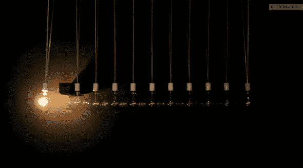

# 灯泡…

> 原文：<https://medium.datadriveninvestor.com/light-bulb-f967698f253d?source=collection_archive---------11----------------------->

**Be the LIGHT…**

如果灯泡是种族主义和阶级歧视的解药呢？

我出来了…

你知道人和灯泡之间的共同点吗？

它们都表现为不同的颜色、不同的形状和不同的大小。它们是在不同的地方制造的。我们有些闪闪发光，有些朦胧，有些充满活力，有些支离破碎。我们给人的印象是外面发生了很大的变化。但是灯的相似之处在于，每个灯泡里只有一个电流。同样的，这个星球上的每个灵魂都有一种奇异的能量。

不管你长什么样，也不管你的种族、性别、民族——那只是灯泡。但从内心做真正的自己。

**能量:**

不相信你是能量？让我来解开这个谜…

假设你有一个叫乔治的朋友，你去医院看望乔治。直到有一天乔治…不幸死在手术台上。你说:“哦，不，乔治死了！”但是…他的身体还在，他的种族，他的性别，但是你说乔治“死了。”但是你知道在内心深处，乔治不仅仅是他的身体，他是赋予他身体生命的能量。

能量…是我们的本质，而能量是无色的。这不是再版，也不是民主党，既不是白人也不是黑人。能源不是基督徒、穆斯林或无神论者。能量就是能量。

我们是聪明的，有创造力的，宇宙能量。如果我们理解了这一点，那么我们将最终知道自时间的开端以来，聪明的男人和女人一直试图让我们感觉到什么。“我们是一体的。”

不使用您的…

思想，

协会，

感知，

情感或记忆…

你是谁？

我们不是拥有神奇经历的人类。我们是拥有人类体验的神奇生物。