# 线性代数:开始机器学习前必须知道的话题

> 原文：<https://medium.datadriveninvestor.com/linear-algebra-must-known-topic-before-starting-machine-learning-ec6b0feec1eb?source=collection_archive---------4----------------------->

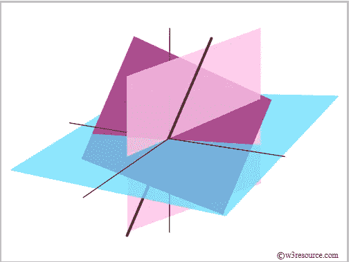

每当你开始机器学习，你就开始听到你需要学习数学(线性代数、微积分、概率和统计)。所以首先我们来谈谈线性代数，在开始机器学习之前，你真的需要知道线性代数的每个概念吗或者你可以学习一些基本的，然后开始做 ML。

[](https://www.datadriveninvestor.com/2019/03/03/editors-pick-5-machine-learning-books/) [## DDI 编辑推荐:5 本让你从新手变成专家的机器学习书籍|数据驱动…

### 机器学习行业的蓬勃发展重新引起了人们对人工智能的兴趣

www.datadriveninvestor.com](https://www.datadriveninvestor.com/2019/03/03/editors-pick-5-machine-learning-books/) 

**导入数字**

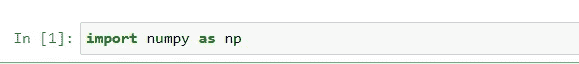

**标量:**标量是一个单一的数字。

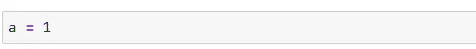

**Vectors:** vector 是一列数字。

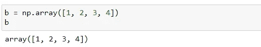

**矩阵:**矩阵是一个 2d 数组。

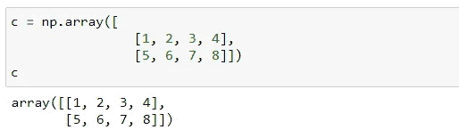

**张量:**张量是 n 维数组(2d 以上)。

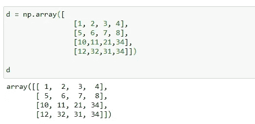

[source](https://hadrienj.github.io/posts/Deep-Learning-Book-Series-2.1-Scalars-Vectors-Matrices-and-Tensors/)

**矩阵加法:**

```
*a = [a1, a2, a3, ......., an]
b = [b1, b2, b3, ......., bn]
a+b = [a1+b1, a2+b2, a3+b3, .......+ an+bn]*
```

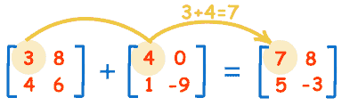

[Source](https://www.mathsisfun.com/algebra/matrix-introduction.html)

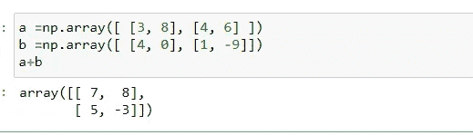

**矩阵减法:**

```
*a = [a1, a2, a3, ......., an]
b = [b1, b2, b3, ......., bn]
a-b = [a1-b1, a2-b2, a3-b3, .......- an-bn]*
```

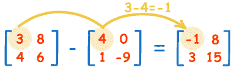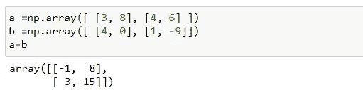

**乘法:**

*   ***由一个常数***

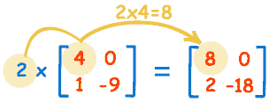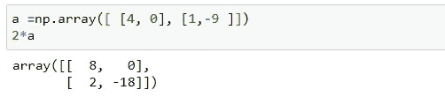

*   ***矩阵点乘*** (我们在 ML 中不使用叉积)

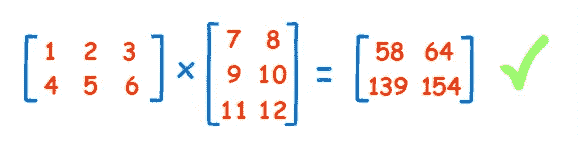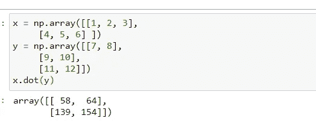

**转置:**转置一个矩阵，交换行和列。我们在右上角放一个“T”表示转置:

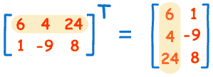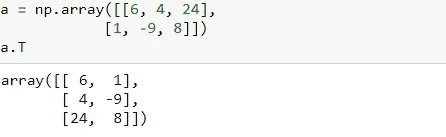

**直线方程:**直线方程用来写成:

```
***y = mx + c (in 2d)
ax + by + c = 0(General Equation)***
```

其中 **y** =多远(**截距**)

有多远

**m** =坡度或坡度(直线有多陡)

c =当 **x=0** 时 **y** 的值

**如何找到 m 和 c？**

c =直线与 Y 轴相交的位置。

m =的变化/X 的变化

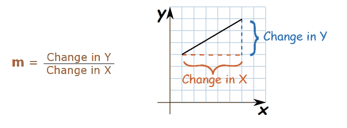

在机器学习中，我们习惯于写出直线的一般方程

```
***w1x1 + w2x2 + w0 = 0 (2d equation)
w1x1 + w2x2 + w3x3+ w0 = 0 (3d equation of straight line)
w1x1 + w2x2 + w3x3+ ........+ wn + w0 = 0 (nd equation of straight line)***
```

[笔记本链接](https://github.com/namratesh/Machine-Learning/blob/master/20_dec_Linear%20Algebra.ipynb)

感谢阅读。

欢迎建议！！！

参考资料:

*   [https://www.mathsisfun.com/](https://www.mathsisfun.com/)
*   [https://hadrienj . github . io/posts/Deep-Learning-Book-Series-2.1-scalar-Vectors-matrix-and-Tensors/](https://hadrienj.github.io/posts/Deep-Learning-Book-Series-2.1-Scalars-Vectors-Matrices-and-Tensors/)