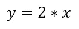
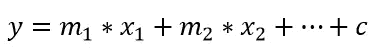
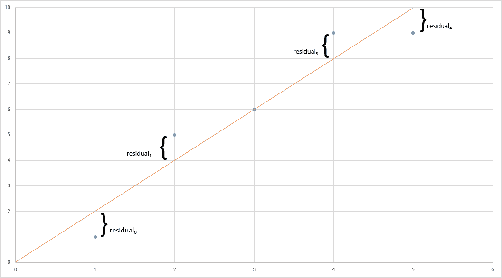
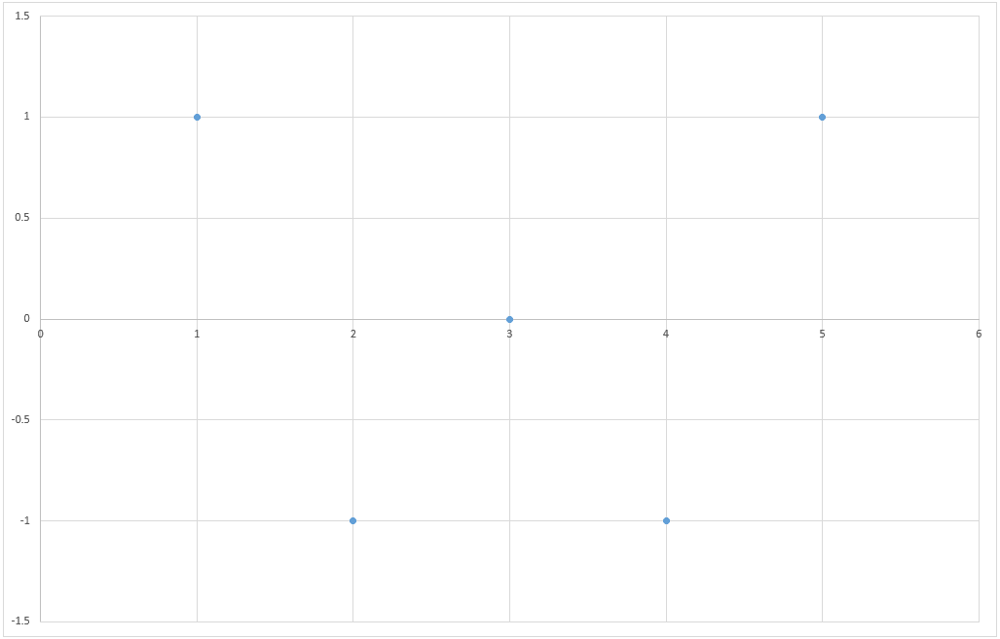
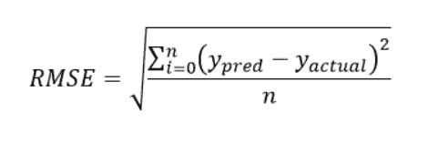
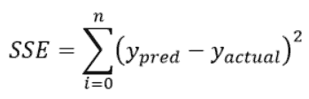
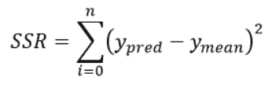
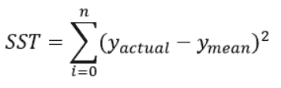
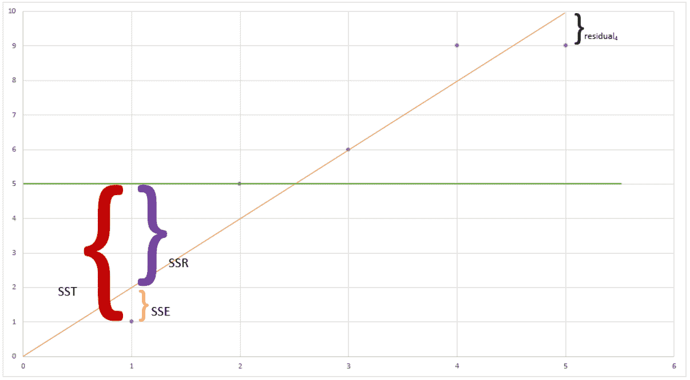
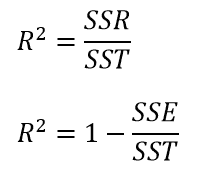

# 线性模型 1:线性回归

> 原文：<https://medium.datadriveninvestor.com/linear-models-1-linear-regression-bb9614ec0eef?source=collection_archive---------7----------------------->

人们可能很容易错误地认为线性回归是微不足道的。事实上，我自己也曾不尊重地对待线性回归，更喜欢花时间在更复杂的线性模型上，如逻辑回归或神经网络。但是我很快意识到，对线性回归的良好了解为其他线性模型的建立打下了坚实的基础。因此，每当我教线性模型时，我总是先从线性回归开始，并用它来解释线性模型的各种概念。没有延迟，让我们直接进入线性回归。

在涵盖了我们关于机器学习的不同分类的系列([第 1 部分](https://medium.com/datadriveninvestor/contemporary-classification-of-machine-learning-techniques-part-1-16e77eaa993e)、[第 2 部分](https://medium.com/datadriveninvestor/contemporary-classification-of-machine-learning-techniques-part-2-4a9b0dc8039c)和[第 3 部分](https://medium.com/datadriveninvestor/contemporary-classification-of-machine-learning-techniques-part-3-f7e3b9de0570))之后，我们现在放大到一类被称为线性模型的监督学习模型。线性模型包括线性回归、逻辑回归和神经网络等模型。我们今天讨论的重点是线性回归。

 [## 金融中的机器学习|数据驱动的投资者

### 在我们讲述一些机器学习金融应用之前，我们先来了解一下什么是机器学习。机器…

www.datadriveninvestor.com](https://www.datadriveninvestor.com/2019/02/08/machine-learning-in-finance/) 

# 线性回归:定义

维基百科对线性回归给出了如下定义:

在统计学中，线性回归是一种对因变量和一个或多个自变量之间的关系进行建模的线性方法。一个独立变量的情况称为简单线性回归。对于一个以上的独立变量，这个过程称为多元线性回归。

该定义包括以下几点:

*   因变量和自变量
*   线性的
*   回归
*   简单与多重

我们将逐点分解这个定义。

## 因变量和自变量

假设我们要对下面的目标变量建模:我上班要花多长时间？可能影响我上班时间的因素的一个例子可能是(例如)交通状况。

因为目标变量，即我去上班所花的时间取决于交通状况，所以目标变量通常被称为因变量。相反，主要的交通状况不受我上班时间的影响，并且独立于目标变量而发生。因此，这些变量被称为独立变量。

在统计学中，通常将这些自变量称为 x 变量，将因变量称为 y 变量。

把这个例子放回到线性回归的环境中，我们是说交通状况(自变量)会影响我去上班的时间(因变量)。

## 线性的

这里的“线性”一词是指自变量以成比例的方式影响因变量。当这个比例可以用一个固定的数字来描述时，这个关系被描述为线性的。具体来说，如果我们可以描述我上班所花的时间是路上汽车数量的两倍，这种(线性)关系可以建模为:

其中 *y* 是因变量(我上班所花的时间) *x* 是自变量(路上的汽车数量)。数字 *2* 是连接自变量和因变量的线性比例。在高中数学中，数字 2 通常被称为梯度。在机器学习中，我们经常称之为系数。

这种线性关系可以归纳为以下形式:

其中线性关系有一个偏移量 *c* ，俗称 y 截距。

## 回归

在我之前的一篇[帖子](https://medium.com/datadriveninvestor/contemporary-classification-of-machine-learning-techniques-part-1-16e77eaa993e)中，我们讨论了监督机器学习中的任务可以分为两种类型:分类或回归。当我们试图预测观察的类别时，这个任务被称为分类任务。当我们试图从一个观察值中预测一个数字时，这个任务被称为回归。

因此，对于线性回归，目标是在给定某个自变量的情况下，创建一条线性线来预测因变量的数值。在我们运行的例子中，它是根据路上的汽车数量来预测我到达工作地点所需的时间。

## 简单回归与多元回归

当我们只有一个独立变量时，我们称之为简单线性回归。对于多个独立变量，它被称为多元回归。本文的重点只是简单的线性回归(一个独立变量)。

多元线性回归的公式概括为以下形式:

# 线性回归:构造

从高中数学开始，我们就被告知，从一系列数据点中，我们应该画一条穿过这些点的线，称为最佳拟合线。然而，如何从数学上确定一条线的好坏呢？或者，我们应该如何从可能的选项中选择最适合的最佳路线？为了确定最佳线路/最佳模型，我们使用一个称为“误差平方和”的概念，也称为 SSE。然而，在我们介绍平方和之前，我们首先介绍称为“残差”的概念。

## 残差

残差只是预测模型回归线的观测值之间的差异。从数学上来说，如果将残差考虑在内，线性回归的公式如下所示:

其中模型试图从自变量中预测因变量，并且来自模型的误差由误差 *e* 捕获。这个误差 *e* 被称为残差。从图形上看，残差将如下所示:

*Figure 1: Plot showing the residuals*

假设我们正在构建一个模型，在这个模型中，我们试图根据路上的汽车数量来预测我上班所花的时间。在上图中，x 轴表示路上的汽车数量，y 轴表示我上班所需的时间。我们有五个观察值(蓝色的点)和橙色的线性回归线。残差是预测时间与实际时间之间的差值，即黑色大括号。

## 误差平方和(SSE)

因此，平方和被定义为残差平方和。在上面的例子中，平方和是(residual₀)、(residual₂)、(residual₃)和(residual₄)的和。因此，当建立模型时，选择线性回归模型的系数，使得误差平方和最小。

# 线性回归:模型分析

## 残差分析

我们通过绘制残差图来进行残差分析。残差图是残差的图。

*Figure 2: Residual Plot*

蓝点是残差。残差分析帮助我们实现了两件事。

*   我们制作的模型与数据的吻合程度。

这是由低残差决定的。残差越小，模型对数据的拟合越好

*   我们使用的模型适合这些数据。

这是由残差图的形状决定的。线性回归的一个大假设是残差必须服从正态分布。因此，如果残差不是正态分布，或者遵循某种模式，这将意味着线性回归模型不适合该数据。

## 均方根误差(RMSE)

下一个指标是均方根误差(RMSE)。根表示平方误差是回归线与实际数据接近程度的度量。它通过以下公式计算:

如果你注意到，这个公式类似于标准差的公式。很多人都说 RMSE 是标准差。因此，标准差计算的是单个变量在其均值周围的分布，而 RMSE 计算的是预测值和真实值之间的距离。

## R₂

我们将在本文中讨论的最后一个指标是 R₂.在我们看 R₂之前，让我们看一下另外三个指标得分，上证综指、SSR 和 SST。

SSE 代表误差平方和，这是我们之前讨论过的一个指标。它是回归线 y_pred 与实际值 y_actual 之间的距离。SSE 的公式如下:

SSR 代表回归平方和。它测量回归线 y_pred 离 y_mean 有多远。SSR 的公式如下:

SST 代表总平方和。它衡量 y_actual 值与 y_mean 值的差距。

从图形上看，SSE、SSR 和 SST 的关系如下。橙色线代表回归线，绿色线代表数据的平均值，蓝色点代表实际数据。红色部分代表 SST，紫色部分代表 SSR，黄色部分代表 SSE。

*Figure 3: Metrics comparison between SST, SSR and SSE*

从图表中，您还可以看到指标之间的关系是 SST = SSR + SSE。事实上，R₂公式是

如果模型能够很好地预测数据，上证综指将接近于零，因此 R₂将接近于 1。相反，如果模型的表现和平均值一样好，上证综指将接近 SST，使 R₂接近于零。

这就总结了我们对线性回归的简短讨论！希望这篇文章澄清/强化了机器学习中一些我们过去可能忽略的概念。如果您有任何意见、反馈或问题，请随时在下面的评论中留下，我很乐意回答。

相关的系列视频短片可以在 youtube [这里](https://www.youtube.com/playlist?list=PLsXcLJfwDnPqf8H5ttvXI8lKSMHJKWLfz)找到。

*作者是新加坡理工学院的助理教授。他拥有帝国理工学院的计算机科学博士学位。他还在新加坡麻省理工学院联盟(SMA)项目下获得了新加坡国立大学计算机科学硕士学位。*

*本文观点仅代表作者个人，并不代表作者所属组织的官方政策或立场。作者也没有从属关系，也没有从本文提到的任何产品、课程或书籍中赚取任何费用。*