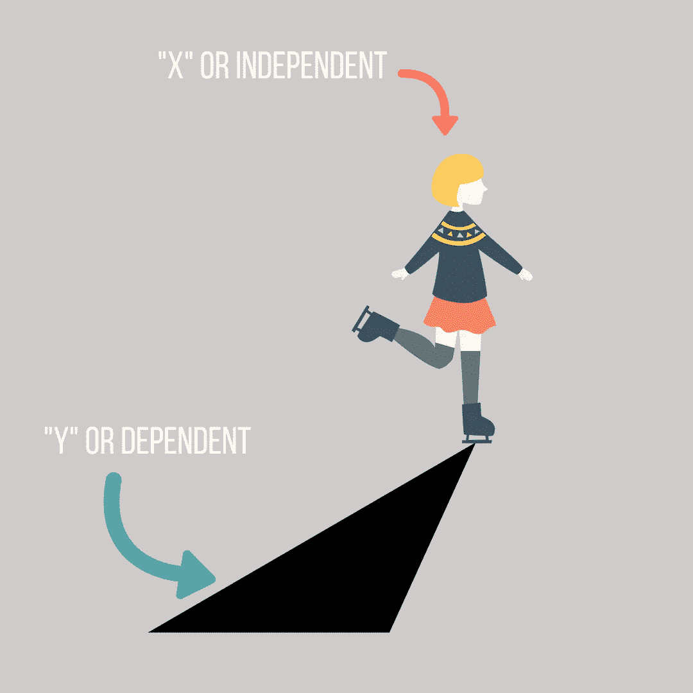
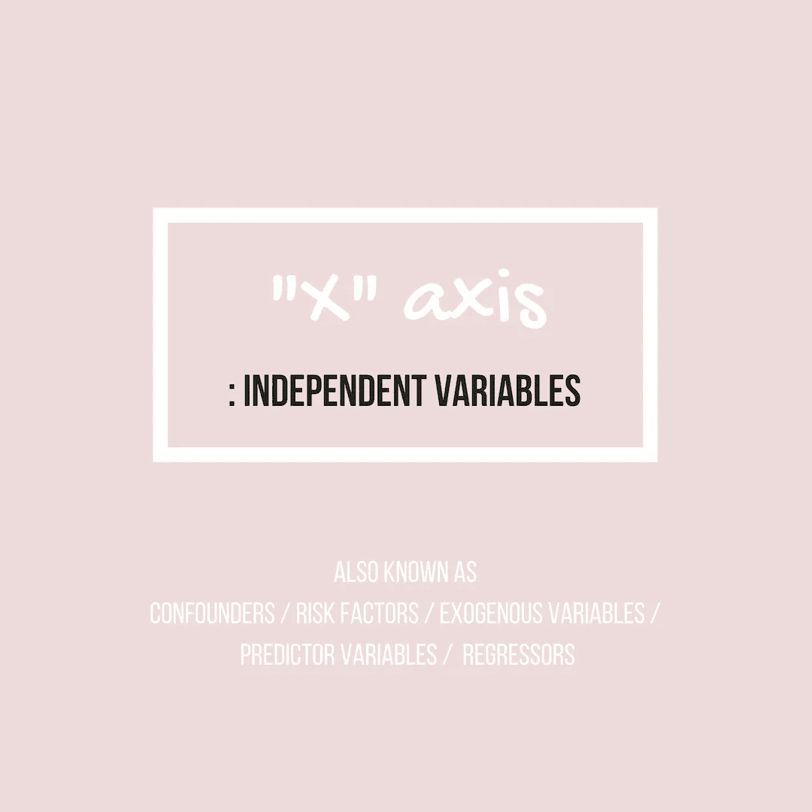
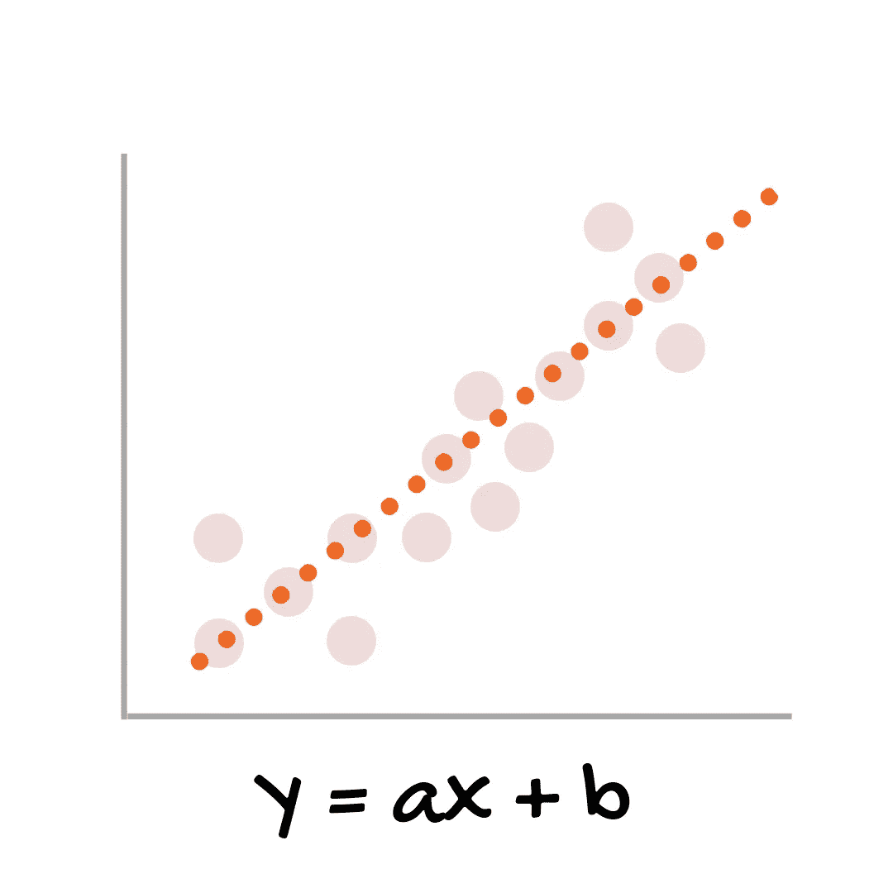
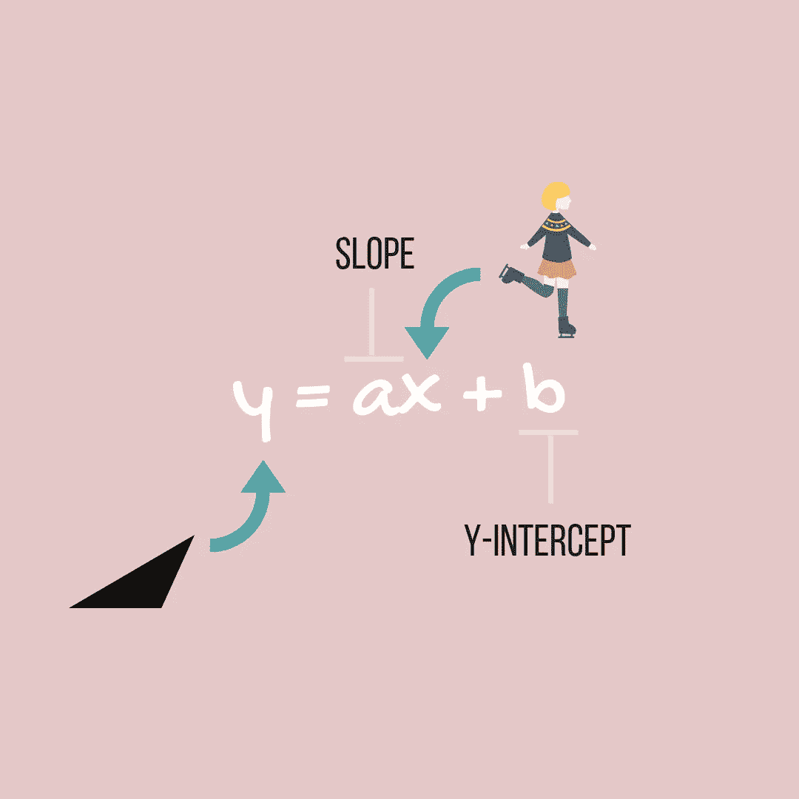
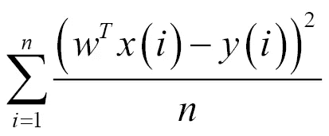
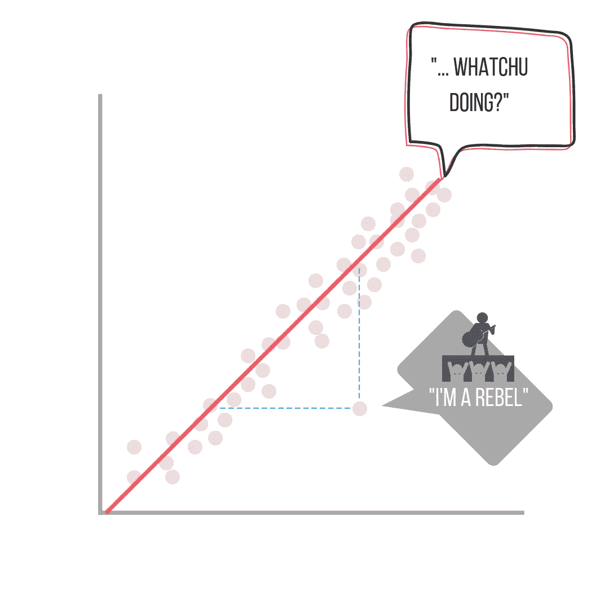

# 线性回归

> 原文：<https://medium.datadriveninvestor.com/linear-regression-251332a61c05?source=collection_archive---------20----------------------->

> 线性回归:一种统计方法，用于模拟因变量**与给定的一组**自变量**([库马尔](https://www.geeksforgeeks.org/linear-regression-python-implementation/))之间的关系。**

想象自己在滑冰。你一直在移动，当你回头看时，你会看到自己的影子。你的影子可能不会完全像你一样移动，但如果说你没有影子，或者说它不受你所做的事情的直接影响，那就太疯狂了，对吗？

线性回归的一个更简单的定义就是——变量受另一个变量的影响。它使用“独立的”(溜冰者)数据来预测“依赖的”(影子)将如何受到影响。可能没有这个例子那么直接，但总是要找到数据之间正确的“关系”(线)。

一个非常典型的简单线性回归模型如下所示:

> 回归分析的三个主要用途是(1)确定预测因子的强度，(2)预测效果，以及(3)趋势预测([统计解决方案](http://www.statisticssolutions.com/what-is-linear-regression/))。

线性回归的目的是**找到直线**，帮助我们以尽可能小的误差进行预测。

解决这类问题的标准方法是定义一个误差函数(也称为成本函数)，用来衡量给定线路的“好”程度。这就是*梯度下降*出现的地方。

> 梯度下降:根据训练数据，通过计算损失相对于模型参数的梯度来最小化 [**损失**](https://developers.google.com/machine-learning/glossary/#loss) 的技术。非正式地，梯度下降迭代调整参数，逐渐找到 [**权重**](https://developers.google.com/machine-learning/glossary/#weight) 和偏差的最佳组合，使损失最小化( [Google 机器学习词汇表](https://developers.google.com/machine-learning/glossary/#gradient_descent))。

误差函数(成本函数)可以用不同的方法计算，但最常用的方法叫做**均方误差**。

MSE: the average of the square of the errors

公式看起来很吓人，我知道，但这一切意味着它是所有(预测值-观察值)平方的总和。MSE 越大，误差越大。

> **方差**是测量观察值与预测值的平均值相差多远，即它们与**预测值平均值** ( [罗](https://www.bmc.com/blogs/mean-squared-error-r2-and-variance-in-regression-analysis/) ) **的差异。**

对于线性回归，MSE 为 0 几乎是不可能的(0 表示预测值与观察值“完全相同”)，但目标是尽可能接近 0。

Scikit-learn 用于使用 Python 绘制线性回归，我很乐意在我的下一篇文章中介绍如何使用它。

**资源:**

1.  Matt Nedrich 的“梯度下降和线性回归简介”
2.  ScikitLearn 的“[线性回归示例](http://scikit-learn.org/stable/auto_examples/linear_model/plot_ols.html#sphx-glr-auto-examples-linear-model-plot-ols-py)
3.  [使用梯度下降算法的线性回归:机器学习的第一步](https://medium.com/meta-design-ideas/linear-regression-by-using-gradient-descent-algorithm-your-first-step-towards-machine-learning-a9b9c0ec41b1)作者 [Souman Ro](https://medium.com/@soumanroy.gsa?source=post_header_lockup) y