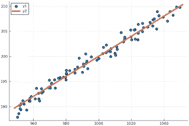
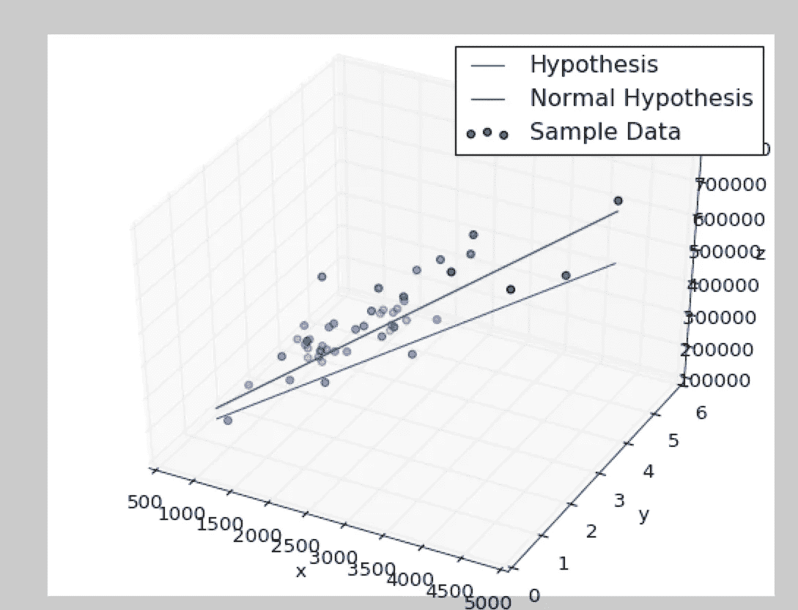
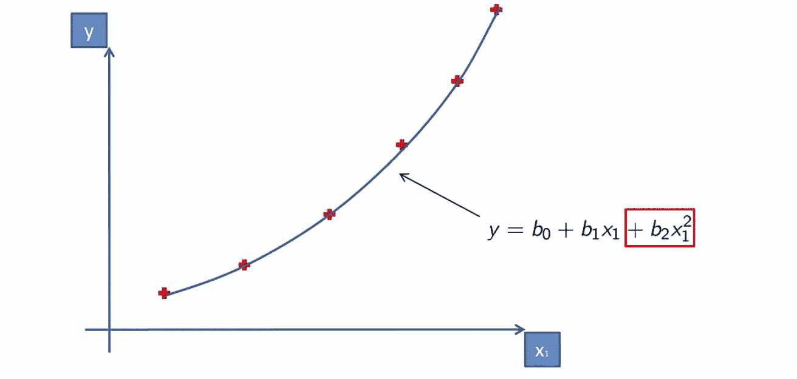
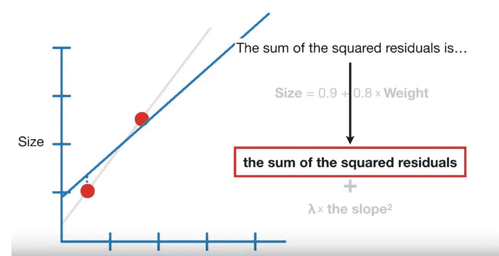
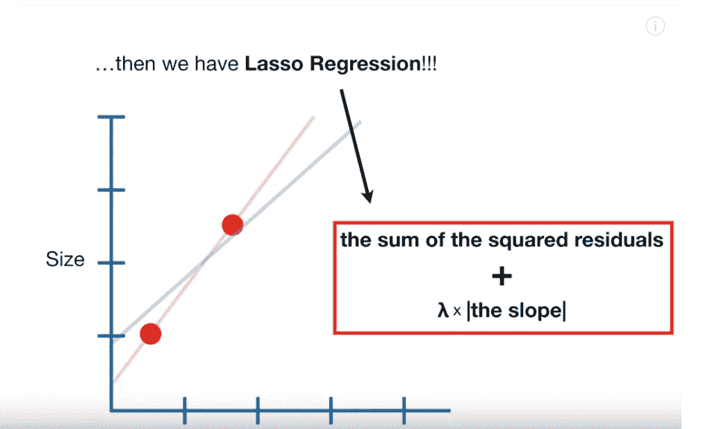

# 线性回归

> 原文：<https://medium.datadriveninvestor.com/linear-regression-66397a9cac92?source=collection_archive---------38----------------------->

[http://imgs.xkcd.com/comics/linear_regression.png](http://imgs.xkcd.com/comics/linear_regression.png)

它是一种表现变量之间的关系以及它们在一起产生输出时如何相关的技术。因变量和一个或多个自变量之间形成关系。

举个例子:考虑你不得不买房子。现在，房子的成本作为因变量，取决于与房子相关的各种因素，如面积、位置、设施等。成本以外的变量作为独立变量。通过对这些自变量进行加权，我们可以计算出因变量。

y(成本)= A(w1) + B(w2) + C(w3) + D

这里 A、B 和 C 表示面积系数、位置系数和舒适系数。w1、w2 和 w3 是与每个独立属性相关联的权重。d 表示偏差，这是一个常数项，表示由上述直线构成的截距。

## 回归的类型

1.  简单线性回归

[https://1.bp.blogspot.com/--CWLuWqWZpA/WmITOrGTL6I/AAAAAAAAFto/7iaIaC-rmb08VWwOBCtW_Y3mKZyFpMfugCLcBGAs/s320/simple_linear_regression.png](https://1.bp.blogspot.com/--CWLuWqWZpA/WmITOrGTL6I/AAAAAAAAFto/7iaIaC-rmb08VWwOBCtW_Y3mKZyFpMfugCLcBGAs/s320/simple_linear_regression.png)

这里存在一个独立变量，等式采用以下形式:

Y=A X + B

其中 X 是自变量，Y 是因变量，B 是偏差，A 是与 X 相关的权重。

2)多元回归

[https://i.stack.imgur.com/eztrA.png](https://i.stack.imgur.com/eztrA.png)

在这种情况下，可能存在一个以上的独立变量，并且该方程可以采用以下形式:

Y=b0 + b1 X1 + b3 X2 + b4 X3 + …

其中 Y 表示独立变量，b1、b2、b3 等表示独立变量，b0 表示偏差。

3)多项式回归

[https://cdn-images-1.medium.com/max/1312/1*iuUjOUrTypcB8z3XqqQgtQ.png](https://cdn-images-1.medium.com/max/1312/1*iuUjOUrTypcB8z3XqqQgtQ.png)

在这里，除了线性变量，变量的次数可以是多项式。这导致曲线的形成。这种方法可能导致高方差或过度拟合(模型仅在训练数据上工作良好)。

Y = b0 + b1 X1 + b2 X1

这里 Y 是因变量，X1 是因变量，b0 是偏差。

4)岭回归

如果我们只有很少的训练数据点，并使用线性或多项式回归，我们的模型可能会过度拟合或具有较高的方差。较少数据点的存在会使数据共线。

在存在高度共线数据的情况下，线性和多项式回归模型失败。共线性是指独立变量之间的关系高度线性。为了避免这个问题，岭回归模型增加了一个平方偏差因子，将可变系数从刚性中分离出来，从而大大减少了模型中的方差。

添加的偏差因子计算为 **λ x slope，其中λ称为正则化参数。**

Here the blue line is calculated by ridge regression and red one with linear regression model

在上面的场景中，很明显，由岭回归形成的蓝线更好地概括了数据，并且没有过度拟合。

5)套索回归

这类似于岭回归。在这里，我们添加了一个绝对偏差项，与岭回归中使用的平方项不同。

Here the blue line represents the line formed by using Lasso Regression model

在上面的例子中，很明显，Lasso 回归形成的蓝线很好地概括了数据，避免了过度拟合。

岭回归和套索回归之间的主要区别在于，岭回归可以将斜率渐近减小到 0，而套索回归可以将斜率精确减小到 0。

例如，考虑一个场景，在这个场景中，尺寸是借助于身高、体重和太阳星座等因素来计算的。当然，求和符号在这里没有用。现在，在这种情况下，如果我们使用岭回归并增加 **λ** 的值，所有属性的系数都会降低，但太阳符号的系数不能降低到 0，在套索回归的情况下，它可以降低到 0。所以套索回归可以减少回归的无用变量。

6)弹性净回归

这是脊和套索回归的混合。它有助于处理参数之间存在相关性的情况。它涉及岭和套索回归的 L1 和 L2 正则化参数。

[https://image.slidesharecdn.com/biggio16-spr-161202221619/95/on-security-and-sparsity-of-linear-classifiers-for-adversarial-settings-17-638.jpg?cb=1480717053](https://image.slidesharecdn.com/biggio16-spr-161202221619/95/on-security-and-sparsity-of-linear-classifiers-for-adversarial-settings-17-638.jpg?cb=1480717053)