# 线性回归

> 原文：<https://medium.datadriveninvestor.com/linear-regression-794f841adbcf?source=collection_archive---------4----------------------->

这篇文章是关于线性回归和确定拟合优度的不同方法

文章的代码可以在[https://github . com/arshren/machine learning/blob/master/Python % 20-% 20 linear % 20 regression % 20-% 20 predicting % 20 temperature . ipynb](https://github.com/arshren/MachineLearning/blob/master/Python%20-%20Linear%20Regression%20-%20Predicting%20Temperature.ipynb)找到

假设您关注气候变化，并希望研究天气状况以了解哪些参数会对温度产生影响。

我们可以用湿度、气压、风速来预测当天的温度。

这里我们将使用线性回归。

线性回归是一种最简单但非常有效的方法，可以模拟标量相关变量和一个或多个自变量之间的线性关系。

线性回归方程为

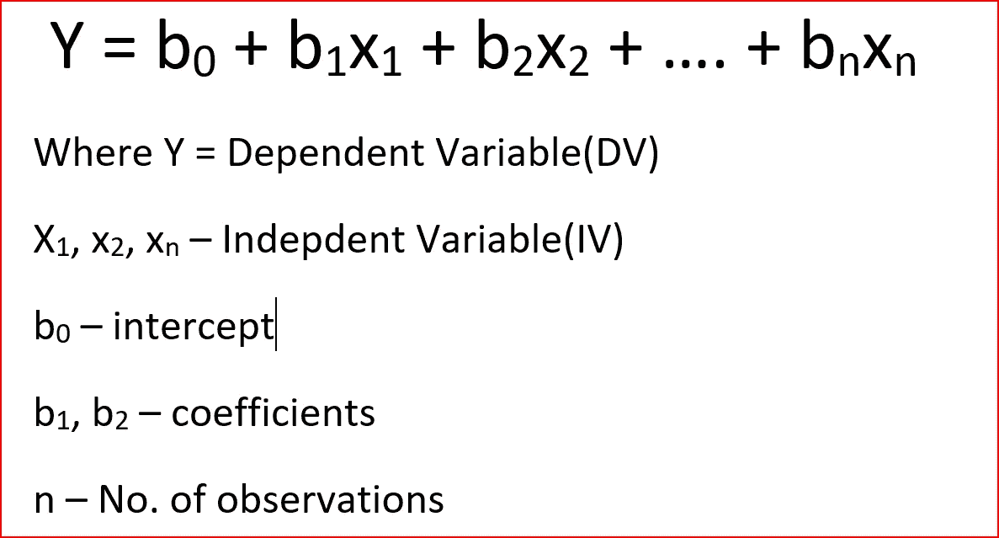

对于我们的例子，我们将使用 https://www.kaggle.com/budincsevity/szeged-weather 卡格尔[的天气数据集](https://www.kaggle.com/budincsevity/szeged-weather)

首先，我们将导入所需的

```
import pandas as pd
import numpy as np
import seaborn as sns
import matplotlib.pyplot as plt
```

让我们读取数据，我已经将我的数据下载到一个文件夹中-D:\ Machine Learning-Full \ Blogs dataset，并将该文件重命名为 WeatherHist.csv

```
weather_data = pd.read_csv("D:\Machine Learning - Full\Blogs dataset\weatherHist.csv")
```

现在，我们想知道不同的列是什么

```
weather_data.head(3)
```

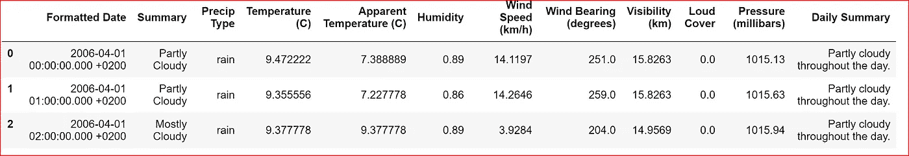

weather data — 3 rows from top with all the columns in the dataset

让我们探索数据集中的分类变量

```
weather_data.describe(include=['O'])
```

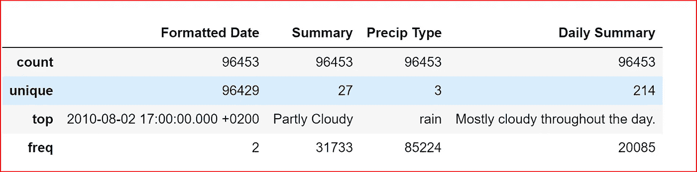

categorical data in weather data

我们想要预测温度，所以让我们找出数据集中不同变量之间的相关性

```
weather_data.corr()
```

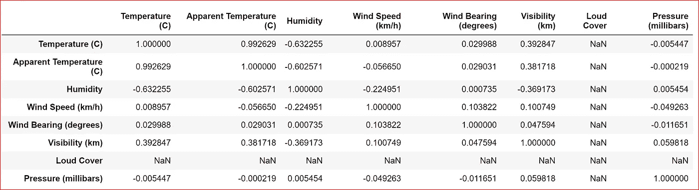

correlation between different variables in the dataset

相关性在+1 到-1 之间变化，+1 表示强正相关，相关系数为-1 表示完全负相关，相关系数为 0 表示变量之间没有关系

从上表中，我们可以看到温度和表观温度、湿度之间的密切关系，也许我们还可以包括能见度。

让我们将所有相关属性放入一个新的数据集中，并再次检查相关性

```
data_set=weather_data.iloc[:,[0,3,4,5,8]]
data_set.corr()
```

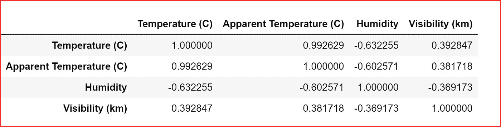

correlation of selected attributes

现在让我们将温度和其他因变量之间的数据可视化

绘制温度和湿度之间的散点图

```
sns.regplot(x=data_set["Temperature (C)"], y=data_set["Humidity"])
```

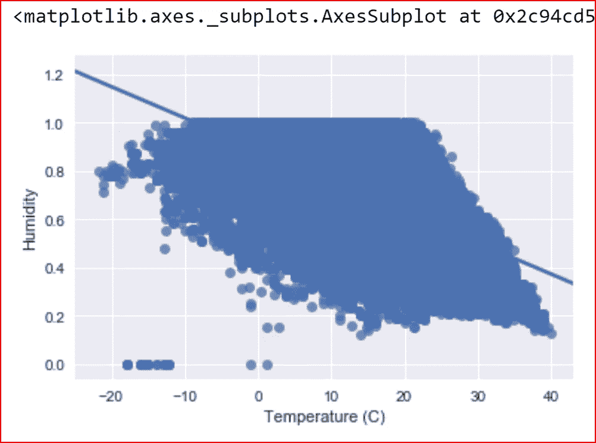

scatter plot between Temperature and Humidity

湿度和温度之间有一种负相关，我们也看到一些异常值。

让我们试着找出异常值，以便我们可以删除它们。

我们已经在推断统计学中了解到，异常值对线性回归有很大的影响

下面我们写了一个函数，帮助识别数据集中湿度变量的异常值。

它查找异常值的方法是基于标准差大于 3 的 Z 分数

```
import numpy as np
import pandas as pd
outliers=[]
def detect_outlier(data_1):

    threshold=3
    mean_1 = np.mean(data_1)
    std_1 =np.std(data_1)

    for y in data_1:
        z_score= (y - mean_1)/std_1 
        if np.abs(z_score) > threshold:
            outliers.append(y)
    return outliersoutlier_data = detect_outlier(data_set["Humidity"])
print (outlier_data)
```

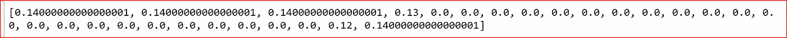

outlier values in Humidity dependent variable with more than 3 standard deviation

我们将从数据集中删除这些行，以获得一个干净的数据集用于回归。

因此，我们在值> 0.15 的数据集中搜索所有湿度值，并创建一个新的数据集 data_set_clean

```
data_set_clean = data_set[data_set["Humidity"]>0.15]
```

让我们再次绘制温度和湿度之间的数据，以检查我们是否有更多的异常值

```
sns.regplot(x=data_set_clean["Temperature (C)"], y=data_set_clean["Humidity"])
```

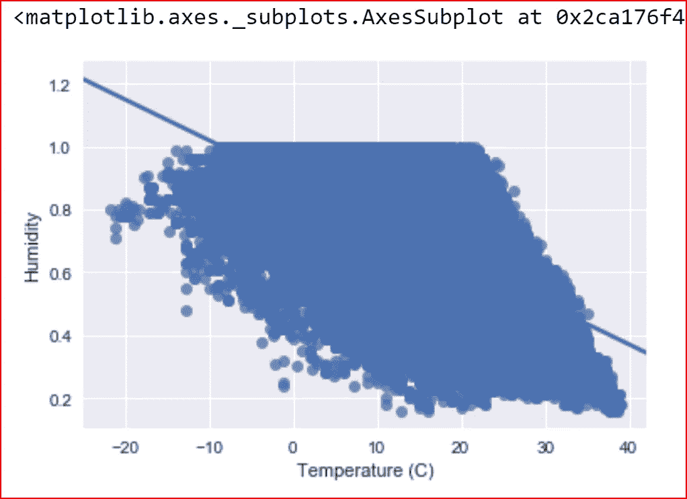

Scatter plot between temperature and humidity after removing outliers

现在让我们画一个温度和表观温度的散点图

```
sns.regplot(x=data_set["Temperature (C)"], y=data_set["Apparent Temperature (C)"])
```

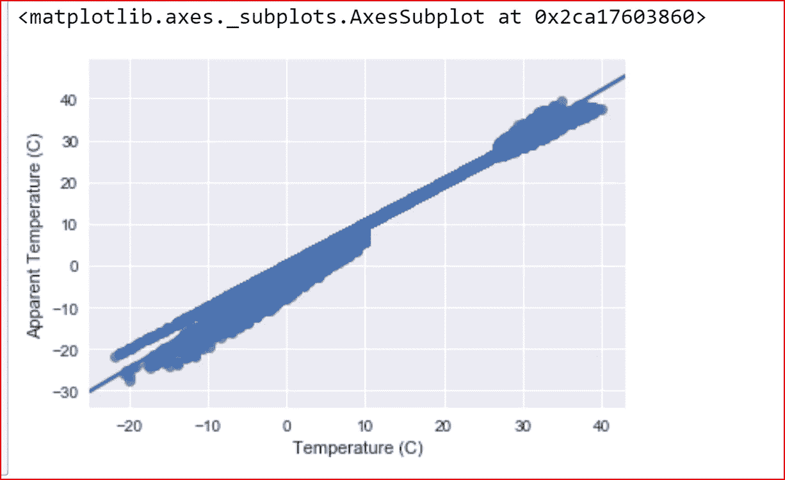

scatter plot between Temperature and Apparent Temperature

看起来温度和表观温度之间有很强的正相关，这也很明显。

我们现在画一个温度和能见度的散点图。

```
sns.regplot(x=data_set["Temperature (C)"], y=data_set["Visibility (km)"])
```

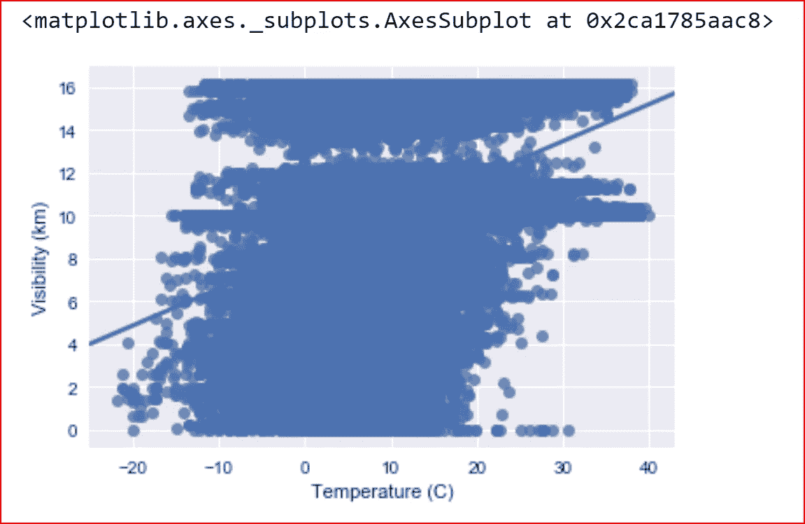

我们没有发现温度和能见度之间有很大的关系，所以我们可以降低能见度。

这里 X 是湿度和表观温度的独立变量。

y 是我们随温度变化的因变量，我们试图先学习，然后计划预测

```
y= data_set_clean.iloc[:,[1]]
X= data_set_clean.iloc[:,[2,3]]
```

打印一行 X 来查看我们的自变量

```
X.head(1)
```

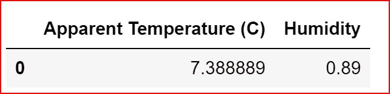

以 80:20 的比例将数据集拆分为训练集和测试集

```
from sklearn.cross_validation import train_test_split
X_train, X_test, y_train, y_test = train_test_split(X, y, test_size = 0.2, random_state = 0)
```

我们现在使用 sklearn library for linear_models 来拟合我们的训练数据以进行多元线性回归。

我们从 **sklearn.linear** _model 中导入库 **LinearRegression** 。创建一个回归对象，然后尝试拟合定型数据

```
from sklearn.linear_model import LinearRegression
regressor =LinearRegression()
regressor.fit(X_train, y_train)
```

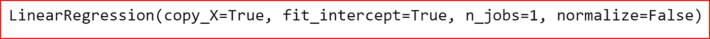

Fitting training data

让我们打印出回归变量的不同值，并理解它们的含义

```
regressor.coef_
```

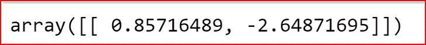

Coefficients of our independent variables

还记得线性回归方程吗

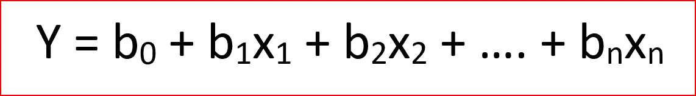

Linear Regression equation

*   0.857 是 b1，其中 x1 是表观温度
*   -2.648 是 b2，其中 x2 是湿度

让我们找到截距 b0

```
regressor.intercept_
```

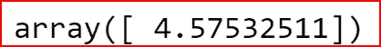

Intercept for the Linear Regression

现在让我们写下基于训练数据集预测温度的线性回归方程

**温度= 4.58 +(表观温度* 0.857) + (-2.648 *湿度)**

我们现在可以预测测试数据集的温度

```
y_pred = regressor.predict(X_test)
```

*我们如何知道衡量我们模型的适合度？*

**良好的拟合模型是指实际值或观察值与基于模型的预测值之间的差异较小且无偏差的模型。**

因此，如果一些统计数据告诉我们，实际值和预测值之间的差异很小，那么我们就知道我们建立的模型是好的。

很少有统计工具能像**决定系数一样帮助我们**

*什么是 r 平方？*

它也被称为决定系数。

**r 为我们提供了一个衡量模型或回归线复制实际结果的标准**。这是基于模型解释的预测的总变化。

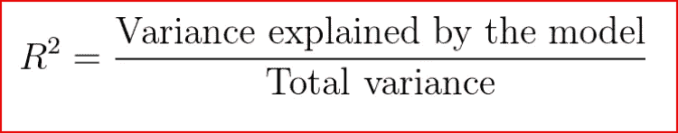

r-square

r 总是介于 0 和 1 之间或介于 0%和 100%之间。

值为 1 表示模型解释了预测变量围绕其平均值的所有变化。

***误差平方和(SSE)或残差，我们预测的值与实际值相比有多远***

## **SSE =实际值-预测值**

***总和平方(SST)，实际值与平均值相比有多远***

## SST =实际值-平均值

***回归平方和(SSR)，实际值与平均值相比有多远*** S

## SSR =预测值-平均值

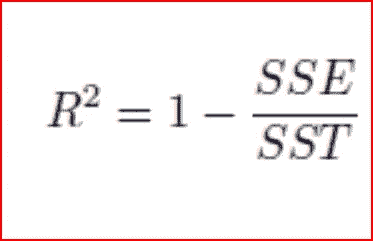

r-square

如果预测误差低，则 SSE 将低，r 平方将接近 1。

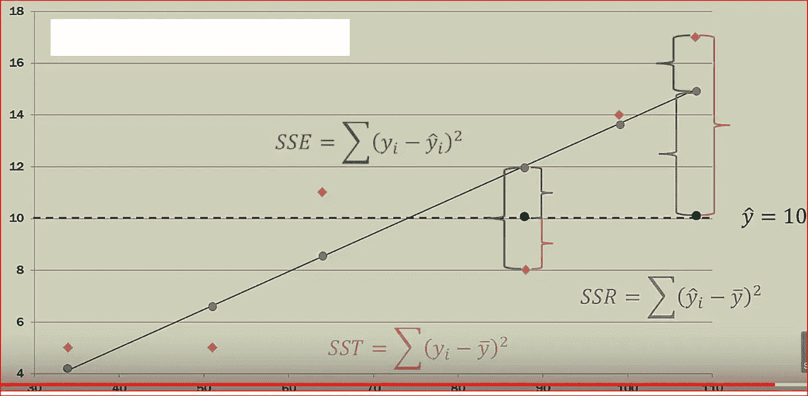

这里需要注意的是，当我们增加更多的自变量时，r 会得到更高的值。r 值随着更多独立变量的加入而不断增加，即使它们可能对预测没有真正的显著影响。这无助于我们建立一个好的模型。

为了克服这个问题，我们使用**调整 R** 。每增加一个无关紧要的自变量，调整后的 r 就惩罚模型。

```
regressor.score(X,y)
```

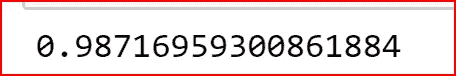

r-square for the dataset

r 的值接近 1 意味着非常适合。

我们还可以计算出**均方根误差**也称为 **RMSE** 。

## **均方根误差**

显示预测值和实际值之间的差异。由于预测值和实际值之间的差值可以是正的，也可以是负的，为了抵消这个差值，我们取预测值和实际值之间差值的平方。

第一步:找出每个观察值的预测值和实际值之间的差异，将它们平方并相加

所有观察值的总和(预测值-实际值)

第二步:将总和除以观察次数

所有观察值之和(预测值-实际值)/观察次数

第三步:对第二步得到的值求平方根

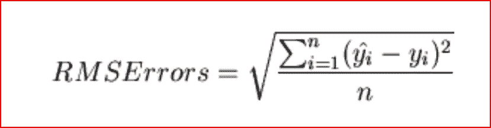

Root Mean Square Error — RMSE

```
from sklearn import metrics
import math
print(math.sqrt(metrics.mean_squared_error(y_test, y_pred)))
```

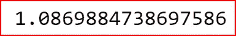

RMSE — root mean square error

我们可以使用的另一个库是 **statsmodel**

```
import statsmodels.api as sm 
```

在我们的线性回归方程中，截距的 x0 总是 1。我们必须显式地创建变量 x0。

```
ones_1 =[1] * X.count()
X["b0"]=ones_1
```

我们现在使用 OLS-普通最小二乘法来寻找最佳拟合回归线

```
model = sm.OLS(y_pred,X_test).fit()
```

然后，我们打印不同统计数据的摘要，帮助我们评估我们的模型

```
model.summary()
```

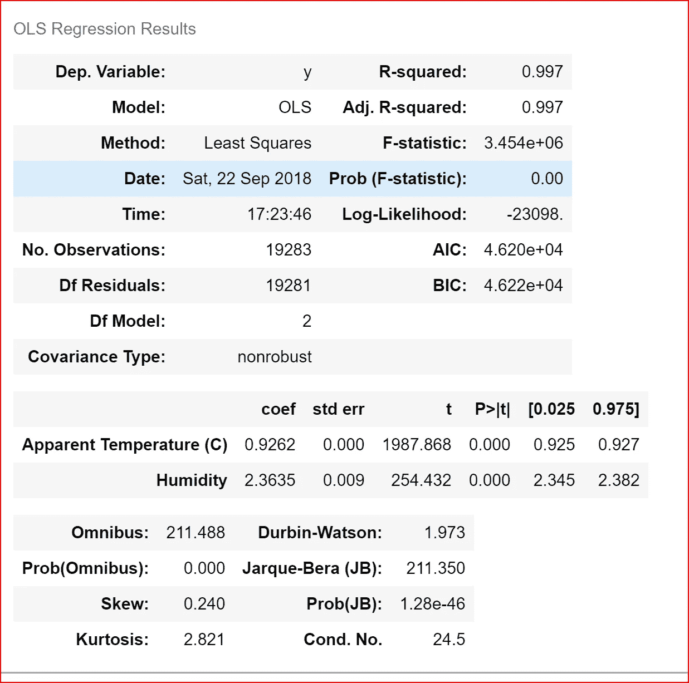

Statistics Summary for OLS

这里我们从之前的值. 987 得到了一个稍好的 r 平方值. 997

希望这篇文章能帮助你很好地理解线性回归。