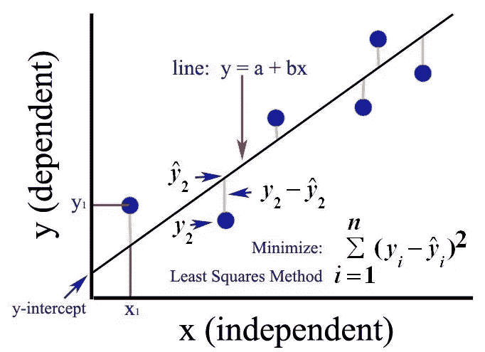
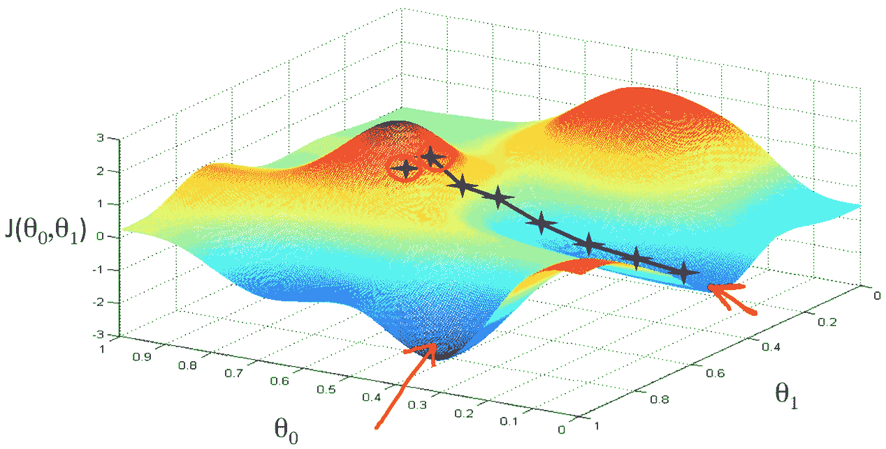

# 线性回归及其数学实现

> 原文：<https://medium.datadriveninvestor.com/linear-regression-and-its-mathematical-implementation-29d520a75ede?source=collection_archive---------4----------------------->

## 简介

# **什么是线性回归？**

线性回归是一种预测统计方法，用于模拟因变量与给定的一组自变量之间的**关系**。

这是一种建模因变量和一个或多个自变量之间关系的**线性方法。当我们只有一个独立变量时，我们称之为简单线性回归。对于一个以上的自变量，这个过程叫做**多元线性回归**。**

# **线性回归模型表示法**

线性回归表示由一个线性方程组成，该方程结合了一组特定的**输入值(x)** ，其解就是该组输入值(y)的**预测输出(y)。**

线性方程为每个输入值或列分配一个比例因子，称为**系数**，用大写**希腊字母 Beta (B)** 表示。还增加了一个额外的系数，使线具有额外的自由度(例如，在二维图上上下移动)，通常称为**截距或偏差系数。**

例如，在一个简单的回归问题中(单个 x 和单个 y)，模型的形式将是:

y = B0 + B1*x，其中

*   B0 —代表截距
*   B1 —代表系数
*   x-代表独立变量
*   y-代表输出或因变量

在**更高维度**中，当**有多个输入(x)** 时，该线被称为 **a 平面**或 **a 超平面**。因此，该表示是方程和用于系数的特定值的形式(例如，上述示例中的 B0 和 B1)。

具有 p 个独立变量的多元线性回归的一般方程如下所示:

# **普通最小二乘法**

当我们有一个以上的输入时，我们可以使用普通最小二乘法**来估计系数**的值。

普通的最小二乘法程序寻求**最小化残差平方和**。这意味着给定一条穿过数据的回归线，我们**计算每个数据点到回归线的距离，对其求平方，并将所有平方误差相加**。这是**普通最小二乘法求最小化**的量。

Ordinary Least Squares

# **梯度下降**

当有一个或多个输入时，您可以使用一个过程**，通过迭代最小化模型对您的训练数据**的误差来优化系数值。这个过程被称为**梯度下降**。

它的工作原理是从每个系数的随机值开始。计算每对输入和输出值的误差平方和。一个**学习率**被用作比例因子，并且系数在朝向**的方向上被更新，以最小化误差**。重复该过程**，直到实现最小平方和误差，或者不可能进一步改进**。

# **线性回归的一些应用:**

1.  从汽车试验数据研究发动机性能。
2.  最小二乘回归用于模拟生物系统中参数之间的因果关系。
3.  OLS(普通最小二乘)回归用于气象数据分析。
4.  线性回归用于市场调查研究和客户调查结果分析。
5.  线性回归用于观测天文学。在天文数据分析中使用了许多统计工具和方法，并且有像 Python 这样的语言的完整的库来进行天体物理学中的数据分析..