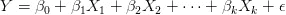
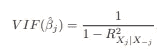
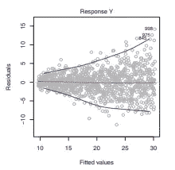

# 线性回归假设

> 原文：<https://medium.datadriveninvestor.com/linear-regression-assumptions-f2252b8e2912?source=collection_archive---------1----------------------->

“grayscale photo of crowd walking on alley” by [Adam Bentley](https://unsplash.com/@bentley6891?utm_source=medium&utm_medium=referral) on [Unsplash](https://unsplash.com?utm_source=medium&utm_medium=referral)

回归是一个简单却非常强大的工具，可以用来解决非常复杂的问题。回归可用于同时分析多个变量的影响。然而，如果假设失败，那么我们不能相信所获得的结果。

回归分析用于估计**人口**的特性，从人口中抽取**随机** **样本**，并使用它来估计人口参数

本文主要讨论线性回归的假设、它们的含义以及检验它们的步骤。

**假设 1:回归模型的参数(系数和误差项)是线性的。**

> **线性:**由预测变量(Xk)的一个单位变化引起的响应变量的变化总是恒定的，与 Xk 的当前值无关

线性回归的定义特征是它的函数形式，为了满足这个假设，模型应该被正确地定义。

**假设 2:自变量之间不应完全相关(无多重共线性)**

当一个变量变化时，另一个变量也以固定的比例变化，这两个变量被称为是相关的。当它们之间的皮尔逊相关系数为+1 或-1 时，它们被认为是完全相关的。

两个变量之间的完美相关性表明它们包含相同的信息，换句话说，两个变量是同一变量的不同形式。完美的相关性是一个障碍，在这种情况下不能应用回归。

然而，在许多情况下，变量并不完全相关，但它们之间有很强的相关性。这种情况称为多重共线性。

> 为什么多重共线性是一个问题？
> 
> 回归系数的解释是，当*保持*所有其他预测变量不变时，它代表预测变量 1 个单位变化的响应变量的平均变化。但是在多重共线性的情况下，由于变量是强相关的，很难保持其他变量不变。因此很难估计变量的参数。

**检查多重共线性:**

多重共线性可以使用*方差膨胀因子(VIF)进行检查。*使用以下公式计算 VIF。

VIF > 5 通常被认为是有问题的，而 VIF > 10 表明共线性的明确存在

**假设 3:残差的平均值应该为零**

> 残差是指实际值和预测值之间的差异

误差项实际上是指自变量未能解释的响应变量中存在的方差。如果误差变量的均值为零，我们的模型被称为无偏的

默认情况下，所有的包和库中都会考虑这个假设，我们不需要太担心。

**假设 4:残差不应与自变量相关**

如上所述，误差项代表响应变量中无法解释的方差。现在，如果残差与独立变量相关，我们可以用独立变量来预测误差，这是根本错误的。误差项和自变量之间的这种相关性被称为*内生性。*

当这种相关性发生时，我们的模型可能会将误差中出现的方差归因于自变量，这反过来会产生不正确的估计。

**假设 5:残差的标准差应该是常数(Homoscedasticity】**

所有观测值的误差方差应该是一致的。这种情况称为同质性。如果方差发生变化，我们称之为异方差。

可以使用拟合与残差图来检查这一假设的有效性。在该图中，如果存在圆锥形状，即残差的分布在一个方向上增加，则存在异方差。

(Image taken from [ISLR](https://www.ime.unicamp.br/~dias/Intoduction%20to%20Statistical%20Learning.pdf))

**假设 6:残差不应该相互关联。**

一个观测值的残差不应预测下一个观测值。这个问题也被称为自相关。在这种情况下，估计的标准误差低估了真实的标准误差

如果可以预测残差，那么该信息实际上应该进入模型，而不是误差项。这个问题可以通过添加额外的(相关的)变量来解决。

还有其他一些假设，虽然不是很重要，但也是值得拥有的。

**假设 7:残差应该是正态分布。**

**假设 8:自变量应该有非负方差。**

**假设 9:观测值的数量应该大于特征的数量。**