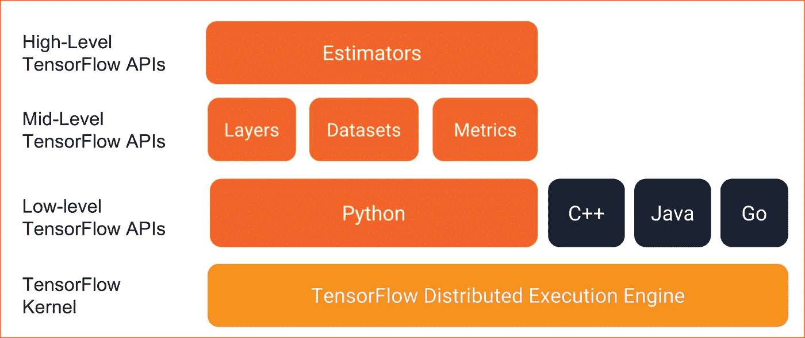
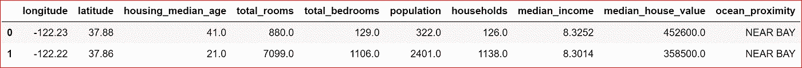
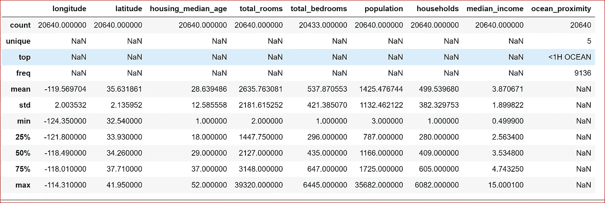
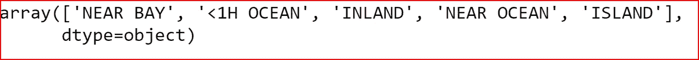
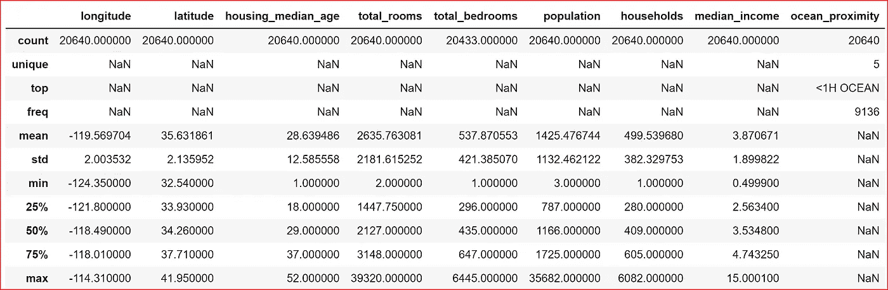
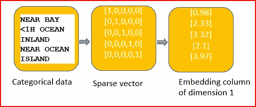
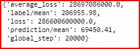
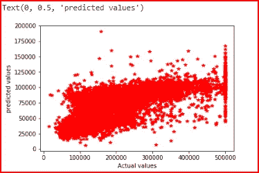
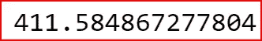

# 使用张量流估计器的 dnn 回归器

> 原文：<https://medium.datadriveninvestor.com/linear-regression-using-tensorflow-estimator-9aa570914375?source=collection_archive---------1----------------------->

[](http://www.track.datadriveninvestor.com/1B9E)

在本帖中，我们将使用 Tensorflow DNNRegressor 探索线性回归。我们将使用估计器来训练、预测和评估模型

## 先决条件:

[线性回归](https://medium.com/datadriveninvestor/linear-regression-794f841adbcf)

[评估车型性能](https://medium.com/datadriveninvestor/how-to-evaluate-the-performance-of-a-machine-learning-model-45063a7a38a7)

[梯度下降](https://medium.com/datadriveninvestor/gradient-descent-5a13f385d403)

[张量流基础知识](https://medium.com/datadriveninvestor/tensorflow-basics-6377a6043d93)

**数据集** : [加州房价](https://www.kaggle.com/camnugent/california-housing-prices/version/1#housing.csv)


*我们先来了解一下估值师*

## 评估者

Estimators 是一个高级 tensorflow API，它通过封装以下函数来简化机器学习

*   训练模型
*   预言；预测；预告
*   评估模型
*   导出模型

评估者是预先制作或定制的



TensorFlow Programming stack- Source -[https://www.tensorflow.org/guide/premade_estimators](https://www.tensorflow.org/guide/premade_estimators)

## 估计量的优点

*   估算器可以在本地运行，可以分布在多个 CPU 或 GPU 上而不改变模型
*   评估员构建图表
*   估算器建立在简化定制的***TF . keras . layers***之上
*   估计器提供了一个安全的分布式训练循环，允许我们控制如何以及何时

1.  构建图表
2.  初始化变量
3.  加载数据
4.  处理异常
5.  创建检查点文件
6.  从失败中恢复
7.  保存 Tensorboard 的摘要

为了实现这一点，建议为模型和数据输入管道创建单独的函数。

*在本帖中，我们将使用预先制作的估算器，我们不会为模型和数据输入管道创建单独的函数，因为我想让事情变得简单。在以后的文章中，我们将为模型和数据输入管道创建单独的函数。*

导入所需的库

```
import numpy as np
import pandas as pd
import matplotlib.pyplot as plt
import tensorflow as tf%matplotlib inline
```

## 读取数据

从 csv 文件中读取数据。我已经从 Dataset:[California Housing prices](https://www.kaggle.com/camnugent/california-housing-prices/version/1#housing.csv)中提取并保存了数据 housing.csv，保存在 D:\ML-data 文件夹中

```
dataset_hous
e = pd.read_csv("d:\\ML-data\\housing.csv") 
```

## 分析数据

打印 dataset_house 中的 2 行。我们可以看到数据集中的所有列

```
dataset_house.head(2)
```



我们想预测房子的中值。

中值房屋价值是我们的目标变量(y ),其余的列将是我们的输入要素(x_data)

```
x_data = dataset_house.drop(['median_house_value'], axis=1)
y = dataset_house['median_house_value']
```

让我们检查是否所有的输入变量都是连续的，或者其中一些是分类的

```
x_data.describe(include='all') 
```



我们可以看到 ocean_proximity 是一个分类变量。total _ bedrooms 也有空值。total_bedroom 的记录计数是 20433，而不是 20640。

我们将找到 ocean_proximity 的所有唯一值

```
x_data.ocean_proximity.unique()
```



Unique values for ocean_proximity

## 数据预处理

作为数据预处理的一部分，我们需要

*   缩放连续输入变量，使它们都处于相同的比例上
*   处理空值。

我们将把所有连续变量放入数据帧 x_subset。为此，我们从输入特征数据帧中删除分类变量。

我们还为列 ocean_proximity 创建了另一个数据帧 x_ocean

```
x_subset= x_data.drop(['ocean_proximity'], axis=1)
x_ocean = x_data['ocean_proximity']
```

使用最小最大缩放器，我们缩放连续输入变量

```
from sklearn.preprocessing import MinMaxScalerscaler = MinMaxScaler()
x_subset = pd.DataFrame(scaler.fit_transform(x_subset), columns=x_subset.columns, index=x_subset.index)
```

缩放连续变量后，我们将两个数据帧连接起来，这样我们就拥有了所有的输入要素

```
x_data=pd.concat([x_subset, x_ocean], axis=1)
x_data.head(2) 
```


现在，我们通过用 total _ believes 的平均值填充空值来处理空值

```
 x_data['total_bedrooms'].fillna(x_data['total_bedrooms'].mean(), inplace = True)
```

我们现在检查是否所有输入要素都具有非空值

```
x_data.describe(include='all')
```



## 创建训练和测试数据

将数据集分为训练集和测试集。测试集将有 30%的数据，而训练集将使用数据集中 70%的数据

```
from sklearn.model_selection import train_test_splitx_train, x_test, y_train, y_test = train_test_split(x_data, y, test_size=0.3)
```

## 将原始数据转换为稠密张量

张量流模型以稠密张量作为输入，输出稠密张量。

估计器使用特征列来描述模型应该如何解释原始输入数据。估计器需要数字输入的向量

**我们用 tf.feature_column** 。 **numeric_column** 用于数值输入，可以直接输入到模型中

```
longitude = tf.feature_column.numeric_column('longitude')
latitude = tf.feature_column.numeric_column('latitude')
median_age = tf.feature_column.numeric_column('housing_median_age')
total_rooms = tf.feature_column.numeric_column('total_rooms')
total_bedroom = tf.feature_column.numeric_column('total_bedrooms')
population = tf.feature_column.numeric_column('population')
households = tf.feature_column.numeric_column('households')
median_income = tf.feature_column.numeric_column('median_income')
```

我们需要转换整数的分类列 ocean_proximity 稀疏列，为此我们传递列名和词汇表的大小

```
ocean_proximity = **tf.contrib.layers.sparse_column_with_hash_bucket**('ocean_proximity',hash_bucket_size=1000)
```

对于分类列，我们将使用嵌入列将稀疏数据输入 DNN。

一个**嵌入列**不是将数据表示为多维的稀疏向量，而是将数据表示为包含任意数字的低维向量，而不仅仅是稀疏向量中的 0 或 1。

这允许对每个单元使用不同的数字，与稀疏向量相比，嵌入列包含更少的单元

嵌入的大小是根据 ocean_proximity 列中唯一值的数量计算的。在我们的例子中，嵌入的大小是 1

```
import math
**embedding_size** = int(math.floor(len(x_data.ocean_proximity.unique())**0.25))
print(embedding_size)**output: 1**ocean_proximity=tf.contrib.layers.embedding_column(sparse_id_column=ocean_proximity, dimension=**embedding_size**)
```



conversion of categorical data to an embedding column

## 功能列

我们在 feature_col 中添加了所有输入特征，它将包含模型中使用的所有输入变量。要素列将原始数据与模型所需的数据联系起来。

```
feature_col =[latitude, longitude,median_age, total_rooms, total_bedroom , population, households, median_income, ocean_proximity] 
```

## Adam 优化器

我们将使用学习率为 0.01 的 Adam 优化器

```
opti = tf.train.AdamOptimizer(learning_rate = 0.01)
```

## 用于训练、测试和评估的输入功能

我们定义输入函数、测试函数和评估函数。

用于训练的输入函数采用输入特征 x_train，目标变量 y_train，10 是要返回的批次大小，要迭代的历元数是 1000，并且我们想要打乱数据。

```
input_func= tf.estimator.inputs.pandas_input_fn(x=x_train, 
                                                y= y_train, 
                                                batch_size=10, 
                                                num_epochs=1000, 
                                                shuffle=True)
```

我们将为预测和评估创建一个输入函数

```
test_input_func = tf.estimator.inputs.pandas_input_fn(x= x_test,                                                   
                                                 batch_size=100, 
                                                 num_epochs=1, 
                                                 shuffle=False)eval_input_func = tf.estimator.inputs.pandas_input_fn(x=x_test,
                                                      y=y_test, 
                                                      batch_size=10, 
                                                      num_epochs=1, 
                                                      shuffle=False)
```

## DNNRegressor

我们现在为 tensor flow DNN 模型创建一个回归变量。我们有 3 个隐藏层，分别是单元 9、9 和 3。我们使用我们创建的 Adam 优化器，50%的节点将被删除

```
estimator = tf.estimator.DNNRegressor(hidden_units=[9,9,3], feature_columns=feature_col, optimizer=opti, dropout=0.5)
```

## 训练模型

我们现在训练这个模型

```
estimator.train(input_fn=input_func,steps=20000)
```

一旦训练好模型，我们就可以评估模型的准确性。我们可以使用 evaluate 函数并通过 eval_input_func 来评估测试数据和模型的准确性。

## 评估模型

```
result_eval = estimator.evaluate(input_fn=eval_input_func)
```

让我们打印指标

```
result_eval
```



我们将从模型中预测数据，并根据测试数据绘制图表

```
predictions=[]
for pred in estimator.predict(input_fn=test_input_func):
    predictions.append(np.array(pred['predictions']).astype(float))plt.plot(y_test, predictions, 'r*')
plt.xlabel('Actual values')
plt.ylabel('predicted values')
```



我们可以去 RMSE 看看

```
from sklearn.metrics import mean_squared_error
np.sqrt(mean_squared_error(y_test, predictions))**0.5
```



RMSE

我们知道应该很好地理解如何转换数字和分类变量，估计量和数据回归的用法

## 参考资料:

[](https://developers.googleblog.com/2017/11/introducing-tensorflow-feature-columns.html) [## TensorFlow 功能列简介

### 欢迎来到介绍张量流数据集和估计量的博客系列的第 2 部分。我们将这篇文章献给…

developers.googleblog.com](https://developers.googleblog.com/2017/11/introducing-tensorflow-feature-columns.html) 

[https://www . tensor flow . org/tutorials/estimators/linear # define _ the _ logistic _ regression _ model](https://www.tensorflow.org/tutorials/estimators/linear#define_the_logistic_regression_model)