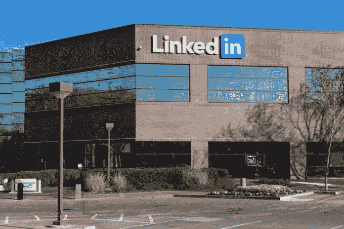
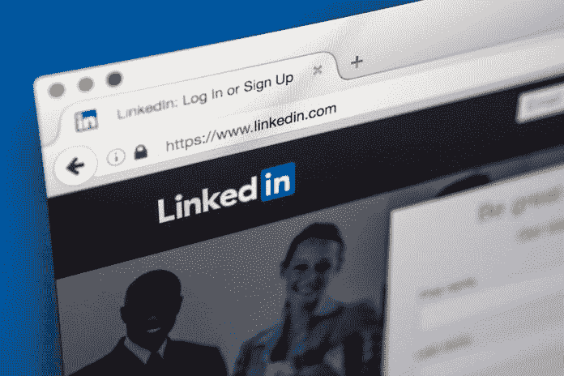

# LinkedIn 做得好几乎是神奇的

> 原文：<https://medium.datadriveninvestor.com/linkedin-done-right-is-almost-magic-805094be7bb6?source=collection_archive---------3----------------------->

## 这是一个宣传你的个人品牌和故事的好地方

areers 和 LinkedIn 经常纠缠在一起。找工作？你在 LinkedIn 上吗？社交媒体引发了不同的反应——有些是积极的，有些不是。

在 LinkedIn 的粉丝中，数一数[查姆·夏皮罗](https://twitter.com/ChaimShapiro)。这位经验丰富的职业顾问已经在 LinkedIn 工作了十多年，使自己成为一名专家，并在美国各地举办研讨会，讨论如何在这个平台上取得成功。

他与营销专家 [Madalyn Sklar](https://twitter.com/MadalynSklar) 和 [Manage Social](https://twitter.com/ManageSocial) 的产品设计师 [Kate Frappell](https://twitter.com/katefrappell) 讨论了如何建立一个成功的 LinkedIn 个人资料。

 [## 插上你从未用过的电动工具

### LinkedIn 充当思想工具，建立关系

blog.markgrowth.com](https://blog.markgrowth.com/plug-in-the-power-tool-youve-never-used-569a34ce3b84) 

对她来说，Frappell 发现 LinkedIn 是一个有用的广告和人力资源工具。

“LinkedIn 平台将工作列表、候选人搜索和推荐整合在一起，”她说。“它还暴露了你网络中的相互联系，让你可以轻松地与以前的同事保持联系——所有这些都是有价值的功能。

“LinkedIn 鼓励用户创建关键词丰富的个人资料，包括他们的职位、相关技能、资历和他们为谁工作，”Frappell 说。“这为企业对企业营销人员提供了一个强大的搜索工具，他们可以根据特定的专业知识对广告活动进行细分。”

她认为 LinkedIn 扰乱了人力资源领域。

“在网上发布广告，从一堆不合格的申请者中筛选的日子已经一去不复返了，”弗拉佩尔说。"现在，多亏了 LinkedIn，招聘人员可以做他们的研究，手动挑选合适的候选人."

# 吸引最大的注意力

求职者的最终成功始于他们在网上发布的内容。

夏皮罗说:“一个成功的 LinkedIn 个人资料能够以一种好的方式吸引注意力，给你带来你想要的线索或工作机会。”“如果成功了，你就是新的专家。有*没有* LinkedIn 的神奇。除非你做得正确，否则上 LinkedIn 是没有价值的。

“我见过很多人因为在 LinkedIn 上拥有非专业的个人资料而伤害自己，”他说。“一份‘成功的’LinkedIn 个人资料会让你受到目标受众的关注。求职者可以是雇主和招聘人员，专业人士可以是其他商业人士。”

这也是展示才华的地方。

“LinkedIn 是你树立和展示你的‘品牌’和专长的机会，”夏皮罗说。“当人们搜索你的名字时，LinkedIn *也*显示*在谷歌排名中非常靠前。LinkedIn 对于推广你的个人品牌和故事至关重要。*

可信的专业知识是侧写的关键。

“你展示的越多越好，”夏皮罗说。"同时，拼错的单词会害死你."

# 三眼捕手

他指出了构成或破坏 LinkedIn 个人资料的因素，从他所谓的 LinkedIn 三人组开始——“LinkedIn 的三个部分，无论你在哪里出现。这些是你的名字、个人资料图片和标题。”

*   你*需要*一张专业的个人资料图片。穿你在社交活动中会穿的衣服，这些社交活动的主角是你职业中的大人物。这可能会有很大的不同，取决于你是在创业公司还是在银行工作。您可以*而不是*使用您公司的徽标作为您的个人资料图片。用一张*的专业图就*你。
*   向您的帐户添加富媒体内容。人们都*非常*直观。我没有告诉人们我可以举办一个很棒的 LinkedIn 研讨会，而是嵌入了我自己举办研讨会的视频。
*   更新你的背景图片。确保它在你的品牌上。永远不要使用 LinkedIn 的默认设置。我有一张自己在 LinkedIn 上给相关人群举办研讨会的照片，以推广我的品牌。
*   图片必不可少。当人们能够“看到”你时，他们就会在 LinkedIn 上与你建立联系。把那个虚荣心网址也抢过来。

一个额外的专业建议:夏皮罗建议把“你的电子邮件地址放在你的摘要里，让人们更容易联系到你。”

求职者必须负责让他们的个人资料在搜索引擎和 LinkedIn 上被发现。

“玩搜索引擎优化游戏，”夏皮罗说。“确保你的关键词和信息在你的个人资料中响亮而自豪。那不是喊，而是要突出专业。再次，*获取那个虚荣心 URL* 。

“这就是你在 LinkedIn 上做出的选择至关重要的地方，”他说。“明智地选择你的行业。请使用大城市的名称，而不是小郊区的名称。填写你的技能部分。这些是*高度*可搜索的，*和*你*可以*在你的目标公司发现*顶尖*技能。”

# 求推荐

另一个重要步骤是优化公共配置文件设置。

夏皮罗说:“这就是你在社交网络之外的人面前的形象。”。“我[把我的 LinkedIn 网址](https://www.linkedin.com/in/chaimshapiro/)放到我在网上发布的东西里，这样我的排名会更高。我还认为，超过五封推荐信会提升你在 LinkedIn 上的地位。”

 [## 雇佣 LinkedIn 是工作 1

### 从头脑中有一个清晰的计划开始，来支持你的主张

medium.com](https://medium.com/datadriveninvestor/employing-linkedin-is-job-1-101ee036c548) 

求职者有很多方法可以有效地定义和创建他们的 LinkedIn 标题推介。

“用数字和事实来支持你的观点，”夏皮罗说。“如果你能找到例子，那就去找吧。把你的 LinkedIn 标题当作你的在线电梯推销。

“你的标题是*社交媒体上最有价值的专业房地产，”他说。“确保它告诉读者他们需要知道的一切，让他们点击查看更多内容。”*

据夏皮罗说，这影响了两种类型的海报:

*   求职者:告诉我你是谁，你带来了什么让我在意。
*   商务人士。说说你能为潜在客户解决哪些痛点？

“你的标题会出现在你在 LinkedIn 上做的每一个地方,”夏皮罗说。“我建议保持 130 个字符的长度*，但是*要包含一些*真正的*力量。问问你自己，如果一个招聘人员或客户没有看到其他的东西，你的头条新闻会向你推销吗？

“我重申:*永远不要*使用默认的*甚至*，尽管 LinkedIn 鼓励这样做，”他说。

夏皮罗更喜欢这些在 LinkedIn 上交流的最佳方式。

“当有人评论时，回应，”他说。“感谢那些给予合法背书的人。提出问题，看看你是否会得到回答。尽你所能开始并保持对话。

“搞！”他说。“它不再仅仅是为徒步旅行者准备的了。这是过去几年来 LinkedIn 最大的变化。你可以为自己的专业领域找到合适的搜索词，并在该领域发表帖子。”

# 分享你的观点

这包括与人交流、讨论和对他们的帖子发表看法。

“张贴你自己，”夏皮罗说。“使用正确的关键词，分享有价值的东西。向查看过您个人资料的人发送消息。他们表示感兴趣。找出原因。

“将你的代言货币化，”他说。“当人们支持你时，要感谢他们，并询问你如何为他们使用你的技能。”

 [## 2.6 亿人支持 LinkedIn

### 这个平台应该是任何社交媒体战略的一部分

medium.com](https://medium.com/datadriveninvestor/260-million-people-endorse-linkedin-628ddbc0850) 

加入一个“网络”或“分享”平台，人们同意对彼此的帖子发表评论，这很好，记住永远不要发垃圾邮件。

“支持你在 LinkedIn 上的支持，”夏皮罗说。“对许多人来说，它们可能是一个笑话，但你要信守诺言。不要让*而不是*在你的 LinkedIn 帖子上给你见过的每个人都贴上*的标签。*加上*值。”*

虽然 LinkedIn 高级账户可能很诱人，但并不适合所有人。

夏皮罗说:“在购买高级 LinkedIn 账户之前，要有一个好的战略和明确的目标，知道你要完成什么。”“如果让你自己的设备和主动性发挥作用，你可能会做得既便宜又聪明。

“Premium 不适合 99%的用户，”他说。“如果你是一名招聘人员，或者需要进行大量的搜索，它可以增加价值。你还可以看到 90 天内使用 Premium 查看过你个人资料的人，*但* LinkedIn 默认为最近五天。”

# 定期检查

标准 LinkedIn 的用户可以通过每隔几个小时检查一次来获得类似的结果，而不是高价的解决方案。

夏皮罗说:“记得让那些浏览过你个人资料的人参与进来。”“他们对你表现出兴趣。节省您的保费。LinkedIn *是否提供一年一次的免费月。请务必在收费前取消。*

“我的直接信息是公开的，”他说。“我的反馈速度太快，无法响应。DM 我，我*会*回复。”

LinkedIn 还有一个开放的候选人功能，没有工作经验的用户可以从中受益。

夏皮罗说:“公开招聘可以让你向招聘人员发出信号，表明你对新职位持开放态度。”。“这对于被动的候选人来说是非常好的——或者是全日制学生或者在大学工作的学生。

“他们的 LinkedIn 个人资料可能会说他们是全职工作，但招聘人员会知道他们是开放的，”他说。

 [## 将你的财富与你的品牌联系起来

### 如何在 LinkedIn 上寻找工作和建立业务联系

medium.com](https://medium.com/datadriveninvestor/link-your-fortunes-to-your-brand-b0abbddb9327) 

夏皮罗补充说，LinkedIn 试图向当前雇主隐瞒某人是公开候选人的事实。

“招聘人员在你的公司看不到你是‘开放的’，但这离完美的 T21 还差得很远，”他说。“例如，代表贵公司工作的招聘人员可能会看到你的‘空缺’状态。确保正确设置您的兴趣参数。”

一定要包括许多感兴趣的工作选项。

夏皮罗说:“不要忘了发出警告，表明你对感兴趣的公司感兴趣。”。

他列举了几个“伟大的”LinkedIn 资源:

*   [三分钟以内领英](https://www.youtube.com/playlist?list=PLJLxaY6S8ltStIdqTLDIEfGYBJEBrWKAB)。
*   商务领英简介。
*   [大学生领英](https://www.youtube.com/watch?v=Ex2K6S_iMx0&feature=youtu.be)。

夏皮罗和 Sklar 继续他们在[脸书直播](https://www.facebook.com/manageflitter/videos/845400369185950/?notif_id=1550013663198215&notif_t=live_video_explicit)的 LinkedIn 对话。

**关于作者**

吉姆·卡扎曼是拉戈金融服务公司的经理，曾在空军和联邦政府的公共事务部门工作。你可以在[推特](https://twitter.com/JKatzaman)、[脸书](https://www.facebook.com/jim.katzaman)和 [LinkedIn](https://www.linkedin.com/in/jim-katzaman-33641b21/) 上和他联系。

*原载于 2019 年 5 月 18 日*[*https://www.datadriveninvestor.com*](http://bit.ly/2Vy9q6z)*。*