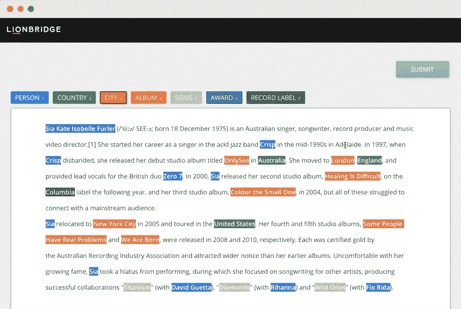
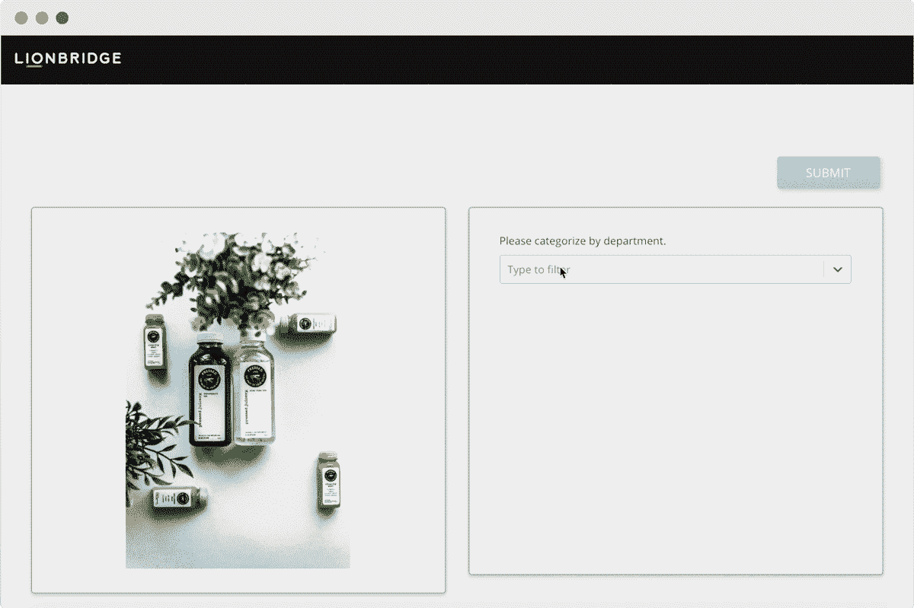
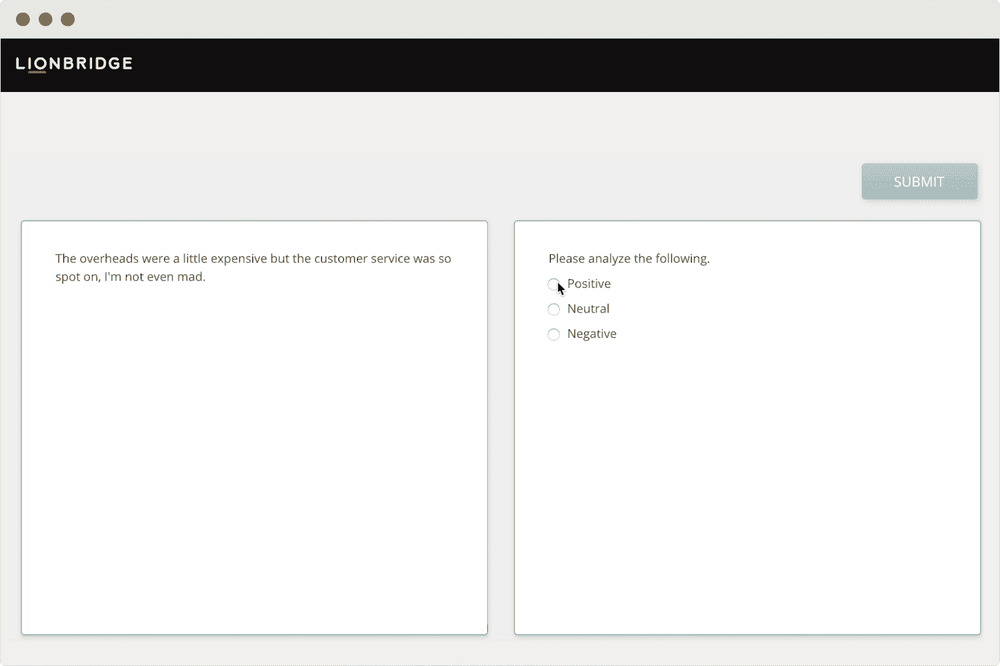

# Lionbridge 的数据注释平台如何让您的机器学习项目变得轻松

> 原文：<https://medium.datadriveninvestor.com/lionbridge-data-annotation-platform-machine-learning-c5cfc4722388?source=collection_archive---------3----------------------->

Lionbridge’s entity annotation platform

构建有效的机器学习应用程序是一个漫长的过程，从创建数据管道到训练模型。高质量的机器学习模型只能从高质量的训练数据中创建，这些数据是干净的、无偏见的，并且代表所有可能的场景和结果。

很容易低估您需要的原始数据的数量，以及收集和清理这些数据所需的时间。收集和标注数据集需要花费大量时间，尤其是对于需要专门数据集的模型。图像注释也往往更加繁琐，需要预先进行大量的手动注释。

 [## 为什么数据将改变投资管理|数据驱动的投资者

### 有人称之为“新石油”虽然它与黑金没有什么相似之处，但它的不断商品化…

www.datadriveninvestor.com](https://www.datadriveninvestor.com/2019/01/25/why-data-will-transform-investment-management/) 

除了数据标注任务本身之外，您还需要召集和管理一大群人来进行数据标注，为他们创建遵循的准则，找出如何评估质量，并确保每个人都得到报酬。

这就是 Lionbridge AI 的用武之地。Lionbridge 提供定制的人工智能训练数据集，因此您可以不再担心收集和注释数据，而是专注于构建和优化您的算法。我们提供人工智能解决方案，如自然语言处理组件开发、定制数据收集程序和安全的现场注释服务。我们的智能 Crowd™️拥有 500，000 名合格的贡献者，他们精通 300 种语言，因此我们可以快速为机器学习建立定制的多语言训练数据集。此外，Lionbridge 的项目管理团队为每个项目寻找合格的工人，并根据您的需求组织预算和进度。

# Lionbridge 平台支持的人工智能培训任务

Lionbridge 的数据注释平台支持文本、图像、音频和视频输入。这里只是一些你可以直接发送到我们平台的任务。

## 图像注释

图像注释是将图像与标识符标签相关联的过程。如果你正在建立一个图像识别模型，你需要训练它理解图像的内容，无论是引导自动驾驶汽车还是阅读和数字化手写文本。Lionbridge 的贡献者在该平台上工作，在各种图像类型上创建边界框、关键点和多边形注释。

Lionbridge’s image annotation platform

## 图像字幕

Lionbridge 的 AI 平台支持图像字幕，我们的客户可以使用它来构建基于图像和基于语言的字幕生成器。图像字幕用于向依赖声音和文本来描述场景的人描述图像，这可能是因为他们是盲人或视力低下。在 web 开发中，为出现在页面上的图像提供文本描述会使内容更易于访问和 SEO 友好。

## 实体注释

实体标注是用信息标记非结构化句子的任务，以便机器可以阅读它们。例如，这可能涉及标记文档中的所有人员、组织和位置。

Lionbridge 还支持命名实体识别、词性标记、IOB 标记，以及所有可以分层以训练机器理解自然语言的流程。

Lionbridge’s entity annotation platform

## 数据分类

Lionbridge 的多语言众包服务包括文档、产品和文本分类。我们为任何格式的文本、图像、音频和视频文件提供数据分类服务。例如，您可以使用我们的文本分类服务进行自然语言处理，或者使用我们的图像分类服务来训练模型以阻止敏感内容或对产品列表进行分类。

Lionbridge’s product categorization platform

## 数据输入

Lionbridge 提供 300 种语言的众包数据输入服务。我们的智能 Crowd™️是一个由 500，000 名贡献者组成的不断壮大的团队，他们围绕数据输入和数据清理提供各种任务。该团队在 Lionbridge 的平台上全天候工作，来自世界上所有时区。

Lionbridge’s data entry platform

## 音频、视频和语音转录

很多有意义的数据，只有在录音录像上的口语词里才有。使用 Lionbridge 的音频和视频转录服务，将口述文字转换为文字，以制作字幕。转录口语词使您的在线视频更容易搜索和访问，因为它为观众提供了更好的 UX，并提高了搜索引擎优化。除了我们的标准转录服务，Lionbridge 平台还提供附加功能，例如多语言音频、时间戳和对所有文件类型的支持。

Lionbridge 的平台支持智能逐字转录和严格逐字转录。对于智能逐字转录，我们的贡献者将转录口语单词，然后编辑文本以删除任何停顿、错误开头或半句。最终结果将是一个干净、易读的文本。对于严格的逐字记录，我们的贡献者将写下所有的口语单词，而不编辑任何东西。你的期末成绩单将包括所有的嗯，嗯，你知道，尴尬的停顿和半句。

我们还支持音标，这是语音的可视化表示。每个语音都由国际音标(IPA)中的一个符号表示。使用 Lionbridge 的音标服务，确保您的模型可以为不同的用户群生成并理解自然语言。

## 情感分析

情感分析用于通过提取特定的单词或短语来确定文本是正面的、负面的还是中性的。情感分析的主要目的是量化公众对某些产品、事件、人物和想法的看法。这是 Lionbridge 平台支持的文本分类任务类型之一。

Lionbridge 的人工智能平台支持单一或多重分类。例如，我们可以限制我们的贡献者，使他们不能将同一文本同时标记为积极和中立。

Lionbridge’s sentiment analysis platform

# Lionbridge 数据注释平台上的项目管理工具

我们的数据注释平台包括以下功能，可帮助您轻松管理您的机器学习项目。

## 可配置定时器

您可以定义我们的贡献者在人工智能项目中处理一个项目的最长时间，直到它被释放回池中供另一个贡献者拾取和处理。此功能对于较长的任务很有用，例如音频转录，每个参与者可能需要花费 20-30 分钟来转录音频文件，而不是只花一分钟来分类图像。

## 质量控制的黄金标准检查

Lionbridge 对质量控制实施黄金标准检查。我们为数据注释创建幻影任务，以及我们期望从贡献者那里得到的结果的答案。然后，我们将这些任务分配给我们的贡献者，就像我们分配客户请求的真实任务一样。只有通过了虚拟任务的贡献者才有资格为我们的客户处理真实的数据注释任务。

## 多次通过质量控制

Lionbridge 的数据注释平台提供了多次传递选项，具体取决于您所需的数据注释质量。多次通过功能允许多个参与者在一个项目中的同一项目上工作，允许我们的客户执行统计分析和实践严格的质量控制。

*   **单遍**:每个文件由单个贡献者进行注释。
*   **一次通过+ 10%** :一次通过后，Lionbridge 的项目经理会审查数据注释任务的代表性样本，以确保质量。
*   **双通**:每个数据标注任务由两个不同的贡献者完成。第二个贡献者可以看到第一个贡献者做了什么，如果他们认为有必要，可以进行更改。通常，我们建议对数据注释任务使用双重传递。
*   **双通盲**:每个数据注释任务由两个不同的贡献者完成，他们看不到彼此的注释。如果两个参与者提交了不同的注释，Lionbridge 的项目经理将调查差异的原因，并确保该错误不会出现在项目的其他部分。

高质量的机器学习模型只能从高质量的训练数据集创建。Lionbridge 为数据收集、数据清理和数据验证提供了有效的解决方案，所有这些都在一个组织有序的平台中完成。如果您有兴趣了解 Lionbridge 平台能为您的机器学习项目做些什么，请[立即联系我们](https://lionbridge.ai/contact-sales/)或访问我们的[主页](https://lionbridge.ai)。