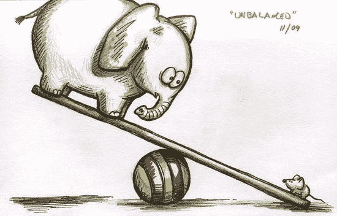

# 6 种流动性措施可以繁荣你的市场业务

> 原文：<https://medium.datadriveninvestor.com/liquidity-flourishes-marketplaces-22a5856ce4e?source=collection_archive---------3----------------------->

## 知道是什么让一个市场运转起来，有什么方法可以到达那里吗？

**市场中的流动性**是可供销售的资源的总体利用率。在最短时间内预订的商品或服务越多，市场的流动性就越好。一般来说，**流动性越高越好。**正如供应方的更多销售意味着一个快乐的供应商群体，更多购买意味着需求方更大的信任和忠诚度。

在 Airbnb 的情况下，每日使用率是每天从可供预订的所有房屋中预订房屋的比率。在优步的情况下，这是可用于服务的驱动程序的使用率。

 [## 金融科技初创公司正在颠覆全球银行业|数据驱动的投资者

### 传统的实体银行从未真正从金融危机后遭受的重大挫折中恢复过来…

www.datadriveninvestor.com](https://www.datadriveninvestor.com/2018/10/20/fintech-startups-are-disrupting-the-banking-industry-around-the-world/) 

流动性越高，市场就越健康。Supply 希望在市场上更快地销售其产品或服务，因此它可以放弃更多的资源和时间来销售更多的产品或服务。一旦供应尝到了流动性更大的市场的有效性，它最终会在平台上停留更长时间。这通常意味着市场有更多的资源来获取新客户(供应/需求)，而花费在重新吸引现有供应上的资源更少。

# 那么，如何获得更高的流动性呢？

让我们来看看一些可以用来产生流动性的杠杆。当这些杠杆串联在一起时，会导致复合流动性效应。所以明智地选择你的杠杆；)

#1 **减少导致交易的摩擦** —逻辑很简单。从发现到交易的步骤越少，效果越好。并非所有市场都是平等的——有些市场需要比其他市场更多的前期选择和决策。

更直接的选择和考虑的一个例子是在护理/治疗市场(例如:荣誉)。与此相反的例子是优步，你可以挑选车辆，但不能选择司机。另一个例子是 Airbnb 的即时预订——与客人和主人之间来回发送消息来确认预订不同，即时预订允许双方完成交易，并给予即时满足。

订单结帐页面是如何减少摩擦的经典示例—可以从以前的交易中捕获送货地址、帐单地址和信用卡信息，以避免重新输入信息，从而减少交易摩擦。

#2 **提高治疗和供应质量** —这与#1 齐头并进。当客户不确定供应品的质量时，他们会花更多的时间来评估供应品，导致交易摩擦增加。亚马逊和易贝通过从客户那里获取供应商评级，并在个人资料页面和搜索结果中显示出来，来解决这个问题。此外，一些市场提供退款保证，以安慰消费者做出购买决定。

一些市场对供应进行预先审查，可能会导致低数量，但质量更高。这种监管过程消除了需求方更多的跑腿工作。

为了平衡数量和质量的动态变化，市场使用的一些策略包括对精选的(*更仔细的)供应给予优惠待遇。针对策展供应的这种特殊处理的一个例子是在搜索结果和展示策展的徽章/标签等上的较高排名。

然而，监管是有成本的，在 Honor 这样的市场中，选择、培训和认证的前期管理在建立市场中发挥着关键作用，这意味着更多的资源投入到提高供应质量的前期工作中。

#3 **订购时间和履行时间** —订购时间是需求方进行交易所需的时间，而履行时间是供应方履行订单(运送物品或提供服务)所需的时间。

订购时间不仅是顾客在网站/应用程序上做出决定所花费的时间，也是考虑做出决定所花费的时间。这里有一个例子，在 DoorDash 上点餐不仅仅是在应用上花费的时间，而是与朋友和家人一起决定点什么食物所花费的时间。Doordash 提供了一个“与你的朋友和家人一起订购”的选项，可以在他们的应用程序上合作决定每个人喜欢的食物。

实现时间需要一系列投资，这取决于我们是在谈论商品市场还是服务市场。在商品市场的情况下，履行时间可以通过改善仓储、库存管理和物流，甚至最后一英里的交付(获得访问代码以投递包裹)来减少。

在服务市场的情况下，履行时间不仅包括提供服务的时间，还包括等待的时间。例如，顾客在市场上的发廊预先预约，在预约的确切时间出现在发廊，但最终等待。

#4 **激励:奖励、社交、定价—** 奖励和折扣有助于客户快速做出决定。类似地，优质供应商也享有特权，比如 Airbnb 的超级房东，他们可以在市场上收取更高的价格。

市场还利用社交和游戏化方法来促进供需之间的互动。这方面的一个很好的例子是 Poshmark 的豪华活动，这些活动激励供应方列出特定主题的商品(例如:户外、家庭聚会、路易威登)，并鼓励需求方参与更多活动。

#5 **信任和安全** —信任和安全对于实现市场成熟度和规模至关重要。

当以下情况发生时，供应和需求双方都感到交易舒适，事实上，交易更多，从而提高整体利用率。

>供应/需求验证

>管理论坛(消除不满、错误信息等)

>淘汰不良演员

>主动管理争议

>保证交付/履行

这方面有几个例子:

罗孚在宠物逗留期间提供宠物保险

Turo 在旅行结束后向租赁者收费，并处理纠纷

OfferUp 会保留付款，直到发货并变得可跟踪

#6 **法规和运营**——扩大市场规模以产生更多流动性需要在应对法规方面加大马力。一个经典的例子是优步和 Lyft 与世界各地的城市、州和联邦政府合作。延迟与政府机构建立跟踪记录可能会导致开展业务的挫折和延迟，从而降低通过市场提供的服务的可靠性和质量。

最后，根据市场提供的价值的规模和类型，运营团队进行调整，以确保规模不会影响质量。为了确保适当的辅导、指导和跟踪到位，市场应该雇佣和保留能够提高流动性的合适员工。

> 一个**繁荣的** **市场**具有**更高的流动性**看起来是这样的……相当不夸张；)

