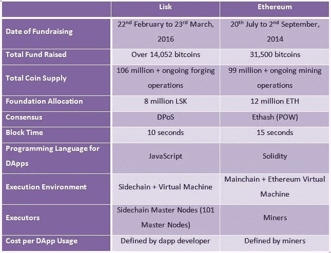

# Lisk VS 以太坊

> 原文：<https://medium.datadriveninvestor.com/lisk-vs-ethereum-7753e95e992d?source=collection_archive---------0----------------------->

## 理解基本差异的简单指南

随着比特币(第一种加密货币)的成功，从其获得的市场采用来看，它变得非常明显，在区块链和去中心化方面有更多的潜力和可能性。让这个概念适用于其他功能的愿望产生了对平台(用于分散式应用程序开发)的需求。

以太坊是为满足这一需求而创建的第一个平台。但是自从以太坊以来，已经为分散化应用程序创建了许多其他平台。Lisk 是其他平台之一，目前是市值第 24 大的加密货币。然而，以太坊在市值上遥遥领先，目前是第二大。Lisk 和以太坊都解决了同样的问题，但是他们有不同的解决方法。

> Lisk 是一个区块链应用程序平台，通过部署链接到 Lisk 主链的侧链，开发人员可以创建、分发和管理分散的区块链应用程序。

基本上，Lisk 的方法是解决许多加密货币经历的可扩展性问题，并给开发者更多的灵活性。Lisk 提供了一个软件开发工具包(SDK ),它将使全世界数百万开发者能够在 Lisk 网络上创建他们自己的分散式应用程序(dapps)。Lisk 非常重视创建 dapps 的便利性，因此使得用 JavaScript 构建和部署区块链应用程序成为可能。这是因为 JavaScript 已经被全世界的开发者所熟知。对于开发人员来说，这比学习一门新的编程语言更容易。

Lisk 的理念是，开发人员更喜欢一个更简单、更灵活的平台来创建 dapps，而不是去学习一门新的编程语言。此外，开发人员不希望被困在一个可能受到网络上其他 dapps 的不幸影响的网络上。

> 另一方面，以太坊是一个区块链应用平台，其构建方式使开发者能够创建智能合约。

这个智能合约功能是一个脚本，设计用于在满足某些设定条件时自动执行任务。作为为 dapps 创建的第一个平台，它已经成为使用其 ERC-20 令牌标准创建新令牌的首选。以太坊的理念是，与金融交易和货币用例相比，分散应用开发平台(和智能合约特性)在区块链世界将是一个更大的用例。

Lisk 和以太坊的区别可以总结如下:

Lisk VS Ethereum

以太坊和 Lisk 的基本区别是从共识模型开始的。虽然以太坊仍然停留在工作证明上，并计划过渡到利益证明，但 Lisk 正在研究委托利益证明。Lisk 的块时间比以太坊快 5 秒左右。Lisk 的一个重要区别和优势是能够在 Lisk 上用 JavaScript 编程。与此同时，以太坊开发者必须学会稳固。此外，Lisk 的侧链概念产生了一种想法(理论上),即特定 dapp 上的拥塞不会影响整个 Lisk 网络。然后，开发人员在 Lisk 中确定每次 dapp 使用的成本，这与在以太坊中由矿工定义不同。**以太坊相对于 Lisk 的一个相当大的优势是区块链以太坊已经上线运行，上面有超过 1500 个 dapps。与此同时，Lisk 仍在开发中。**

Lisk 和以太坊都显示出成为标志性区块链平台的巨大潜力。然而，只有时间(以及不同团队投入的工作)才能告诉我们几年后他们两人的处境。