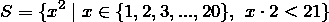
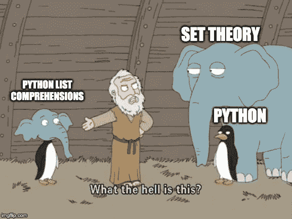

# Python 中的列表理解和集合论中的集合生成器符号

> 原文：<https://medium.datadriveninvestor.com/list-comprehensions-in-python-and-set-builder-notation-in-set-theory-4b373195b266?source=collection_archive---------1----------------------->

在这篇文章中，我将讨论 Python 中的**列表理解**和集合论中的**集合构建器符号**之间的相似性和联系。我还将简单地将它们与 Haskell 中的 list comprehensions 进行比较。

# Python 中的列表理解

python 中的列表理解将允许您通过遍历给定列表中的每个元素(或 Python 中的任何可迭代对象，如字典和元组)来构造新列表。列表理解的语法如下:

```
s = [x**2 for x in range(21) if x*2 < 21]
```

该表达式的目的是遍历整数列表中从 0 到 20 的每个元素，选择 double 小于 21 的元素，并返回每个元素都是平方的新列表。

这基本上是一个`for`循环的简写版本，由上面的表达式产生的`s`的值也可以实现如下:

```
s = []
for x in range(21):
    if x*2 < 21:
        s.append(x**2)
```

如你所见，列表理解中的`for x in range(21)`本质上是`for`循环的头。过滤器`if x*2 < 21`相当于`for`循环中的`if`条件。这里的一个主要区别是列表理解省去了我们构造一个空列表并将每个循环的结果附加到它上面的麻烦。

[](https://www.datadriveninvestor.com/2019/02/21/best-coding-languages-to-learn-in-2019/) [## 2019 年最值得学习的编码语言|数据驱动的投资者

### 在我读大学的那几年，我跳过了很多次夜游去学习 Java，希望有一天它能帮助我在…

www.datadriveninvestor.com](https://www.datadriveninvestor.com/2019/02/21/best-coding-languages-to-learn-in-2019/) 

既然列表理解总是可以写成一个`for`循环，为什么我们要用前者呢？一般来说，如果使用正确，列表理解有许多优点:

*   *简洁*:不用写一整块的控制流语句，只用一行表达式就可以了，这样我们的代码更简洁。
*   就语法和我们可以使用它们的位置而言，列表理解是多种多样的。就语法而言，列表理解非常有表现力:我们可以为变量添加[三元运算符](https://data-flair.training/blogs/python-ternary-operator/)，使用几个`for`子句的嵌套循环，以及使用`if`子句的多个过滤器等等。就位置而言，列表理解可以插入到 return 语句等地方，或者作为其他表达式中的嵌套表达式。
*   *高效*:相比`for`循环，列表理解更高效，运行更快。正如马克·卢茨在他的书 [*学习 Python*](https://www.amazon.com/Learning-Python-5th-Mark-Lutz/dp/1449355730) 中指出的，“根据你的 Python 和代码，列表理解可能比手动`for`循环语句运行得快得多(通常大约快两倍)，因为它们的迭代是在解释器中以 C 语言的速度执行的，而不是用手动 Python 代码。尤其是对于较大的数据集，使用这种表达式通常会有很大的性能优势。

# 集合论中的集合构造符号

现在我们已经看到了 Python 中的列表理解是如何工作的，我将把它们与集合论中的集合生成器符号进行比较。

当我第一次学习 Python 中的列表理解时，我有一种似曾相识的感觉:语法看起来很像集合论中的[集合构建符号](https://en.wikipedia.org/wiki/Set-builder_notation)。为了比较，让我们用集合构建器符号来表达上面的 Python 列表理解:



这可以理解为“S 是所有数字‘x 的平方’的集合，其中 x 是 0 到 20 之间的整数集合中的一项，x 的两倍小于 21”。以此为例，让我们将此符号与 Python 列表理解表达式进行比较:

*   花括号表示结果 S 是一个集合；而在 Python 中，方括号用于指示结果是一个列表(对于 Python 中的字典理解，使用花括号，但它不指示结果是一个集合)。
*   在竖线左侧的花括号中，x**2 是输出符号，与 list comprehension 相同。
*   竖线右边的部分相当于列表理解中的`for`从句。
*   逗号的右边是一个过滤器，和 list comprehension 中的`if`子句一样。

尽管有一些细微的差别，集合构建器符号和 Python 中的列表理解之间的相似之处是显而易见的。这就好像 Python 中的列表理解是集合论和 Python 的私生子一样！



这个“私生子”不是巧合:Python 中的列表理解语法是 Barry Warsaw 在 2000 年作为 Python 2.0 的一个新特性首次引入的。这是受函数式编程语言 Haskell 中的列表理解的启发。Haskell 从 Miranda 那里学到了这个特性，Miranda 是一种由英国计算机科学家[大卫·特纳](https://en.wikipedia.org/wiki/David_Turner_(computer_scientist))设计的语言，并且对 Haskell 有很大的影响。David Turner 在他的论文[“函数式编程语言的一些历史”](https://www.cs.kent.ac.uk/people/staff/dat/tfp12/tfp12.pdf)中提到了列表理解和集合论之间的联系:

> SASL 继续温和地发展，在 1983 年获得了浮点数和列表理解。后者的灵感来自达林顿的“集合表达式”[…]，但适用于懒惰列表。[……]我最初称这些 ZF 表达式为策梅洛-弗兰克尔集合论的参考——是菲尔·瓦德勒创造了更好的术语列表理解。

# Haskell 中的列表理解

现在让我们将集合构建器符号与 Haskell 中的列表理解进行比较。上述 python 示例可以写成如下形式:

```
s = [ x^2 | x <- [0..20], x*2 < 21 ]
```

正如我们所看到的，Haskell 中的列表理解和集合构建器概念之间的相似性更加明显。

我的博文到此结束。我希望通过比较 Python 中的 list comprehensions 和 set-builder 符号，对于不熟悉这种表达式的人来说，前者的语法和用法会变得更清楚。对于我自己，我希望探索更多关于函数式编程语言中列表理解的应用。

感谢您的阅读。一如既往，如果您有任何意见或反馈，我很乐意收到您的来信。

# 参考

[*学习 Python*](https://www.amazon.com/Learning-Python-5th-Mark-Lutz/dp/1449355730) 马克·卢茨

Alex Chumbley、Karleigh Moore、Agnishom Chattopadhyay 和其他 1 人参与撰写

[*巨蟒一言以蔽之*](https://www.oreilly.com/library/view/python-in-a/0596001886/ch04s09.html) 亚历克斯·马尔泰利著

[*一些函数式编程语言的历史*](https://www.cs.kent.ac.uk/people/staff/dat/tfp12/tfp12.pdf) 作者大卫·特纳