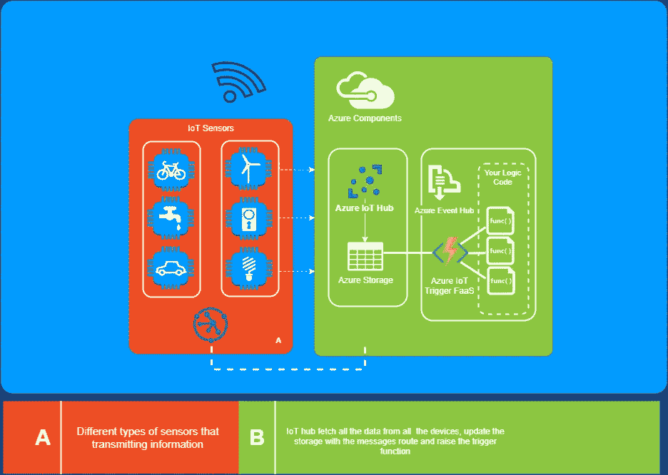
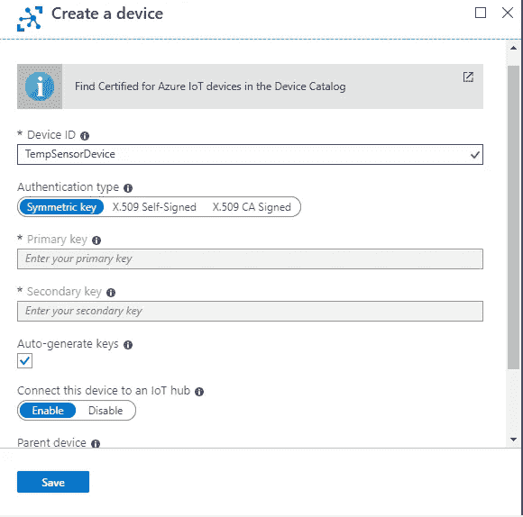
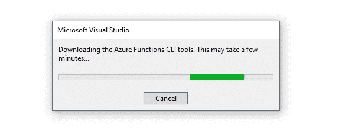
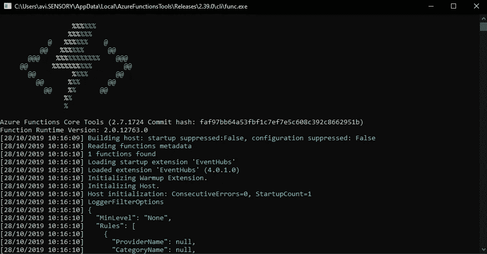

# 使用 Azure 功能收听物联网中心—第 1 部分

> 原文：<https://medium.datadriveninvestor.com/listening-to-iot-hub-with-azure-function-part-1-743407b79163?source=collection_archive---------0----------------------->

在本文中，我们将介绍如何用一个 Azure 函数连接到 Azure IoT hub(D2C ),而无需使用监听主机。

在过去的几天里，我面临着将 azure IoT 集成到现有系统中的挑战。面对这个问题，我决定使用一些 Azure 云小部件，如 Azure IoT hub trigger。

 [## 理解物联网|数据驱动的投资者

### 一个系统越开放，它就越有利于创新和产生信任。然而，当谈到开放系统时…

www.datadriveninvestor.com](https://www.datadriveninvestor.com/2019/09/28/making-sense-of-iot/) 

我做出这个决定的主要原因是:

1.  很便宜。比运行主机便宜多了。
2.  它开着。它为项目进入微服务架构的世界而不是通常的整体建筑打开了大门

本文是讨论 Azure 函数及其好处的系列文章的一部分。
接下来的几篇文章将讲述:

1.  **使用 Azure 功能监听物联网中心** —第 2 部分—与 DI 合作，为物联网服务器客户端创建控制器和功能&。
2.  调度器功能——使用编排触发器来调度 Azure 功能

完整代码在 GitHub 上， [**这里**](https://github.com/avisiboni/IoT-Listener.git) **。**

Azure component architecture.

物联网简介:

## IoT——物联网。

> 物联网是一个由相互关联的计算设备、机械和数字机器、物体、动物或人组成的系统，这些计算设备、机械和数字机器、物体、动物或人具有唯一的标识符，并且能够通过网络传输数据，而无需人与人或人与计算机的交互。[维基百科](https://en.wikipedia.org/wiki/Internet_of_things)。

## Azure 物联网中心。

> Azure IoT Hub 是 Azure IoT Central 和 Azure IoT 解决方案加速器使用的核心 Azure PaaS。物联网中心支持数百万物联网设备和云解决方案之间可靠、安全的双向通信。[微软文档](https://docs.microsoft.com/en-us/azure/iot-central/overview-iot-options)。

## Azure 功能。

> Azure Functions 是托管在微软 Azure 公共云上的无服务器计算服务。总的来说，Azure Functions 和无服务器计算旨在加速和简化应用程序开发

为了在这个项目上工作，我们需要以下先决条件。

*   有效的 Azure 帐户。
*   Visual Studio(社区版就够了)。
*   基本 C#确认。

> 如果在 Visual Studio 上找不到 Azure Function template 项目，请转到“工具”菜单，选择“扩展和更新”。展开已安装>工具，然后选择 Azure 函数和 Web 作业工具。

准备好了吗？让我们开始吧！

***第一步*** —创建 Azure 物联网枢纽和设备(如果你已经有了，可以跳到第二步)。

1.  在这里 登录蔚蓝门户
2.  创建资源>在市场中搜索物联网中心>填写必填字段(选择免费计划)，创建它。
3.  稍等片刻，中心创建完成后，您会看到一个祝酒词。
4.  我们的中枢准备好了！让我们为创建的集线器创建一个设备。
5.  在 hub 菜单中导航>物联网设备>添加>并填写以下字段:**设备 Id —** 设备名称，**认证类型—认证类型**选择对称密钥(也称为 SAS)并选中自动生成密钥，并将此设备连接到物联网 hub 设置为启用。
6.  按下保存，等待几个和中提琴！我们的设备准备好了。

Azure IoT device creation.

***第二步* —** 使用 Azure 函数(IoTHubTrigger 函数类型)创建将从设备接收所有消息的集线器监听器。

1.  打开 Visual Studio***>***创建 Azure 函数项目。
2.  选择物联网集线器触发器 v2(v2 和 v1 的主要区别在于，v2 基于。Net 核心，而 v1 使用。Net Framework，连接字符串来自两个不同的地方)。
3.  必填字段: ***存储账号***——现在你可以为本地选择一个模拟器， ***连接字符串设置*** *—* 连接字符串的键值来自 local.setting.json ( **重要！—** 连接字符串值需要从，转到创建的物联网 hub >内置端点>事件-hub 兼容端点。) ***路径—*** 保持原样(消息/事件)。
4.  最后，创建项目。

创建项目后，我们应该能够看到一个创建的函数，带有以下参数:

1.  **IoTHubTrigger**>**1。**事件中心名称。 **2。**连接字符串(v2 是上述 local.setting.json 中连接字符串值的键)。
2.  **EventData >** 保存来自设备的事件数据，如消息有效载荷、消息属性，即
3.  **ILogger** —就像声音一样，代表一个记录器。

## ***步骤三——创建负责发送消息的*** 设备(D2C)。

1.  创建一个控制台应用程序，命名并创建。
2.  安装软件包 Microsoft。来自 NuGet 的 Azure.Devices.Client。
3.  将以下函数添加到创建的类中(它也在 GitHub 项目的其余部分中)。

4.将下面一行添加到主函数中

5.添加以下函数来发送事件。

6.构建项目(CTRL +SHIFT + B)。

7.要运行功能内的设备，右击解决方案 ***>*** 属性 ***>*** 启动项目 **>** 勾选多个启动项目>选择功能项目和控制台设备项目，选择动作—启动。

按 F5 运行，第一次可能需要一段时间，正在下载 CLI 工具

完成后，您应该会看到 CLI 运行。

恭喜你。您的功能已启动并正在运行，现在您将开始接收来自设备的消息，每次有新消息进入时，该功能都会自动开始运行(您应该考虑冷启动，因为如果在 X 时间内没有接收到消息，它就会开始空闲，解决方案之一是定期调用该功能，每分钟一次)。

所以，感谢你阅读这篇文章，希望它有所帮助。

**下一篇文章将讨论使用 Azure 功能收听物联网中心** —第 2 部分