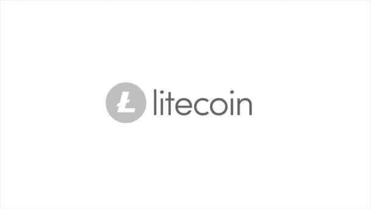
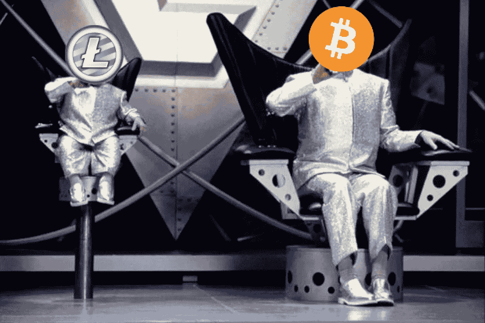

# 银币初学者指南。

> 原文：<https://medium.datadriveninvestor.com/litecoin-oversimplified-a-beginners-guide-to-the-silver-coin-afdeca289e0c?source=collection_archive---------18----------------------->

# 莱特币的起源。

尽管比特币创始人“中本聪”的身份仍笼罩在神秘之中，但莱特币的创始人查理·李在他的博客和社交媒体上非常活跃。他曾在谷歌工作，之后才有了创造比特币更轻便版本的愿景。当比特币被视为“黄金”和长期价值储存手段时，莱特币被视为“白银”和日常交换媒介，而且更便宜。回到 2011 年 10 月 7 日，litecoin 通过开源客户端在 GitHub 上发布。莱特币网络于 2011 年 10 月 13 日上线。基本上就是比特币核心客户端的一个分叉。

这个项目开始解决比特币的一些瓶颈和可扩展性问题，最显著的是在给定的时间框架内可以处理的交易数量。莱特币优于比特币的地方在于，它的支付速度是比特币的四倍，交易成本非常低。

# 比特币的黄金和白银

比特币和莱特币非常相似，除了一些细微的区别，莱特币与比特币的用途相同，这就是为什么它们总是被相互比较的原因。毕竟这是最早的比特币分叉之一。Litecoin 的用途是用作点对点加密。它可以完成与比特币相同的工作，但速度更快、成本更低。

**速度**

莱特币的验证周期正好是固定的 2.5 分钟。每确认一个比特币块，就有四个相同大小的莱特币块被确认。

**成本**

发送面值 LTC 的成本约为 0.02 美元，而比特币目前约为 0.35 美元。然而，当流量很大时，比特币交易成本急剧上升。

**采矿**

Litecoin 旨在保持哈希权力分散。莱特币的目标之一是，他们希望比比特币的网络更均匀地分配散列能量。这包括采矿集团、采矿池和分散得多、小得多的矿工子集。

*如果您想了解更多，请访问 BIDITEX 页面并提出您的问题，关注我们的* [*推特*](https://twitter.com/biditex_com) *，* [*脸书*](https://www.facebook.com/biditex/) *，* [*中型*](https://medium.com/@biditex) *，* [*电报*](https://t.me/biditex%20%28edited%29) *等。投标变更同***。**