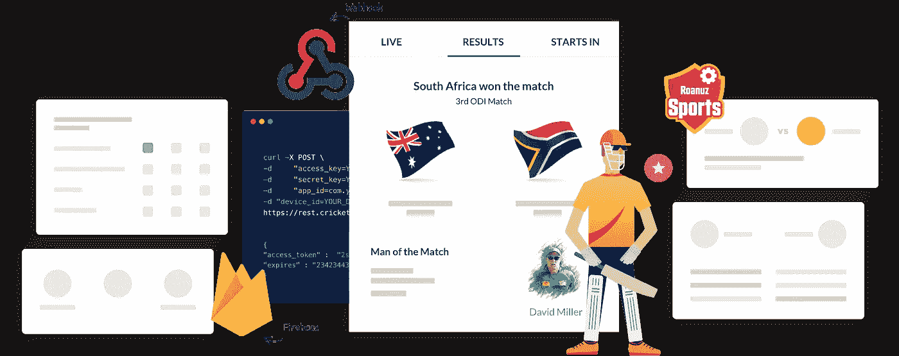

# 通过 Roanuz Sports 的 Webhook、Firebase 和 WebSocket 直播板球比分

> 原文：<https://medium.datadriveninvestor.com/live-cricket-score-via-webhook-firebase-websocket-from-roanuz-sports-45d82a029f1f?source=collection_archive---------8----------------------->

Roanuz Cricket API 通过 **Webhook、Firebase & WebSocket 给出了最快的现场比分。**与基于拉的方法相比，推送通知的数据传输延迟更短。在推送通知中，我们将数据推送到服务器，但在基于拉取的方法中，命中 API 的频率在实时分数更新的延迟中起着主要作用。

**网络插座:**

WebSocket 是双向、全双工的，只有一个 TCP 连接。与 HTTP 请求不同，WebSocket 不需要像请求/响应这样的预定义模式。在 WebSocket 中，要么客户端可以与服务器对话，要么服务器可以与客户端对话。因此，没有等待时间，数据传输会更快。Roanuz Cricket API 允许多达五个推送连接。

**Webhook:**
注册自己的网址，就能在直播比赛期间获得比赛 API 的持续更新。与其不断轮询数据，不如即时获取实时数据。

**Firebase:**
与传统的 HTTP 请求不同，Firebase 实时数据库使用数据同步。因此，如果任何球员数据或实况板球数据被 Roanuz Cricket API 修改，则这些改变在客户端设备中以毫秒更新。firebase 不允许空值。所以你的回答里永远不会有空值。

与 WebSocket 相比，Webhook & Firebase 是获得[现场比赛记分卡](https://www.cricketapi.com/docs/Core-API/Match-API/)的最佳方法。

【Webhook、Firebase 的区别& WebSocket:

1.  webhook & firebase 是单向通信，发送方必须可用。而 WebSocket 是双向通信，发送方和接收方必须可用。
2.  由于上述情况，在 webhook & firebase 中对服务器的需求较少。但是，WebSocket 对服务器的需求很高。
3.  如果任何一个服务器连接失败，在 webhook &firebase 中重新连接是很容易的。但是在 web-socket 中，没有重新连接处理机制。

**Roanuz Cricket API 集成:**
Roanuz Cricket API 超快&易于与任何平台集成[简单文档](https://www.cricketapi.com/docs/)、[开源库](https://www.cricketapi.com/docs/guides/Open-Source-Libraries/)、&人性化支持团队总能给出正确的解决方案。响应是 JSON 格式的，并且是独立于平台的。

以下是 Roanuz Cricket API 提供的 API: [赛程 API](https://www.cricketapi.com/docs/Core-API/Schedule-API/?src=article) 、[最近赛季 API](https://www.cricketapi.com/docs/Core-API/Recent-Seasons-API/?src=article) 、[最近比赛 API](https://www.cricketapi.com/docs/Core-API/Recent-Matches-API/?src=article) 、[赛季 API](https://www.cricketapi.com/docs/Core-API/Season-API/?src=article) 、[赛季团队 API](https://www.cricketapi.com/docs/Core-API/Season-Team-API/?src=article) 、[比赛 API](https://www.cricketapi.com/docs/Core-API/Match-API/?src=article) 、[逐球 API](https://www.cricketapi.com/docs/Core-API/Ball-By-Ball-API/?src=article) 、[过球总结 API](https://www.cricketapi.com/docs/Core-API/Overs-Summary-API/?src=article) 、[球员统计 API](https://www.cricketapi.com/docs/Core-API/Player-Stats-API/?src=article) 、[赛季统计 API](https://www.cricketapi.com/docs/Core-API/Season-Stats-API/?src=article) 、【t24 [赛季的球员统计 API](https://www.cricketapi.com/docs/Core-API/Season-Player-Stats-API/?src=article) 、[幻想赛积分 API](https://www.cricketapi.com/docs/Fantasy/Fantasy-Match-Points-API/) 、[幻想赛积分 API](https://www.cricketapi.com/docs/Fantasy/Fantasy-Match-Credit-API/) 、[聊天机器人 API](https://www.cricketapi.com/chatbot-api/) & [历史数据 API](https://www.cricketapi.com/performance-api/) 。