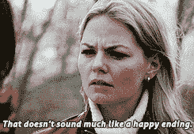

# “为他人而活”是一个谎言

> 原文：<https://medium.datadriveninvestor.com/live-for-others-is-a-lie-b9733e4afea2?source=collection_archive---------5----------------------->

Photo by [Krzysztof Kowalik](https://unsplash.com/@kowalikus?utm_source=medium&utm_medium=referral) on [Unsplash](https://unsplash.com?utm_source=medium&utm_medium=referral)

大多数人认为我们在这个地球上的目的是为他人而活。给予，服务。这是我们刚刚接受的陈词滥调之一。从表面上看，这听起来不错。谁不想帮助别人呢？也许是吝啬鬼。没有人想成为吝啬鬼。

但是有一个问题。

“为他人而活”是一个谎言。

 [## 成功的生活数据驱动型投资者的 25 种自我提升方式

### “我活得越久，学到的就越多。学的越多，体会的越多，知道的越少。”―米切尔·莱格兰德时间到…

www.datadriveninvestor.com](https://www.datadriveninvestor.com/2019/03/12/25-self-improvement-ways-for-a-successful-life/) 

这是我们早年达成的协议。我们认识到，要被接受，我们必须扭曲自己以满足他人的愿望。要得到认可和庆祝，就要遵守规则。规则是伟大的，不要误解我。我非常喜欢规则。

但是当遵守规则成为我们的认可时，我们就有问题了。

事情是这样的。

我们了解到，如果我们把铲子给提米，他会把桶给我们，而“大人们”会让我们在沙盒里玩得更久。我们学会安静地坐着，这样老师就会喜欢我们，让我们去休息。是的，分享和权威的技能很重要，但我认为我们吸取了错误的教训。我们学到的不是分享和权威的价值，而是为他人而活的价值。没有人教我们做这些事情会改善我们自己的生活，而是告诉我们去做，因为“这是应该做的事情。”我们必须*善待他人*。就像这样，我们开始把我们的成功行动和其他人如何看待和接受它联系起来。这是一个微妙的转变，但它造成了一个很深的鸿沟，大多数人永远无法自拔。

我不是你的私人精灵。我不会让我的生活成为你欲望的银盘。你可能会认为“这太可笑了，没人会这么想。”哦，是吗？他们就是这样生活的。

我会证明的。

大多数人根据他人的反应做出决定。

例句:你在咖啡店对面看到一个有魅力的人。你会走过去和他们打招呼吗？

大多数人不会。*我可能看起来很蠢*。或者*对方会觉得我怪怪的*。或者我会给他们留下尴尬的印象。或者他们可能会拒绝我。注意每个原因是如何处理别人对你的看法的。如果你是为你自己而活，而不是为其他人，你的思维过程会有所不同，你会想:哇，那个人可能是我未来的伴侣。这是一个巨大的差异。

当面临选择时，我们的条件思维过程(除非被打断)是在决定做什么之前，在内部筛选以下问题:

*   我将如何被理解？
*   如果我说 x，他们会有什么反应？
*   他们会怎么看我？

所以我们编辑我们的生活。我们编辑我们的梦。

如此渴望冒犯，我们生活在蛋壳上。因为害怕看起来很傻，我们生活在安全地带。不管是谁从那个邮政编码做了什么有价值的事情？

这样的人是别人意见的奴隶。问题就在这里。没有人想成为奴隶。我们想成为一名战士。我们想跟随勇士。一个有自己的使命并且不管别人怎么想都要去追求的人。这就是我们被吸引的那种人。想想你真正崇拜的每一个人——公众人物、有影响力的人、作家。他们为自己而活。句号。

我们的目的不是为别人而活。是为了自己而活。归结起来就是选择我们的道路，从真实的地方开始生活。

*但是特蕾莎修女呢？*对，她呢。如果她在乎别人的看法，她就不会涉足加尔各答最肮脏、最贫穷的街道。她对自己工作的信念有很深的个人色彩。这让*的心燃烧起来。注意，她的。*

发现你的目标是你和你的创造者之间非常亲密和个人的行为。不涉及其他人。它发生在安静的灵魂深处。这个目的将包括其他人——不要误解我的意思。我们天生就喜欢联系，没有什么比用我们的天赋来丰富他人的生活更能给我们带来满足感了。但并不是从那里开始的。不是从人开始的。从你开始。你和你的作者。你和你的目的。私人的。个人。自我实现。

讽刺的是。如果你的注意力都在别人身上——你能给他们什么，你如何取悦他们，你如何赢得他们的掌声——你永远不会满足。如果焦点是在你身上，并日复一日地完成你的使命，那么，也只有到那时，你才能真正影响他人的生活。正是当我们不需要别人的时候，我们的影响力最大。

看，‘为别人而活’有真诚的余味，但没有实质。

这就是谎言的魅力所在——它包含了一丝真实，否则就不会如此吸引人。

如果我们为别人(他们的奉承和掌声)而活，我们不会帮助任何人。如果我们为自己和我们的使命而活，我们从一个充满力量和信念的地方开始行动，这是能够改变世界的唯一土壤。

***但先改变自己的世界。***

然后天哪，不知道你会继续做什么。🔥🔥🔥

## 加入我的电子邮件列表。 ❤