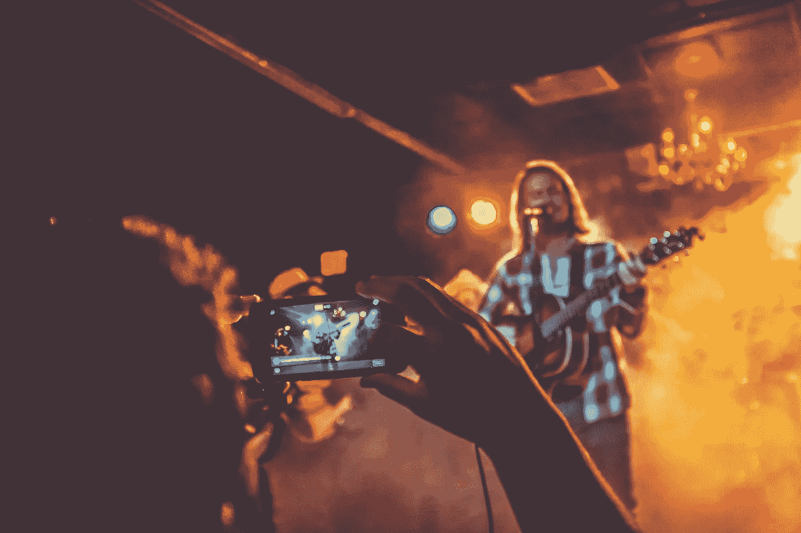

# 自由且合法地直播

> 原文：<https://medium.datadriveninvestor.com/live-stream-freely-and-legally-c313f4114a15?source=collection_archive---------5----------------------->

## 录音时很容易违反版权保护

Photo by NeONBRAND on Unsplash

五条彩带冒着风险。主人和客人必须注意自己的言辞，不要触犯法律。当你有疑问的时候，甚至在怀疑之前，问问律师。

如果幸运的话，有[凯瑞·奥谢·戈戈内](https://twitter.com/KerryGorgone)在身边。这位律师是一名播客，为营销教育和培训公司 [MarketingProfs](https://twitter.com/MarketingProfs) 撰稿。

“我与许多营销思想领袖、作者和有影响力的人有联系，因为我在 MarketingProfs 播客上采访过他们，”Gorgone 说。“这些年来，我在 B2B 营销论坛上遇到了很多企业对企业和企业对消费者的营销人员，我也和他们有联系。”

她加入了数字营销和演讲人 Madalyn Sklar，她在 Twitter 上与各种类型的人互动。

“我的业务是与 B2B 合作，”Sklar 说。“我倾向于与营销人员和有影响力的人联系。”

Gorgone 和 Sklar 结合他们的专业知识，就直播的法律风险以及如何将其降至最低，特别是在直播视频时避免侵犯版权的问题交换了看法。

“直播他人的版权内容是不合法的，”戈尔尼说。“只要想想这一点，你就比许多其他公司领先了。我为营销人员制作了一份[法律清单](http://www.kerrygorgone.com/meerkat-periscope-checklist/)品牌直播。

 [## 在创业之旅中，拥抱学习|数据驱动的投资者

### 好像建立一个数百万美元的公司还不够困难，企业家必须额外照顾他们的…

www.datadriveninvestor.com](https://www.datadriveninvestor.com/2018/10/16/on-the-entrepreneurial-trek-embrace-the-learning/) 

“永远不要在电影院录制或播放电影，”她说。"根据《家庭娱乐和版权法》，这是刑事犯罪."

露面本身就意味着法律风险。

“仔细选择你的位置，”戈尔尼说。“确保视图中没有受版权保护的内容，并且您听不到任何受版权保护的内容播放到您的流中。

“当你在流式传输时，要意识到什么是可见的和可听见的，”她说。"如果它是受版权保护的材料，移动到另一个位置."

游戏不一定是公平的游戏。

戈尔尼说:“对于每个在线视频游戏的人来说，请记住，从法律上讲，这仍然是一个非常灰色的领域。”。“游戏归发行商所有，但也有个人流媒体或 YouTube 明星的评论。至于这是否合法，我们还没有明确的答案。”

# **被正义暗算**

参与者还不知道发生了什么，麻烦就已经出现了。

“许多人没有意识到‘合理使用’是对侵犯版权的一种辩护，”Gorgone 说。“换句话说，你已经被起诉了。不是个好地方。也许你赢了，也许你没有，但是诉讼是昂贵的。飘带要尽量避免这个。”

在提出问题时，她希望不要吓跑现场彩带。

“飘带正在创造创新、有趣、发人深省的内容，将它们的声音添加到人类的合唱中，”戈尔尼说。“不要让法律担忧阻止你。只要采取一些预防措施来降低风险。

“不要在你的视频流中使用任何受版权保护的材料——30 秒钟，10 秒钟都不要，”她说。“没有法律规定你可以在未经许可的情况下使用特定数量的某人的创造性作品。那是一个都市传说。一个都别用。”

 [## 直播激发人类瞬间

### 错误会发生，并为你的观众展现真实的你

medium.datadriveninvestor.com](/live-streaming-inspires-human-moments-d8043cf4efb1) 

好的律师也能找到漏洞。

“有一个例外:你在对作品进行评论，只展示你需要的东西来表达你的观点，”戈尔尼说。“这可能是合理的使用，但仍需谨慎。合理使用是一种辩护，只有在法院权衡每个案件的事实后才能确定。

“这很简单，但人们仍然每天都收到撤下通知，因为他们没有注意这些事情，”她说。"稍微复习一下不会有坏处。"

体育比赛、会议或游行等公共活动期间的直播流会带来法律风险。

“我知道直播体育赛事是不合法的，因为我记得一些 NFL 球队在他们的推特上直播比赛，他们被撤下了，”Sklar 说。“对于会议，你需要询问活动协调员。有些人会允许。许多人不会。常问。”

# **‘汉密尔顿’击中了**

流媒体直播并不是每个人都喜欢的音乐。

“从法律角度来看，我会避免直播音乐会，”戈尔尼说。“音乐是受版权保护的。你不想看表演吗？

“许多乐队和场地禁止直播，”她说。“执法是一项挑战。独立音乐人可能不会介意。他们可以利用曝光率。”

这位律师强调了一个引人注目的法律麻烦的例子:“如果你看《T2》的演出，不要看流媒体。甚至不要拿出手机，除非你[想要来自](https://ew.com/theater/2019/01/18/lin-manuel-miranda-hamilton-audience-filming-puerto-rico/)[林·曼努尔·米兰达](https://twitter.com/Lin_Manuel)的指责

 [## 用桨划着小溪:现场直播引起轰动

### 当视频聊天和闲逛只是一个想法的时候

blog.markgrowth.com](https://blog.markgrowth.com/up-the-creek-with-a-paddle-livestreaming-makes-a-splash-1f81a3079e27) 

让观众欣慰的是，他们仍然喜欢游行。

“如果你在游行，很有可能你是在公共场所，”Gorgone 说。“你可以在任何你有合法权利的地方直播，包括公共场所。

“直播游行可能没问题，但我会避免播放有版权的音乐，就像你经常在梅西百货感恩节游行中看到的那种，”她说。

另一方面，很少有好的运动。

“体育比赛是不同的，”戈尔尼说。“通常，公司拥有‘联播’这些事件的独家权利，而这些权利是昂贵的。

“为了保护他们与这些公司的宝贵关系，体育特许经营和场馆往往有禁止直播的政策，”她说。"被抓到直播的粉丝可能会被逐出比赛。"

另一个例子是，在 2017-2018 赛季，英超联赛[屏蔽了近 20 万条足球比赛的非法流](https://www.standard.co.uk/tech/reddit-soccer-streams-no-more-premier-league-a4044501.html)。

“相比之下，会议通常在私人场所举行，”戈尔尼说。“场地和组织者决定直播的规则。

“在会议上，你经常会看到人群发布提醒与会者他们可能被拍摄，”她说。“这让他们知道，如果留在这里，他们就同意组织者出于宣传目的使用他们的形象。”

发布在会议上的人群发布保护了组织者和会场，而不是与会者。

“如果你计划直播演示，确保组织者同意，”戈尔尼说。"也从你采访的任何人那里获得一份个人声明."

# **眼不见，心不烦**

Sklar 和 Gorgone 在直播地点看得更深入。

Gorgone 说:“确保没有受版权保护的内容，并且你听不到任何受版权保护的内容播放到你的视频流中。”“确保你的视频流中有任何人的签名发布，或者你已经发布了人群发布，提醒人们正在拍摄的事实。

“不要从任何可能看到或听到机密信息的地方流出，比如律师事务所或公司的‘作战室’，”她说。“避免在直播中捕捉他人的私人对话。你不希望以后在一些离婚或刑事案件中被传唤为证人。”

 [## 直播暴露了真正的企业家

### 渲染并强调你的理想客户的角色特征

blog.markgrowth.com](https://blog.markgrowth.com/live-streaming-exposes-the-real-entrepreneur-246ab1eef4cd) 

无论是私人还是公共场所，都要获得 OKs。

“允许你从任何你选择的地方开始播放，”Gorgone 说。“如果是私人财产，要获得所有者的书面许可。如果是公共场所，获得任何必要的许可。”

请记住，外面的风或室内繁忙的位置会导致糟糕的音频。

“除了法律上的考虑，还有实际的考虑，”Gorgone 说。“直播可能完全合法，但也可能完全是垃圾。规划可以避免许多流媒体问题，包括糟糕的音频。”

人群释放可能被称为一揽子许可。

Sklar 说:“在一个拥挤的空间里，你不可能总是得到每个人的签名，所以你发布一个人群发布，说明你正在拍摄。”"我在洛杉矶的公共场合见过这个."

能见度对观众来说是至关重要的。

“一份‘人群发布’声明被张贴在摄影师或摄像师将要拍摄的地方，”Gorgone 说。“通常情况下，你会看到这些张贴在入口处或其他难以错过的地方。您的活动门票上也可能会印上新闻稿。

“如果你在采访中大量使用一个人，我建议从他或她那里获得一份签名新闻稿，即使你已经发布了人群新闻稿，”她说。

# **限制较少**

在直播中提及或处理衣服或技术似乎不会面临严格的规则。

Sklar 说:“在直播中，看起来更放松。”“我的衬衫和帽子上都有商标。这并不意味着我支持他们。我总是炫耀我的纹身。这并不意味着我要求[耐克](https://twitter.com/Nike)赞助我。”

说话的方式最重要。

“品牌提及是否是一种认可取决于你说了什么，”戈尔尼说。“许多人会遮住衣服上或流媒体区域周围的标志，但这通常不是必需的。

“如果你在谈论一个你合作的品牌，或者你从该品牌得到了什么，一定要在你的直播中披露，”她说。

 [## 上线开启了一个全新的世界

### 尽快在视频上推广活动

blog.markgrowth.com](https://blog.markgrowth.com/going-live-opens-whole-new-universe-e9646cff18e0) 

还不如说好话。

“如果你在说某个人或某个品牌的坏话，要确保这是真的——并且要有证据，”戈尔尼说。"即使你赢了，诽谤诉讼费用也很高."

在任何情况下，避免在直播中讨论某些话题。

“要知道，你在溪流中所说的话会产生深远的影响，”戈尔尼说。

“在一个例子中，一个开发者发布了一个[数字千年版权法案](https://en.wikipedia.org/wiki/Digital_Millennium_Copyright_Act)来对付[PewDiePie](https://twitter.com/pewdiepie)——一个大的 YouTuber 用户，他后来遇到了一些麻烦——在一个不同标题的直播中使用了一个种族主义的绰号，”她说。"那个开发者的游戏甚至没有出现在有污点的视频中."

公司也要求隐私。

“避免在直播过程中泄露机密信息或商业秘密，”Gorgone 说。"一旦妖怪从瓶子里出来，你就不能把它放回去."

Sklar 同意“任何机密都会让你很快陷入困境。”

# **奢华的曲调**

虽然营造气氛很有吸引力，但在直播时播放背景音乐却令人不快。

“就是不要，”戈多内说。“避免在直播背景中播放受版权保护的音乐。如果你绝对不能移动，保持水流很短。那么版权所有者就没有理由认为你的音乐流是购买音乐的替代品。”

Sklar 更简洁。

“不惜一切代价避免背景音乐，”她说。“不值得，除非你有使用权。”

 [## 生动的视频将业务提升至顶级水平

### 直播带来更大的关注和更多的钱

medium.com](https://medium.com/curious/lively-video-boosts-business-to-the-top-tier-15d3065f59f8) 

记住这些警告，直播主持人可以有效地在 Twitter 上推广他们的直播。

“首先，确保你的直播观众在 Twitter 上，”Gorgone 说。“他们可能在脸书，或者如果他们在 YouTube 上订阅了你的频道，他们会在那里看到通知。确保 Twitter 是你需要投入时间的地方。

"你在推特上直播音频吗？"她说。玛莎·科利尔在这方面取得了巨大的成功。当然，在这种情况下，事先在 Twitter 上推广你的信息流是有意义的。”

Twitter 促销是 Sklar 的拿手好戏。

“我提前发推特，让人们知道我在直播，”她说。“在我直播之后，我会截图，然后用链接发布出去。很多时候人是看不到直播的。我让他们知道，这样他们就可以在方便的时候观看。”

这就是所有形式的品牌需要同步的地方。

“确保你的 Twitter 角色与你在任何直播平台上的个人品牌相一致，”戈尔尼说。“在你的 Twitter 传记中推广你的渠道。”

她还建议使用固定推文来推广即将到来的直播。

**关于作者**

吉姆·卡扎曼是[拉戈金融服务公司](http://largofinancialservices.com/)的经理，曾在空军和联邦政府的公共事务部门工作。你可以在[推特](https://twitter.com/JKatzaman)、[脸书](https://www.facebook.com/jim.katzaman)和 [LinkedIn](https://www.linkedin.com/in/jim-katzaman-33641b21/) 上和他联系。