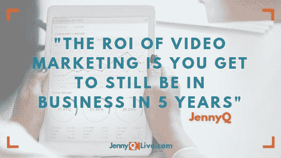

# 直播激发人类瞬间

> 原文：<https://medium.datadriveninvestor.com/live-streaming-inspires-human-moments-d8043cf4efb1?source=collection_archive---------18----------------------->

## 错误会发生，并为你的观众展现真实的你

W 关于直播到底是什么，[詹妮弗·奎因](https://twitter.com/JennyQ)研究了这个话题并迷上了它。也就是 JennyQ，在很短的时间内她从新手一跃成为了 maven。

奎因使自己成为互联网直播领域领先的顾问、演讲者、主持人和作者。她[在国际知名的直播节目中进行了 450 多次现场采访](https://jennyqlive.com/)。

多年来，Quinn 帮助专业人士体验了直播如何帮助提高他们的权威、可信度和对潜在客户和客户的首要意识。

她与数字营销专家 [Madalyn Sklar](https://twitter.com/MadalynSklar) 谈论了互联网视频直播的激动人心的旅程，从基本设备和音频设备开始。

 [## 计划者让社交媒体保持正轨|数据驱动的投资者

### 如果想达到并保持最高效率，忙碌的人会坚持使用系统。这是 Tweepsmap 和…背后的前提

www.datadriveninvestor.com](https://www.datadriveninvestor.com/2019/03/11/schedulers-keep-social-media-on-track/) 

奎恩说:“从你想要特别注意的事情开始。“这就是我所说的 L.A.V.S .:灯光、音频、视频和稳定性。”

她将每一类都进行了细分:

*   照明:日光——坐在窗前；响铃灯—夹在手机上；箱式照明——中级工作室
*   音频:带内置麦克风、外部电话麦克风、USB 或录音室麦克风的耳塞
*   视频:手机摄像头，内置摄像头，USB 摄像头
*   稳定性:用书或盒子把手机支撑在眼睛的高度；三脚架或支架；台式机或笔记本电脑，小心不要碰撞

# 选择最合适的

有各种各样的直播平台。每个都是个人喜好的问题。

“它们都很好——YouTube Live、脸书 Live、Instagram Live、Twitter、Periscope，”奎因说。“这取决于你的受众在哪里，你的理想客户在哪里。内容和一致性是关键。”

Sklar 指出，Periscope 允许广播公司将最多三位嘉宾添加到节目流中。

直播的挑战之一是吸引观众，尤其是在制作的早期。

奎因说:“即使没有现场观众，也要在直播的那一刻开始你的内容，这一点很重要。”。“您也在为重播观众录制视频。好消息是大部分的观看来自回放。如果你没有现场观众，不要担心。无论如何都要粉碎它。”

 [## 视频创造了令人感动的差异

### 图像会留下不可磨灭的印象

medium.com](https://medium.com/datadriveninvestor/video-creates-a-moving-difference-ec43f8dd16f9) 

简洁地制作一个视频，传达你的信息和个性。告知、娱乐并知道何时适可而止——让观众想要更多。

奎恩说:“我告诉我的客户，只要你分享你的内容，就一直播放，一分钟也不要多。”“要有像样的结构，知道自己要说什么。与观众互动。那么结束的时候不要害怕结束。总是以行动号召结束。

“对于专业人士、企业和品牌来说，拥有结构化的内容——介绍、要点和结尾——尤其重要，”她说。"在现场直播前先练习一下，这样你就能对自己要说的话有个大致的概念。"

# 不要沉迷于数字

你会浪费时间去摆弄窗帘后面的机器。

“人们沉迷于游戏算法，这是一个错误，”奎因说。“视频直播是关于建立信任、发展关系和增加价值的。专注于创造一流的内容。与此同时，测试事物并查看数据以做出决策也很好。”

每周一次直播是可以的，但是无论你做多少，都要可靠和持续。制定一个时间表，并坚持下去。建立观众的期望并超越他们。

“作为一个企业或品牌，始终如一地直播很重要，”奎因说。“如果你一个月只能上线一次，那就坚持下去。如果你认为你可以每天做，我建议你从每周开始。然后慢慢增加。增加容易减少难。

“记住，你是在与观众建立信任，”她说。"无论你说你要做什么，都要信守承诺，并坚持到底."

与任何其他风险一样，错误是直播的一部分。从它们开始构建。这些失误可能没有你想象的那么大，因为观众可能不会像你一样注意到它们。

# 理解听众

“错误总是会发生的，”奎恩说。“尽可能提前做好计划。然后当事情没有按计划进行时，用幽默和优雅来处理它。观众站在你这边，希望你成功。承认它，继续前进。

“我通常会说，‘欢迎收看视频直播！’并解释刚刚发生的事情，然后继续前进。我喜欢#H2H 的布莱恩·克莱默说:“我刚刚经历了一个人的时刻！”然后他继续前进。"

 [## 对于视频，关注你的业务

### 企业家做生意是为了赚钱。无论他们从事什么样的投资，他们都希望获得投资回报。

contentgrind.com](https://contentgrind.com/for-video-focus-on-your-business-c3e9385ed63b) 

为了盈利，企业家需要将直播变现。

“企业必须制作视频来保持相关性，”奎因说。“直播可用于最重要的认知、销售产品，作为提供免费 pdf 或赠品的潜在客户[。但主要是通过增加价值来建立关系。](https://blog.markgrowth.com/lead-magnets-attractive-ways-to-get-your-foot-in-the-door-2005d8be6f96)

“人们问我视频营销的投资回报率是多少，”她说。“我告诉他们，投资回报率是你在五年内仍然可以做生意。”

奎恩和 Sklar 在[脸书直播](https://www.facebook.com/manageflitter/videos/658199811297690/?notif_id=1549408684701831&notif_t=live_video_explicit)的对话中继续讨论直播。

**关于作者**

吉姆·卡扎曼是拉戈金融服务公司的经理，曾在空军和联邦政府的公共事务部门工作。你可以在[推特](https://twitter.com/JKatzaman)、[脸书](https://www.facebook.com/jim.katzaman)和 [LinkedIn](https://www.linkedin.com/in/jim-katzaman-33641b21/) 上和他联系。

*原载于 2019 年 7 月 17 日*[*https://www.datadriveninvestor.com*](https://www.datadriveninvestor.com/2019/07/17/live-streaming-inspires-human-moments/)*。*