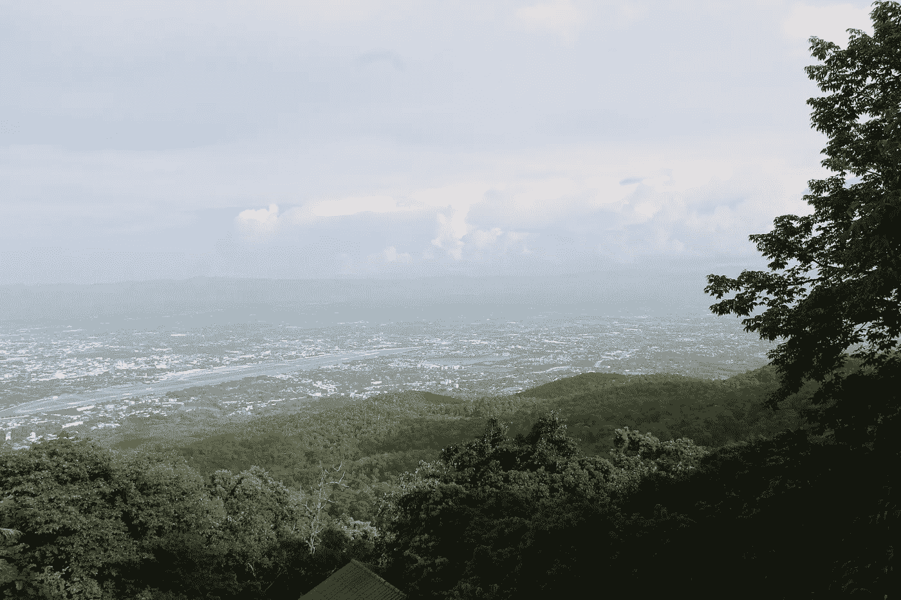
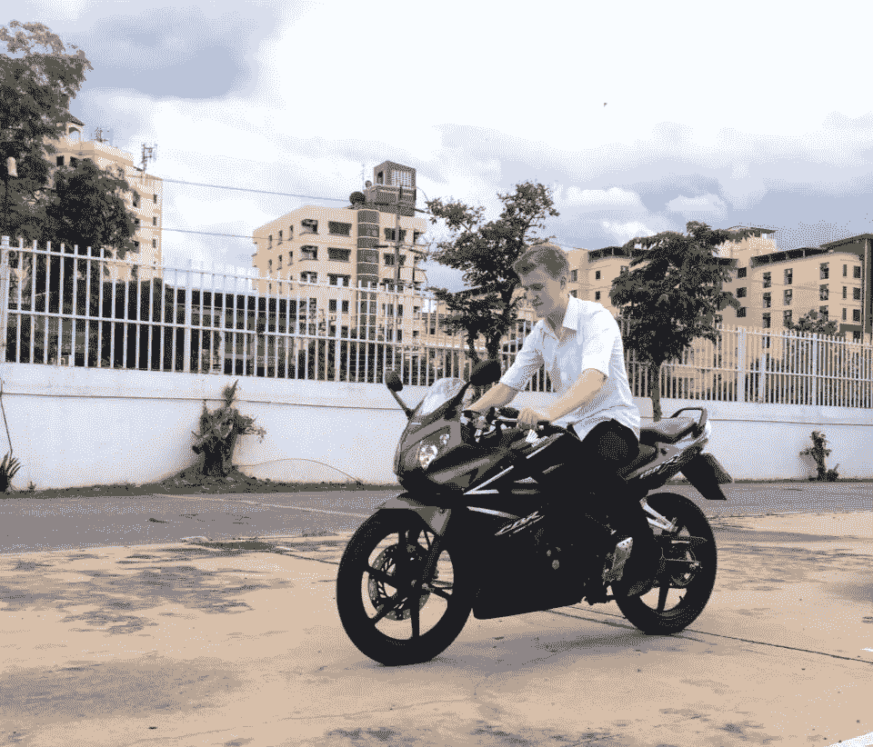
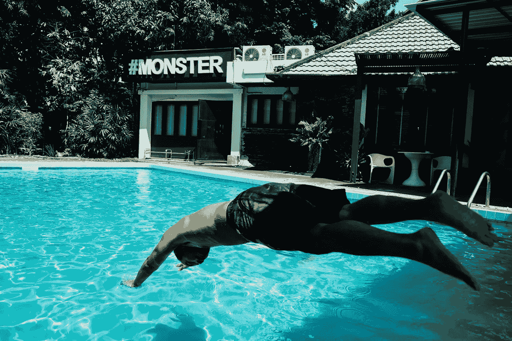
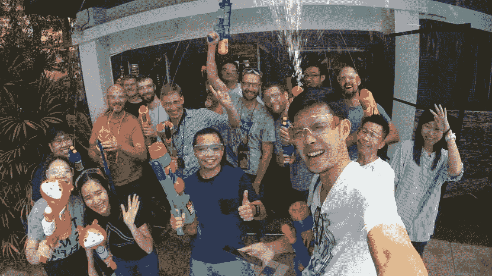

# 在泰国生活和工作——我的经历

> 原文：<https://medium.datadriveninvestor.com/living-working-in-thailand-b11c73d01dd2?source=collection_archive---------2----------------------->

Overlooking Chiang Mai on Doi Suthep

# 我为什么来泰国

这是从我高中最后几年开始的。—我去泰国度假，爱上了这个国家和它的人民。

当我回到家乡密歇根州埃尔希时，我觉得我的生活中好像少了点什么。所以，毕业的时候，我告诉父母我想去泰国读大学，令人惊讶的是，他们非常支持我。

## 在大学学习

我被 SIIT 法政大学录取了，简单地说，我是那里唯一的白人。由于语言障碍，交朋友很难，但过了一段时间，一旦你开始更多地接触泰国人并了解他们的文化，他们就会真正敞开心扉。

Thammasat First Meet with John

我不得不说，独自一人很难适应，为了一个可能更好的未来而抛弃一切。

有时我非常想家，想搬回美国。谢天谢地，我能够在圣诞节期间回去，并意识到我当初为什么要搬家。

当你回家的时候，你会意识到在你离开的这段时间里，什么都没有改变。那时我知道我必须坚持到底，因为随着时间的推移，事情会变得更容易。

在我的第一年，不知何故，有 4 个疯狂的美国学生在同一所大学学习。我从其中一个叫维托的人那里学会了骑摩托车，直到今天，他还是我的好朋友。那是一辆小型本田 150cc CBR。

I thought I was going to die.

通过认识维托，他把我介绍给了其他人。我们很快就合得来，开始在曼谷南部骑摩托车旅行。

只是给每个第一次骑行的人一个警告，不要让你的朋友说服你在高峰时间学骑摩托车。我在红灯前熄火了 7 次，汽车冲我按喇叭催我的小白车快点！

大学只持续了两年多，后来我病得很重，导致我辍学。我想留在泰国解决这个问题。然后事情就变得有趣了。我的签证将在 4 个月后到期。我必须尽快找到工作！

# 在泰国找工作

当你 21 岁在泰国时，几乎不可能找到任何工作(有工作许可证和适当的签证)。我有一点制作基本网站的经验，所以我试着展示我学习的意愿。

我在曼谷参加了 3 次单独的面试，运气都不好——对于任何人来说，接受大学辍学都是难以自圆其说的。

我设法找到了一份为฿150/hour 开发 WordPress 网站的兼职工作(每小时不到 5 美元)。很明显，那很糟糕。

我需要更长久的东西。

## 搜索开始了..

我申请了 4 个多月的工作，从曼谷到偏僻的地方，以及两者之间的任何地方。我发现一个名为 [Blognone](http://www.blognone.com) 的广告技术公司网站有开发人员的职位空缺。

那天，我向 100 多家公司递交了申请，这是我最后一次尝试寻找工作。

# 电子邮件

> 不如我们赶紧打个电话。你在曼谷，对吗？

我最初不知道这个职位是在清迈。

邮件和电话来来回回，直到我被邀请到清迈进行为期一周的试用。

他们把我安排在一家酒店，并为我租了一辆摩托车。

Swimming at the office

是的，那是办公室外面的一个游泳池。

一周的试用期结束后，大老板用他的旅行自行车带我去吃早餐。我们坐下来，我在发抖，他很放松。

他突然动了一下，伸出手说:“欢迎加入这个团队”🤝

*两周后……*

# 在 Buzzwoo Asia 做网页开发

Buzzwoo 是一家专门开发网络和移动应用的数字机构。

它现在由超过 25 个不同国籍的人组成，这在泰国任何公司都是前所未闻的。

我是一名后端开发人员，开发 PHP ( [Laravel](http://www.laraval.com) 框架)应用程序。

在 Buzzwoo 的每一天都是独一无二的经历。与 25 个不同国籍的人交流不是一件容易的事情。我们有泰国，德国，俄罗斯，立陶宛，意大利，比利时和瑞典。

Songkran Day at Buzzwoo; it got wet.

不知何故，它成功了。

# 生活在泰国

你会发现泰国有很多了不起的人。

对于想搬到泰国曼谷或清迈的人来说，我强烈推荐。许多公司都在寻找人才，尤其是在科技行业。

如果你还没有赚钱的方法，最好在把所有东西搬到泰国之前，先在你的祖国解决这个问题。

## 生活费用

生活费用较低*但是*它可以变贵，变快。

在曼谷和清迈，离城市相对较近的像样公寓的价格大约在฿8000(240 美元)左右。对于小型摩托车或踏板车，租金通常在每月 2500 泰铢左右。

每顿饭通常花费大约฿35-50(1-2 美元)。

你可以预计每月支付大约฿20,000(600 美元)的生活费。

## 旅行

这里的大多数外国人喜欢在周末旅游。最好是和你的朋友在蜿蜒的山上完成。

Doi Suthep Peak with Jaime on the CRF250 and MT-07

# 最后的话

泰国很棒。从任何意义上来说都不完美，但我没有后悔过一天。它帮助我成长为一个人。

非常感谢我的 [*公司*](https://www.buzzwoo.de) *给了我一次机会。*

First day on a business trip in Stuttgart, Germany. Prost!

如果你有任何关于在泰国生活的问题，请在下面评论！

[查看更多关于网络发展和生活在泰国的故事](https://medium.com/@garrettvorce)

在[http://garrettvorce.com/living-and-working-in-thailand/](http://garrettvorce.com/living-and-working-in-thailand/)查看原文

> 👋🏾了解塑造我们日常使用产品的人和想法。 [**订阅值得关注的**](https://usejournal.typeform.com/to/YDVRgX?utm_source=usejournal.com&utm_medium=blog&utm_content=garrett_vorce&utm_campaign=guest_post)—[期刊](https://usejournal.com/?/utm_source=usejournal.com&utm_medium=blog&utm_content=garrett_vorce&utm_campaign=guest_post)团队撰写的产品&设计简讯。

