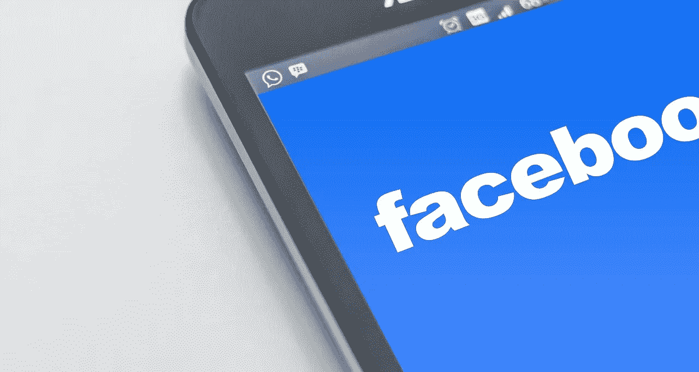
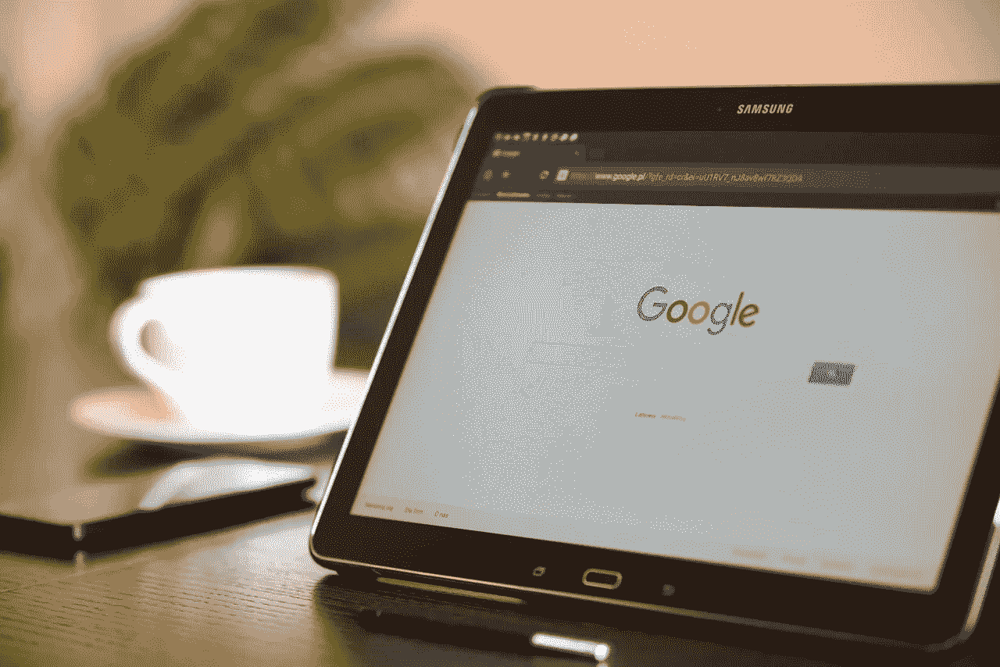

# 利兹·沃伦的反垄断提案不会奏效

> 原文：<https://medium.datadriveninvestor.com/liz-warrens-antitrust-proposal-will-not-work-904305a45d3a?source=collection_archive---------15----------------------->

总统候选人利兹·沃伦的反垄断提案表明，为什么用 19 世纪的法律来监管 21 世纪的公司是一个坏主意。

具体来说，美国参议员沃伦(马萨诸塞州民主党人)希望通过执行旧的反垄断法来拆分几家科技巨头。例如，沃伦概述了将亚马逊(NASDAQ: AMZN)、T2、脸书(NASDAQ: FB)、T4 Alphabet(NASDAQ:GOOGL)和 T5 拆分成小公司的计划。

沃伦的提议在五个方面存在问题。首先，她的拆分计划不会限制大型科技公司的垄断力量。其次，沃伦的一些计划只会将垄断从大型科技公司转移到其他公司。

第三，沃伦的提议可能会让美国科技在与中国科技竞争时处于严重劣势。第四，沃伦的提议可能会将大型科技公司赶出美国。第五，沃伦忽略了科技巨头中一些最危险、最具潜在破坏性的活动。

# 根据利兹·沃伦的反垄断提案，脸书仍将保持垄断地位

例如，沃伦希望脸书出售 WhatsApp 据 Statista [估计，这款消息应用在美国只有 2360 万用户。此外，据 Statista](https://www.statista.com/statistics/558290/number-of-whatsapp-users-usa/) [计算](https://www.statista.com/statistics/247614/number-of-monthly-active-facebook-users-worldwide/)，沃伦的提议将使脸书在美国和加拿大拥有 2.42 亿活跃月用户。

因此，在沃伦被迫分手后，脸书仍将在美国和加拿大拥有实际的社交媒体垄断地位。令人难以置信的是，脸书将保留其大部分收入和沃伦计划带来的权力。

Investopedia 指出，解释一下，脸书的大部分收入来自脸书网页上的定向广告。事实上，没有赔钱的 WhatsApp，脸书会更有钱。

再者，不赚钱的[WhatsApp](https://www.investopedia.com/articles/personal-finance/040915/how-whatsapp-makes-money.asp)；该公司拥有 15 亿用户，如果没有脸书的所有权，它可能会关闭。因此，由于沃伦的反垄断提案，社交媒体用户的选择可能会更少，脸书的垄断可能会更大。

 [## 数据驱动的趋势和统计-2019 年 2 月-数据驱动的投资者

### 虽然寻找视觉内容最简单的方法是“谷歌”它们，但如果你能…

www.datadriveninvestor.com](https://www.datadriveninvestor.com/2019/03/07/data-driven-trends-statistics%e2%80%8a-%e2%80%8afeb-2019/) 

# **沃伦斯的反垄断提案可能伤害 Alphabet**

奇怪的是，唯一受到沃伦反垄断提案严重伤害的公司将是 **Alphabet(纳斯达克代码:GOOG)** 或谷歌。

为了解释，沃伦希望 Alphabet 出售广告公司 Double Click 或 Google Ads。这将损害 Alphabet，因为该公司的大部分收入来自数字广告。

事实上，Alphabet 在 2018 年将双击纳入其谷歌搜索引擎。所以，双击现在是[谷歌广告](https://www.cnbc.com/2018/06/27/googles-adwords-and-doubleclick-have-been-rebranded-and-reorganized.html)；Alphabet 在 2018 年报告称，这是 1368.19 亿美元收入的大部分。

# **沃伦的反垄断提案将使大型零售业变得更大**

沃伦的反垄断提案最糟糕的一面是，它将把垄断权力从大型科技公司转移到大型零售公司。

为了解释，沃伦希望亚马逊出售杂货连锁店全食超市。全食超市管理公司在 2017 年将连锁店卖给了亚马逊，因为该公司濒临倒闭。事实上，[全食](https://marketmadhouse.com/kroger-winning-grocery-wars-amazon-bought-whole-foods/)在亚马逊收购的时候已经没钱了，正在关店。

如果亚马逊出售全食超市，那么合乎逻辑的买家就是美国最大的独立杂货店。克罗格和美国最大的“杂货商”**沃尔玛(纽约证券交易所代码:WMT)** 已经在许多杂货市场形成了实际的双头垄断。

此外，克罗格和沃尔玛是无情的竞争对手，它们通过大幅打折将小品牌挤出市场。全食超市已经证明了它无法与这些巨头竞争。

因此，沃伦的反垄断提案将通过消除沃尔玛和克罗格的竞争对手来减少杂货业务的竞争。事实上，由于利兹·沃伦的反垄断提案，消费者购买食品杂货的地方可能会更少。

值得注意的是，沃伦想经营少数几家能与克罗格和沃尔玛竞争的公司之一；亚马逊，退出杂货业。愤世嫉俗者会怀疑这份反垄断提案是沃尔玛还是克罗格的法律部门写的。

# **沃伦的反垄断提案帮助中国**

沃伦反垄断提议的最大受益者将是中国科技公司。

WhatsApp、谷歌广告、Apple Pay 和 Google Pay 等服务的合理买家是中国科技公司。美国科技公司的潜在中国买家包括搜索引擎 [**、百度**](https://www.scmp.com/tech/big-tech/article/2189586/baidu-chery-launch-electric-car-face-scanning-payment-ar-navigation) **(纽约证券交易所代码:BIDU)** 、社交媒体和支付巨头 [**、腾讯控股**](https://www.scmp.com/tech/big-tech/article/2189586/baidu-chery-launch-electric-car-face-scanning-payment-ar-navigation)**(OTCMKTS:tce hy)**、全球最有价值的独角兽蚂蚁金服和电子商务巨头**阿里巴巴(纽约证券交易所代码:BABA)** 。

此外，中华人民共和国的主权财富基金；中国投资公司可以贷款给中国公司购买美国技术。有意思的是，中国的外汇储备；中国出口的收益，为中国投资公司提供资金。因此，美国消费者可以资助中国收购硅谷。

# **沃伦的反垄断提案可能会让中国垄断全球社交媒体**

山姆大叔可以阻止硅谷向中国公司出售其美国资产。然而，美国政府没有办法阻止中国人在其他国家购买脸书资产。

例如，脸书可以将 WhatsApp 所有海外基础设施的所有权转让给一家爱尔兰或开曼群岛的公司。然后，该实体可以转身将自己出售给腾讯控股。

此类交易可能会让腾讯在全球大部分地区的社交媒体上获得实际垄断地位。例如，Statista [计算出](https://www.statista.com/statistics/291540/mobile-internet-user-whatsapp/)沙特 73%的人口、巴西和德国 65%的人口以及墨西哥 56%的人口使用 WhatsApp。

中国可能会收购 WhatsApp，因为没有其他人可能会收购这家亏损的公司。拥有 WhatsApp 对中国来说是有意义的，因为它将使中华人民共和国能够控制许多国家的信息流动。

# 根据沃伦的反垄断提案，他们可以把苹果卖给中国

也不仅仅是 WhatsApp。我认为百度、腾讯控股、阿里巴巴或[蚂蚁金服](https://marketmadhouse.com/ant-financial-not-uber-worlds-valuable-unicorn/)可以染指 Instagram(另一家脸书子公司)、Alphabet 旗下的 YouTube、Apple Pay、Google Pay、App Store，甚至是沃伦计划中的 iTunes。

App Store、iTunes 和 Apple Pay 最终可能会落入中国人手中，因为沃伦想要拆分**苹果公司(纳斯达克股票代码:AAPL)** 、 *The Verge* 、[声称](https://www.theverge.com/2019/3/9/18257965/elizabeth-warren-break-up-apple-monopoly-antitrust)。因此，沃伦参议员可以将世界媒体基础设施的控制权交给中国共产党。

因此，沃伦打破美国垄断的尝试可能会创造一个更加危险的全球垄断。因此，如果中国公司最终拥有了数字媒体，美国人只能怪自己。

# **沃伦的反垄断提案可能会将大型科技公司赶出美国**

沃伦的反垄断提案可能会让硅谷走向海外。Alphabet、脸书或苹果可以将总部迁至海外，而不是拆分它们的全球帝国。

显然，许多地方会欢迎大型科技公司；和它的钱，张开双臂。比如，中国的硅谷；深圳、加拿大、英国、印度、瑞士和爱尔兰共和国。

此外，公司可以将法定地址转移到开曼群岛等避税天堂，以规避许多法律。事实上，他们的基地或注册地阿里巴巴，在开曼群岛，*保守收益投资者* [透露](https://theconservativeincomeinvestor.com/alibaba-stocks-peculiar-legal-structure/)。

由于像 Alphabet 这样的公司已经在爱尔兰设有办事处，将总部搬到日内瓦、伦敦或上海并不是什么难事。特别是，一些公司可能认为像中国这样坚定的资本主义威权国家比民粹主义的美国更好投资。

# **沃伦的反垄断计划忽略了大型科技公司最危险的业务**

最后，沃伦的反垄断计划显然忽略了一些大型科技公司最危险的商业举动。

令人不安的是，沃伦的提议没有提及金融服务应用，如 PayPal(纳斯达克:PYPL)、Google Pay 和 Apple Pay。事实上，这种数字钱包可能比任何垄断都更具破坏性。

例如，PayPal 的数字钱包和 Venmo 点对点支付(P2P)解决方案就像银行账户一样运作。然而，[联邦存款保险公司(FDIC)](https://www.fdic.gov/deposit/deposits/faq.html) 并不为这些应用提供保险。

因此，PayPal 或 Venmo 可能会耗尽资金，导致数百万人无法获得现金。可怕的是，这个噩梦般的场景不是幻想。

# **沃伦的反垄断提案忽视了硅谷对我们经济的最大威胁**

2018 年 7 月，中国人民银行(PBOC)，中国央行命令蚂蚁金服和腾讯控股将 20%的消费者存款保留在他们的数字钱包中，*金融时报* [报道](https://www.ft.com/content/b472f73c-859e-11e8-96dd-fa565ec55929)。本质上，PBOC 的监管者担心数字钱包可能会没钱，让依赖它们的中国人没有现金。

详细来说，蚂蚁金服的支付宝和腾讯控股的微信支付是全球最受欢迎的两种数字钱包。据 Statista [估计](https://www.statista.com/statistics/744944/mobile-payment-platforms-users/)，2017 年 8 月，微信支付拥有 6 亿用户，支付宝拥有 4 亿用户。

在这种情况下，移动钱包可能会引发一场像 2008 年那样大的金融危机，而沃伦却对此视而不见。举例来说，如果银行突然屏蔽了谷歌支付、苹果支付或贝宝的资金，会发生什么？

相反，如果一家银行资金告罄，美联储或联邦存款保险公司可以接管它，或贷出足够的资金来维持该机构的运营。与此同时，PayPal 可能会立即崩溃，导致数百万小企业无法获得现金或信贷。

# **我们需要硅谷的监管**

因此，迫使贝宝成为一家银行；这将把它置于联邦存款保险公司的监管之下，是比反垄断行动更明智的监管举措。

因此，强迫出售 Apple Pay 或 Google Pay 给像**摩根大通(纽约证券交易所:JPM)** 这样的大银行，可能比强迫出售 Instagram 对消费者更有利。说明我们政府对大通这样的银行有一定的控制，总比没有控制好。

例如，银行提供的金融产品必须获得批准。目前，只要不与银行账户挂钩，科技公司几乎可以提供任何金融服务。因此，我认为像贝宝这样的公司在没有联邦存款保险公司保险的情况下经营银行业务。

# **我们需要 21 世纪的法规，而不是利兹·沃伦的反垄断提案**

归根结底，Instagram 只是一个玩具，而 Apple Pay、Venmo 和 Google Pay 是危险的金融工具。此外，像亚马逊和脸书这样的科技公司正在研究更新的金融技术；像加密货币和 [stablecoins](https://medium.com/@MarketMadhouse/swimming-with-the-interssting-new-stablecoins-34bbe2030189) 可能比数字钱包更危险。

因此，我认为阻止脸书和 Alphabet 进入金融服务领域的努力比执行过时的反垄断法更重要。特别是，沃伦想要实施的 T4 反垄断法是 19 世纪的政策。

例如，他们在马车时代为国家经济起草了反托拉斯法。然而，我们现在在全球经济中运作，生活在一个数字时代。美国需要生活在 21 世纪的领导人，而不是想用 19 世纪的经济政策复兴过去的理想主义者。

如果我们希望美国在 21 世纪保持相关性和竞争力，我们就必须拒绝利兹·沃伦的反垄断政策。